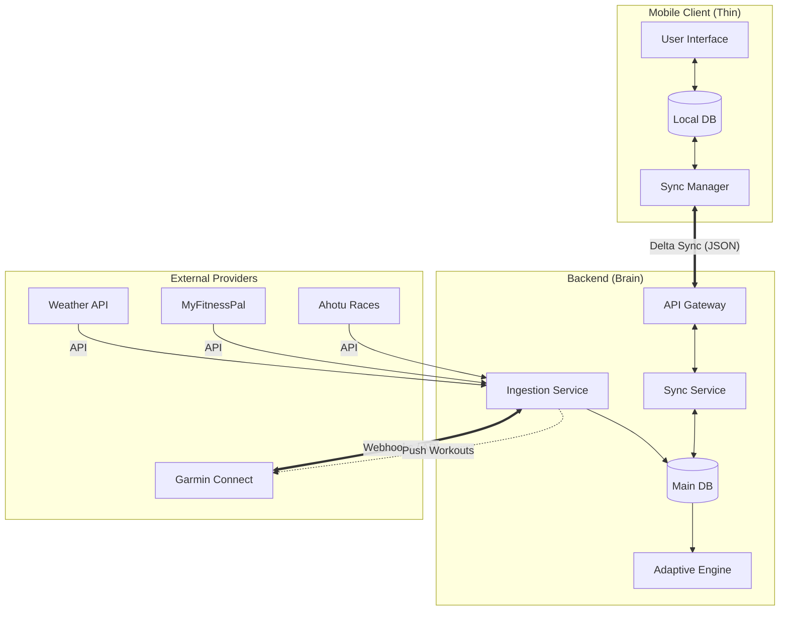

# PRD: Sync Infrastructure & Integrations

## 1. Introduction
This document defines the architecture for data synchronization in the RunningCoach ecosystem. It covers two distinct domains:
1.  **Internal Sync:** Synchronization between the Mobile Client (Thin Client) and the Backend "Brain".
2.  **External Integrations:** Ingestion and synchronization of data from third-party services (Garmin, Ahotu, MyFitnessPal, Weather).

## 2. Core Principles
*   **Offline First:** The mobile application must be fully functional without an internet connection. The local database is the single source of truth for the UI.
*   **Backend Authority:** The backend is the ultimate source of truth for complex calculations, training plans, and long-term data storage.
*   **Seamless Integration:** External data ingestion should happen automatically in the background without requiring manual user intervention after initial setup.
*   **Extensibility:** The system must be designed to easily add new providers (e.g., Apple Health, Strava, Whoop) in the future.

## 3. Internal Sync Architecture (Client <-> Backend)

### 3.1. Offline-First Data Model
*   **Local Storage:** The mobile client uses a local database (e.g., SQLite, Realm) to store:
    *   The current training plan (next 4-8 weeks).
    *   Recent activity logs.
    *   User profile and settings.
    *   Pending changes (queue of actions to sync).
*   **Read/Write Operations:** All UI interactions read from and write to the local database immediately.

### 3.2. Synchronization Protocol
*   **Delta Sync:** To minimize data usage and battery drain, only changed data is transmitted.
    *   **Upstream (Client -> Backend):** Completed workouts, manual logs, plan adjustments, settings changes.
    *   **Downstream (Backend -> Client):** New training plan adaptations, processed activity insights, external data updates.
*   **Trigger Mechanisms:**
    *   **Immediate:** When the user explicitly saves a workout or changes a critical setting.
    *   **Background:** Periodic sync (e.g., every 15-60 minutes) when the app is in the background, subject to OS constraints.
    *   **On Launch:** When the app is opened.

### 3.3. Conflict Resolution
*   **Strategy:** "Smart Merge" with Backend Authority.
*   **Scenario:** User edits a log on the phone while the backend processes a new file from Garmin.
    *   **Resolution:** The system attempts to merge the data. If a conflict exists (e.g., different distance for the same run), the **Device Data (Garmin)** is generally preferred for objective metrics (GPS, HR), while **User Input** is preferred for subjective metrics (RPE, Notes).
    *   **Plan Conflicts:** If the backend generates a new plan while the user is offline, the backend's plan overwrites the local plan *forward-looking*, but preserves past logs.

## 4. External Integrations (Backend <-> 3rd Party)

The backend acts as the central hub, ingesting data from various sources to feed the Adaptive Training Engine.

### 4.1. Race Discovery & Planning (Ahotu)
*   **Purpose:** To allow users to find target races and automatically populate their training calendar with accurate race dates, distances, and course profiles (elevation maps).
*   **Integration Type:** API (Search & Retrieve).
*   **Data Points:**
    *   Race Name, Date, Location.
    *   Distance (Marathon, Half, etc.).
    *   Course Profile (Elevation gain/loss) - *Critical for training specificity.*
*   **Workflow:**
    1.  User searches for a race in the app.
    2.  Backend queries Ahotu API.
    3.  User selects a race.
    4.  Backend imports race details and triggers the **Periodization Engine** to build a plan backward from the race date.

### 4.2. Activity & Health Data (Garmin Connect)
*   **Purpose:** Primary source for objective training data and physiological metrics.
*   **Integration Type:** Garmin Health API (Cloud-to-Cloud).
*   **Direction:** Bidirectional.
*   **Inbound Data (Garmin -> RunningCoach):**
    *   **Activities:** GPS tracks, Pace, Heart Rate, Cadence, Power (if available).
    *   **Daily Health:** Resting Heart Rate (RHR), Heart Rate Variability (HRV), Sleep Score, Sleep Duration, Body Battery.
*   **Outbound Data (RunningCoach -> Garmin):**
    *   **Planned Workouts:** Structured workouts (e.g., "20 min Warmup, 4x5 min Threshold, 10 min Cooldown") sent to the user's Garmin calendar. This allows the watch to guide the user during the run.
*   **Sync Frequency:** Real-time Webhooks (Garmin notifies backend of new data) + Daily polling as backup.

### 4.3. Nutrition & Fueling (MyFitnessPal)
*   **Purpose:** To monitor energy availability and macronutrient balance, ensuring the athlete is fueling enough for the training load.
*   **Integration Type:** API (OAuth2).
*   **Data Points:**
    *   **Daily Totals:** Calories consumed, Carbohydrates (g), Protein (g), Fat (g).
    *   **Meal Timing:** (Optional/Future) Time of meals relative to workouts.
*   **Privacy:** We only request daily summary data, not specific food item logs, to respect user privacy.
*   **Usage:** The **Adaptive Engine** checks if `Calories In < Calories Out` significantly for prolonged periods (RED-S risk) or if Protein/Carb targets are missed during heavy training blocks.

### 4.4. Environmental Data (Weather Services)
*   **Purpose:** To adjust training intensity expectations based on environmental stress (Heat, Humidity, Wind).
*   **Integration Type:** Weather API (e.g., OpenWeatherMap, AccuWeather).
*   **Data Points:**
    *   Temperature, Humidity, Dew Point (to calculate "Feels Like").
    *   Wind Speed/Direction.
    *   Air Quality Index (AQI).
*   **Workflow:**
    *   **Planning:** 7-day forecast used to suggest moving long runs or hard workouts to cooler days/times.
    *   **Pre-Run:** "Feels like" temperature displayed on the "Coach's Note" with hydration advice.
    *   **Post-Run Analysis:** Backend adjusts the "Effort Score" (GAP - Grade Adjusted Pace + Weather adjustment). A slow run in 35°C heat might be scored as a high-performance effort.

## 5. Future Integrations (Roadmap)
The architecture must support adding these providers via a plugin-like adapter pattern:

*   **Other Wearables:** Apple Health (via Mobile Client sync), Strava (Aggregator), Fitbit, Suunto, Polar, Coros, Whoop, Oura.
*   **Smart Scales:** Withings, Garmin Index (Weight, Body Fat % trends).
*   **Connected Gym Equipment:** Treadmills (Zwift Run, Peloton) for indoor run accuracy.
*   **Glucose Monitors:** CGMs (Supersapiens/Abbott) for real-time fueling insights.

## 6. Data Privacy & Security
*   **OAuth2:** All third-party integrations must use OAuth2 for secure authorization. We never store user passwords for external services.
*   **Token Management:** Access and Refresh tokens are stored securely (encrypted at rest) in the backend.
*   **Data Minimization:** We only request scopes necessary for the features (e.g., `activity:read`, `nutrition:read`).
*   **User Control:** Users can disconnect any service at any time, which triggers a deletion of the associated tokens (and optionally historical data).

## 7. Architecture Diagram (Mermaid)

