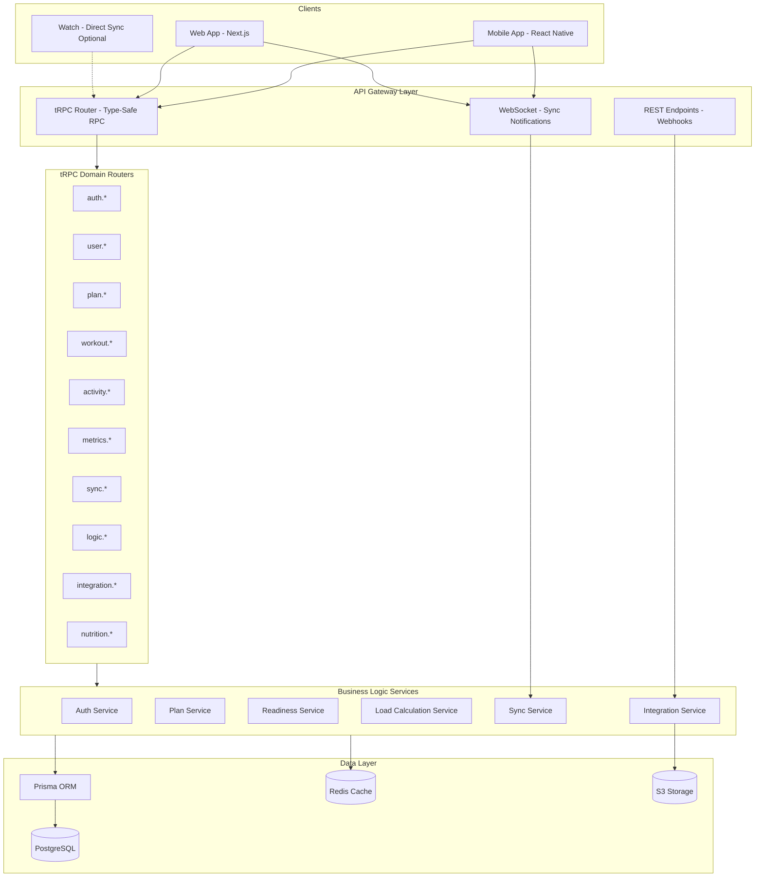

# RFC 0003: Backend API Design

| Status        | Draft |
| :---          | :--- |
| **RFC #**     | 0003 |
| **Author(s)** | Backend Lead |
| **Created**   | 2025-11-27 |
| **Updated**   | 2025-11-27 |

## 1. Introduction

### 1.1. Context
This RFC defines the complete API specification for the RunningCoach backend services. The API serves as the contract between the Cloud Backend and all client applications (Mobile, Web, Watch), enabling the "Holistic Coach" experience through type-safe, offline-first synchronization.

As established in [RFC 0001: System Architecture](./0001-system-architecture.md), the backend follows a **hybrid thick-client architecture**. The Adaptive Training Engine ("Brain") runs locally on devices via the shared `@runningcoach/engine` package for zero-latency guidance and offline functionality. The cloud backend serves as the long-term data store, external integration hub, heavy batch computation engine, and synchronization point for all devices.

### 1.2. Problem Statement
We need a comprehensive API layer that:
1. **Supports Offline-First Clients:** Enables efficient delta synchronization for mobile and web applications that function 100% offline.
2. **Powers the 4-System Readiness Model:** Exposes endpoints for the Body System Scan (Cardio, Muscular, Skeletal, CNS) defined in [PRD 01](../prd/01_MOBILE_CLIENT.md).
3. **Enables Adaptive Training:** Provides data ingestion and plan adaptation endpoints for the Adaptive Training Engine ([PRD 06](../prd/06_ADAPTIVE_TRAINING_ENGINE.md)).
4. **Integrates External Services:** Handles webhooks from Garmin, Strava, and other wearable platforms ([PRD 03](../prd/03_WEARABLE_INTEGRATION.md)).
5. **Ensures Type Safety:** Provides end-to-end type safety from database to UI using tRPC.
6. **Maintains Security:** Protects sensitive health data while enabling seamless user experience.

### 1.3. Goals & Non-Goals
**Goals:**
* **Type-Safe API:** End-to-end TypeScript types from backend to all clients using tRPC
* **Offline-First Support:** Delta sync protocol with conflict resolution for all entity types
* **Comprehensive Coverage:** APIs for all features defined in PRDs 01-10
* **External Integration:** Webhook receivers and OAuth flows for wearable platforms
* **Performance:** Sub-100ms p95 latency for standard read operations
* **Security:** JWT-based auth with row-level security and encrypted health data

**Non-Goals:**
* **GraphQL Implementation:** Using tRPC instead for full TypeScript integration
* **Real-time Streaming:** WebSocket used only for sync notifications, not live data streams
* **Third-party Coach API:** Coach marketplace APIs are out of scope for MVP
* **Public API:** No external developer API; all endpoints are internal to RunningCoach ecosystem

### 1.4. Dependencies
**Related PRDs:**
* [01_MOBILE_CLIENT.md](../prd/01_MOBILE_CLIENT.md) - UX flows requiring API support
* [02_BACKEND_CORE.md](../prd/02_BACKEND_CORE.md) - Backend processing pipelines
* [03_WEARABLE_INTEGRATION.md](../prd/03_WEARABLE_INTEGRATION.md) - External device integration
* [05_SYNC_INFRASTRUCTURE.md](../prd/05_SYNC_INFRASTRUCTURE.md) - Sync protocol requirements
* [06_ADAPTIVE_TRAINING_ENGINE.md](../prd/06_ADAPTIVE_TRAINING_ENGINE.md) - 4-System readiness model
* [07_LOAD_MANAGEMENT.md](../prd/07_LOAD_MANAGEMENT.md) - ACWR and load metrics
* [10_NUTRITION_FUELING.md](../prd/10_NUTRITION_FUELING.md) - Nutrition tracking

**Related RFCs:**
* [0001-system-architecture.md](./0001-system-architecture.md) - System-wide architecture decisions
* [0002-mobile-app-architecture.md](./0002-mobile-app-architecture.md) - Mobile client architecture

**External Dependencies:**
* **Supabase Auth:** JWT-based authentication provider
* **AWS S3:** File storage for FIT files, GPS tracks, profile images
* **Garmin Health API:** Activity and health data integration
* **Strava API:** Activity import via OAuth
* **Apple Push Notification Service (APNs):** iOS push notifications
* **Firebase Cloud Messaging (FCM):** Android push notifications

### 1.5. Success Metrics
* **API Latency:** p50 < 50ms, p95 < 100ms, p99 < 500ms for read operations
* **Sync Performance:** Complete delta sync < 2 seconds for typical payload (< 100KB)
* **Availability:** 99.5% uptime for API endpoints
* **Type Safety:** 100% of endpoints have TypeScript types shared with clients
* **Webhook Reliability:** 99.9% successful processing of external webhooks
* **Error Rate:** < 0.1% 5xx errors under normal load

---

## 2. Proposed Solution

### 2.1. High-Level Design

The API is built on **NestJS** with **tRPC** for type-safe procedure calls. It follows a modular router structure aligned with domain boundaries.



**Key Design Principles:**
1. **tRPC for Internal APIs:** All client-facing endpoints use tRPC for type safety
2. **REST for Webhooks:** External integrations (Garmin, Strava) use REST endpoints
3. **WebSocket for Notifications:** Real-time sync triggers and alerts
4. **Modular Routers:** Each domain has its own router with clear boundaries
5. **Service Layer:** Business logic encapsulated in services, not routers

### 2.2. Detailed Design

#### 2.2.1. API Protocol & Transport

**tRPC Configuration:**
```typescript
// packages/api/src/trpc.ts
import { initTRPC, TRPCError } from '@trpc/server';
import { type Context } from './context';
import superjson from 'superjson';

const t = initTRPC.context<Context>().create({
  transformer: superjson, // Supports Date, Map, Set serialization
  errorFormatter({ shape, error }) {
    return {
      ...shape,
      data: {
        ...shape.data,
        zodError: error.cause instanceof ZodError ? error.cause.flatten() : null,
      },
    };
  },
});

export const router = t.router;
export const publicProcedure = t.procedure;
export const protectedProcedure = t.procedure.use(authMiddleware);
```

**HTTP Transport:**
* **Base URL:** `https://api.runningcoach.app/trpc`
* **Method:** POST for all procedures (queries and mutations)
* **Content-Type:** `application/json`
* **Authentication:** Bearer token in `Authorization` header

**Batching:**
* tRPC automatically batches multiple concurrent requests
* Maximum batch size: 10 procedures
* Batch timeout: 10ms

#### 2.2.2. Authentication Router (`auth.*`)

Handles user registration, login, token management, and OAuth flows.

```typescript
// auth.router.ts
export const authRouter = router({
  /**
   * Register a new user account
   * @input email, password, name, birthDate (optional)
   * @returns User profile and auth tokens
   */
  register: publicProcedure
    .input(z.object({
      email: z.string().email(),
      password: z.string().min(8).max(128),
      name: z.string().min(1).max(100),
      birthDate: z.date().optional(),
    }))
    .mutation(async ({ ctx, input }) => {
      // Implementation: Create user in Supabase Auth, create profile in DB
      return { user: UserSchema, tokens: TokensSchema };
    }),

  /**
   * Login with email and password
   * @input email, password
   * @returns Auth tokens (access + refresh)
   */
  login: publicProcedure
    .input(z.object({
      email: z.string().email(),
      password: z.string(),
    }))
    .mutation(async ({ ctx, input }) => {
      return { tokens: TokensSchema };
    }),

  /**
   * Refresh access token using refresh token
   * @input refreshToken
   * @returns New access token and optionally new refresh token
   */
  refresh: publicProcedure
    .input(z.object({
      refreshToken: z.string(),
    }))
    .mutation(async ({ ctx, input }) => {
      return { tokens: TokensSchema };
    }),

  /**
   * Logout and invalidate tokens
   * @input refreshToken (optional, invalidates specific token)
   */
  logout: protectedProcedure
    .input(z.object({
      refreshToken: z.string().optional(),
      allDevices: z.boolean().default(false),
    }))
    .mutation(async ({ ctx, input }) => {
      return { success: true };
    }),

  /**
   * Request password reset email
   * @input email
   */
  requestPasswordReset: publicProcedure
    .input(z.object({
      email: z.string().email(),
    }))
    .mutation(async ({ ctx, input }) => {
      return { success: true };
    }),

  /**
   * Reset password with token from email
   * @input token, newPassword
   */
  resetPassword: publicProcedure
    .input(z.object({
      token: z.string(),
      newPassword: z.string().min(8).max(128),
    }))
    .mutation(async ({ ctx, input }) => {
      return { success: true };
    }),

  /**
   * Initiate OAuth flow for social login
   * @input provider (google, apple)
   * @returns Redirect URL for OAuth provider
   */
  oauthStart: publicProcedure
    .input(z.object({
      provider: z.enum(['google', 'apple']),
      redirectUri: z.string().url(),
    }))
    .mutation(async ({ ctx, input }) => {
      return { authUrl: z.string() };
    }),

  /**
   * Complete OAuth flow with authorization code
   * @input provider, code, state
   * @returns Auth tokens
   */
  oauthCallback: publicProcedure
    .input(z.object({
      provider: z.enum(['google', 'apple']),
      code: z.string(),
      state: z.string(),
    }))
    .mutation(async ({ ctx, input }) => {
      return { user: UserSchema, tokens: TokensSchema };
    }),

  /**
   * Delete user account and all data (GDPR compliance)
   * @input password (confirmation)
   */
  deleteAccount: protectedProcedure
    .input(z.object({
      password: z.string(),
      confirmPhrase: z.literal('DELETE MY ACCOUNT'),
    }))
    .mutation(async ({ ctx, input }) => {
      return { success: true };
    }),
});
```

**Token Schema:**
```typescript
const TokensSchema = z.object({
  accessToken: z.string(),
  refreshToken: z.string(),
  expiresIn: z.number(), // Seconds until access token expires (900 = 15 min)
  tokenType: z.literal('Bearer'),
});
```

#### 2.2.3. User Router (`user.*`)

Manages user profile, preferences, and physiological baselines.

```typescript
// user.router.ts
export const userRouter = router({
  /**
   * Get current user's profile
   * @returns Full user profile with preferences and baselines
   */
  getProfile: protectedProcedure
    .query(async ({ ctx }) => {
      return UserProfileSchema;
    }),

  /**
   * Update user profile
   * @input Partial profile fields
   */
  updateProfile: protectedProcedure
    .input(z.object({
      name: z.string().min(1).max(100).optional(),
      birthDate: z.date().optional(),
      gender: z.enum(['male', 'female', 'other', 'prefer_not_to_say']).optional(),
      weight: z.number().min(30).max(300).optional(), // kg
      height: z.number().min(100).max(250).optional(), // cm
      timezone: z.string().optional(),
      units: z.enum(['metric', 'imperial']).optional(),
    }))
    .mutation(async ({ ctx, input }) => {
      return UserProfileSchema;
    }),

  /**
   * Update physiological baselines (used for readiness calculations)
   * @input HR zones, LT HR, Max HR, VO2max, HRV baseline
   */
  updateBaselines: protectedProcedure
    .input(z.object({
      maxHR: z.number().min(100).max(230).optional(),
      restingHR: z.number().min(30).max(100).optional(),
      lactateThresholdHR: z.number().min(100).max(220).optional(),
      vo2max: z.number().min(20).max(90).optional(),
      hrvBaseline: z.number().min(10).max(200).optional(), // rMSSD in ms
      hrvBaselineStdDev: z.number().min(1).max(50).optional(),
    }))
    .mutation(async ({ ctx, input }) => {
      return UserBaselinesSchema;
    }),

  /**
   * Get calculated heart rate and pace zones
   * @returns Zones derived from baselines
   */
  getZones: protectedProcedure
    .query(async ({ ctx }) => {
      return {
        heartRateZones: HeartRateZonesSchema,
        paceZones: PaceZonesSchema,
      };
    }),

  /**
   * Update notification preferences
   */
  updateNotificationPreferences: protectedProcedure
    .input(z.object({
      morningCheckInReminder: z.boolean().optional(),
      morningCheckInTime: z.string().regex(/^\d{2}:\d{2}$/).optional(), // HH:MM
      postWorkoutRPEReminder: z.boolean().optional(),
      weeklyProgressSummary: z.boolean().optional(),
      planAdaptationAlerts: z.boolean().optional(),
      injuryRiskAlerts: z.boolean().optional(),
    }))
    .mutation(async ({ ctx, input }) => {
      return NotificationPreferencesSchema;
    }),

  /**
   * Export all user data (GDPR compliance)
   * @returns Signed URL to download data archive
   */
  exportData: protectedProcedure
    .mutation(async ({ ctx }) => {
      // Queues background job to generate export
      return {
        jobId: z.string().uuid(),
        estimatedCompletionMinutes: z.number(),
      };
    }),

  /**
   * Check data export status
   */
  getExportStatus: protectedProcedure
    .input(z.object({
      jobId: z.string().uuid(),
    }))
    .query(async ({ ctx, input }) => {
      return {
        status: z.enum(['pending', 'processing', 'completed', 'failed']),
        downloadUrl: z.string().url().optional(), // Signed S3 URL, valid 24 hours
      };
    }),
});
```

**User Profile Schema:**
```typescript
const UserProfileSchema = z.object({
  id: z.string().uuid(),
  email: z.string().email(),
  name: z.string(),
  birthDate: z.date().nullable(),
  gender: z.enum(['male', 'female', 'other', 'prefer_not_to_say']).nullable(),
  weight: z.number().nullable(), // kg
  height: z.number().nullable(), // cm
  timezone: z.string(),
  units: z.enum(['metric', 'imperial']),
  createdAt: z.date(),
  updatedAt: z.date(),

  // Computed fields
  age: z.number().nullable(),
  baselines: UserBaselinesSchema.nullable(),
  preferences: UserPreferencesSchema,
});

const UserBaselinesSchema = z.object({
  maxHR: z.number().nullable(),
  restingHR: z.number().nullable(),
  lactateThresholdHR: z.number().nullable(),
  vo2max: z.number().nullable(),
  hrvBaseline: z.number().nullable(),
  hrvBaselineStdDev: z.number().nullable(),
  updatedAt: z.date(),
});

const HeartRateZonesSchema = z.object({
  zone1: z.object({ min: z.number(), max: z.number(), name: z.literal('Recovery') }),
  zone2: z.object({ min: z.number(), max: z.number(), name: z.literal('Aerobic') }),
  zone3: z.object({ min: z.number(), max: z.number(), name: z.literal('Tempo') }),
  zone4: z.object({ min: z.number(), max: z.number(), name: z.literal('Threshold') }),
  zone5: z.object({ min: z.number(), max: z.number(), name: z.literal('VO2max') }),
});
```

#### 2.2.4. Goal Router (`goal.*`)

Manages training goals (races, targets).

```typescript
// goal.router.ts
export const goalRouter = router({
  /**
   * Create a new training goal
   * @input Race date, distance, target time
   * @returns Created goal with plan generation status
   */
  create: protectedProcedure
    .input(z.object({
      name: z.string().min(1).max(200), // e.g., "Boston Marathon 2025"
      raceDate: z.date(),
      distance: z.enum(['5k', '10k', 'half_marathon', 'marathon', 'ultra', 'custom']),
      customDistanceMeters: z.number().min(100).max(500000).optional(),
      targetTime: z.number().optional(), // Target finish time in seconds
      priority: z.enum(['a_race', 'b_race', 'c_race', 'training']).default('a_race'),
      notes: z.string().max(1000).optional(),
    }))
    .mutation(async ({ ctx, input }) => {
      return GoalSchema;
    }),

  /**
   * Get all user goals
   * @returns List of goals with status
   */
  list: protectedProcedure
    .input(z.object({
      status: z.enum(['upcoming', 'completed', 'cancelled', 'all']).default('all'),
    }))
    .query(async ({ ctx, input }) => {
      return z.array(GoalSchema);
    }),

  /**
   * Get single goal with detailed progress
   */
  get: protectedProcedure
    .input(z.object({
      goalId: z.string().uuid(),
    }))
    .query(async ({ ctx, input }) => {
      return GoalDetailSchema;
    }),

  /**
   * Update goal
   */
  update: protectedProcedure
    .input(z.object({
      goalId: z.string().uuid(),
      name: z.string().min(1).max(200).optional(),
      raceDate: z.date().optional(),
      targetTime: z.number().optional(),
      priority: z.enum(['a_race', 'b_race', 'c_race', 'training']).optional(),
      notes: z.string().max(1000).optional(),
    }))
    .mutation(async ({ ctx, input }) => {
      return GoalSchema;
    }),

  /**
   * Cancel/delete a goal
   */
  cancel: protectedProcedure
    .input(z.object({
      goalId: z.string().uuid(),
      reason: z.string().max(500).optional(),
    }))
    .mutation(async ({ ctx, input }) => {
      return { success: true };
    }),

  /**
   * Mark goal as completed (after race)
   * @input Actual race result
   */
  complete: protectedProcedure
    .input(z.object({
      goalId: z.string().uuid(),
      actualTime: z.number(), // Actual finish time in seconds
      activityId: z.string().uuid().optional(), // Link to race activity
      notes: z.string().max(1000).optional(),
    }))
    .mutation(async ({ ctx, input }) => {
      return GoalSchema;
    }),
});

const GoalSchema = z.object({
  id: z.string().uuid(),
  userId: z.string().uuid(),
  name: z.string(),
  raceDate: z.date(),
  distance: z.enum(['5k', '10k', 'half_marathon', 'marathon', 'ultra', 'custom']),
  distanceMeters: z.number(),
  targetTime: z.number().nullable(),
  actualTime: z.number().nullable(),
  priority: z.enum(['a_race', 'b_race', 'c_race', 'training']),
  status: z.enum(['upcoming', 'completed', 'cancelled']),
  planId: z.string().uuid().nullable(),
  createdAt: z.date(),
  updatedAt: z.date(),
});
```

#### 2.2.5. Training Plan Router (`plan.*`)

Manages training plan generation and adaptation.

```typescript
// plan.router.ts
export const planRouter = router({
  /**
   * Generate a new training plan for a goal
   * @input goalId, preferences
   * @returns Generated plan structure
   */
  generate: protectedProcedure
    .input(z.object({
      goalId: z.string().uuid(),
      preferences: z.object({
        availableDays: z.array(z.enum(['mon', 'tue', 'wed', 'thu', 'fri', 'sat', 'sun'])),
        longRunDay: z.enum(['sat', 'sun']).default('sun'),
        maxWeeklyHours: z.number().min(3).max(25).optional(),
        includeStrength: z.boolean().default(true),
        includeCrossTraining: z.boolean().default(false),
        currentWeeklyMileage: z.number().min(0).max(200).optional(), // km
        experienceLevel: z.enum(['beginner', 'intermediate', 'advanced']).optional(),
      }),
    }))
    .mutation(async ({ ctx, input }) => {
      // Triggers async plan generation
      return {
        planId: z.string().uuid(),
        status: z.enum(['generating', 'ready']),
      };
    }),

  /**
   * Get current active training plan
   * @returns Full plan with weeks and workouts
   */
  getCurrent: protectedProcedure
    .query(async ({ ctx }) => {
      return TrainingPlanSchema.nullable();
    }),

  /**
   * Get plan by ID
   */
  get: protectedProcedure
    .input(z.object({
      planId: z.string().uuid(),
    }))
    .query(async ({ ctx, input }) => {
      return TrainingPlanSchema;
    }),

  /**
   * Get upcoming workouts for next N days
   * @input days (default 7)
   * @returns Simplified workout list for quick viewing
   */
  getUpcoming: protectedProcedure
    .input(z.object({
      days: z.number().min(1).max(30).default(7),
    }))
    .query(async ({ ctx, input }) => {
      return z.array(WorkoutSummarySchema);
    }),

  /**
   * Get workouts for a date range (calendar view)
   * @input startDate, endDate
   */
  getWorkoutsInRange: protectedProcedure
    .input(z.object({
      startDate: z.date(),
      endDate: z.date(),
    }))
    .query(async ({ ctx, input }) => {
      return z.array(WorkoutSchema);
    }),

  /**
   * Get plan history (past plans)
   */
  getHistory: protectedProcedure
    .input(z.object({
      limit: z.number().min(1).max(50).default(10),
      cursor: z.string().uuid().optional(),
    }))
    .query(async ({ ctx, input }) => {
      return {
        plans: z.array(TrainingPlanSummarySchema),
        nextCursor: z.string().uuid().nullable(),
      };
    }),

  /**
   * Reschedule a workout to a different day
   * @input workoutId, newDate
   * @returns Updated workout with ACWR impact warning if applicable
   */
  rescheduleWorkout: protectedProcedure
    .input(z.object({
      workoutId: z.string().uuid(),
      newDate: z.date(),
    }))
    .mutation(async ({ ctx, input }) => {
      return {
        workout: WorkoutSchema,
        acwrImpact: z.object({
          currentACWR: z.number(),
          projectedACWR: z.number(),
          riskLevel: z.enum(['low', 'moderate', 'high', 'critical']),
          warning: z.string().nullable(),
        }).nullable(),
      };
    }),

  /**
   * Swap workout with another day
   * @input workoutId1, workoutId2
   */
  swapWorkouts: protectedProcedure
    .input(z.object({
      workoutId1: z.string().uuid(),
      workoutId2: z.string().uuid(),
    }))
    .mutation(async ({ ctx, input }) => {
      return {
        workout1: WorkoutSchema,
        workout2: WorkoutSchema,
      };
    }),

  /**
   * Trigger "Life Happens" adaptation
   * @input event type and duration
   * @returns Adapted plan preview
   */
  triggerLifeEvent: protectedProcedure
    .input(z.object({
      eventType: z.enum(['sick', 'traveling', 'tired', 'injured', 'busy']),
      startDate: z.date(),
      endDate: z.date().optional(), // If not provided, backend determines duration
      severity: z.enum(['mild', 'moderate', 'severe']).default('moderate'),
      notes: z.string().max(500).optional(),
    }))
    .mutation(async ({ ctx, input }) => {
      return {
        adaptedWorkouts: z.array(WorkoutSchema),
        protocol: z.string(), // e.g., "Return to Health Protocol"
        explanation: z.string(),
      };
    }),

  /**
   * Get adaptation history (why plan changed)
   */
  getAdaptationHistory: protectedProcedure
    .input(z.object({
      planId: z.string().uuid(),
      limit: z.number().min(1).max(100).default(20),
    }))
    .query(async ({ ctx, input }) => {
      return z.array(AdaptationEventSchema);
    }),
});

const TrainingPlanSchema = z.object({
  id: z.string().uuid(),
  userId: z.string().uuid(),
  goalId: z.string().uuid(),
  name: z.string(),
  startDate: z.date(),
  endDate: z.date(),
  currentPhase: z.enum(['base', 'build', 'peak', 'taper', 'recovery']),
  currentWeek: z.number(),
  totalWeeks: z.number(),
  status: z.enum(['active', 'completed', 'cancelled']),
  weeks: z.array(WeekSchema),
  createdAt: z.date(),
  updatedAt: z.date(),
});

const WeekSchema = z.object({
  weekNumber: z.number(),
  startDate: z.date(),
  endDate: z.date(),
  phase: z.enum(['base', 'build', 'peak', 'taper', 'recovery']),
  isRecoveryWeek: z.boolean(),
  plannedVolume: z.number(), // km
  plannedDuration: z.number(), // minutes
  workouts: z.array(WorkoutSchema),
});

const WorkoutSchema = z.object({
  id: z.string().uuid(),
  planId: z.string().uuid(),
  date: z.date(),
  type: z.enum([
    'easy_run', 'long_run', 'tempo', 'intervals', 'threshold',
    'recovery_run', 'fartlek', 'hill_repeats', 'race_pace',
    'strength', 'cross_training', 'rest', 'race'
  ]),
  title: z.string(),
  description: z.string(),
  structure: WorkoutStructureSchema,
  targetDuration: z.number().nullable(), // minutes
  targetDistance: z.number().nullable(), // meters
  targetPace: z.object({
    min: z.number(), // seconds per km
    max: z.number(),
  }).nullable(),
  targetHR: z.object({
    min: z.number(),
    max: z.number(),
  }).nullable(),
  targetRPE: z.number().min(1).max(10).nullable(),
  status: z.enum(['scheduled', 'completed', 'skipped', 'modified']),
  completedActivityId: z.string().uuid().nullable(),
  coachNote: z.string().nullable(),
  createdAt: z.date(),
  updatedAt: z.date(),
});

const WorkoutStructureSchema = z.object({
  segments: z.array(z.object({
    type: z.enum(['warmup', 'work', 'recovery', 'cooldown', 'rest']),
    duration: z.number().nullable(), // seconds
    distance: z.number().nullable(), // meters
    targetPace: z.object({ min: z.number(), max: z.number() }).nullable(),
    targetHR: z.object({ min: z.number(), max: z.number() }).nullable(),
    targetRPE: z.number().nullable(),
    description: z.string().nullable(),
    repeats: z.number().default(1),
  })),
});

const AdaptationEventSchema = z.object({
  id: z.string().uuid(),
  planId: z.string().uuid(),
  timestamp: z.date(),
  trigger: z.enum([
    'readiness_assessment', 'life_event', 'missed_workout',
    'manual_reschedule', 'acwr_warning', 'goal_change'
  ]),
  triggerDetails: z.record(z.unknown()),
  changes: z.array(z.object({
    workoutId: z.string().uuid(),
    changeType: z.enum(['modified', 'cancelled', 'added', 'rescheduled']),
    before: z.record(z.unknown()).nullable(),
    after: z.record(z.unknown()).nullable(),
  })),
  explanation: z.string(),
});
```

#### 2.2.6. Workout Router (`workout.*`)

Handles individual workout operations and completion.

```typescript
// workout.router.ts
export const workoutRouter = router({
  /**
   * Get workout details
   */
  get: protectedProcedure
    .input(z.object({
      workoutId: z.string().uuid(),
    }))
    .query(async ({ ctx, input }) => {
      return WorkoutDetailSchema;
    }),

  /**
   * Get today's workout with readiness context
   */
  getToday: protectedProcedure
    .query(async ({ ctx }) => {
      return {
        workout: WorkoutSchema.nullable(),
        readiness: ReadinessAssessmentSchema,
        coachDirective: z.string(),
        adaptationSuggestion: z.object({
          suggested: z.boolean(),
          reason: z.string().nullable(),
          alternativeWorkout: WorkoutSchema.nullable(),
        }),
      };
    }),

  /**
   * Mark workout as completed (links to activity)
   * @input workoutId, activityId
   */
  complete: protectedProcedure
    .input(z.object({
      workoutId: z.string().uuid(),
      activityId: z.string().uuid(),
    }))
    .mutation(async ({ ctx, input }) => {
      return WorkoutSchema;
    }),

  /**
   * Skip workout with reason
   */
  skip: protectedProcedure
    .input(z.object({
      workoutId: z.string().uuid(),
      reason: z.enum(['tired', 'sick', 'injured', 'busy', 'weather', 'other']),
      notes: z.string().max(500).optional(),
    }))
    .mutation(async ({ ctx, input }) => {
      return {
        workout: WorkoutSchema,
        planAdaptation: z.string().nullable(), // Explanation of how plan adapts
      };
    }),

  /**
   * Modify workout intensity/duration before doing it
   */
  modify: protectedProcedure
    .input(z.object({
      workoutId: z.string().uuid(),
      targetDuration: z.number().optional(),
      targetDistance: z.number().optional(),
      intensityAdjustment: z.enum(['easier', 'as_planned', 'harder']).optional(),
      notes: z.string().max(500).optional(),
    }))
    .mutation(async ({ ctx, input }) => {
      return WorkoutSchema;
    }),
});
```

#### 2.2.7. Activity Router (`activity.*`)

Manages recorded activities (runs, workouts, cross-training).

```typescript
// activity.router.ts
export const activityRouter = router({
  /**
   * Log a manual activity
   * @input Activity details
   * @returns Created activity
   */
  create: protectedProcedure
    .input(z.object({
      type: z.enum(['running', 'cycling', 'swimming', 'strength', 'walking', 'hiking', 'other']),
      startTime: z.date(),
      duration: z.number().min(1), // seconds
      distance: z.number().min(0).optional(), // meters
      avgHR: z.number().min(30).max(250).optional(),
      maxHR: z.number().min(30).max(250).optional(),
      elevationGain: z.number().min(0).optional(), // meters
      rpe: z.number().min(1).max(10),
      notes: z.string().max(2000).optional(),
      workoutId: z.string().uuid().optional(), // Link to planned workout
    }))
    .mutation(async ({ ctx, input }) => {
      return ActivitySchema;
    }),

  /**
   * Get activity by ID
   */
  get: protectedProcedure
    .input(z.object({
      activityId: z.string().uuid(),
    }))
    .query(async ({ ctx, input }) => {
      return ActivityDetailSchema;
    }),

  /**
   * List activities with filters
   */
  list: protectedProcedure
    .input(z.object({
      startDate: z.date().optional(),
      endDate: z.date().optional(),
      type: z.enum(['running', 'cycling', 'swimming', 'strength', 'walking', 'hiking', 'other']).optional(),
      limit: z.number().min(1).max(100).default(20),
      cursor: z.string().uuid().optional(),
    }))
    .query(async ({ ctx, input }) => {
      return {
        activities: z.array(ActivitySchema),
        nextCursor: z.string().uuid().nullable(),
      };
    }),

  /**
   * Update activity (RPE, notes)
   */
  update: protectedProcedure
    .input(z.object({
      activityId: z.string().uuid(),
      rpe: z.number().min(1).max(10).optional(),
      notes: z.string().max(2000).optional(),
    }))
    .mutation(async ({ ctx, input }) => {
      return ActivitySchema;
    }),

  /**
   * Log post-workout RPE (triggered 20-30 min after workout)
   */
  logRPE: protectedProcedure
    .input(z.object({
      activityId: z.string().uuid(),
      rpe: z.number().min(1).max(10),
      feeling: z.enum(['great', 'good', 'okay', 'tired', 'exhausted']).optional(),
      notes: z.string().max(500).optional(),
    }))
    .mutation(async ({ ctx, input }) => {
      return {
        activity: ActivitySchema,
        loadUpdate: z.object({
          sessionLoad: z.number(), // RPE × duration
          acuteLoad: z.number(),
          acwr: z.number(),
        }),
      };
    }),

  /**
   * Delete activity
   */
  delete: protectedProcedure
    .input(z.object({
      activityId: z.string().uuid(),
    }))
    .mutation(async ({ ctx, input }) => {
      return { success: true };
    }),

  /**
   * Get activity summary stats
   */
  getStats: protectedProcedure
    .input(z.object({
      period: z.enum(['week', 'month', 'year', 'all']).default('week'),
      startDate: z.date().optional(),
      endDate: z.date().optional(),
    }))
    .query(async ({ ctx, input }) => {
      return ActivityStatsSchema;
    }),

  /**
   * Upload FIT/GPX file for detailed activity data
   */
  uploadFile: protectedProcedure
    .input(z.object({
      activityId: z.string().uuid(),
      fileType: z.enum(['fit', 'gpx', 'tcx']),
      // File uploaded separately via presigned URL
      fileKey: z.string(),
    }))
    .mutation(async ({ ctx, input }) => {
      return ActivityDetailSchema;
    }),

  /**
   * Get presigned URL for file upload
   */
  getUploadUrl: protectedProcedure
    .input(z.object({
      fileType: z.enum(['fit', 'gpx', 'tcx']),
      contentType: z.string(),
    }))
    .query(async ({ ctx, input }) => {
      return {
        uploadUrl: z.string().url(),
        fileKey: z.string(),
        expiresIn: z.number(), // seconds
      };
    }),
});

const ActivitySchema = z.object({
  id: z.string().uuid(),
  userId: z.string().uuid(),
  workoutId: z.string().uuid().nullable(),
  type: z.enum(['running', 'cycling', 'swimming', 'strength', 'walking', 'hiking', 'other']),
  source: z.enum(['manual', 'garmin', 'strava', 'apple_health', 'watch_sync']),
  externalId: z.string().nullable(),
  startTime: z.date(),
  duration: z.number(), // seconds
  distance: z.number().nullable(), // meters
  avgPace: z.number().nullable(), // seconds per km
  avgHR: z.number().nullable(),
  maxHR: z.number().nullable(),
  elevationGain: z.number().nullable(),
  calories: z.number().nullable(),
  rpe: z.number().nullable(),
  sessionLoad: z.number().nullable(), // RPE × duration (minutes)
  notes: z.string().nullable(),
  hasGPSTrack: z.boolean(),
  hasFitFile: z.boolean(),
  createdAt: z.date(),
  updatedAt: z.date(),
});

const ActivityDetailSchema = ActivitySchema.extend({
  gpsTrack: z.array(z.object({
    lat: z.number(),
    lon: z.number(),
    elevation: z.number().nullable(),
    timestamp: z.date(),
  })).nullable(),
  heartRateStream: z.array(z.number()).nullable(),
  paceStream: z.array(z.number()).nullable(), // seconds per km at each point
  cadenceStream: z.array(z.number()).nullable(),
  splits: z.array(z.object({
    distance: z.number(), // meters (typically 1000 for km splits)
    time: z.number(), // seconds
    avgPace: z.number(),
    avgHR: z.number().nullable(),
    elevationChange: z.number().nullable(),
  })).nullable(),
  timeInZones: z.object({
    zone1: z.number(),
    zone2: z.number(),
    zone3: z.number(),
    zone4: z.number(),
    zone5: z.number(),
  }).nullable(),
  fitFileUrl: z.string().url().nullable(),
});

const ActivityStatsSchema = z.object({
  period: z.object({
    start: z.date(),
    end: z.date(),
  }),
  totalActivities: z.number(),
  totalDuration: z.number(), // seconds
  totalDistance: z.number(), // meters
  totalElevation: z.number(), // meters
  totalLoad: z.number(),
  avgRPE: z.number().nullable(),
  byType: z.record(z.object({
    count: z.number(),
    duration: z.number(),
    distance: z.number(),
  })),
});
```

#### 2.2.8. Metrics Router (`metrics.*`)

Handles body metrics, readiness assessment, and the 4-System Analysis.

```typescript
// metrics.router.ts
export const metricsRouter = router({
  /**
   * Submit morning check-in (The "Body System Scan")
   * @input Subjective metrics: sleep, soreness, stress, etc.
   * @returns Calculated readiness assessment
   */
  submitCheckIn: protectedProcedure
    .input(z.object({
      date: z.date(),
      sleepDuration: z.number().min(0).max(24), // hours
      sleepQuality: z.number().min(1).max(10),
      sorenessMap: z.record(z.number().min(0).max(10)), // { "calves": 3, "quads": 5, ... }
      overallSoreness: z.number().min(1).max(10),
      stressLevel: z.number().min(1).max(10),
      motivation: z.number().min(1).max(10),
      restingHR: z.number().min(30).max(120).optional(), // Manual entry if not from wearable
      hrvReading: z.number().min(10).max(200).optional(), // Manual entry if not from wearable
      notes: z.string().max(500).optional(),
    }))
    .mutation(async ({ ctx, input }) => {
      return {
        dailyMetrics: DailyMetricsSchema,
        readiness: ReadinessAssessmentSchema,
        todayDirective: z.string(),
      };
    }),

  /**
   * Get today's readiness assessment
   */
  getTodayReadiness: protectedProcedure
    .query(async ({ ctx }) => {
      return {
        readiness: ReadinessAssessmentSchema,
        hasCheckedIn: z.boolean(),
        directive: z.string(),
        workoutRecommendation: z.enum(['proceed', 'modify', 'rest']),
      };
    }),

  /**
   * Get daily metrics for a specific date
   */
  getDailyMetrics: protectedProcedure
    .input(z.object({
      date: z.date(),
    }))
    .query(async ({ ctx, input }) => {
      return DailyMetricsSchema.nullable();
    }),

  /**
   * Get daily metrics history
   */
  getMetricsHistory: protectedProcedure
    .input(z.object({
      startDate: z.date(),
      endDate: z.date(),
    }))
    .query(async ({ ctx, input }) => {
      return z.array(DailyMetricsSchema);
    }),

  /**
   * Get load management metrics (ACWR, TSB)
   */
  getLoadMetrics: protectedProcedure
    .query(async ({ ctx }) => {
      return LoadMetricsSchema;
    }),

  /**
   * Get load history for charts
   */
  getLoadHistory: protectedProcedure
    .input(z.object({
      weeks: z.number().min(4).max(52).default(12),
    }))
    .query(async ({ ctx, input }) => {
      return z.array(DailyLoadSchema);
    }),

  /**
   * Get current alerts/warnings
   */
  getAlerts: protectedProcedure
    .query(async ({ ctx }) => {
      return z.array(AlertSchema);
    }),

  /**
   * Dismiss an alert
   */
  dismissAlert: protectedProcedure
    .input(z.object({
      alertId: z.string().uuid(),
    }))
    .mutation(async ({ ctx, input }) => {
      return { success: true };
    }),

  /**
   * Report injury/pain
   */
  reportInjury: protectedProcedure
    .input(z.object({
      location: z.string(), // Body part
      intensity: z.number().min(1).max(10),
      painType: z.enum(['sharp', 'dull', 'ache', 'burning', 'other']),
      onset: z.enum(['sudden', 'gradual']),
      notes: z.string().max(1000).optional(),
    }))
    .mutation(async ({ ctx, input }) => {
      return {
        injuryReport: InjuryReportSchema,
        planAdaptation: z.string(),
        recommendation: z.string(),
      };
    }),

  /**
   * Get injury history
   */
  getInjuryHistory: protectedProcedure
    .query(async ({ ctx }) => {
      return z.array(InjuryReportSchema);
    }),

  /**
   * Update injury status
   */
  updateInjuryStatus: protectedProcedure
    .input(z.object({
      injuryId: z.string().uuid(),
      status: z.enum(['active', 'improving', 'resolved']),
      currentIntensity: z.number().min(0).max(10).optional(),
      notes: z.string().max(500).optional(),
    }))
    .mutation(async ({ ctx, input }) => {
      return InjuryReportSchema;
    }),
});

/**
 * 4-System Readiness Assessment Schema
 * Based on PRD 06: Adaptive Training Engine
 */
const ReadinessAssessmentSchema = z.object({
  date: z.date(),

  // Cardio-Respiratory System
  cardioSystem: z.object({
    status: z.enum(['green', 'yellow', 'red']),
    score: z.number().min(0).max(100),
    hrvStatus: z.enum(['normal', 'low', 'critical']),
    hrvValue: z.number().nullable(),
    hrvVsBaseline: z.number().nullable(), // percentage
    restingHR: z.number().nullable(),
    rhrVsBaseline: z.number().nullable(),
    factors: z.array(z.string()),
  }),

  // Muscular System
  muscularSystem: z.object({
    status: z.enum(['green', 'yellow', 'red']),
    score: z.number().min(0).max(100),
    sorenessScore: z.number(),
    volumeFatigue: z.number(), // 7-day volume vs baseline
    factors: z.array(z.string()),
  }),

  // Skeletal System
  skeletalSystem: z.object({
    status: z.enum(['green', 'yellow', 'red']),
    score: z.number().min(0).max(100),
    acwr: z.number(),
    acwrStatus: z.enum(['optimal', 'caution', 'danger']),
    impactLoad: z.number().nullable(),
    factors: z.array(z.string()),
  }),

  // CNS (Neural) System
  cnsSystem: z.object({
    status: z.enum(['green', 'yellow', 'red']),
    score: z.number().min(0).max(100),
    sleepScore: z.number(),
    stressLevel: z.number(),
    motivation: z.number(),
    factors: z.array(z.string()),
  }),

  // Overall Assessment
  overall: z.object({
    status: z.enum(['green', 'yellow', 'red']),
    score: z.number().min(0).max(100),
    directive: z.enum(['push', 'maintain', 'recover']),
    recommendation: z.string(),
  }),
});

const DailyMetricsSchema = z.object({
  id: z.string().uuid(),
  userId: z.string().uuid(),
  date: z.date(),

  // Sleep
  sleepDuration: z.number().nullable(),
  sleepQuality: z.number().nullable(),
  sleepScore: z.number().nullable(), // duration × quality

  // Cardiovascular
  restingHR: z.number().nullable(),
  hrv: z.number().nullable(),
  hrvSource: z.enum(['manual', 'garmin', 'apple', 'whoop', 'oura']).nullable(),

  // Subjective
  overallSoreness: z.number().nullable(),
  sorenessMap: z.record(z.number()).nullable(),
  stressLevel: z.number().nullable(),
  motivation: z.number().nullable(),

  // Calculated
  readinessScore: z.number().nullable(),
  notes: z.string().nullable(),

  createdAt: z.date(),
  updatedAt: z.date(),
});

const LoadMetricsSchema = z.object({
  // Current values
  acuteLoad: z.number(), // 7-day EWMA
  chronicLoad: z.number(), // 28-day EWMA
  acwr: z.number(), // Acute / Chronic
  tsb: z.number(), // Training Stress Balance (Chronic - Acute)

  // Status
  acwrStatus: z.enum(['undertraining', 'optimal', 'caution', 'danger']),
  tsbStatus: z.enum(['fresh', 'neutral', 'fatigued', 'overtrained']),

  // Weekly stats
  weeklyVolume: z.number(), // km
  weeklyDuration: z.number(), // minutes
  weeklyLoad: z.number(), // total session load
  trainingMonotony: z.number(),

  // Thresholds for visualization
  acwrThresholds: z.object({
    optimal: z.object({ min: z.number(), max: z.number() }),
    caution: z.object({ min: z.number(), max: z.number() }),
  }),

  lastUpdated: z.date(),
});

const DailyLoadSchema = z.object({
  date: z.date(),
  sessionLoad: z.number(),
  acuteLoad: z.number(),
  chronicLoad: z.number(),
  acwr: z.number(),
  tsb: z.number(),
});

const AlertSchema = z.object({
  id: z.string().uuid(),
  type: z.enum([
    'acwr_high', 'acwr_critical', 'acwr_low',
    'tsb_low', 'tsb_critical',
    'monotony_high',
    'hrv_low', 'hrv_critical',
    'injury_risk', 'overtraining_risk',
    'missed_checkin', 'missed_rpe',
  ]),
  severity: z.enum(['info', 'warning', 'critical']),
  title: z.string(),
  message: z.string(),
  actionRequired: z.boolean(),
  actionLabel: z.string().nullable(),
  createdAt: z.date(),
  dismissedAt: z.date().nullable(),
});

const InjuryReportSchema = z.object({
  id: z.string().uuid(),
  userId: z.string().uuid(),
  location: z.string(),
  intensity: z.number(),
  painType: z.enum(['sharp', 'dull', 'ache', 'burning', 'other']),
  onset: z.enum(['sudden', 'gradual']),
  status: z.enum(['active', 'improving', 'resolved']),
  notes: z.string().nullable(),
  createdAt: z.date(),
  updatedAt: z.date(),
  resolvedAt: z.date().nullable(),
});
```

#### 2.2.9. Sync Router (`sync.*`)

Implements the delta sync protocol for offline-first functionality.

```typescript
// sync.router.ts
export const syncRouter = router({
  /**
   * Check for available updates (first step of sync)
   * @input lastPulledAt timestamp, schema version
   * @returns Manifest of available changes
   */
  check: protectedProcedure
    .input(z.object({
      lastPulledAt: z.number(), // Unix timestamp
      schemaVersion: z.string(),
      pendingChangesCount: z.number(),
    }))
    .query(async ({ ctx, input }) => {
      return {
        hasUpdates: z.boolean(),
        serverTimestamp: z.number(),
        changesAvailable: z.array(z.enum([
          'user', 'goals', 'plans', 'workouts', 'activities',
          'daily_metrics', 'injuries', 'alerts', 'nutrition'
        ])),
        acceptsClientChanges: z.boolean(),
        schemaCompatible: z.boolean(),
        requiredSchemaVersion: z.string().nullable(),
      };
    }),

  /**
   * Pull changes from server (download phase)
   * @input lastPulledAt timestamp
   * @returns All changes since timestamp
   */
  pull: protectedProcedure
    .input(z.object({
      lastPulledAt: z.number(),
      schemaVersion: z.string(),
    }))
    .query(async ({ ctx, input }) => {
      return SyncPullResponseSchema;
    }),

  /**
   * Push changes to server (upload phase)
   * @input Local changes grouped by table
   * @returns Accepted/rejected changes and conflicts
   */
  push: protectedProcedure
    .input(z.object({
      lastPulledAt: z.number(),
      changes: SyncChangesSchema,
    }))
    .mutation(async ({ ctx, input }) => {
      return SyncPushResponseSchema;
    }),

  /**
   * Complete sync session
   * Used for analytics and debugging
   */
  complete: protectedProcedure
    .input(z.object({
      syncId: z.string().uuid(),
      status: z.enum(['success', 'partial', 'failed']),
      pullDuration: z.number(), // ms
      pushDuration: z.number(), // ms
      changesApplied: z.number(),
      conflicts: z.number(),
    }))
    .mutation(async ({ ctx, input }) => {
      return { acknowledged: true };
    }),

  /**
   * Get sync status/health
   */
  getStatus: protectedProcedure
    .query(async ({ ctx }) => {
      return {
        lastSyncAt: z.date().nullable(),
        pendingUploads: z.number(),
        syncHealth: z.enum(['healthy', 'behind', 'error']),
        serverTime: z.date(),
      };
    }),

  /**
   * Force full resync (used after major schema changes or corruption)
   */
  forceResync: protectedProcedure
    .mutation(async ({ ctx }) => {
      return {
        newLastPulledAt: z.number(),
        dataToRedownload: z.array(z.string()),
      };
    }),
});

/**
 * Sync Protocol Schemas
 * Based on WatermelonDB sync adapter format
 */
const SyncChangesSchema = z.object({
  goals: z.object({
    created: z.array(z.record(z.unknown())),
    updated: z.array(z.record(z.unknown())),
    deleted: z.array(z.string()), // IDs only
  }).optional(),

  training_plans: z.object({
    created: z.array(z.record(z.unknown())),
    updated: z.array(z.record(z.unknown())),
    deleted: z.array(z.string()),
  }).optional(),

  workouts: z.object({
    created: z.array(z.record(z.unknown())),
    updated: z.array(z.record(z.unknown())),
    deleted: z.array(z.string()),
  }).optional(),

  activities: z.object({
    created: z.array(z.record(z.unknown())),
    updated: z.array(z.record(z.unknown())),
    deleted: z.array(z.string()),
  }).optional(),

  daily_metrics: z.object({
    created: z.array(z.record(z.unknown())),
    updated: z.array(z.record(z.unknown())),
    deleted: z.array(z.string()),
  }).optional(),

  injuries: z.object({
    created: z.array(z.record(z.unknown())),
    updated: z.array(z.record(z.unknown())),
    deleted: z.array(z.string()),
  }).optional(),

  nutrition_logs: z.object({
    created: z.array(z.record(z.unknown())),
    updated: z.array(z.record(z.unknown())),
    deleted: z.array(z.string()),
  }).optional(),
});

const SyncPullResponseSchema = z.object({
  changes: z.object({
    user: z.object({
      created: z.array(z.record(z.unknown())),
      updated: z.array(z.record(z.unknown())),
      deleted: z.array(z.string()),
    }),
    goals: z.object({
      created: z.array(z.record(z.unknown())),
      updated: z.array(z.record(z.unknown())),
      deleted: z.array(z.string()),
    }),
    training_plans: z.object({
      created: z.array(z.record(z.unknown())),
      updated: z.array(z.record(z.unknown())),
      deleted: z.array(z.string()),
    }),
    workouts: z.object({
      created: z.array(z.record(z.unknown())),
      updated: z.array(z.record(z.unknown())),
      deleted: z.array(z.string()),
    }),
    activities: z.object({
      created: z.array(z.record(z.unknown())),
      updated: z.array(z.record(z.unknown())),
      deleted: z.array(z.string()),
    }),
    daily_metrics: z.object({
      created: z.array(z.record(z.unknown())),
      updated: z.array(z.record(z.unknown())),
      deleted: z.array(z.string()),
    }),
    injuries: z.object({
      created: z.array(z.record(z.unknown())),
      updated: z.array(z.record(z.unknown())),
      deleted: z.array(z.string()),
    }),
    alerts: z.object({
      created: z.array(z.record(z.unknown())),
      updated: z.array(z.record(z.unknown())),
      deleted: z.array(z.string()),
    }),
    nutrition_logs: z.object({
      created: z.array(z.record(z.unknown())),
      updated: z.array(z.record(z.unknown())),
      deleted: z.array(z.string()),
    }),
  }),
  timestamp: z.number(), // New lastPulledAt value
});

const SyncPushResponseSchema = z.object({
  accepted: z.array(z.object({
    table: z.string(),
    localId: z.string(),
    serverId: z.string(),
  })),
  rejected: z.array(z.object({
    table: z.string(),
    localId: z.string(),
    reason: z.string(),
  })),
  conflicts: z.array(z.object({
    table: z.string(),
    localId: z.string(),
    resolution: z.enum(['server_wins', 'client_wins', 'merged']),
    mergedRecord: z.record(z.unknown()).nullable(),
  })),
  serverTimestamp: z.number(),
});
```

#### 2.2.10. Logic Router (`logic.*`)

Handles OTA updates for the Adaptive Training Engine.

```typescript
// logic.router.ts
export const logicRouter = router({
  /**
   * Get latest logic engine version info
   * @returns Version info and download URL if update available
   */
  getLatestVersion: protectedProcedure
    .input(z.object({
      currentVersion: z.string(),
      platform: z.enum(['mobile', 'web', 'watch_apple', 'watch_garmin']),
    }))
    .query(async ({ ctx, input }) => {
      return {
        latestVersion: z.string(),
        updateAvailable: z.boolean(),
        downloadUrl: z.string().url().nullable(),
        checksum: z.string().nullable(), // SHA-256 for validation
        releaseNotes: z.string().nullable(),
        minAppVersion: z.string().nullable(),
        forceUpdate: z.boolean(),
      };
    }),

  /**
   * Confirm logic bundle download completed
   * Used for analytics and rollout tracking
   */
  confirmUpdate: protectedProcedure
    .input(z.object({
      version: z.string(),
      platform: z.enum(['mobile', 'web', 'watch_apple', 'watch_garmin']),
      success: z.boolean(),
      errorMessage: z.string().optional(),
    }))
    .mutation(async ({ ctx, input }) => {
      return { acknowledged: true };
    }),

  /**
   * Report logic execution error
   * Used for monitoring and automatic rollback triggers
   */
  reportError: protectedProcedure
    .input(z.object({
      version: z.string(),
      platform: z.enum(['mobile', 'web', 'watch_apple', 'watch_garmin']),
      errorType: z.string(),
      errorMessage: z.string(),
      stackTrace: z.string().optional(),
      context: z.record(z.unknown()).optional(),
    }))
    .mutation(async ({ ctx, input }) => {
      return {
        acknowledged: true,
        rollbackRecommended: z.boolean(),
        fallbackVersion: z.string().nullable(),
      };
    }),
});
```

#### 2.2.11. Integration Router (`integration.*`)

Manages external service connections (Garmin, Strava, Apple Health).

```typescript
// integration.router.ts
export const integrationRouter = router({
  /**
   * Get status of all connected integrations
   */
  getStatus: protectedProcedure
    .query(async ({ ctx }) => {
      return z.array(IntegrationStatusSchema);
    }),

  /**
   * Initiate Garmin Connect OAuth flow
   */
  connectGarmin: protectedProcedure
    .input(z.object({
      redirectUri: z.string().url(),
    }))
    .mutation(async ({ ctx, input }) => {
      return {
        authUrl: z.string().url(),
        state: z.string(),
      };
    }),

  /**
   * Complete Garmin OAuth callback
   */
  completeGarminAuth: protectedProcedure
    .input(z.object({
      code: z.string(),
      state: z.string(),
    }))
    .mutation(async ({ ctx, input }) => {
      return IntegrationStatusSchema;
    }),

  /**
   * Disconnect Garmin
   */
  disconnectGarmin: protectedProcedure
    .mutation(async ({ ctx }) => {
      return { success: true };
    }),

  /**
   * Initiate Strava OAuth flow
   */
  connectStrava: protectedProcedure
    .input(z.object({
      redirectUri: z.string().url(),
    }))
    .mutation(async ({ ctx, input }) => {
      return {
        authUrl: z.string().url(),
        state: z.string(),
      };
    }),

  /**
   * Complete Strava OAuth callback
   */
  completeStravaAuth: protectedProcedure
    .input(z.object({
      code: z.string(),
      state: z.string(),
    }))
    .mutation(async ({ ctx, input }) => {
      return IntegrationStatusSchema;
    }),

  /**
   * Disconnect Strava
   */
  disconnectStrava: protectedProcedure
    .mutation(async ({ ctx }) => {
      return { success: true };
    }),

  /**
   * Trigger manual sync from connected platforms
   */
  syncNow: protectedProcedure
    .input(z.object({
      platform: z.enum(['garmin', 'strava', 'all']),
    }))
    .mutation(async ({ ctx, input }) => {
      return {
        jobId: z.string().uuid(),
        estimatedDuration: z.number(), // seconds
      };
    }),

  /**
   * Get sync job status
   */
  getSyncJobStatus: protectedProcedure
    .input(z.object({
      jobId: z.string().uuid(),
    }))
    .query(async ({ ctx, input }) => {
      return {
        status: z.enum(['pending', 'processing', 'completed', 'failed']),
        activitiesImported: z.number(),
        metricsImported: z.number(),
        errors: z.array(z.string()),
      };
    }),

  /**
   * Import historical activities from connected platform
   */
  importHistory: protectedProcedure
    .input(z.object({
      platform: z.enum(['garmin', 'strava']),
      startDate: z.date(),
      endDate: z.date(),
    }))
    .mutation(async ({ ctx, input }) => {
      return {
        jobId: z.string().uuid(),
        estimatedActivities: z.number(),
      };
    }),
});

const IntegrationStatusSchema = z.object({
  platform: z.enum(['garmin', 'strava', 'apple_health']),
  connected: z.boolean(),
  connectedAt: z.date().nullable(),
  lastSyncAt: z.date().nullable(),
  syncStatus: z.enum(['healthy', 'error', 'pending']).nullable(),
  permissions: z.array(z.string()).nullable(),
  error: z.string().nullable(),
});
```

#### 2.2.12. Nutrition Router (`nutrition.*`)

Manages nutrition tracking and fueling strategies.

```typescript
// nutrition.router.ts
export const nutritionRouter = router({
  /**
   * Log daily nutrition
   */
  logDaily: protectedProcedure
    .input(z.object({
      date: z.date(),
      carbs: z.number().min(0).optional(), // grams
      protein: z.number().min(0).optional(),
      fat: z.number().min(0).optional(),
      calories: z.number().min(0).optional(),
      hydration: z.number().min(0).optional(), // ml
      notes: z.string().max(500).optional(),
    }))
    .mutation(async ({ ctx, input }) => {
      return NutritionLogSchema;
    }),

  /**
   * Get daily nutrition log
   */
  getDaily: protectedProcedure
    .input(z.object({
      date: z.date(),
    }))
    .query(async ({ ctx, input }) => {
      return NutritionLogSchema.nullable();
    }),

  /**
   * Get nutrition history
   */
  getHistory: protectedProcedure
    .input(z.object({
      startDate: z.date(),
      endDate: z.date(),
    }))
    .query(async ({ ctx, input }) => {
      return z.array(NutritionLogSchema);
    }),

  /**
   * Get recommended daily targets based on training
   */
  getDailyTargets: protectedProcedure
    .input(z.object({
      date: z.date(),
    }))
    .query(async ({ ctx, input }) => {
      return {
        targets: NutritionTargetsSchema,
        reason: z.string(), // e.g., "Long run tomorrow, increase carbs"
        workout: WorkoutSummarySchema.nullable(),
      };
    }),

  /**
   * Log workout fueling (during/after workout)
   */
  logWorkoutFueling: protectedProcedure
    .input(z.object({
      activityId: z.string().uuid(),
      preFueling: z.object({
        carbs: z.number(),
        timing: z.number(), // minutes before
        notes: z.string().optional(),
      }).optional(),
      duringFueling: z.object({
        carbs: z.number(),
        carbsPerHour: z.number(),
        products: z.array(z.string()),
        giDistress: z.boolean(),
        giDistressSeverity: z.number().min(1).max(10).optional(),
      }).optional(),
      postFueling: z.object({
        carbs: z.number(),
        protein: z.number(),
        timing: z.number(), // minutes after
      }).optional(),
    }))
    .mutation(async ({ ctx, input }) => {
      return WorkoutFuelingSchema;
    }),

  /**
   * Get gut training progress
   */
  getGutTrainingProgress: protectedProcedure
    .query(async ({ ctx }) => {
      return {
        averageCarbsPerHour: z.number(),
        giDistressRate: z.number(), // percentage
        trend: z.enum(['improving', 'stable', 'declining']),
        recommendations: z.array(z.string()),
        history: z.array(z.object({
          date: z.date(),
          carbsPerHour: z.number(),
          hadDistress: z.boolean(),
        })),
      };
    }),

  /**
   * Create race fueling plan
   */
  createRacePlan: protectedProcedure
    .input(z.object({
      goalId: z.string().uuid(),
      strategy: z.object({
        targetCarbsPerHour: z.number(),
        products: z.array(z.object({
          name: z.string(),
          carbsPerServing: z.number(),
          servingInterval: z.number(), // minutes
        })),
        hydrationPerHour: z.number(), // ml
        caffeineStrategy: z.object({
          timing: z.number(), // minutes before start
          amount: z.number(), // mg
        }).optional(),
      }),
    }))
    .mutation(async ({ ctx, input }) => {
      return RaceFuelingPlanSchema;
    }),

  /**
   * Get race fueling plan
   */
  getRacePlan: protectedProcedure
    .input(z.object({
      goalId: z.string().uuid(),
    }))
    .query(async ({ ctx, input }) => {
      return RaceFuelingPlanSchema.nullable();
    }),
});

const NutritionLogSchema = z.object({
  id: z.string().uuid(),
  userId: z.string().uuid(),
  date: z.date(),
  carbs: z.number().nullable(),
  protein: z.number().nullable(),
  fat: z.number().nullable(),
  calories: z.number().nullable(),
  hydration: z.number().nullable(),
  notes: z.string().nullable(),
  createdAt: z.date(),
  updatedAt: z.date(),
});

const NutritionTargetsSchema = z.object({
  carbs: z.object({ min: z.number(), max: z.number() }),
  protein: z.object({ min: z.number(), max: z.number() }),
  fat: z.object({ min: z.number(), max: z.number() }),
  calories: z.object({ min: z.number(), max: z.number() }),
  hydration: z.number(),
});

const WorkoutFuelingSchema = z.object({
  id: z.string().uuid(),
  activityId: z.string().uuid(),
  preFueling: z.record(z.unknown()).nullable(),
  duringFueling: z.record(z.unknown()).nullable(),
  postFueling: z.record(z.unknown()).nullable(),
  totalCarbs: z.number(),
  carbsPerHour: z.number().nullable(),
  giDistress: z.boolean(),
  createdAt: z.date(),
});

const RaceFuelingPlanSchema = z.object({
  id: z.string().uuid(),
  goalId: z.string().uuid(),
  targetCarbsPerHour: z.number(),
  products: z.array(z.object({
    name: z.string(),
    carbsPerServing: z.number(),
    servingInterval: z.number(),
  })),
  hydrationPerHour: z.number(),
  caffeineStrategy: z.object({
    timing: z.number(),
    amount: z.number(),
  }).nullable(),
  schedule: z.array(z.object({
    time: z.number(), // minutes into race
    distance: z.number(), // estimated km
    action: z.string(),
    product: z.string().nullable(),
  })),
  createdAt: z.date(),
  updatedAt: z.date(),
});
```

#### 2.2.13. REST Webhook Endpoints

External webhooks for Garmin and Strava that cannot use tRPC.

```typescript
// webhooks.controller.ts (NestJS REST Controller)

/**
 * Garmin Push API Webhook
 * Receives notifications when new activities or daily summaries are available
 */
@Post('/webhooks/garmin')
@HttpCode(200)
async handleGarminWebhook(
  @Body() payload: GarminWebhookPayload,
  @Headers('X-Garmin-Signature') signature: string,
) {
  // Verify webhook signature
  // Process activity or daily summary
  // Queue background job for data import
  return { status: 'received' };
}

/**
 * Strava Webhook (Subscription)
 * Handles webhook verification and activity events
 */
@Get('/webhooks/strava')
handleStravaVerification(
  @Query('hub.mode') mode: string,
  @Query('hub.challenge') challenge: string,
  @Query('hub.verify_token') verifyToken: string,
) {
  // Return challenge for webhook subscription verification
  return { 'hub.challenge': challenge };
}

@Post('/webhooks/strava')
@HttpCode(200)
async handleStravaWebhook(
  @Body() payload: StravaWebhookPayload,
) {
  // Process activity create/update/delete events
  // Queue background job for data import
  return { status: 'received' };
}

/**
 * Apple Health Sync (via mobile app)
 * Receives batched health data from iOS app
 */
@Post('/webhooks/apple-health')
@UseGuards(JwtAuthGuard)
async handleAppleHealthSync(
  @Body() payload: AppleHealthPayload,
  @CurrentUser() user: User,
) {
  // Process HRV, sleep, activity data from HealthKit
  return { processed: true };
}
```

**Webhook Payload Schemas:**
```typescript
interface GarminWebhookPayload {
  activities?: Array<{
    activityId: number;
    activityType: string;
    startTimeInSeconds: number;
    userId: string;
  }>;
  dailies?: Array<{
    calendarDate: string;
    userId: string;
  }>;
  sleeps?: Array<{
    calendarDate: string;
    userId: string;
  }>;
}

interface StravaWebhookPayload {
  object_type: 'activity' | 'athlete';
  object_id: number;
  aspect_type: 'create' | 'update' | 'delete';
  owner_id: number;
  subscription_id: number;
  event_time: number;
  updates?: Record<string, unknown>;
}
```

### 2.3. Data Model Changes

**Database Schema (Prisma):**

```prisma
// schema.prisma

generator client {
  provider = "prisma-client-js"
}

datasource db {
  provider = "postgresql"
  url      = env("DATABASE_URL")
}

// ============ USER & AUTH ============

model User {
  id                String   @id @default(uuid()) @db.Uuid
  email             String   @unique
  name              String
  birthDate         DateTime? @map("birth_date")
  gender            Gender?
  weight            Float?   // kg
  height            Float?   // cm
  timezone          String   @default("UTC")
  units             Units    @default(METRIC)
  createdAt         DateTime @default(now()) @map("created_at")
  updatedAt         DateTime @updatedAt @map("updated_at")

  // Relations
  baselines         UserBaselines?
  preferences       UserPreferences?
  goals             Goal[]
  plans             TrainingPlan[]
  activities        Activity[]
  dailyMetrics      DailyMetrics[]
  injuries          InjuryReport[]
  integrations      Integration[]
  nutritionLogs     NutritionLog[]
  alerts            Alert[]

  @@map("users")
}

model UserBaselines {
  id                    String   @id @default(uuid()) @db.Uuid
  userId                String   @unique @map("user_id") @db.Uuid
  maxHR                 Int?     @map("max_hr")
  restingHR             Int?     @map("resting_hr")
  lactateThresholdHR    Int?     @map("lt_hr")
  vo2max                Float?
  hrvBaseline           Float?   @map("hrv_baseline")
  hrvBaselineStdDev     Float?   @map("hrv_baseline_std_dev")
  updatedAt             DateTime @updatedAt @map("updated_at")

  user User @relation(fields: [userId], references: [id], onDelete: Cascade)

  @@map("user_baselines")
}

model UserPreferences {
  id                    String   @id @default(uuid()) @db.Uuid
  userId                String   @unique @map("user_id") @db.Uuid
  morningCheckInReminder Boolean @default(true) @map("morning_checkin_reminder")
  morningCheckInTime    String   @default("07:00") @map("morning_checkin_time")
  postWorkoutRPEReminder Boolean @default(true) @map("post_workout_rpe_reminder")
  weeklyProgressSummary Boolean @default(true) @map("weekly_progress_summary")
  planAdaptationAlerts  Boolean @default(true) @map("plan_adaptation_alerts")
  injuryRiskAlerts      Boolean @default(true) @map("injury_risk_alerts")

  user User @relation(fields: [userId], references: [id], onDelete: Cascade)

  @@map("user_preferences")
}

// ============ GOALS & PLANS ============

model Goal {
  id                String   @id @default(uuid()) @db.Uuid
  userId            String   @map("user_id") @db.Uuid
  name              String
  raceDate          DateTime @map("race_date")
  distance          RaceDistance
  distanceMeters    Int      @map("distance_meters")
  targetTime        Int?     @map("target_time") // seconds
  actualTime        Int?     @map("actual_time")
  priority          RacePriority @default(A_RACE)
  status            GoalStatus @default(UPCOMING)
  notes             String?
  createdAt         DateTime @default(now()) @map("created_at")
  updatedAt         DateTime @updatedAt @map("updated_at")

  user              User     @relation(fields: [userId], references: [id], onDelete: Cascade)
  plan              TrainingPlan?
  raceFuelingPlan   RaceFuelingPlan?

  @@map("goals")
}

model TrainingPlan {
  id                String   @id @default(uuid()) @db.Uuid
  userId            String   @map("user_id") @db.Uuid
  goalId            String   @unique @map("goal_id") @db.Uuid
  name              String
  startDate         DateTime @map("start_date")
  endDate           DateTime @map("end_date")
  currentPhase      TrainingPhase @map("current_phase")
  currentWeek       Int      @map("current_week")
  totalWeeks        Int      @map("total_weeks")
  status            PlanStatus @default(ACTIVE)
  preferences       Json     // Store plan generation preferences
  createdAt         DateTime @default(now()) @map("created_at")
  updatedAt         DateTime @updatedAt @map("updated_at")

  user              User     @relation(fields: [userId], references: [id], onDelete: Cascade)
  goal              Goal     @relation(fields: [goalId], references: [id], onDelete: Cascade)
  workouts          Workout[]
  adaptationEvents  AdaptationEvent[]

  @@map("training_plans")
}

model Workout {
  id                String   @id @default(uuid()) @db.Uuid
  planId            String   @map("plan_id") @db.Uuid
  date              DateTime
  weekNumber        Int      @map("week_number")
  type              WorkoutType
  title             String
  description       String
  structure         Json     // WorkoutStructure
  targetDuration    Int?     @map("target_duration") // minutes
  targetDistance    Int?     @map("target_distance") // meters
  targetPaceMin     Int?     @map("target_pace_min") // sec/km
  targetPaceMax     Int?     @map("target_pace_max")
  targetHRMin       Int?     @map("target_hr_min")
  targetHRMax       Int?     @map("target_hr_max")
  targetRPE         Int?     @map("target_rpe")
  status            WorkoutStatus @default(SCHEDULED)
  coachNote         String?  @map("coach_note")
  createdAt         DateTime @default(now()) @map("created_at")
  updatedAt         DateTime @updatedAt @map("updated_at")

  plan              TrainingPlan @relation(fields: [planId], references: [id], onDelete: Cascade)
  completedActivity Activity?    @relation("CompletedActivity")

  @@index([planId, date])
  @@map("workouts")
}

model AdaptationEvent {
  id                String   @id @default(uuid()) @db.Uuid
  planId            String   @map("plan_id") @db.Uuid
  trigger           AdaptationTrigger
  triggerDetails    Json     @map("trigger_details")
  changes           Json     // Array of change objects
  explanation       String
  createdAt         DateTime @default(now()) @map("created_at")

  plan              TrainingPlan @relation(fields: [planId], references: [id], onDelete: Cascade)

  @@index([planId, createdAt])
  @@map("adaptation_events")
}

// ============ ACTIVITIES & METRICS ============

model Activity {
  id                String   @id @default(uuid()) @db.Uuid
  userId            String   @map("user_id") @db.Uuid
  workoutId         String?  @unique @map("workout_id") @db.Uuid
  type              ActivityType
  source            ActivitySource
  externalId        String?  @map("external_id")
  startTime         DateTime @map("start_time")
  duration          Int      // seconds
  distance          Int?     // meters
  avgPace           Int?     @map("avg_pace") // sec/km
  avgHR             Int?     @map("avg_hr")
  maxHR             Int?     @map("max_hr")
  elevationGain     Int?     @map("elevation_gain") // meters
  calories          Int?
  rpe               Int?
  sessionLoad       Int?     @map("session_load") // RPE × duration (min)
  notes             String?
  gpsTrack          Json?    @map("gps_track")
  heartRateStream   Int[]    @map("hr_stream")
  paceStream        Int[]    @map("pace_stream")
  cadenceStream     Int[]    @map("cadence_stream")
  splits            Json?
  timeInZones       Json?    @map("time_in_zones")
  fitFileKey        String?  @map("fit_file_key") // S3 key
  createdAt         DateTime @default(now()) @map("created_at")
  updatedAt         DateTime @updatedAt @map("updated_at")

  user              User     @relation(fields: [userId], references: [id], onDelete: Cascade)
  workout           Workout? @relation("CompletedActivity", fields: [workoutId], references: [id])
  fueling           WorkoutFueling?

  @@index([userId, startTime])
  @@index([externalId])
  @@map("activities")
}

model DailyMetrics {
  id                String   @id @default(uuid()) @db.Uuid
  userId            String   @map("user_id") @db.Uuid
  date              DateTime @db.Date

  // Sleep
  sleepDuration     Float?   @map("sleep_duration") // hours
  sleepQuality      Int?     @map("sleep_quality") // 1-10
  sleepScore        Float?   @map("sleep_score")

  // Cardiovascular
  restingHR         Int?     @map("resting_hr")
  hrv               Float?
  hrvSource         HRVSource? @map("hrv_source")

  // Subjective
  overallSoreness   Int?     @map("overall_soreness") // 1-10
  sorenessMap       Json?    @map("soreness_map")
  stressLevel       Int?     @map("stress_level") // 1-10
  motivation        Int?     // 1-10

  // Calculated
  readinessScore    Int?     @map("readiness_score")
  cardioStatus      SystemStatus? @map("cardio_status")
  muscularStatus    SystemStatus? @map("muscular_status")
  skeletalStatus    SystemStatus? @map("skeletal_status")
  cnsStatus         SystemStatus? @map("cns_status")

  // Load Metrics (calculated)
  acuteLoad         Float?   @map("acute_load")
  chronicLoad       Float?   @map("chronic_load")
  acwr              Float?
  tsb               Float?

  notes             String?
  createdAt         DateTime @default(now()) @map("created_at")
  updatedAt         DateTime @updatedAt @map("updated_at")

  user              User     @relation(fields: [userId], references: [id], onDelete: Cascade)

  @@unique([userId, date])
  @@index([userId, date])
  @@map("daily_metrics")
}

model InjuryReport {
  id                String   @id @default(uuid()) @db.Uuid
  userId            String   @map("user_id") @db.Uuid
  location          String
  intensity         Int      // 1-10
  painType          PainType @map("pain_type")
  onset             InjuryOnset
  status            InjuryStatus @default(ACTIVE)
  notes             String?
  createdAt         DateTime @default(now()) @map("created_at")
  updatedAt         DateTime @updatedAt @map("updated_at")
  resolvedAt        DateTime? @map("resolved_at")

  user              User     @relation(fields: [userId], references: [id], onDelete: Cascade)

  @@index([userId, status])
  @@map("injury_reports")
}

model Alert {
  id                String   @id @default(uuid()) @db.Uuid
  userId            String   @map("user_id") @db.Uuid
  type              AlertType
  severity          AlertSeverity
  title             String
  message           String
  actionRequired    Boolean  @map("action_required")
  actionLabel       String?  @map("action_label")
  createdAt         DateTime @default(now()) @map("created_at")
  dismissedAt       DateTime? @map("dismissed_at")

  user              User     @relation(fields: [userId], references: [id], onDelete: Cascade)

  @@index([userId, dismissedAt])
  @@map("alerts")
}

// ============ INTEGRATIONS ============

model Integration {
  id                String   @id @default(uuid()) @db.Uuid
  userId            String   @map("user_id") @db.Uuid
  platform          IntegrationPlatform
  accessToken       String   @map("access_token") // Encrypted
  refreshToken      String?  @map("refresh_token") // Encrypted
  tokenExpiresAt    DateTime? @map("token_expires_at")
  externalUserId    String?  @map("external_user_id")
  permissions       String[] // Scopes granted
  lastSyncAt        DateTime? @map("last_sync_at")
  syncStatus        SyncStatus? @map("sync_status")
  error             String?
  createdAt         DateTime @default(now()) @map("created_at")
  updatedAt         DateTime @updatedAt @map("updated_at")

  user              User     @relation(fields: [userId], references: [id], onDelete: Cascade)

  @@unique([userId, platform])
  @@map("integrations")
}

// ============ NUTRITION ============

model NutritionLog {
  id                String   @id @default(uuid()) @db.Uuid
  userId            String   @map("user_id") @db.Uuid
  date              DateTime @db.Date
  carbs             Float?   // grams
  protein           Float?
  fat               Float?
  calories          Float?
  hydration         Float?   // ml
  notes             String?
  createdAt         DateTime @default(now()) @map("created_at")
  updatedAt         DateTime @updatedAt @map("updated_at")

  user              User     @relation(fields: [userId], references: [id], onDelete: Cascade)

  @@unique([userId, date])
  @@map("nutrition_logs")
}

model WorkoutFueling {
  id                String   @id @default(uuid()) @db.Uuid
  activityId        String   @unique @map("activity_id") @db.Uuid
  preFueling        Json?    @map("pre_fueling")
  duringFueling     Json?    @map("during_fueling")
  postFueling       Json?    @map("post_fueling")
  totalCarbs        Float    @map("total_carbs")
  carbsPerHour      Float?   @map("carbs_per_hour")
  giDistress        Boolean  @map("gi_distress") @default(false)
  giDistressSeverity Int?    @map("gi_distress_severity")
  createdAt         DateTime @default(now()) @map("created_at")

  activity          Activity @relation(fields: [activityId], references: [id], onDelete: Cascade)

  @@map("workout_fueling")
}

model RaceFuelingPlan {
  id                String   @id @default(uuid()) @db.Uuid
  goalId            String   @unique @map("goal_id") @db.Uuid
  targetCarbsPerHour Float   @map("target_carbs_per_hour")
  products          Json
  hydrationPerHour  Float    @map("hydration_per_hour")
  caffeineStrategy  Json?    @map("caffeine_strategy")
  schedule          Json
  createdAt         DateTime @default(now()) @map("created_at")
  updatedAt         DateTime @updatedAt @map("updated_at")

  goal              Goal     @relation(fields: [goalId], references: [id], onDelete: Cascade)

  @@map("race_fueling_plans")
}

// ============ ENUMS ============

enum Gender {
  MALE
  FEMALE
  OTHER
  PREFER_NOT_TO_SAY
}

enum Units {
  METRIC
  IMPERIAL
}

enum RaceDistance {
  FIVE_K
  TEN_K
  HALF_MARATHON
  MARATHON
  ULTRA
  CUSTOM
}

enum RacePriority {
  A_RACE
  B_RACE
  C_RACE
  TRAINING
}

enum GoalStatus {
  UPCOMING
  COMPLETED
  CANCELLED
}

enum TrainingPhase {
  BASE
  BUILD
  PEAK
  TAPER
  RECOVERY
}

enum PlanStatus {
  ACTIVE
  COMPLETED
  CANCELLED
}

enum WorkoutType {
  EASY_RUN
  LONG_RUN
  TEMPO
  INTERVALS
  THRESHOLD
  RECOVERY_RUN
  FARTLEK
  HILL_REPEATS
  RACE_PACE
  STRENGTH
  CROSS_TRAINING
  REST
  RACE
}

enum WorkoutStatus {
  SCHEDULED
  COMPLETED
  SKIPPED
  MODIFIED
}

enum AdaptationTrigger {
  READINESS_ASSESSMENT
  LIFE_EVENT
  MISSED_WORKOUT
  MANUAL_RESCHEDULE
  ACWR_WARNING
  GOAL_CHANGE
}

enum ActivityType {
  RUNNING
  CYCLING
  SWIMMING
  STRENGTH
  WALKING
  HIKING
  OTHER
}

enum ActivitySource {
  MANUAL
  GARMIN
  STRAVA
  APPLE_HEALTH
  WATCH_SYNC
}

enum HRVSource {
  MANUAL
  GARMIN
  APPLE
  WHOOP
  OURA
}

enum SystemStatus {
  GREEN
  YELLOW
  RED
}

enum PainType {
  SHARP
  DULL
  ACHE
  BURNING
  OTHER
}

enum InjuryOnset {
  SUDDEN
  GRADUAL
}

enum InjuryStatus {
  ACTIVE
  IMPROVING
  RESOLVED
}

enum AlertType {
  ACWR_HIGH
  ACWR_CRITICAL
  ACWR_LOW
  TSB_LOW
  TSB_CRITICAL
  MONOTONY_HIGH
  HRV_LOW
  HRV_CRITICAL
  INJURY_RISK
  OVERTRAINING_RISK
  MISSED_CHECKIN
  MISSED_RPE
}

enum AlertSeverity {
  INFO
  WARNING
  CRITICAL
}

enum IntegrationPlatform {
  GARMIN
  STRAVA
  APPLE_HEALTH
}

enum SyncStatus {
  HEALTHY
  ERROR
  PENDING
}
```

### 2.4. API Changes

**tRPC Router Aggregation:**
```typescript
// packages/api/src/root.ts
import { router } from './trpc';
import { authRouter } from './routers/auth';
import { userRouter } from './routers/user';
import { goalRouter } from './routers/goal';
import { planRouter } from './routers/plan';
import { workoutRouter } from './routers/workout';
import { activityRouter } from './routers/activity';
import { metricsRouter } from './routers/metrics';
import { syncRouter } from './routers/sync';
import { logicRouter } from './routers/logic';
import { integrationRouter } from './routers/integration';
import { nutritionRouter } from './routers/nutrition';

export const appRouter = router({
  auth: authRouter,
  user: userRouter,
  goal: goalRouter,
  plan: planRouter,
  workout: workoutRouter,
  activity: activityRouter,
  metrics: metricsRouter,
  sync: syncRouter,
  logic: logicRouter,
  integration: integrationRouter,
  nutrition: nutritionRouter,
});

export type AppRouter = typeof appRouter;
```

**Type Export for Clients:**
```typescript
// packages/api/src/index.ts
export type { AppRouter } from './root';
export type {
  UserProfileSchema,
  GoalSchema,
  TrainingPlanSchema,
  WorkoutSchema,
  ActivitySchema,
  DailyMetricsSchema,
  ReadinessAssessmentSchema,
  LoadMetricsSchema,
} from './schemas';
```

### 2.5. Offline-First Considerations

**Conflict Resolution Strategy:**

| Entity | Resolution | Rationale |
|--------|------------|-----------|
| **User Profile** | Last Write Wins | User controls their own data |
| **Goals** | Last Write Wins | User intent is authoritative |
| **Training Plans** | Server Wins | Algorithm-generated, server has context |
| **Workouts (structure)** | Server Wins | Plan adaptations are authoritative |
| **Workouts (status)** | Client Wins | User's completion status is authoritative |
| **Activities** | Merge (Union) | Combine objective + subjective data |
| **Daily Metrics** | Client Wins | User input is authoritative |
| **RPE** | Client Wins | User's perception is authoritative |
| **Notes** | Client Wins | User content is authoritative |

**Sync Queue Priority:**
1. **Critical (immediate):** RPE submissions, check-ins, injury reports
2. **High (< 1 min):** Activity completion, workout status changes
3. **Medium (< 5 min):** Profile updates, goal changes
4. **Low (background):** Historical data imports, analytics sync

**Offline Scenarios:**
1. **Morning Check-in Offline:** Saved locally, readiness calculated locally, synced when online
2. **Workout Completion Offline:** Activity saved, RPE logged, load metrics updated locally
3. **Plan View Offline:** Full plan cached (4 weeks minimum), viewable without connection
4. **Multi-Device Conflict:** If user modifies workout on two devices, last sync wins for status fields

### 2.6. Error Handling

**tRPC Error Codes:**
```typescript
// Standard error responses
throw new TRPCError({
  code: 'UNAUTHORIZED',      // 401 - Invalid/missing auth
  code: 'FORBIDDEN',         // 403 - Lacks permission
  code: 'NOT_FOUND',         // 404 - Resource doesn't exist
  code: 'BAD_REQUEST',       // 400 - Invalid input
  code: 'CONFLICT',          // 409 - Conflict (e.g., sync conflict)
  code: 'PRECONDITION_FAILED', // 412 - Condition not met
  code: 'TOO_MANY_REQUESTS', // 429 - Rate limited
  code: 'INTERNAL_SERVER_ERROR', // 500 - Server error
  message: 'Human-readable error message',
  cause: originalError, // For debugging
});
```

**Error Response Format:**
```json
{
  "error": {
    "code": "BAD_REQUEST",
    "message": "Invalid RPE value. Must be between 1 and 10.",
    "data": {
      "zodError": {
        "fieldErrors": {
          "rpe": ["Number must be less than or equal to 10"]
        }
      }
    }
  }
}
```

---

## 3. Implementation Plan

### 3.1. Phasing

**Phase 1: Core Infrastructure (Weeks 1-2)**
* **Deliverables:**
  * NestJS project setup with tRPC integration
  * Prisma schema and initial migrations
  * Auth router (register, login, refresh, logout)
  * User router (profile CRUD)
  * Basic test infrastructure
* **Dependencies:** None
* **Success Criteria:**
  * User can register and authenticate
  * Profile data persists correctly
  * JWT flow working end-to-end

**Phase 2: Training Domain (Weeks 3-4)**
* **Deliverables:**
  * Goal router (CRUD operations)
  * Plan router (generation, retrieval, adaptation triggers)
  * Workout router (CRUD, completion, skip)
  * Plan generation job queue setup
* **Dependencies:** Phase 1 complete
* **Success Criteria:**
  * User can create goal and generate plan
  * Workouts appear in schedule
  * Life events trigger plan adaptations

**Phase 3: Activity & Metrics (Weeks 5-6)**
* **Deliverables:**
  * Activity router (manual logging, RPE, file uploads)
  * Metrics router (check-in, readiness, load metrics)
  * Load calculation service (ACWR, TSB)
  * Alert generation logic
* **Dependencies:** Phase 2 complete
* **Success Criteria:**
  * Morning check-in calculates readiness
  * Activities update load metrics
  * ACWR alerts trigger correctly

**Phase 4: Sync Infrastructure (Weeks 7-8)**
* **Deliverables:**
  * Sync router (check, pull, push, complete)
  * Delta sync calculation logic
  * Conflict resolution implementation
  * Sync status tracking
* **Dependencies:** Phase 3 complete
* **Success Criteria:**
  * Mobile can sync bidirectionally
  * Conflicts resolved per strategy
  * Sync completes < 2 seconds

**Phase 5: Integrations (Weeks 9-10)**
* **Deliverables:**
  * Integration router (OAuth flows)
  * Garmin webhook handler
  * Strava webhook handler
  * Activity import/normalization pipeline
* **Dependencies:** Phase 3 complete (can parallel with Phase 4)
* **Success Criteria:**
  * Garmin activities auto-import
  * Strava connection works
  * Data normalized to internal schema

**Phase 6: Nutrition & Polish (Weeks 11-12)**
* **Deliverables:**
  * Nutrition router
  * Logic router (OTA updates)
  * Performance optimization
  * Documentation completion
* **Dependencies:** Phases 4, 5 complete
* **Success Criteria:**
  * All endpoints documented
  * Performance benchmarks met
  * Ready for mobile integration

### 3.2. Testing Strategy

**Unit Tests:**
* All Zod schemas validated
* Service layer logic (load calculations, readiness assessment)
* Conflict resolution algorithms
* Target: 90% coverage on services

**Integration Tests:**
* Each router endpoint tested with test database
* Auth flows (register → login → protected endpoint)
* Sync protocol full cycle
* Webhook processing

**End-to-End Tests:**
* Full user journey: Register → Create Goal → Generate Plan → Log Activity → View Metrics
* Sync cycle: Offline changes → Reconnect → Sync → Verify consistency
* Integration: Garmin activity import → RPE prompt → Load update

**Offline/Online Transition Tests:**
* Simulate client going offline mid-sync and verify data integrity on reconnect
* Test conflict resolution scenarios across multiple devices
* Verify sync queue processes correctly after extended offline periods
* Test graceful degradation when backend is unavailable

**Performance Tests:**
* Load testing: 1000 concurrent sync operations
* Latency benchmarks: p95 < 100ms for reads
* Database query optimization validation

### 3.3. Migration Strategy

* **Initial Deployment:** No existing data, clean slate
* **Schema Evolution:** Prisma migrations with version control
* **Backward Compatibility:** Support N-1 schema version for 30 days
* **Rollout:** Staged deployment (internal → beta → production)

### 3.4. Rollback Strategy

**Rollback Triggers:**
* Error rate > 5% for 5 minutes
* p95 latency > 1 second for 10 minutes
* Sync failures > 10%
* Critical security issue

**Procedure:**
1. Revert to previous container image (1-click in ECS/Railway)
2. Run down-migration if schema changed
3. Update mobile app minimum version if needed
4. Post-incident review within 24 hours

---

## 4. Alternatives Considered

| Alternative | Pros | Cons | Reason for Rejection |
|------------|------|------|---------------------|
| **GraphQL** | Flexible queries, established ecosystem | No end-to-end types, more boilerplate, overfetching still possible | tRPC provides full TypeScript safety with simpler implementation |
| **REST with OpenAPI** | Industry standard, wide tooling | No type inference, manual schema sync | tRPC types flow directly to client |
| **Firebase/Supabase Realtime** | Built-in sync, less code | Less control over conflict resolution, vendor lock-in | Need custom sync for WatermelonDB integration |
| **gRPC** | High performance, strong typing | Complex web integration, larger payloads | HTTP/JSON simpler for mobile, performance adequate |
| **Separate Microservices** | Independent scaling, team isolation | Operational complexity, latency overhead | Modular monolith sufficient for MVP scale |

---

## 5. Cross-Cutting Concerns

### 5.1. Security

**Authentication:**
* **Provider:** Supabase Auth (JWT-based)
* **Token Strategy:**
  * Access tokens: 15-minute expiry, short-lived for security
  * Refresh tokens: 30-day expiry, stored in device keychain
  * Automatic refresh via tRPC middleware

**Authorization:**
* **Row-Level Security:** All queries filtered by `userId` from JWT
* **Middleware:** `protectedProcedure` validates JWT before execution
* **Database:** Prisma queries always include user filter

**Data Protection:**
* **At Rest:**
  * PostgreSQL: AWS RDS encryption (AES-256)
  * S3: Server-side encryption (SSE-S3)
  * Integration tokens: AES-256 encrypted before storage
* **In Transit:**
  * TLS 1.3 for all API calls
  * Certificate pinning recommended for mobile

**Privacy:**
* **GDPR Compliance:**
  * Data export endpoint (`user.exportData`)
  * Account deletion (`auth.deleteAccount`)
  * Consent tracking for integrations
* **Data Minimization:**
  * GPS tracks compressed and anonymized after 90 days
  * Only essential health metrics stored

**API Security:**
* **Rate Limiting:** 100 requests/minute per user
* **Input Validation:** Zod schemas on all inputs
* **SQL Injection:** Prisma parameterized queries
* **Webhook Verification:** Signature validation for Garmin/Strava

### 5.2. Performance

**Latency Targets:**
* p50: < 50ms
* p95: < 100ms
* p99: < 500ms

**Optimization Strategies:**
* **Caching:** Redis for frequently accessed data (user zones, current plan)
* **Indexing:** Database indexes on all foreign keys and query patterns
* **Connection Pooling:** PgBouncer for database connections
* **Lazy Loading:** Pagination on all list endpoints

**Throughput:**
* Target: 1000 requests/second at launch
* Horizontal scaling via containerized deployment

### 5.3. Observability

**Logging:**
* Structured JSON logs (Winston)
* Request ID correlation across services
* Log levels: error, warn, info, debug
* Retention: 30 days in CloudWatch

**Metrics:**
* Request rate, error rate, latency (RED metrics)
* Sync success/failure rates
* Integration health by platform
* ACWR alert frequency

**Tracing:**
* OpenTelemetry for distributed tracing
* Trace sync flows end-to-end
* Database query performance tracking

**Alerting:**
* Error rate > 5% → PagerDuty
* p95 latency > 500ms → Slack
* Sync failures > 10% → Dashboard alert
* Integration errors → Email to on-call

### 5.4. Reliability

**Error Handling:**
* Structured tRPC errors with codes
* Graceful degradation for non-critical features
* Client-friendly error messages

**Retries:**
* Webhook processing: 3 retries with exponential backoff
* External API calls: 3 retries with circuit breaker
* Sync operations: Client-side retry with backoff

**Circuit Breakers:**
* Garmin API: Open after 5 failures, reset after 30s
* Strava API: Open after 5 failures, reset after 30s
* Prevent cascading failures from external dependencies

**Data Integrity:**
* ACID transactions for multi-table updates
* Idempotency keys for sync operations
* Audit logging for data mutations

**Disaster Recovery:**
* **Backup Strategy:**
  * PostgreSQL automated daily backups (retained 30 days)
  * S3 versioning enabled for all files (FIT files, logic bundles)
  * Point-in-time recovery (PITR) window: 7 days
  * Cross-region replication for critical data (production)
* **RTO (Recovery Time Objective):** 4 hours from catastrophic failure
* **RPO (Recovery Point Objective):** < 1 hour data loss (worst case)
* **Runbook:** Documented procedures for database restore, service failover, data recovery
* **Chaos Testing:** Quarterly disaster recovery drills to validate procedures

---

## 6. Stakeholder Review

| Stakeholder | Role | Review Status | Sign-off Date |
|------------|------|---------------|---------------|
| Maksat | Product Owner | Pending | |
| System Architect | Tech Lead | Pending | |
| Backend Lead | Backend Architecture | Pending | |
| Mobile Lead | API Consumer | Pending | |
| Security Engineer | Security Review | Pending | |

---

## 7. Open Questions

* **Webhook Retry Strategy:** Should we implement our own webhook queue or rely on Garmin/Strava retries? (Current assumption: use provider retries + idempotency)
* **Historical Import Limits:** How far back should we allow Garmin/Strava historical imports? (Current assumption: 1 year max)
* **Watch Sync API:** Should watches sync directly to cloud or always via phone? (Current assumption: phone-first, direct as fallback)
* **Rate Limiting Granularity:** Should rate limits be per-endpoint or global per-user? (Current assumption: global)
* **Soft Delete vs Hard Delete:** Should we soft-delete activities and workouts for recovery? (Current assumption: hard delete with 30-day backup)

---

## 8. References

* [NestJS Documentation](https://docs.nestjs.com/) - Backend framework
* [tRPC Documentation](https://trpc.io/docs) - Type-safe API framework
* [Prisma Documentation](https://www.prisma.io/docs) - Database ORM
* [WatermelonDB Sync Documentation](https://watermelondb.dev/docs/Sync/Intro) - Mobile sync protocol reference
* [Garmin Health API](https://developer.garmin.com/health-api/overview/) - Integration documentation
* [Strava API Documentation](https://developers.strava.com/docs/) - Integration documentation
* [RFC 0001: System Architecture](./0001-system-architecture.md) - System-wide decisions
* [RFC 0002: Mobile App Architecture](./0002-mobile-app-architecture.md) - Mobile client architecture
* [PRD: Backend Core](../prd/02_BACKEND_CORE.md) - Backend requirements
* [PRD: Sync Infrastructure](../prd/05_SYNC_INFRASTRUCTURE.md) - Sync protocol requirements
