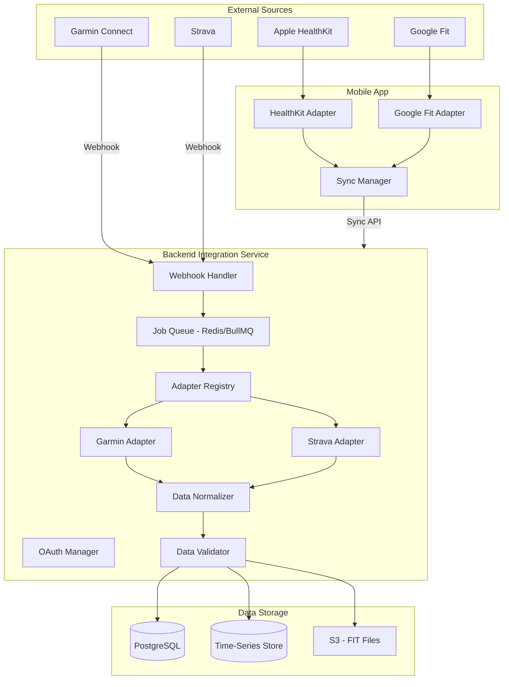

# RFC 0004: Wearable Integration Service

| Status        | Draft |
| :---          | :--- |
| **RFC #**     | 0004 |
| **Author(s)** | Integration Specialist |
| **Created**   | 2025-11-26 |
| **Updated**   | 2025-11-27 |

## 1. Introduction

### 1.1. Context
Following the **hybrid thick-client architecture** defined in [RFC 0001: System Architecture](./0001-system-architecture.md), the Wearable Integration Service handles the ingestion, normalization, and storage of health and activity data from external wearable devices and fitness platforms.

This service is critical for providing the "Holistic" coaching experience, as it feeds the Adaptive Training Engine with objective physiological data (HR, HRV, Sleep, GPS) that informs daily training decisions.

### 1.2. Problem Statement
Athletes use a variety of wearable devices (Garmin, Apple Watch, Polar, Coros, Fitbit) and fitness platforms (Strava). Each vendor has proprietary APIs, data formats, and access patterns. We need a vendor-agnostic integration layer that:
*   Normalizes disparate data formats into a unified internal schema
*   Handles webhook reliability, rate limits, and API failures gracefully
*   Supports both server-to-server (Garmin) and client-mediated (Apple Health) integrations
*   Prioritizes data sources when conflicts occur (e.g., Garmin HR vs. manual entry)
*   Scales to support additional vendors without architectural changes

### 1.3. Goals & Non-Goals
**Goals:**
*   **Vendor Agnostic:** Internal system uses a unified data model regardless of source
*   **Reliable:** Handle webhook failures, API rate limits, and data gaps gracefully
*   **Extensible:** Easy to add new vendors (Coros, Polar, Whoop) via adapter pattern
*   **Real-Time:** Activity data available within 5 minutes of completion (via webhooks)
*   **Bidirectional:** Support pushing structured workouts to compatible platforms (Garmin)

**Non-Goals:**
*   Native watch applications (covered in RFC 0001 Phase 5-6)
*   Real-time streaming during workouts (future enhancement)
*   Third-party coaching platform integrations (e.g., TrainingPeaks export)

### 1.4. Dependencies
**Related PRDs:**
*   [03_WEARABLE_INTEGRATION.md](../prd/03_WEARABLE_INTEGRATION.md) - Full requirements
*   [02_BACKEND_CORE.md](../prd/02_BACKEND_CORE.md) - Backend architecture

**Related RFCs:**
*   [RFC 0001: System Architecture](./0001-system-architecture.md) - Overall system design
*   [RFC 0003: Backend API Design](./0003-backend-api-design.md) - API patterns
*   [RFC 0006: Sync Infrastructure](./0006-sync-infrastructure.md) - Data synchronization

**External Dependencies:**
*   **Garmin Health API** - OAuth 2.0, webhooks, activity/health data
*   **Strava API v3** - OAuth 2.0, webhooks, activity aggregation
*   **Apple HealthKit** - iOS native framework (client-side)
*   **Google Fit API** - Android health data (client-side)

### 1.5. Success Metrics
*   **Integration Reliability:** >99.5% webhook delivery success rate
*   **Data Freshness:** Activities imported within 5 minutes of completion (via webhook)
*   **User Adoption:** >85% of users successfully connect at least one wearable
*   **Data Quality:** <1% of activities require manual correction due to anomalies
*   **RPE Collection:** >80% of activities have RPE logged within 30 minutes

---

## 2. Proposed Solution

### 2.1. High-Level Design

The Wearable Integration Service follows the **Adapter Pattern** to normalize vendor-specific data into a unified internal format.



**Key Principles:**
1. **Adapter Pattern:** Each vendor has a dedicated adapter implementing a common interface
2. **Queue-Based Processing:** Webhooks enqueue jobs for asynchronous processing
3. **Client-Mediated for Apple/Google:** HealthKit/Google Fit data flows through mobile app
4. **Idempotent Processing:** Duplicate webhooks handled gracefully via `external_id`

### 2.2. Detailed Design

#### 2.2.1. Internal Data Model (Normalized Schema)

```typescript
// Normalized Activity (from any source)
interface NormalizedActivity {
  source: 'garmin' | 'strava' | 'apple_health' | 'google_fit' | 'manual';
  externalId: string;
  activityType: ActivityType;
  startTime: Date;
  endTime: Date;
  durationSeconds: number;
  distanceMeters: number;
  elevationGainMeters: number;

  // Heart Rate Metrics
  avgHeartRate?: number;
  maxHeartRate?: number;
  heartRateZones?: HeartRateZoneTime[];

  // Pace/Speed Metrics
  avgPaceSecondsPerKm?: number;
  maxPaceSecondsPerKm?: number;

  // Running Dynamics (if available)
  avgCadence?: number;
  avgVerticalOscillation?: number;
  avgGroundContactTime?: number;
  avgStrideLength?: number;

  // Power (if available)
  avgPower?: number;
  normalizedPower?: number;

  // Time-Series Data (stored separately)
  hasGpsTrack: boolean;
  hasHeartRateStream: boolean;

  // Metadata
  deviceModel?: string;
  activityName?: string;
  notes?: string;
  fitFileUrl?: string;
}

type ActivityType =
  | 'running' | 'cycling' | 'swimming' | 'strength'
  | 'elliptical' | 'rowing' | 'walking' | 'other';

interface HeartRateZoneTime {
  zone: 1 | 2 | 3 | 4 | 5;
  seconds: number;
}

// Normalized Daily Health Metrics
interface NormalizedDailyHealth {
  date: string; // YYYY-MM-DD
  source: 'garmin' | 'apple_health' | 'google_fit' | 'manual';

  // Cardio-Respiratory System
  restingHeartRate?: number;
  hrvRmssd?: number;
  hrvMeasurementType?: 'morning_waking' | 'overnight_sleep' | 'unknown';
  hrvSensorType?: 'chest_strap' | 'optical_wrist' | 'optical_finger';
  hrvQualityScore?: 'high' | 'medium' | 'low';
  hrvDurationSeconds?: number;

  // Sleep Data
  sleepDurationMinutes?: number;
  sleepQualityScore?: number; // 0-100
  sleepStages?: {
    lightMinutes: number;
    deepMinutes: number;
    remMinutes: number;
    awakeMinutes: number;
  };

  // Stress/Recovery (Vendor-specific)
  stressScore?: number; // 0-100 (Garmin)
  bodyBattery?: number; // 0-100 (Garmin)
  readinessScore?: number; // 0-100 (Whoop, Oura)

  // Steps
  steps?: number;
}
```

#### 2.2.2. Adapter Interface

```typescript
interface WearableAdapter {
  readonly source: DataSource;

  // OAuth Flow
  getAuthorizationUrl(userId: string, redirectUri: string): string;
  exchangeCodeForTokens(code: string, redirectUri: string): Promise<OAuthTokens>;
  refreshTokens(refreshToken: string): Promise<OAuthTokens>;
  revokeAccess(accessToken: string): Promise<void>;

  // Data Fetching
  fetchActivity(accessToken: string, activityId: string): Promise<RawActivity>;
  fetchDailyHealth(accessToken: string, date: string): Promise<RawDailyHealth>;
  fetchActivities(accessToken: string, startDate: Date, endDate: Date): Promise<RawActivity[]>;

  // Normalization
  normalizeActivity(raw: RawActivity): NormalizedActivity;
  normalizeDailyHealth(raw: RawDailyHealth): NormalizedDailyHealth;

  // Webhook Handling
  validateWebhook(headers: Record<string, string>, body: string): boolean;
  parseWebhook(body: string): WebhookEvent;

  // Bidirectional (optional)
  pushWorkout?(accessToken: string, workout: StructuredWorkout): Promise<string>;
}

interface OAuthTokens {
  accessToken: string;
  refreshToken: string;
  expiresAt: Date;
  scope: string[];
}

type WebhookEvent =
  | { type: 'activity_created'; activityId: string; userId: string }
  | { type: 'daily_summary'; date: string; userId: string }
  | { type: 'deauthorization'; userId: string };
```

#### 2.2.3. Garmin Integration (Server-Side)

```typescript
// Garmin Adapter Implementation
class GarminAdapter implements WearableAdapter {
  readonly source = 'garmin';

  private readonly baseUrl = 'https://apis.garmin.com';
  private readonly consumerKey: string;
  private readonly consumerSecret: string;

  // OAuth 2.0 Flow
  getAuthorizationUrl(userId: string, redirectUri: string): string {
    const state = this.encodeState({ userId, redirectUri });
    return `${this.baseUrl}/oauth-service/oauth/authorize?` +
      `client_id=${this.consumerKey}&` +
      `response_type=code&` +
      `scope=activities:read dailies:read workouts:write&` +
      `state=${state}&` +
      `redirect_uri=${encodeURIComponent(redirectUri)}`;
  }

  async fetchActivity(accessToken: string, activityId: string): Promise<GarminActivity> {
    const response = await fetch(
      `${this.baseUrl}/wellness-api/rest/activities/${activityId}`,
      { headers: { Authorization: `Bearer ${accessToken}` } }
    );
    return response.json();
  }

  normalizeActivity(raw: GarminActivity): NormalizedActivity {
    return {
      source: 'garmin',
      externalId: raw.activityId.toString(),
      activityType: this.mapActivityType(raw.activityType),
      startTime: new Date(raw.startTimeInSeconds * 1000),
      endTime: new Date((raw.startTimeInSeconds + raw.durationInSeconds) * 1000),
      durationSeconds: raw.durationInSeconds,
      distanceMeters: raw.distanceInMeters,
      elevationGainMeters: raw.elevationGainInMeters ?? 0,
      avgHeartRate: raw.averageHeartRateInBeatsPerMinute,
      maxHeartRate: raw.maxHeartRateInBeatsPerMinute,
      avgPaceSecondsPerKm: raw.distanceInMeters > 0
        ? (raw.durationInSeconds / (raw.distanceInMeters / 1000))
        : undefined,
      avgCadence: raw.averageRunCadenceInStepsPerMinute,
      hasGpsTrack: raw.hasPolyline ?? false,
      hasHeartRateStream: raw.hasHeartRateSamples ?? false,
      deviceModel: raw.deviceName,
      activityName: raw.activityName,
    };
  }

  private mapActivityType(garminType: string): ActivityType {
    const mapping: Record<string, ActivityType> = {
      'running': 'running',
      'trail_running': 'running',
      'treadmill_running': 'running',
      'cycling': 'cycling',
      'indoor_cycling': 'cycling',
      'swimming': 'swimming',
      'pool_swimming': 'swimming',
      'strength_training': 'strength',
      'elliptical': 'elliptical',
      'rowing': 'rowing',
      'walking': 'walking',
    };
    return mapping[garminType.toLowerCase()] ?? 'other';
  }

  // Webhook validation
  validateWebhook(headers: Record<string, string>, body: string): boolean {
    const signature = headers['x-garmin-signature'];
    const expectedSignature = crypto
      .createHmac('sha256', this.consumerSecret)
      .update(body)
      .digest('hex');
    return crypto.timingSafeEqual(
      Buffer.from(signature),
      Buffer.from(expectedSignature)
    );
  }
}
```

#### 2.2.4. Apple Health Integration (Client-Side)

```typescript
// React Native - HealthKit Adapter
import AppleHealthKit, { HealthKitPermissions, HealthValue } from 'react-native-health';

class AppleHealthAdapter {
  private readonly permissions: HealthKitPermissions = {
    permissions: {
      read: [
        AppleHealthKit.Constants.Permissions.HeartRate,
        AppleHealthKit.Constants.Permissions.HeartRateVariability,
        AppleHealthKit.Constants.Permissions.RestingHeartRate,
        AppleHealthKit.Constants.Permissions.SleepAnalysis,
        AppleHealthKit.Constants.Permissions.Workout,
        AppleHealthKit.Constants.Permissions.StepCount,
      ],
      write: [],
    },
  };

  async requestPermissions(): Promise<boolean> {
    return new Promise((resolve) => {
      AppleHealthKit.initHealthKit(this.permissions, (err) => {
        resolve(!err);
      });
    });
  }

  async getWorkouts(startDate: Date, endDate: Date): Promise<NormalizedActivity[]> {
    return new Promise((resolve, reject) => {
      AppleHealthKit.getSamples({
        typeIdentifier: 'HKWorkoutTypeIdentifier',
        startDate: startDate.toISOString(),
        endDate: endDate.toISOString(),
      }, (err, results) => {
        if (err) reject(err);
        resolve(results.map(this.normalizeWorkout));
      });
    });
  }

  async getDailyHealth(date: string): Promise<NormalizedDailyHealth> {
    const [hrv, restingHR, sleep, steps] = await Promise.all([
      this.getHRV(date),
      this.getRestingHR(date),
      this.getSleep(date),
      this.getSteps(date),
    ]);

    return {
      date,
      source: 'apple_health',
      hrvRmssd: hrv?.value,
      hrvMeasurementType: hrv ? 'overnight_sleep' : undefined,
      hrvSensorType: 'optical_wrist',
      hrvQualityScore: 'medium',
      restingHeartRate: restingHR,
      sleepDurationMinutes: sleep?.totalMinutes,
      sleepQualityScore: sleep?.quality,
      sleepStages: sleep?.stages,
      steps,
    };
  }

  private normalizeWorkout(raw: HealthValue): NormalizedActivity {
    return {
      source: 'apple_health',
      externalId: raw.id,
      activityType: this.mapActivityType(raw.activityType),
      startTime: new Date(raw.startDate),
      endTime: new Date(raw.endDate),
      durationSeconds: raw.duration,
      distanceMeters: raw.distance * 1000, // Convert km to m
      elevationGainMeters: 0,
      avgHeartRate: raw.averageHeartRate,
      hasGpsTrack: false,
      hasHeartRateStream: false,
    };
  }
}
```

#### 2.2.5. Webhook Handler & Queue Processing

```typescript
// NestJS Webhook Controller
@Controller('webhooks')
export class WebhookController {
  constructor(
    private readonly adapterRegistry: AdapterRegistry,
    private readonly webhookQueue: Queue,
  ) {}

  @Post('garmin')
  async handleGarminWebhook(
    @Headers() headers: Record<string, string>,
    @Body() body: string,
    @Req() req: Request,
  ): Promise<{ success: boolean }> {
    const adapter = this.adapterRegistry.get('garmin');

    // Validate webhook signature
    if (!adapter.validateWebhook(headers, body)) {
      throw new UnauthorizedException('Invalid webhook signature');
    }

    const event = adapter.parseWebhook(body);

    // Enqueue for async processing (idempotent)
    await this.webhookQueue.add('process-webhook', {
      source: 'garmin',
      event,
      receivedAt: new Date().toISOString(),
    }, {
      jobId: `garmin-${event.type}-${event.activityId ?? event.date}`,
      attempts: 3,
      backoff: { type: 'exponential', delay: 1000 },
    });

    return { success: true };
  }

  @Post('strava')
  async handleStravaWebhook(/* similar implementation */) {}
}

// BullMQ Worker
@Processor('webhook-queue')
export class WebhookProcessor {
  constructor(
    private readonly adapterRegistry: AdapterRegistry,
    private readonly activityService: ActivityService,
    private readonly dailyHealthService: DailyHealthService,
    private readonly tokenService: IntegrationTokenService,
  ) {}

  @Process('process-webhook')
  async processWebhook(job: Job<WebhookJob>): Promise<void> {
    const { source, event } = job.data;
    const adapter = this.adapterRegistry.get(source);

    // Get user's access token
    const tokens = await this.tokenService.getTokens(event.userId, source);
    if (!tokens) {
      throw new Error(`No tokens found for user ${event.userId}`);
    }

    // Refresh if expired
    if (tokens.expiresAt < new Date()) {
      const newTokens = await adapter.refreshTokens(tokens.refreshToken);
      await this.tokenService.saveTokens(event.userId, source, newTokens);
      tokens.accessToken = newTokens.accessToken;
    }

    switch (event.type) {
      case 'activity_created': {
        // Fetch full activity data
        const rawActivity = await adapter.fetchActivity(tokens.accessToken, event.activityId);
        const normalized = adapter.normalizeActivity(rawActivity);

        // Check for duplicates
        const existing = await this.activityService.findByExternalId(source, event.activityId);
        if (existing) {
          // Merge data (prefer new data for objective metrics)
          await this.activityService.merge(existing.id, normalized);
        } else {
          await this.activityService.create(event.userId, normalized);
        }

        // Trigger RPE reminder notification (20-30 min post-workout)
        await this.scheduleRpeReminder(event.userId, normalized.endTime);
        break;
      }

      case 'daily_summary': {
        const rawHealth = await adapter.fetchDailyHealth(tokens.accessToken, event.date);
        const normalized = adapter.normalizeDailyHealth(rawHealth);
        await this.dailyHealthService.upsert(event.userId, normalized);
        break;
      }

      case 'deauthorization': {
        await this.tokenService.deleteTokens(event.userId, source);
        break;
      }
    }
  }
}
```

#### 2.2.6. Data Priority & Conflict Resolution

```typescript
// Data source priority hierarchy
const DATA_PRIORITY: Record<DataSource, number> = {
  'chest_strap': 1,      // Highest - external sensors
  'garmin': 2,           // Hardware watch source
  'polar': 2,
  'coros': 2,
  'apple_health': 3,     // Phone-mediated watch data
  'google_fit': 3,
  'strava': 4,           // Aggregator
  'manual': 5,           // User entry (lowest for objective data)
};

// Conflict resolution
class ActivityMergeService {
  merge(existing: Activity, incoming: NormalizedActivity): Activity {
    const existingPriority = DATA_PRIORITY[existing.source];
    const incomingPriority = DATA_PRIORITY[incoming.source];

    // Objective metrics: prefer higher priority source
    const objectiveMetrics = incomingPriority <= existingPriority
      ? {
          avgHeartRate: incoming.avgHeartRate ?? existing.avgHeartRate,
          maxHeartRate: incoming.maxHeartRate ?? existing.maxHeartRate,
          distanceMeters: incoming.distanceMeters ?? existing.distanceMeters,
          avgPaceSecondsPerKm: incoming.avgPaceSecondsPerKm ?? existing.avgPaceSecondsPerKm,
          // ... other objective metrics
        }
      : {
          avgHeartRate: existing.avgHeartRate ?? incoming.avgHeartRate,
          maxHeartRate: existing.maxHeartRate ?? incoming.maxHeartRate,
          distanceMeters: existing.distanceMeters ?? incoming.distanceMeters,
          avgPaceSecondsPerKm: existing.avgPaceSecondsPerKm ?? incoming.avgPaceSecondsPerKm,
        };

    // Subjective metrics: always prefer existing (user-entered)
    const subjectiveMetrics = {
      rpe: existing.rpe ?? incoming.rpe,
      notes: existing.notes ?? incoming.notes,
      feeling: existing.feeling ?? incoming.feeling,
    };

    return {
      ...existing,
      ...objectiveMetrics,
      ...subjectiveMetrics,
      mergedFrom: [...(existing.mergedFrom ?? []), incoming.source],
    };
  }

  // De-duplication check
  isDuplicate(a: NormalizedActivity, b: NormalizedActivity): boolean {
    // Same start time within 5 minutes AND same activity type
    const timeDiff = Math.abs(a.startTime.getTime() - b.startTime.getTime());
    return timeDiff < 5 * 60 * 1000 && a.activityType === b.activityType;
  }
}
```

#### 2.2.7. HRV Validation & Quality Scoring

```typescript
class HRVValidator {
  // Physiologically plausible range
  private readonly MIN_HRV = 20;  // ms RMSSD
  private readonly MAX_HRV = 120; // ms RMSSD

  validate(hrv: NormalizedDailyHealth): HRVValidationResult {
    const issues: string[] = [];
    let qualityScore: 'high' | 'medium' | 'low' = 'medium';

    // Range check
    if (hrv.hrvRmssd && (hrv.hrvRmssd < this.MIN_HRV || hrv.hrvRmssd > this.MAX_HRV)) {
      issues.push(`HRV value ${hrv.hrvRmssd}ms outside physiological range`);
      qualityScore = 'low';
    }

    // Duration check
    if (hrv.hrvDurationSeconds && hrv.hrvDurationSeconds < 60) {
      issues.push('HRV measurement duration < 1 minute');
      qualityScore = 'low';
    }

    // Sensor type adjustment
    if (hrv.hrvSensorType === 'chest_strap') {
      qualityScore = 'high';
    }

    // Measurement type check
    if (hrv.hrvMeasurementType === 'unknown') {
      qualityScore = qualityScore === 'high' ? 'medium' : 'low';
    }

    return {
      isValid: issues.length === 0,
      qualityScore,
      issues,
      adjustedHrv: hrv.hrvRmssd,
    };
  }

  // Detect anomalous changes (potential measurement error or illness)
  detectAnomaly(current: number, baseline30d: number, stdDev: number): AnomalyResult {
    const zScore = (current - baseline30d) / stdDev;

    if (Math.abs(zScore) > 2) {
      return {
        isAnomaly: true,
        severity: Math.abs(zScore) > 3 ? 'high' : 'moderate',
        message: zScore < 0
          ? 'HRV significantly below baseline - may indicate stress or illness'
          : 'HRV significantly above baseline - verify measurement quality',
      };
    }

    return { isAnomaly: false };
  }
}
```

### 2.3. Data Model Changes

```prisma
// Prisma Schema additions for Wearable Integration

model IntegrationConnection {
  id           String   @id @default(cuid())
  userId       String
  user         User     @relation(fields: [userId], references: [id], onDelete: Cascade)
  source       DataSource
  accessToken  String   @db.Text // Encrypted
  refreshToken String   @db.Text // Encrypted
  expiresAt    DateTime
  scope        String[]
  connectedAt  DateTime @default(now())
  lastSyncAt   DateTime?
  status       ConnectionStatus @default(ACTIVE)

  @@unique([userId, source])
  @@index([userId])
}

enum DataSource {
  GARMIN
  STRAVA
  APPLE_HEALTH
  GOOGLE_FIT
  POLAR
  COROS
  WHOOP
  MANUAL
}

enum ConnectionStatus {
  ACTIVE
  EXPIRED
  REVOKED
  ERROR
}

model ActivityImport {
  id           String   @id @default(cuid())
  activityId   String
  activity     Activity @relation(fields: [activityId], references: [id], onDelete: Cascade)
  source       DataSource
  externalId   String
  importedAt   DateTime @default(now())
  rawData      Json?    // Original vendor data (for debugging)

  @@unique([source, externalId])
  @@index([activityId])
}

model WebhookLog {
  id           String   @id @default(cuid())
  source       DataSource
  eventType    String
  payload      Json
  status       WebhookStatus
  processedAt  DateTime?
  error        String?
  createdAt    DateTime @default(now())

  @@index([source, createdAt])
}

enum WebhookStatus {
  RECEIVED
  PROCESSING
  COMPLETED
  FAILED
}
```

### 2.4. API Changes

```typescript
// tRPC Router for Integrations
export const integrationRouter = router({
  // List connected integrations
  list: protectedProcedure.query(async ({ ctx }) => {
    return ctx.db.integrationConnection.findMany({
      where: { userId: ctx.user.id },
      select: {
        source: true,
        connectedAt: true,
        lastSyncAt: true,
        status: true,
      },
    });
  }),

  // Get OAuth URL for connecting
  getAuthUrl: protectedProcedure
    .input(z.object({ source: z.nativeEnum(DataSource) }))
    .query(async ({ ctx, input }) => {
      const adapter = ctx.adapterRegistry.get(input.source);
      const redirectUri = `${ctx.config.appUrl}/api/oauth/callback/${input.source}`;
      return adapter.getAuthorizationUrl(ctx.user.id, redirectUri);
    }),

  // Exchange OAuth code for tokens (called from callback)
  exchangeCode: protectedProcedure
    .input(z.object({
      source: z.nativeEnum(DataSource),
      code: z.string(),
    }))
    .mutation(async ({ ctx, input }) => {
      const adapter = ctx.adapterRegistry.get(input.source);
      const redirectUri = `${ctx.config.appUrl}/api/oauth/callback/${input.source}`;
      const tokens = await adapter.exchangeCodeForTokens(input.code, redirectUri);

      await ctx.db.integrationConnection.upsert({
        where: { userId_source: { userId: ctx.user.id, source: input.source } },
        create: {
          userId: ctx.user.id,
          source: input.source,
          accessToken: encrypt(tokens.accessToken),
          refreshToken: encrypt(tokens.refreshToken),
          expiresAt: tokens.expiresAt,
          scope: tokens.scope,
        },
        update: {
          accessToken: encrypt(tokens.accessToken),
          refreshToken: encrypt(tokens.refreshToken),
          expiresAt: tokens.expiresAt,
          scope: tokens.scope,
          status: 'ACTIVE',
        },
      });

      // Trigger historical import
      await ctx.importQueue.add('historical-import', {
        userId: ctx.user.id,
        source: input.source,
        days: 90, // Import last 90 days
      });

      return { success: true };
    }),

  // Disconnect integration
  disconnect: protectedProcedure
    .input(z.object({ source: z.nativeEnum(DataSource) }))
    .mutation(async ({ ctx, input }) => {
      const connection = await ctx.db.integrationConnection.findUnique({
        where: { userId_source: { userId: ctx.user.id, source: input.source } },
      });

      if (connection) {
        const adapter = ctx.adapterRegistry.get(input.source);
        await adapter.revokeAccess(decrypt(connection.accessToken));
        await ctx.db.integrationConnection.delete({
          where: { id: connection.id },
        });
      }

      return { success: true };
    }),

  // Manual sync trigger
  syncNow: protectedProcedure
    .input(z.object({ source: z.nativeEnum(DataSource) }))
    .mutation(async ({ ctx, input }) => {
      await ctx.importQueue.add('manual-sync', {
        userId: ctx.user.id,
        source: input.source,
        days: 7, // Sync last 7 days
      });

      return { success: true, message: 'Sync started' };
    }),

  // Get connection status
  status: protectedProcedure
    .input(z.object({ source: z.nativeEnum(DataSource) }))
    .query(async ({ ctx, input }) => {
      const connection = await ctx.db.integrationConnection.findUnique({
        where: { userId_source: { userId: ctx.user.id, source: input.source } },
      });

      if (!connection) {
        return { connected: false };
      }

      return {
        connected: true,
        status: connection.status,
        lastSyncAt: connection.lastSyncAt,
        expiresAt: connection.expiresAt,
      };
    }),
});
```

### 2.5. Offline-First Considerations

**Apple Health / Google Fit (Client-Side):**
*   Data read from HealthKit/Google Fit stored locally in WatermelonDB
*   Normalized activities queued for sync to backend
*   If offline, data syncs when connection restored
*   Client-side adapter runs normalization locally

**Server-Side Integrations (Garmin/Strava):**
*   Webhook data stored in database immediately
*   If backend processing fails, job retries with exponential backoff
*   Mobile app pulls new activities during regular sync

**Conflict Resolution:**
*   Same activity from multiple sources (e.g., Garmin + Strava) merged
*   Last-synced version from backend is authoritative for cloud-sourced data
*   Client-entered data (RPE, notes) always preserved

### 2.6. Synchronization Strategy

**Webhook Flow (Real-Time):**
1. Garmin/Strava sends webhook to backend
2. Webhook enqueued for async processing
3. Worker fetches full data, normalizes, stores
4. Mobile app receives update during next sync (or push notification)

**Polling Fallback:**
*   If webhooks fail, poll for new activities every 15 minutes
*   Poll daily health summaries once per day at 6 AM local time

**Historical Import:**
*   On first connection, import last 90 days of data
*   Paginated to avoid rate limits (100 activities per request)
*   Background job with progress tracking

**Client-Mediated Sync (Apple Health):**
1. App reads from HealthKit on launch and periodic background task
2. New data normalized and stored in local DB
3. Synced to backend via standard sync API
4. Backend stores with `source: 'apple_health'`

---

## 3. Implementation Plan

### 3.1. Phasing

**Phase 1: Core Infrastructure (Week 1-2)**
*   **Deliverables:**
    *   Adapter interface and registry
    *   OAuth token storage (encrypted)
    *   Webhook controller with queue integration
    *   Basic normalization pipeline
*   **Success Criteria:**
    *   Adapters can be registered and retrieved
    *   Tokens stored securely and refreshed
    *   Webhooks received and enqueued

**Phase 2: Garmin Integration (Week 3-4)**
*   **Deliverables:**
    *   Complete Garmin adapter implementation
    *   OAuth flow (connect/disconnect)
    *   Activity and daily health normalization
    *   Historical import job
    *   Webhook processing
*   **Success Criteria:**
    *   User can connect Garmin account
    *   Activities appear within 5 minutes of completion
    *   Daily HRV/sleep data imported

**Phase 3: Apple Health Integration (Week 5-6)**
*   **Deliverables:**
    *   React Native HealthKit module
    *   Local AppleHealthAdapter
    *   Background sync task
    *   Integration with main sync flow
*   **Success Criteria:**
    *   User can grant HealthKit permissions
    *   Workouts and health data sync to backend
    *   Works offline with queued sync

**Phase 4: Strava Integration (Week 7-8)**
*   **Deliverables:**
    *   Strava adapter implementation
    *   OAuth flow
    *   Webhook handling
    *   De-duplication with Garmin data
*   **Success Criteria:**
    *   User can connect Strava
    *   Activities imported and de-duplicated
    *   Works alongside Garmin connection

**Phase 5: Data Quality & Validation (Week 9)**
*   **Deliverables:**
    *   HRV validation and quality scoring
    *   Anomaly detection
    *   Activity data quality checks
    *   User notification for issues
*   **Success Criteria:**
    *   Invalid data flagged
    *   Quality scores assigned
    *   <1% manual correction rate

**Phase 6: Bidirectional Sync (Week 10)**
*   **Deliverables:**
    *   Push structured workouts to Garmin
    *   Workout format conversion (FIT)
    *   Scheduling (next 7 days)
*   **Success Criteria:**
    *   Workouts appear on Garmin watch
    *   Correct structure and zones

### 3.2. Testing Strategy

**Unit Tests:**
*   Adapter normalization logic (each vendor)
*   Conflict resolution algorithms
*   HRV validation rules
*   OAuth token refresh logic
*   Coverage target: 80%+

**Integration Tests:**
*   OAuth flow end-to-end (mock vendor APIs)
*   Webhook processing pipeline
*   Historical import with pagination
*   De-duplication scenarios

**End-to-End Tests:**
*   User connects Garmin → activity imported → appears in app
*   Apple Health workout → synced to backend → visible on web

**Offline/Online Transition Tests:**
*   Apple Health data collected offline → syncs when online
*   Webhook arrives during mobile app offline → data available on next sync

**Performance Tests:**
*   Historical import of 500 activities (rate limit compliance)
*   Webhook processing throughput (100 concurrent webhooks)
*   Query performance for activity timeline

### 3.3. Migration Strategy

*   No existing integrations (greenfield)
*   Database migrations deployed via Prisma
*   Feature flag for phased vendor rollout

**Rollout Plan:**
1. Garmin (Week 4): Beta users only
2. Apple Health (Week 6): All iOS users
3. Strava (Week 8): All users
4. Google Fit (Future): Android users

### 3.4. Rollback Strategy

**Rollback Triggers:**
*   Webhook processing error rate > 10%
*   OAuth flow failures > 5%
*   Data quality issues reported by users

**Rollback Procedure:**
1. Disable webhook endpoints (return 503)
2. Pause import queue processing
3. Revert to previous adapter version
4. Re-process failed webhooks after fix

**Data Integrity:**
*   Webhook payloads logged for replay
*   Activity imports are idempotent (upsert by external_id)
*   No data loss on rollback

---

## 4. Alternatives Considered

| Alternative | Pros | Cons | Reason for Rejection |
|------------|------|------|---------------------|
| **Single vendor focus (Garmin only)** | Simpler implementation | Excludes Apple Watch users (large market) | Need broad device support |
| **Third-party aggregator (Terra API)** | Single integration point | Vendor lock-in, cost, latency | Want direct control over data flow |
| **Client-side only (all via HealthKit)** | Simpler backend | Garmin data not in HealthKit, Android excluded | Need server-side for reliability |
| **Real-time streaming (WebSocket from watch)** | Lowest latency | Complex, battery drain, not supported by vendors | Post-workout sync sufficient for MVP |

---

## 5. Cross-Cutting Concerns

### 5.1. Security

**Authentication:**
*   OAuth 2.0 for all vendor integrations
*   Tokens encrypted at rest (AES-256-GCM)
*   Tokens never exposed to client applications

**Authorization:**
*   Request only necessary OAuth scopes
*   User can revoke access anytime
*   Automatic token refresh server-side

**Data Protection:**
*   Webhook signatures validated (HMAC-SHA256)
*   TLS 1.3 for all API communication
*   Rate limiting on webhook endpoints (100/min per source)

**Privacy:**
*   GPS tracks aggregated after 90 days (privacy-preserving)
*   User can delete imported data
*   Selective import (user chooses which metrics)

**Threat Model:**
*   **Threat:** Malicious webhook injection
    *   **Mitigation:** Signature validation, origin verification
*   **Threat:** Token theft
    *   **Mitigation:** Encryption at rest, short expiry, refresh rotation
*   **Threat:** Data exfiltration via integration
    *   **Mitigation:** Minimal scope, audit logging

### 5.2. Performance

**Latency:**
*   Webhook to stored activity: < 30 seconds
*   OAuth flow: < 5 seconds total
*   Historical import: 100 activities/minute

**Throughput:**
*   Webhook endpoint: 1000 req/min capacity
*   Import queue: 10 concurrent workers

**Resource Usage:**
*   Queue memory: < 100 MB per worker
*   Database connections: Pooled (max 20 per service)

**Scalability:**
*   Horizontal scaling of webhook workers
*   Separate queues per vendor (isolation)
*   Read replicas for query load

### 5.3. Observability

**Logging:**
*   Webhook events (received, processed, failed)
*   OAuth flows (initiated, completed, errors)
*   Data quality issues (anomalies, validation failures)

**Metrics:**
*   Webhook success rate (by source)
*   Import latency (p50, p95, p99)
*   Active connections per source
*   Queue depth and processing time

**Tracing:**
*   Distributed trace from webhook → DB write
*   Trace ID in all log entries

**Alerting:**
*   Webhook failure rate > 5% → PagerDuty
*   OAuth errors spike → Slack
*   Queue depth > 1000 → Dashboard warning

### 5.4. Reliability

**Error Handling:**
*   Webhook failures: retry with exponential backoff
*   OAuth token refresh: automatic before expiry
*   API rate limits: respect and backoff

**Retries:**
*   Webhook jobs: 3 attempts, exponential backoff
*   API calls: 3 attempts, linear backoff
*   Dead-letter queue for permanent failures

**Circuit Breakers:**
*   Per-vendor circuit breaker
*   Open after 5 consecutive failures
*   Half-open after 60 seconds

**Data Integrity:**
*   Idempotent processing via external_id
*   Webhook payload logging for replay
*   Checksum validation for FIT files

**Disaster Recovery:**
*   Webhook logs retained 30 days
*   Can replay from logs if data lost
*   Integration connections backed up with main DB

---

## 6. Stakeholder Review

| Stakeholder | Role | Review Status | Sign-off Date |
|------------|------|---------------|---------------|
| Integration Specialist | Author | Approved | 2025-11-27 |
| Backend Lead | Technical Review | Pending | - |
| Security Engineer | Security Review | Pending | - |
| Product Manager | Requirements | Pending | - |

---

## 7. Open Questions

*   **Historical Import Limit:** How far back should we import? Current: 90 days. Consider user preference.
*   **Rate Limit Handling:** Garmin rate limits are strict (100 req/hour). Need robust backoff strategy.
*   **FIT File Storage:** Store raw FIT files for how long? Cost vs. debugging value.
*   **Google Fit Priority:** When to prioritize Google Fit implementation? Based on Android user demand.
*   **Whoop/Oura Integration:** These provide excellent HRV data. Priority for Phase 2+?

---

## 8. References

*   [PRD: Wearable Data Integration](../prd/03_WEARABLE_INTEGRATION.md)
*   [Garmin Health API Documentation](https://developer.garmin.com/health-api/overview/)
*   [Strava API Documentation](https://developers.strava.com/)
*   [Apple HealthKit Documentation](https://developer.apple.com/documentation/healthkit)
*   [RFC 0001: System Architecture](./0001-system-architecture.md)
*   [RFC 0003: Backend API Design](./0003-backend-api-design.md)
