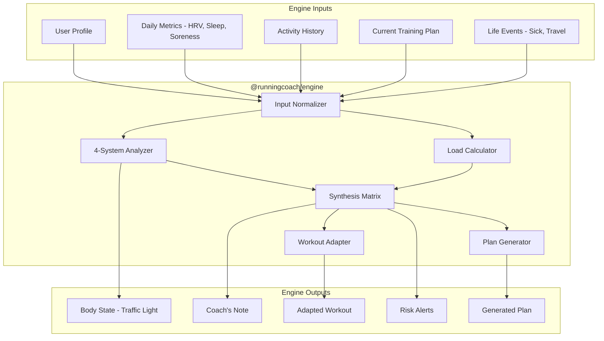

# RFC 0005: Adaptive Training Engine (The Brain)

| Status        | Draft |
| :---          | :--- |
| **RFC #**     | 0005 |
| **Author(s)** | Lead Algorithm Engineer |
| **Created**   | 2025-11-26 |
| **Updated**   | 2025-11-27 |

## 1. Introduction

### 1.1. Context
Following the **hybrid thick-client architecture** defined in [RFC 0001: System Architecture](./0001-system-architecture.md), the Adaptive Training Engine (nicknamed "The Brain") is the core intelligence of RunningCoach. This portable TypeScript package runs locally on devices for zero-latency guidance and offline functionality, while also executing on the backend for batch processing.

The engine implements the 4-System Analysis Model from [PRD 06: Adaptive Training Engine](../prd/06_ADAPTIVE_TRAINING_ENGINE.md), continuously analyzing physiological data across Cardiovascular, Muscular, Skeletal, and CNS systems to adapt training daily.

### 1.2. Problem Statement
Traditional training plans are static documents that don't adapt to:
*   **Day-to-day readiness variation:** Sleep quality, stress, recovery status
*   **Training response patterns:** Individual adaptation rates and recovery needs
*   **Life disruptions:** Illness, travel, work stress, family commitments
*   **Accumulated fatigue:** Progressive overload vs. overtraining risk

We need an intelligent system that:
*   Evaluates multi-system readiness before prescribing workouts
*   Adapts workouts in real-time based on current body state
*   Runs offline on devices without network dependency
*   Can be updated over-the-air without app store releases
*   Produces deterministic outputs (same inputs → same outputs)

### 1.3. Goals & Non-Goals
**Goals:**
*   **Portability:** Logic runs identically on Node.js, React Native (Hermes), and browser
*   **Determinism:** Same inputs produce same outputs regardless of platform
*   **Updatability:** Update coaching algorithms without app store releases (OTA)
*   **Zero Network Dependency:** Full functionality offline
*   **Evidence-Based:** All decisions backed by sports science research
*   **Explainable:** Users understand why modifications are made ("Coach's Note")

**Non-Goals:**
*   Machine learning model training (future phase)
*   Social features or coach marketplace
*   Video analysis or form feedback (separate feature)
*   Nutrition tracking logic (covered in RFC 0011)

### 1.4. Dependencies
**Related PRDs:**
*   [06_ADAPTIVE_TRAINING_ENGINE.md](../prd/06_ADAPTIVE_TRAINING_ENGINE.md) - Core logic requirements
*   [07_LOAD_MANAGEMENT.md](../prd/07_LOAD_MANAGEMENT.md) - ACWR and TSB calculations
*   [02_BACKEND_CORE.md](../prd/02_BACKEND_CORE.md) - Backend integration

**Related RFCs:**
*   [RFC 0001: System Architecture](./0001-system-architecture.md) - Distribution architecture
*   [RFC 0004: Wearable Integration](./0004-wearable-integration-service.md) - Data sources
*   [RFC 0007: Load Management](./0007-load-management-service.md) - Load calculations

**External Dependencies:**
*   **EAS Update (Expo)** - OTA updates for React Native
*   **AWS S3 + CloudFront** - Logic bundle distribution
*   **Hermes JS Engine** - React Native execution environment

### 1.5. Success Metrics
*   **Injury Rate:** <5% of users reporting training-related injury
*   **Plan Completion:** >85% of modified workout sessions completed
*   **Personal Bests:** >60% of users achieving goal time within 5%
*   **Logic Update Adoption:** 90% of active users on latest engine within 24 hours
*   **Offline Reliability:** 100% of core features functional without network
*   **Determinism:** Zero divergence between platforms for identical inputs

---

## 2. Proposed Solution

### 2.1. High-Level Design

The Adaptive Training Engine is a **standalone TypeScript package** (`@runningcoach/engine`) with zero external dependencies. It receives structured inputs and produces deterministic outputs.



**Key Principles:**
1. **Pure Functions:** No side effects, no I/O, no database access
2. **Portable:** Runs in any JavaScript environment
3. **Deterministic:** Same inputs always produce same outputs
4. **Versioned:** Semantic versioning with backward compatibility
5. **Testable:** Comprehensive unit tests with real-world scenarios

### 2.2. Detailed Design

#### 2.2.1. Package Structure

```
@runningcoach/engine/
├── src/
│   ├── index.ts                 # Public API exports
│   ├── types/
│   │   ├── inputs.ts            # Input type definitions
│   │   ├── outputs.ts           # Output type definitions
│   │   └── internal.ts          # Internal types
│   ├── analyzers/
│   │   ├── cardio.ts            # Cardiovascular system analysis
│   │   ├── muscular.ts          # Muscular system analysis
│   │   ├── skeletal.ts          # Skeletal system (ACWR)
│   │   ├── cns.ts               # CNS/Neural analysis
│   │   └── synthesis.ts         # Multi-system synthesis
│   ├── adapters/
│   │   ├── workout.ts           # Workout modification logic
│   │   └── plan.ts              # Plan adaptation logic
│   ├── generators/
│   │   ├── plan.ts              # Training plan generation
│   │   └── periodization.ts     # Phase management
│   ├── calculators/
│   │   ├── load.ts              # Training load (RPE × Duration)
│   │   ├── acwr.ts              # ACWR calculation
│   │   ├── tsb.ts               # Training Stress Balance
│   │   └── zones.ts             # HR/Pace zone calculations
│   ├── protocols/
│   │   ├── illness.ts           # Return-to-sport after illness
│   │   ├── travel.ts            # Travel adaptation
│   │   └── injury.ts            # Injury management
│   └── utils/
│       ├── statistics.ts        # EWMA, Z-scores, etc.
│       ├── date.ts              # Date calculations
│       └── validation.ts        # Input validation
├── tests/
│   ├── unit/                    # Unit tests per module
│   ├── integration/             # Cross-module tests
│   └── scenarios/               # Real-world training scenarios
├── package.json
└── tsconfig.json
```

#### 2.2.2. Core Types & Interfaces

```typescript
// ==================== INPUT TYPES ====================

export interface EngineInput {
  user: UserProfile;
  metrics: DailyMetrics;
  activities: Activity[];
  plan: TrainingPlan;
  lifeEvents: LifeEvent[];
  today: string; // YYYY-MM-DD (for determinism)
}

export interface UserProfile {
  id: string;
  birthDate: string;
  gender: 'male' | 'female' | 'other';
  weightKg: number;
  heightCm: number;

  // Physiological Baselines
  restingHrBaseline: number;
  hrvBaseline: number;
  maxHr: number;
  lactateThresholdHr: number;

  // Training History
  experienceLevel: 'beginner' | 'intermediate' | 'advanced';
  weeklyRunningHours: number;
  responderType: 'high' | 'moderate' | 'low' | 'unknown';

  // Goals
  goalRaceDate?: string;
  goalRaceDistance?: number; // meters
  goalFinishTime?: number; // seconds
}

export interface DailyMetrics {
  date: string;

  // Objective (from wearables)
  restingHr?: number;
  hrvRmssd?: number;
  hrvQuality?: 'high' | 'medium' | 'low';
  sleepDurationMinutes?: number;
  sleepQuality?: number; // 0-100

  // Subjective (from check-in)
  sorenessRating?: number; // 1-10
  stressRating?: number; // 1-10
  energyRating?: number; // 1-10
  motivationRating?: number; // 1-10
  sleepRating?: number; // 1-10 (if no wearable data)
}

export interface Activity {
  id: string;
  date: string;
  type: ActivityType;
  durationSeconds: number;
  distanceMeters?: number;
  rpe?: number; // 0-10
  avgHeartRate?: number;
  maxHeartRate?: number;
  elevationGain?: number;
  completed: boolean;
  plannedWorkoutId?: string;
}

export interface TrainingPlan {
  id: string;
  userId: string;
  goalRaceDate: string;
  currentPhase: TrainingPhase;
  weeks: TrainingWeek[];
  version: number;
}

export interface LifeEvent {
  type: 'sick' | 'travel' | 'injury' | 'vacation' | 'high_stress';
  startDate: string;
  endDate?: string;
  severity?: 'mild' | 'moderate' | 'severe';
  details?: string;
}

// ==================== OUTPUT TYPES ====================

export interface EngineOutput {
  bodyState: BodyState;
  todaysWorkout: AdaptedWorkout;
  coachNote: string;
  alerts: Alert[];
  loadMetrics: LoadMetrics;
  weekSummary?: WeekSummary;
}

export interface BodyState {
  cardio: SystemStatus;
  muscular: SystemStatus;
  skeletal: SystemStatus;
  cns: SystemStatus;
  overall: OverallReadiness;
  timestamp: string;
}

export interface SystemStatus {
  status: 'green' | 'yellow' | 'red';
  score: number; // 0-100
  factors: StatusFactor[];
}

export interface StatusFactor {
  name: string;
  value: number;
  baseline: number;
  deviation: number; // Standard deviations from baseline
  impact: 'positive' | 'neutral' | 'negative';
}

export interface OverallReadiness {
  score: number; // 0-100
  directive: 'push' | 'maintain' | 'recover';
  confidence: number; // 0-1
}

export interface AdaptedWorkout {
  original: ScheduledWorkout;
  adapted: ScheduledWorkout;
  modifications: Modification[];
  reason: string;
}

export interface Modification {
  type: 'intensity' | 'duration' | 'volume' | 'type_swap' | 'cancel';
  originalValue: any;
  newValue: any;
  reason: string;
}

export interface Alert {
  severity: 'info' | 'warning' | 'critical';
  type: AlertType;
  message: string;
  actionRequired: boolean;
  recommendation?: string;
}

export interface LoadMetrics {
  todaysLoad: number;
  acuteLoad: number;
  chronicLoad: number;
  acwr: number;
  tsb: number;
  monotony: number;
  strain: number;
  riskZone: 'green' | 'yellow' | 'red' | 'detraining';
}
```

#### 2.2.3. 4-System Analysis Implementation

```typescript
// src/analyzers/synthesis.ts

import { analyzeCardio } from './cardio';
import { analyzeMuscular } from './muscular';
import { analyzeSkeletal } from './skeletal';
import { analyzeCns } from './cns';

export function analyzeBodyState(input: EngineInput): BodyState {
  const { user, metrics, activities } = input;

  // Calculate baselines (30-day rolling averages)
  const baselines = calculateBaselines(activities, metrics);

  // Analyze each system independently
  const cardio = analyzeCardio(metrics, baselines);
  const muscular = analyzeMuscular(metrics, activities, baselines);
  const skeletal = analyzeSkeletal(activities, baselines);
  const cns = analyzeCns(metrics, baselines);

  // Synthesize overall readiness
  const overall = synthesizeReadiness(cardio, muscular, skeletal, cns);

  return {
    cardio,
    muscular,
    skeletal,
    cns,
    overall,
    timestamp: new Date().toISOString(),
  };
}

// src/analyzers/cardio.ts
export function analyzeCardio(
  metrics: DailyMetrics,
  baselines: Baselines
): SystemStatus {
  const factors: StatusFactor[] = [];

  // HRV Analysis (most important)
  if (metrics.hrvRmssd !== undefined) {
    const hrvDeviation = calculateZScore(
      metrics.hrvRmssd,
      baselines.hrvMean,
      baselines.hrvStdDev
    );
    factors.push({
      name: 'HRV',
      value: metrics.hrvRmssd,
      baseline: baselines.hrvMean,
      deviation: hrvDeviation,
      impact: hrvDeviation < -1 ? 'negative' : hrvDeviation > 0.5 ? 'positive' : 'neutral',
    });
  }

  // Resting HR Analysis
  if (metrics.restingHr !== undefined) {
    const rhrDeviation = calculateZScore(
      metrics.restingHr,
      baselines.rhrMean,
      baselines.rhrStdDev
    );
    factors.push({
      name: 'Resting HR',
      value: metrics.restingHr,
      baseline: baselines.rhrMean,
      deviation: rhrDeviation,
      // For RHR, higher is worse
      impact: rhrDeviation > 1 ? 'negative' : rhrDeviation < -0.5 ? 'positive' : 'neutral',
    });
  }

  // Determine status based on factors
  const status = determineCardioStatus(factors);
  const score = calculateCardioScore(factors);

  return { status, score, factors };
}

function determineCardioStatus(factors: StatusFactor[]): 'green' | 'yellow' | 'red' {
  const hrvFactor = factors.find(f => f.name === 'HRV');
  const rhrFactor = factors.find(f => f.name === 'Resting HR');

  // Red: HRV < baseline - 2SD OR RHR > baseline + 5bpm
  if (hrvFactor && hrvFactor.deviation < -2) return 'red';
  if (rhrFactor && rhrFactor.value > rhrFactor.baseline + 5) return 'red';

  // Yellow: HRV < baseline - 1SD
  if (hrvFactor && hrvFactor.deviation < -1) return 'yellow';

  return 'green';
}

// src/analyzers/skeletal.ts
export function analyzeSkeletal(
  activities: Activity[],
  baselines: Baselines
): SystemStatus {
  const { acuteLoad, chronicLoad, acwr } = calculateACWR(activities);

  const factors: StatusFactor[] = [
    {
      name: 'ACWR',
      value: acwr,
      baseline: 1.0, // Optimal is ~1.0
      deviation: (acwr - 1.0) / 0.3, // Approximate SD
      impact: acwr > 1.3 ? 'negative' : acwr < 0.8 ? 'negative' : 'neutral',
    },
    {
      name: 'Acute Load',
      value: acuteLoad,
      baseline: chronicLoad,
      deviation: (acuteLoad - chronicLoad) / (chronicLoad * 0.2),
      impact: acuteLoad > chronicLoad * 1.3 ? 'negative' : 'neutral',
    },
  ];

  let status: 'green' | 'yellow' | 'red';
  if (acwr > 1.5) status = 'red';
  else if (acwr > 1.3 || acwr < 0.8) status = 'yellow';
  else status = 'green';

  const score = Math.max(0, Math.min(100, 100 - Math.abs(acwr - 1.0) * 50));

  return { status, score, factors };
}

// src/analyzers/muscular.ts
export function analyzeMuscular(
  metrics: DailyMetrics,
  activities: Activity[],
  baselines: Baselines
): SystemStatus {
  const factors: StatusFactor[] = [];

  // Subjective soreness
  if (metrics.sorenessRating !== undefined) {
    factors.push({
      name: 'Soreness',
      value: metrics.sorenessRating,
      baseline: 3, // Expected baseline
      deviation: (metrics.sorenessRating - 3) / 2,
      impact: metrics.sorenessRating > 5 ? 'negative' : 'neutral',
    });
  }

  // Volume fatigue (7-day volume vs 4-week average)
  const recentVolume = calculateRecentVolume(activities, 7);
  const avgVolume = baselines.weeklyVolumeMean;
  const volumeRatio = avgVolume > 0 ? recentVolume / avgVolume : 1;
  factors.push({
    name: 'Volume Ratio',
    value: volumeRatio,
    baseline: 1.0,
    deviation: (volumeRatio - 1.0) / 0.2,
    impact: volumeRatio > 1.2 ? 'negative' : 'neutral',
  });

  let status: 'green' | 'yellow' | 'red';
  const soreness = metrics.sorenessRating ?? 0;
  if (soreness > 7) status = 'red';
  else if (soreness > 4 || volumeRatio > 1.2) status = 'yellow';
  else status = 'green';

  const score = Math.max(0, 100 - (soreness - 3) * 10 - (volumeRatio - 1.0) * 30);

  return { status, score, factors };
}

// src/analyzers/cns.ts
export function analyzeCns(
  metrics: DailyMetrics,
  baselines: Baselines
): SystemStatus {
  const factors: StatusFactor[] = [];

  // Sleep analysis
  const sleepHours = (metrics.sleepDurationMinutes ?? 420) / 60;
  factors.push({
    name: 'Sleep Duration',
    value: sleepHours,
    baseline: 7.5,
    deviation: (sleepHours - 7.5) / 1.0,
    impact: sleepHours < 6 ? 'negative' : sleepHours > 7 ? 'positive' : 'neutral',
  });

  // Stress rating
  if (metrics.stressRating !== undefined) {
    factors.push({
      name: 'Stress',
      value: metrics.stressRating,
      baseline: 5,
      deviation: (metrics.stressRating - 5) / 2,
      impact: metrics.stressRating > 7 ? 'negative' : 'neutral',
    });
  }

  let status: 'green' | 'yellow' | 'red';
  const stress = metrics.stressRating ?? 5;
  if (sleepHours < 5 || stress > 8) status = 'red';
  else if (sleepHours < 6 || stress > 6) status = 'yellow';
  else status = 'green';

  const score = Math.max(0, 100 - (7.5 - sleepHours) * 10 - (stress - 5) * 8);

  return { status, score, factors };
}
```

#### 2.2.4. Synthesis Matrix & Workout Adaptation

```typescript
// src/analyzers/synthesis.ts

export function synthesizeReadiness(
  cardio: SystemStatus,
  muscular: SystemStatus,
  skeletal: SystemStatus,
  cns: SystemStatus
): OverallReadiness {
  const systems = [cardio, muscular, skeletal, cns];

  // Count red/yellow systems
  const redCount = systems.filter(s => s.status === 'red').length;
  const yellowCount = systems.filter(s => s.status === 'yellow').length;

  // Calculate weighted score
  const weights = { cardio: 0.3, muscular: 0.25, skeletal: 0.25, cns: 0.2 };
  const score = Math.round(
    cardio.score * weights.cardio +
    muscular.score * weights.muscular +
    skeletal.score * weights.skeletal +
    cns.score * weights.cns
  );

  // Determine directive
  let directive: 'push' | 'maintain' | 'recover';
  if (redCount > 0) directive = 'recover';
  else if (yellowCount >= 2) directive = 'recover';
  else if (yellowCount === 1) directive = 'maintain';
  else directive = 'push';

  // Confidence based on data availability
  const confidence = calculateConfidence(cardio, muscular, skeletal, cns);

  return { score, directive, confidence };
}

// src/adapters/workout.ts

export interface AdaptationContext {
  bodyState: BodyState;
  scheduledWorkout: ScheduledWorkout;
  loadMetrics: LoadMetrics;
  lifeEvents: LifeEvent[];
}

export function adaptWorkout(context: AdaptationContext): AdaptedWorkout {
  const { bodyState, scheduledWorkout, loadMetrics, lifeEvents } = context;
  const modifications: Modification[] = [];

  let adapted = { ...scheduledWorkout };

  // Check for active life events
  const activeIllness = lifeEvents.find(
    e => e.type === 'sick' && isEventActive(e, context.today)
  );
  if (activeIllness) {
    return applyIllnessProtocol(scheduledWorkout, activeIllness);
  }

  // Apply synthesis matrix rules
  const { cardio, muscular, skeletal, cns, overall } = bodyState;

  // Rule 1: Any system RED → Rest/Active Recovery
  if ([cardio, muscular, skeletal, cns].some(s => s.status === 'red')) {
    const redSystems = [
      cardio.status === 'red' ? 'Cardiovascular' : null,
      muscular.status === 'red' ? 'Muscular' : null,
      skeletal.status === 'red' ? 'Skeletal' : null,
      cns.status === 'red' ? 'CNS' : null,
    ].filter(Boolean);

    modifications.push({
      type: 'type_swap',
      originalValue: scheduledWorkout.type,
      newValue: 'recovery',
      reason: `${redSystems.join(', ')} system(s) need recovery`,
    });

    adapted = {
      ...adapted,
      type: 'recovery',
      targetDuration: Math.min(adapted.targetDuration ?? 30, 30),
      targetIntensity: 'very_easy',
    };

    return {
      original: scheduledWorkout,
      adapted,
      modifications,
      reason: `Red flag in ${redSystems.join(', ')}. Prioritizing recovery today.`,
    };
  }

  // Rule 2: Cardio Yellow → Reduce intensity, keep volume
  if (cardio.status === 'yellow' && scheduledWorkout.type !== 'easy') {
    modifications.push({
      type: 'intensity',
      originalValue: scheduledWorkout.targetIntensity,
      newValue: 'easy',
      reason: 'HRV below baseline - reducing cardiac stress',
    });
    adapted.targetIntensity = 'easy';
    adapted.heartRateZone = 1;
  }

  // Rule 3: Muscular Yellow → Reduce volume, keep intensity
  if (muscular.status === 'yellow') {
    const volumeReduction = 0.8; // 20% reduction
    modifications.push({
      type: 'volume',
      originalValue: scheduledWorkout.targetDuration,
      newValue: Math.round((scheduledWorkout.targetDuration ?? 60) * volumeReduction),
      reason: 'Elevated soreness - reducing volume',
    });
    adapted.targetDuration = Math.round((adapted.targetDuration ?? 60) * volumeReduction);
  }

  // Rule 4: Skeletal Yellow (ACWR > 1.3) → Cross-train or soft surface
  if (skeletal.status === 'yellow') {
    if (scheduledWorkout.type === 'long' || scheduledWorkout.type === 'intervals') {
      modifications.push({
        type: 'type_swap',
        originalValue: scheduledWorkout.type,
        newValue: 'cross_train',
        reason: 'ACWR elevated - reducing impact load',
      });
      adapted.type = 'cross_train';
      adapted.crossTrainType = 'cycling';
    }
  }

  // Rule 5: CNS Yellow → Remove complexity
  if (cns.status === 'yellow' && ['intervals', 'tempo'].includes(scheduledWorkout.type)) {
    modifications.push({
      type: 'type_swap',
      originalValue: scheduledWorkout.type,
      newValue: 'easy',
      reason: 'High stress/poor sleep - simplifying workout',
    });
    adapted.type = 'easy';
    adapted.structure = undefined; // Remove interval structure
  }

  // Generate reason string
  const reason = modifications.length > 0
    ? `Workout adapted: ${modifications.map(m => m.reason).join('; ')}`
    : 'All systems green - execute as planned';

  return {
    original: scheduledWorkout,
    adapted,
    modifications,
    reason,
  };
}
```

#### 2.2.5. Load Calculation (ACWR, TSB)

```typescript
// src/calculators/load.ts

export function calculateTrainingLoad(activity: Activity): number {
  // Session RPE × Duration (minutes)
  const rpe = activity.rpe ?? estimateRPE(activity);
  const durationMinutes = activity.durationSeconds / 60;
  return rpe * durationMinutes;
}

function estimateRPE(activity: Activity): number {
  // Fallback estimation when RPE not provided
  if (activity.avgHeartRate && activity.maxHr) {
    const hrRatio = activity.avgHeartRate / activity.maxHr;
    if (hrRatio < 0.65) return 3; // Very easy
    if (hrRatio < 0.75) return 5; // Easy
    if (hrRatio < 0.85) return 7; // Moderate
    if (hrRatio < 0.92) return 8; // Hard
    return 9; // Very hard
  }

  // Type-based estimation
  const typeRPE: Record<string, number> = {
    recovery: 2,
    easy: 4,
    long: 5,
    tempo: 7,
    intervals: 8,
    race: 9,
  };
  return typeRPE[activity.type] ?? 5;
}

// src/calculators/acwr.ts

export function calculateACWR(
  activities: Activity[],
  today: string
): { acuteLoad: number; chronicLoad: number; acwr: number } {
  // EWMA decay constants
  const acuteDecay = 2 / (7 + 1);    // 7-day window
  const chronicDecay = 2 / (28 + 1); // 28-day window

  // Get daily loads for last 28 days
  const dailyLoads = getDailyLoads(activities, today, 28);

  // Calculate EWMA
  let acuteLoad = 0;
  let chronicLoad = 0;

  for (let i = 0; i < dailyLoads.length; i++) {
    const load = dailyLoads[i];
    acuteLoad = load * acuteDecay + acuteLoad * (1 - acuteDecay);
    chronicLoad = load * chronicDecay + chronicLoad * (1 - chronicDecay);
  }

  const acwr = chronicLoad > 0 ? acuteLoad / chronicLoad : 1.0;

  return { acuteLoad, chronicLoad, acwr };
}

// src/calculators/tsb.ts

export function calculateTSB(
  acuteLoad: number,
  chronicLoad: number
): number {
  // TSB = Chronic Load - Acute Load
  // Positive = Fresh, Negative = Fatigued
  return chronicLoad - acuteLoad;
}

export function getTSBStatus(tsb: number): {
  status: 'fresh' | 'optimal' | 'fatigued' | 'danger';
  message: string;
} {
  if (tsb > 10) return { status: 'fresh', message: 'Good freshness for racing' };
  if (tsb > -15) return { status: 'optimal', message: 'Productive training zone' };
  if (tsb > -30) return { status: 'fatigued', message: 'Accumulated fatigue - monitor closely' };
  return { status: 'danger', message: 'Excessive fatigue - recovery recommended' };
}

// src/calculators/monotony.ts

export function calculateMonotony(dailyLoads: number[]): number {
  const mean = dailyLoads.reduce((a, b) => a + b, 0) / dailyLoads.length;
  const variance = dailyLoads.reduce((sum, load) => sum + Math.pow(load - mean, 2), 0) / dailyLoads.length;
  const stdDev = Math.sqrt(variance);

  // Monotony = Mean / StdDev
  return stdDev > 0 ? mean / stdDev : 0;
}
```

#### 2.2.6. Life Event Protocols

```typescript
// src/protocols/illness.ts

export interface IllnessProtocol {
  phase: number;
  daysSinceSymptomFree: number;
  prescription: ScheduledWorkout;
  guidelines: string[];
}

export function applyIllnessProtocol(
  originalWorkout: ScheduledWorkout,
  illness: LifeEvent
): AdaptedWorkout {
  // 5-Stage graduated return protocol
  // Requires minimum 10 days rest and 7 days symptom-free

  const daysSinceStart = daysBetween(illness.startDate, today);
  const symptomFreeDate = illness.endDate;

  if (!symptomFreeDate) {
    // Still symptomatic - complete rest
    return {
      original: originalWorkout,
      adapted: { type: 'rest', targetDuration: 0 },
      modifications: [{ type: 'cancel', reason: 'Active illness - rest required' }],
      reason: 'You are still experiencing symptoms. Complete rest is essential for recovery.',
    };
  }

  const daysSinceSymptomFree = daysBetween(symptomFreeDate, today);

  // Stage 1: Days 1-2 post symptom-free
  if (daysSinceSymptomFree <= 2) {
    return {
      original: originalWorkout,
      adapted: {
        type: 'walking',
        targetDuration: 15,
        targetIntensity: 'very_easy',
      },
      modifications: [{ type: 'type_swap', reason: 'Stage 1 return: Light activity only' }],
      reason: 'Stage 1 Return: Light walking only. RPE should stay at 2-3.',
    };
  }

  // Stage 2: Days 3-4
  if (daysSinceSymptomFree <= 4) {
    return {
      original: originalWorkout,
      adapted: {
        type: 'easy',
        targetDuration: 25,
        targetIntensity: 'very_easy',
      },
      modifications: [{ type: 'type_swap', reason: 'Stage 2 return: Easy jogging' }],
      reason: 'Stage 2 Return: Easy running 20-30 min at 50-60% normal intensity. RPE 4-5.',
    };
  }

  // Stage 3: Days 5-6
  if (daysSinceSymptomFree <= 6) {
    return {
      original: originalWorkout,
      adapted: {
        type: 'easy',
        targetDuration: 40,
        targetIntensity: 'easy',
        includeStrides: true,
      },
      modifications: [{ type: 'intensity', reason: 'Stage 3 return: Steady with pickups' }],
      reason: 'Stage 3 Return: Steady runs with brief pickups. 60-75% normal intensity.',
    };
  }

  // Stage 4: Days 7-9
  if (daysSinceSymptomFree <= 9) {
    return {
      original: originalWorkout,
      adapted: {
        ...originalWorkout,
        targetIntensity: 'moderate',
        targetDuration: Math.round((originalWorkout.targetDuration ?? 60) * 0.8),
      },
      modifications: [{ type: 'volume', reason: 'Stage 4 return: 80% normal intensity' }],
      reason: 'Stage 4 Return: One workout at 75-90% normal intensity allowed.',
    };
  }

  // Stage 5: Day 10+
  return {
    original: originalWorkout,
    adapted: originalWorkout,
    modifications: [],
    reason: 'Stage 5: Resume normal training. Monitor for symptom recurrence for 2 weeks.',
  };
}

// src/protocols/travel.ts

export function applyTravelProtocol(
  originalWorkout: ScheduledWorkout,
  travel: LifeEvent
): AdaptedWorkout {
  // Travel protocol: Maintenance mode
  // Replace long runs with fartlek, gym with bodyweight

  if (originalWorkout.type === 'long') {
    return {
      original: originalWorkout,
      adapted: {
        type: 'fartlek',
        targetDuration: 35, // Short, time-efficient
        targetIntensity: 'moderate',
        structure: {
          warmup: 10,
          intervals: [
            { duration: 3, intensity: 'hard' },
            { duration: 2, intensity: 'easy' },
          ],
          reps: 4,
          cooldown: 5,
        },
      },
      modifications: [{ type: 'type_swap', reason: 'Travel adaptation: Time-efficient fartlek' }],
      reason: 'Travel mode: Short fartlek to maintain fitness without the time commitment.',
    };
  }

  if (originalWorkout.type === 'strength') {
    return {
      original: originalWorkout,
      adapted: {
        type: 'strength',
        targetDuration: 20,
        targetIntensity: 'moderate',
        equipment: 'bodyweight',
      },
      modifications: [{ type: 'type_swap', reason: 'Travel: Hotel room workout' }],
      reason: 'Travel mode: Bodyweight circuit in your hotel room.',
    };
  }

  // Keep other workouts but cap duration
  return {
    original: originalWorkout,
    adapted: {
      ...originalWorkout,
      targetDuration: Math.min(originalWorkout.targetDuration ?? 60, 45),
    },
    modifications: originalWorkout.targetDuration > 45
      ? [{ type: 'duration', reason: 'Travel: Capped at 45 minutes' }]
      : [],
    reason: 'Travel mode: Focus on maintaining habit, not building fitness.',
  };
}
```

#### 2.2.7. Plan Generation & Periodization

```typescript
// src/generators/plan.ts

export interface PlanGeneratorInput {
  user: UserProfile;
  goalRaceDate: string;
  goalRaceDistance: number;
  goalFinishTime?: number;
  availableTrainingDays: number[]; // 0-6, Sunday = 0
  currentFitness: number; // Estimated weekly volume capability
}

export function generateTrainingPlan(input: PlanGeneratorInput): TrainingPlan {
  const { user, goalRaceDate, goalRaceDistance, availableTrainingDays, currentFitness } = input;

  const weeksUntilRace = calculateWeeksUntilRace(goalRaceDate);
  const phases = determinePhaseDurations(weeksUntilRace);

  const weeks: TrainingWeek[] = [];
  let weekNumber = 1;

  // Generate each phase
  for (const phase of phases) {
    const phaseWeeks = generatePhaseWeeks(
      phase,
      user,
      availableTrainingDays,
      currentFitness,
      weekNumber
    );
    weeks.push(...phaseWeeks);
    weekNumber += phaseWeeks.length;
  }

  return {
    id: generateId(),
    userId: user.id,
    goalRaceDate,
    currentPhase: phases[0].type,
    weeks,
    version: 1,
  };
}

function determinePhaseDurations(totalWeeks: number): Phase[] {
  // Standard marathon periodization:
  // Base: 30%, Build: 35%, Peak: 25%, Taper: 10%
  const baseWeeks = Math.ceil(totalWeeks * 0.30);
  const buildWeeks = Math.ceil(totalWeeks * 0.35);
  const peakWeeks = Math.ceil(totalWeeks * 0.25);
  const taperWeeks = Math.min(3, Math.ceil(totalWeeks * 0.10));

  return [
    { type: 'base', duration: baseWeeks },
    { type: 'build', duration: buildWeeks },
    { type: 'peak', duration: peakWeeks },
    { type: 'taper', duration: taperWeeks },
  ];
}

function generatePhaseWeeks(
  phase: Phase,
  user: UserProfile,
  availableDays: number[],
  currentFitness: number,
  startWeek: number
): TrainingWeek[] {
  const weeks: TrainingWeek[] = [];

  for (let i = 0; i < phase.duration; i++) {
    const weekNumber = startWeek + i;
    const isRecoveryWeek = (i + 1) % 4 === 0; // Every 4th week

    const weekTemplate = getWeekTemplate(phase.type, user.experienceLevel);
    const volume = calculateWeekVolume(phase.type, weekNumber, isRecoveryWeek, currentFitness);

    const workouts = distributeWorkouts(weekTemplate, availableDays, volume);

    weeks.push({
      weekNumber,
      phase: phase.type,
      isRecoveryWeek,
      targetVolume: volume,
      workouts,
    });
  }

  return weeks;
}

// src/generators/periodization.ts

const WEEK_TEMPLATES: Record<TrainingPhase, WeekTemplate> = {
  base: {
    keyWorkouts: ['long', 'easy', 'easy'],
    frequency: 4,
    intensityDistribution: { easy: 0.85, moderate: 0.15, hard: 0 },
    strengthSessions: 2,
  },
  build: {
    keyWorkouts: ['long', 'tempo', 'intervals'],
    frequency: 5,
    intensityDistribution: { easy: 0.80, moderate: 0.10, hard: 0.10 },
    strengthSessions: 2,
  },
  peak: {
    keyWorkouts: ['long', 'tempo', 'intervals', 'easy'],
    frequency: 5,
    intensityDistribution: { easy: 0.75, moderate: 0.10, hard: 0.15 },
    strengthSessions: 1,
  },
  taper: {
    keyWorkouts: ['easy', 'short_tempo'],
    frequency: 4,
    intensityDistribution: { easy: 0.85, moderate: 0.15, hard: 0 },
    strengthSessions: 0,
  },
};
```

#### 2.2.8. OTA Update Mechanism

```typescript
// Package versioning and distribution

// package.json
{
  "name": "@runningcoach/engine",
  "version": "1.2.4",
  "main": "dist/index.js",
  "types": "dist/index.d.ts",
  "exports": {
    ".": {
      "require": "./dist/index.js",
      "import": "./dist/index.mjs",
      "types": "./dist/index.d.ts"
    }
  },
  "files": ["dist"],
  "sideEffects": false
}

// CI/CD Pipeline (GitHub Actions)
// .github/workflows/publish-engine.yml
/*
name: Publish Engine Bundle

on:
  push:
    tags:
      - 'engine-v*'

jobs:
  build-and-publish:
    runs-on: ubuntu-latest
    steps:
      - uses: actions/checkout@v4

      - name: Build engine bundle
        run: |
          cd packages/engine
          pnpm install
          pnpm build
          pnpm test

      - name: Upload to S3
        run: |
          aws s3 cp dist/engine.bundle.js s3://runningcoach-assets/engine/v${{ github.ref_name }}.js
          aws s3 cp dist/engine.bundle.js s3://runningcoach-assets/engine/latest.js

      - name: Invalidate CDN
        run: |
          aws cloudfront create-invalidation --distribution-id $CDN_ID --paths "/engine/*"

      - name: Update version manifest
        run: |
          echo '{"version": "${{ github.ref_name }}", "releaseDate": "'$(date -u +%Y-%m-%dT%H:%M:%SZ)'"}' > manifest.json
          aws s3 cp manifest.json s3://runningcoach-assets/engine/manifest.json
*/

// Mobile app - Engine loader
// apps/mobile/src/engine/loader.ts

export class EngineLoader {
  private currentVersion: string | null = null;
  private engine: typeof import('@runningcoach/engine') | null = null;

  async checkForUpdates(): Promise<boolean> {
    try {
      const manifest = await fetch('https://cdn.runningcoach.com/engine/manifest.json')
        .then(r => r.json());

      if (manifest.version !== this.currentVersion) {
        return true;
      }
      return false;
    } catch {
      return false; // Offline, use cached version
    }
  }

  async loadLatestEngine(): Promise<void> {
    try {
      // Check for cached version first
      const cachedVersion = await AsyncStorage.getItem('engine_version');
      const cachedBundle = await AsyncStorage.getItem('engine_bundle');

      if (cachedBundle) {
        this.engine = this.evaluateBundle(cachedBundle);
        this.currentVersion = cachedVersion;
      }

      // Try to fetch latest
      const hasUpdate = await this.checkForUpdates();
      if (hasUpdate) {
        const bundle = await fetch('https://cdn.runningcoach.com/engine/latest.js')
          .then(r => r.text());

        // Validate bundle signature
        if (await this.validateSignature(bundle)) {
          this.engine = this.evaluateBundle(bundle);
          await AsyncStorage.setItem('engine_bundle', bundle);
          await AsyncStorage.setItem('engine_version', manifest.version);
        }
      }
    } catch {
      // Use bundled fallback
      this.engine = require('@runningcoach/engine');
    }
  }

  private evaluateBundle(bundle: string): typeof import('@runningcoach/engine') {
    // Use Function constructor for sandboxed evaluation
    const factory = new Function('exports', bundle);
    const exports = {};
    factory(exports);
    return exports as typeof import('@runningcoach/engine');
  }

  getEngine(): typeof import('@runningcoach/engine') {
    if (!this.engine) {
      throw new Error('Engine not loaded');
    }
    return this.engine;
  }
}
```

### 2.3. Data Model Changes

The engine is stateless and doesn't persist data directly. It receives inputs and produces outputs. Data persistence is handled by:
- **Mobile:** WatermelonDB (see RFC 0002)
- **Backend:** PostgreSQL (see RFC 0003)

### 2.4. API Changes

The engine exposes a pure functional API:

```typescript
// Public API
export function runEngine(input: EngineInput): EngineOutput;
export function calculateACWR(activities: Activity[]): ACWRResult;
export function calculateTSB(activities: Activity[]): TSBResult;
export function generatePlan(input: PlanGeneratorInput): TrainingPlan;
export function adaptWorkout(context: AdaptationContext): AdaptedWorkout;
export function analyzeBodyState(input: EngineInput): BodyState;

// Version info
export const ENGINE_VERSION: string;
export const ENGINE_BUILD_DATE: string;
```

### 2.5. Offline-First Considerations

*   **No Network Calls:** Engine has zero network dependencies
*   **Deterministic:** Same inputs always produce same outputs
*   **Portable:** Runs in any JavaScript environment
*   **Bundled Fallback:** App ships with baseline engine version
*   **Cached Updates:** Downloaded updates persist to local storage

### 2.6. Synchronization Strategy

The engine itself doesn't sync. The mobile app:
1. Loads engine on startup (cached or bundled)
2. Checks for updates when online
3. Downloads new version to cache
4. Uses latest cached version next session

---

## 3. Implementation Plan

### 3.1. Phasing

**Phase 1: Core Package Structure (Week 1)**
*   **Deliverables:**
    *   Package scaffold with TypeScript config
    *   Type definitions (inputs, outputs)
    *   Basic build pipeline (esbuild)
    *   Unit test setup (Vitest)
*   **Success Criteria:**
    *   Package compiles and exports types
    *   Can be imported in React Native and Node.js

**Phase 2: Load Calculations (Week 2)**
*   **Deliverables:**
    *   Training load calculator (RPE × Duration)
    *   ACWR calculation (EWMA)
    *   TSB calculation
    *   Monotony calculation
*   **Success Criteria:**
    *   Unit tests pass with real-world data
    *   Results match manual calculations

**Phase 3: 4-System Analysis (Week 3-4)**
*   **Deliverables:**
    *   Cardiovascular analyzer
    *   Muscular analyzer
    *   Skeletal analyzer (ACWR integration)
    *   CNS analyzer
    *   Synthesis matrix
*   **Success Criteria:**
    *   BodyState output for sample inputs
    *   Traffic light system functional

**Phase 4: Workout Adaptation (Week 5)**
*   **Deliverables:**
    *   Adaptation rules engine
    *   Modification generator
    *   Coach's note generator
*   **Success Criteria:**
    *   Workouts adapt based on body state
    *   Modifications are explainable

**Phase 5: Life Event Protocols (Week 6)**
*   **Deliverables:**
    *   Illness protocol (5-stage return)
    *   Travel protocol
    *   Injury protocol
*   **Success Criteria:**
    *   Protocols produce correct adaptations
    *   Graduated return works correctly

**Phase 6: Plan Generation (Week 7-8)**
*   **Deliverables:**
    *   Phase duration calculator
    *   Week template system
    *   Workout distribution
    *   Recovery week insertion
*   **Success Criteria:**
    *   Full training plan generated
    *   Periodization correct

**Phase 7: Integration & OTA (Week 9-10)**
*   **Deliverables:**
    *   Mobile app integration
    *   OTA update pipeline
    *   Bundle signing
    *   Fallback mechanism
*   **Success Criteria:**
    *   Engine loads in app
    *   Updates deploy within 24 hours

### 3.2. Testing Strategy

**Unit Tests:**
*   Each calculator function
*   Each analyzer function
*   Each protocol
*   Coverage target: 90%+

**Integration Tests:**
*   Full engine run with sample inputs
*   Cross-module interactions
*   Baseline calculation accuracy

**Scenario Tests:**
*   Real-world training scenarios:
    *   Healthy athlete green light
    *   Recovery week needed
    *   Post-illness return
    *   Travel adaptation
    *   Overtraining detection

**Determinism Tests:**
*   Same input → same output across platforms
*   Run on Node.js, Hermes, and browser
*   Compare outputs byte-for-byte

**Performance Tests:**
*   Engine execution time (<50ms for full run)
*   Bundle size (<500KB gzipped)
*   Memory usage

### 3.3. Migration Strategy

*   **Greenfield:** No existing engine to migrate from
*   **Versioning:** Semantic versioning from v1.0.0
*   **Backward Compatibility:** Input/output schema versioned

### 3.4. Rollback Strategy

**Rollback Triggers:**
*   Critical bug in adaptation logic
*   Performance regression
*   Platform incompatibility

**Rollback Procedure:**
1. Update S3 manifest to point to previous version
2. Invalidate CDN cache
3. Apps download previous version on next check
4. Bundled fallback provides safety net

**Data Integrity:**
*   Engine is stateless - no data corruption risk
*   Outputs can be regenerated with new engine version

---

## 4. Alternatives Considered

| Alternative | Pros | Cons | Reason for Rejection |
|------------|------|------|---------------------|
| **Server-side only** | Easier updates | Requires internet, high latency | Offline-first is critical |
| **Rule engine (JSON config)** | Non-code updates | Limited expressiveness | Complex logic needs code |
| **Python/NumPy** | Better math libraries | No mobile support, not portable | Need single codebase |
| **WebAssembly** | Fast execution | Complex toolchain, debugging hard | TypeScript sufficient |
| **ML model** | Personalization | Training data needed, explainability | Rule-based MVP first |

---

## 5. Cross-Cutting Concerns

### 5.1. Security

**Code Integrity:**
*   Bundle signature verification (SHA-256)
*   HTTPS for all downloads
*   No eval() - use Function constructor with sandboxing

**Privacy:**
*   Engine receives only necessary data
*   No PII in logs or errors
*   Outputs don't contain raw health data

### 5.2. Performance

**Latency:**
*   Full engine run: <50ms on mobile
*   Partial calculations: <10ms
*   Bundle load: <100ms from cache

**Resource Usage:**
*   Bundle size: <500KB gzipped
*   Memory: <20MB during execution
*   No background processing

### 5.3. Observability

**Logging:**
*   Engine is pure - no internal logging
*   Calling code logs inputs/outputs
*   Error boundaries catch exceptions

**Metrics:**
*   Engine version adoption rate
*   Execution time percentiles
*   Error rates by version

### 5.4. Reliability

**Error Handling:**
*   Graceful degradation on missing inputs
*   Default values for optional fields
*   Validation at input boundary

**Fallbacks:**
*   Bundled engine version in app
*   Cached version in local storage
*   Network version as enhancement

---

## 6. Stakeholder Review

| Stakeholder | Role | Review Status | Sign-off Date |
|------------|------|---------------|---------------|
| Lead Algorithm Engineer | Author | Approved | 2025-11-27 |
| Sports Science Lead | Domain Review | Pending | - |
| Mobile Lead | Integration Review | Pending | - |
| Security Engineer | Security Review | Pending | - |

---

## 7. Open Questions

*   **WatchOS Execution:** Can full engine run on Apple Watch (JSC performance)?
*   **Garmin Support:** How much logic can be transpiled to MonkeyC?
*   **Personalization:** When to introduce ML-based adjustments?
*   **Baseline Period:** How long before engine has enough data? (Current: 14 days)
*   **Confidence Intervals:** Should we show uncertainty in recommendations?

---

## 8. References

*   [PRD: Adaptive Training Engine](../prd/06_ADAPTIVE_TRAINING_ENGINE.md)
*   [PRD: Load Management](../prd/07_LOAD_MANAGEMENT.md)
*   [RFC 0001: System Architecture](./0001-system-architecture.md)
*   [RFC 0007: Load Management Service](./0007-load-management-service.md)
*   Banister et al. (1975) - Training Impulse Model
*   Hulin et al. (2016) - ACWR and Injury Risk
*   Plews et al. (2013) - HRV-guided Training
