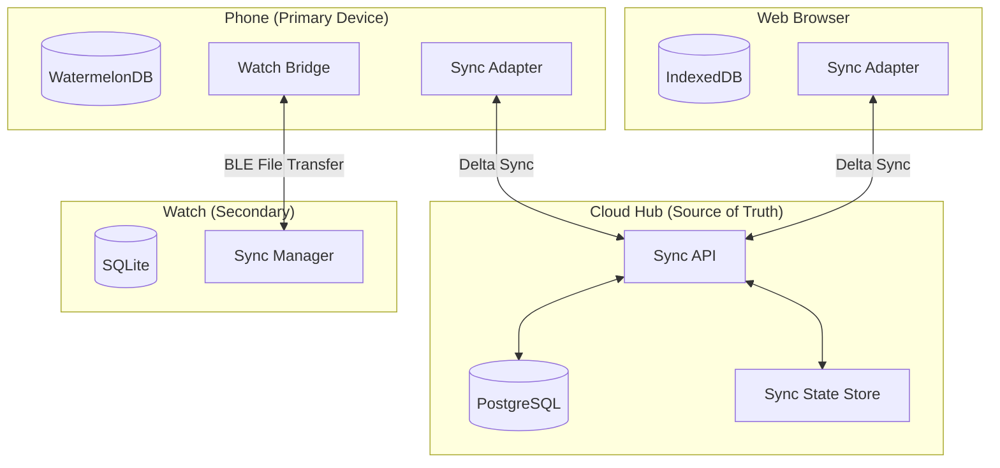

# RFC 0006: Sync Infrastructure

| Status        | Draft |
| :---          | :--- |
| **RFC #**     | 0006 |
| **Author(s)** | Infrastructure Engineer |
| **Created**   | 2025-11-26 |
| **Updated**   | 2025-11-27 |

## 1. Introduction

### 1.1. Context
Following the **hybrid thick-client architecture** defined in [RFC 0001: System Architecture](./0001-system-architecture.md), the Sync Infrastructure enables seamless data synchronization across all devices (Phone, Watch, Web, Cloud) while maintaining offline-first functionality.

Athletes train in environments without reliable connectivity (trails, mountains, rural areas). The system must function fully offline and sync transparently when connectivity is restored.

### 1.2. Problem Statement
Multi-device, offline-first applications face complex synchronization challenges:
*   **Conflict Resolution:** Same data modified on multiple offline devices
*   **Data Ordering:** Ensuring events are processed in correct order
*   **Partial Connectivity:** Phone online, watch offline, or vice versa
*   **Large Data Sets:** GPS tracks, heart rate streams can be megabytes
*   **Battery Constraints:** Watch apps cannot do frequent network calls
*   **Eventual Consistency:** All devices must converge to same state

### 1.3. Goals & Non-Goals
**Goals:**
*   **Offline-First:** Full app functionality without internet
*   **Multi-Device Sync:** Phone ↔ Cloud ↔ Watch ↔ Web all synchronized
*   **Conflict Resolution:** Deterministic, predictable conflict handling
*   **Efficient Transfer:** Delta sync, compression, prioritization
*   **Low Battery Impact:** Minimal power consumption on watches
*   **Real-Time Updates:** Sub-second sync when online

**Non-Goals:**
*   Real-time collaboration (multiple users editing same data)
*   Peer-to-peer sync between users
*   Video/media streaming
*   Full-text search indexing across devices

### 1.4. Dependencies
**Related PRDs:**
*   [05_SYNC_INFRASTRUCTURE.md](../prd/05_SYNC_INFRASTRUCTURE.md) - Sync requirements
*   [01_MOBILE_CLIENT.md](../prd/01_MOBILE_CLIENT.md) - Mobile offline requirements

**Related RFCs:**
*   [RFC 0001: System Architecture](./0001-system-architecture.md) - Distribution architecture
*   [RFC 0002: Mobile App Architecture](./0002-mobile-app-architecture.md) - WatermelonDB setup
*   [RFC 0003: Backend API Design](./0003-backend-api-design.md) - API endpoints

**External Dependencies:**
*   **WatermelonDB** - React Native local database with sync
*   **Watch Connectivity Framework** (iOS) - Apple Watch BLE sync
*   **Garmin Mobile SDK** - Garmin watch BLE sync
*   **Redis** - Sync state caching
*   **PostgreSQL** - Server-side data store

### 1.5. Success Metrics
*   **Sync Latency (Phone ↔ Cloud):** < 2 seconds for typical payload
*   **Sync Latency (Phone ↔ Watch):** < 10 seconds for context pack
*   **Data Consistency:** Zero data loss during sync conflicts
*   **Offline Availability:** 100% of core features work offline
*   **Conflict Rate:** < 1% of sync operations have conflicts
*   **Battery Impact:** < 2% additional drain per sync operation

---

## 2. Proposed Solution

### 2.1. High-Level Design

The sync infrastructure implements a **Hub-and-Spoke** topology with the Cloud as the authoritative hub. Each device maintains a local database and syncs with the hub independently.



**Sync Topology:**
1. **Phone ↔ Cloud:** Delta sync over HTTPS (primary channel)
2. **Web ↔ Cloud:** Delta sync over HTTPS (same protocol as phone)
3. **Watch ↔ Phone:** BLE file transfer (Context Pack / Activity Pack)
4. **Watch ↔ Cloud (Optional):** WiFi/LTE direct sync when phone unavailable

### 2.2. Detailed Design

#### 2.2.1. Delta Sync Protocol

The sync protocol is based on **WatermelonDB's sync protocol** with custom extensions.

```typescript
// Sync Protocol Types

interface SyncPullRequest {
  lastPulledAt: number; // Timestamp (ms) of last successful pull
  schemaVersion: string; // Client schema version
  deviceId: string; // Unique device identifier
  tables?: string[]; // Optional: specific tables to sync
}

interface SyncPullResponse {
  changes: DatabaseChanges;
  timestamp: number; // Server timestamp for next pull
}

interface DatabaseChanges {
  [tableName: string]: TableChanges;
}

interface TableChanges {
  created: Record<string, any>[];
  updated: Record<string, any>[];
  deleted: string[]; // IDs of deleted records
}

interface SyncPushRequest {
  changes: DatabaseChanges;
  lastPulledAt: number; // Must match last successful pull
  deviceId: string;
}

interface SyncPushResponse {
  success: boolean;
  conflictedRecords?: ConflictRecord[];
  timestamp: number;
}

interface ConflictRecord {
  tableName: string;
  id: string;
  clientRecord: Record<string, any>;
  serverRecord: Record<string, any>;
  resolution: 'server_wins' | 'client_wins' | 'merged';
  resolvedRecord: Record<string, any>;
}
```

#### 2.2.2. Sync Flow Implementation

```typescript
// Mobile App Sync Manager
// apps/mobile/src/sync/SyncManager.ts

import { synchronize } from '@nozbe/watermelondb/sync';
import { database } from '../database';

interface SyncOptions {
  forceFullSync?: boolean;
  tables?: string[];
  onProgress?: (progress: SyncProgress) => void;
}

interface SyncProgress {
  phase: 'pulling' | 'pushing' | 'resolving';
  current: number;
  total: number;
}

export class SyncManager {
  private isSyncing = false;
  private lastSyncAt: number = 0;
  private syncQueue: SyncQueueItem[] = [];

  async sync(options: SyncOptions = {}): Promise<SyncResult> {
    if (this.isSyncing) {
      return { success: false, reason: 'sync_in_progress' };
    }

    this.isSyncing = true;

    try {
      const result = await synchronize({
        database,
        pullChanges: async ({ lastPulledAt, schemaVersion }) => {
          const response = await api.sync.pull.query({
            lastPulledAt: lastPulledAt ?? 0,
            schemaVersion,
            deviceId: await getDeviceId(),
            tables: options.tables,
          });

          options.onProgress?.({ phase: 'pulling', current: 100, total: 100 });

          return {
            changes: response.changes,
            timestamp: response.timestamp,
          };
        },
        pushChanges: async ({ changes, lastPulledAt }) => {
          options.onProgress?.({ phase: 'pushing', current: 0, total: 100 });

          await api.sync.push.mutate({
            changes,
            lastPulledAt,
            deviceId: await getDeviceId(),
          });

          options.onProgress?.({ phase: 'pushing', current: 100, total: 100 });
        },
        migrationsEnabledAtVersion: 1,
        sendCreatedAsUpdated: true,
        conflictResolver: this.resolveConflict,
      });

      this.lastSyncAt = Date.now();
      return { success: true, timestamp: this.lastSyncAt };
    } catch (error) {
      return { success: false, reason: 'sync_failed', error };
    } finally {
      this.isSyncing = false;
    }
  }

  private resolveConflict(
    tableName: string,
    local: Record<string, any>,
    remote: Record<string, any>,
    resolved: Record<string, any>
  ): Record<string, any> {
    // Resolution strategies by table/field type
    const strategy = CONFLICT_STRATEGIES[tableName];

    switch (strategy) {
      case 'server_wins':
        return remote;

      case 'client_wins':
        return local;

      case 'last_write_wins':
        return local.updated_at > remote.updated_at ? local : remote;

      case 'merge':
        return this.mergeRecords(tableName, local, remote);

      default:
        return remote; // Safe default
    }
  }

  private mergeRecords(
    tableName: string,
    local: Record<string, any>,
    remote: Record<string, any>
  ): Record<string, any> {
    // Field-level merge for specific tables
    if (tableName === 'activities') {
      // Prefer remote for objective data, local for subjective
      return {
        ...remote, // Base from server
        rpe: local.rpe ?? remote.rpe, // User-entered data
        notes: local.notes ?? remote.notes,
        feeling: local.feeling ?? remote.feeling,
      };
    }

    if (tableName === 'daily_metrics') {
      // Merge all fields, prefer non-null values
      return {
        ...remote,
        ...Object.fromEntries(
          Object.entries(local).filter(([_, v]) => v != null)
        ),
      };
    }

    return remote;
  }
}

// Conflict resolution strategies
const CONFLICT_STRATEGIES: Record<string, string> = {
  // User profile: client wins (user's latest changes)
  users: 'client_wins',

  // Activities: merge (objective from server, subjective from client)
  activities: 'merge',

  // Training plan: server wins (Brain-generated)
  training_plans: 'server_wins',
  scheduled_workouts: 'server_wins',

  // Daily metrics: merge (combine all sources)
  daily_metrics: 'merge',

  // Goals: last write wins
  goals: 'last_write_wins',
};
```

#### 2.2.3. Server-Side Sync Implementation

```typescript
// Backend Sync Router
// apps/backend/src/sync/sync.router.ts

import { router, protectedProcedure } from '../trpc';
import { z } from 'zod';

const syncPullInputSchema = z.object({
  lastPulledAt: z.number(),
  schemaVersion: z.string(),
  deviceId: z.string(),
  tables: z.array(z.string()).optional(),
});

const syncPushInputSchema = z.object({
  changes: z.record(z.object({
    created: z.array(z.record(z.any())),
    updated: z.array(z.record(z.any())),
    deleted: z.array(z.string()),
  })),
  lastPulledAt: z.number(),
  deviceId: z.string(),
});

export const syncRouter = router({
  pull: protectedProcedure
    .input(syncPullInputSchema)
    .query(async ({ ctx, input }) => {
      const { lastPulledAt, schemaVersion, deviceId, tables } = input;
      const userId = ctx.user.id;

      // Validate schema version compatibility
      if (!isSchemaCompatible(schemaVersion)) {
        throw new TRPCError({
          code: 'PRECONDITION_FAILED',
          message: 'Client schema version incompatible. Please update the app.',
        });
      }

      // Get changes since last pull
      const changes = await getChangesSince(userId, lastPulledAt, tables);

      // Record this pull for sync state tracking
      await recordSyncEvent(userId, deviceId, 'pull', Date.now());

      return {
        changes,
        timestamp: Date.now(),
      };
    }),

  push: protectedProcedure
    .input(syncPushInputSchema)
    .mutation(async ({ ctx, input }) => {
      const { changes, lastPulledAt, deviceId } = input;
      const userId = ctx.user.id;

      // Validate lastPulledAt matches server state
      const serverLastPulledAt = await getLastPulledAt(userId, deviceId);
      if (lastPulledAt !== serverLastPulledAt) {
        // Client is out of date, must pull first
        throw new TRPCError({
          code: 'CONFLICT',
          message: 'Sync state mismatch. Pull changes first.',
        });
      }

      const conflicts: ConflictRecord[] = [];

      // Process each table's changes
      for (const [tableName, tableChanges] of Object.entries(changes)) {
        // Process created records
        for (const record of tableChanges.created) {
          await processCreate(userId, tableName, record);
        }

        // Process updated records (may conflict)
        for (const record of tableChanges.updated) {
          const conflict = await processUpdate(userId, tableName, record);
          if (conflict) {
            conflicts.push(conflict);
          }
        }

        // Process deleted records
        for (const id of tableChanges.deleted) {
          await processDelete(userId, tableName, id);
        }
      }

      // Record this push
      await recordSyncEvent(userId, deviceId, 'push', Date.now());

      return {
        success: true,
        conflictedRecords: conflicts,
        timestamp: Date.now(),
      };
    }),
});

// Helper: Get changes since timestamp
async function getChangesSince(
  userId: string,
  since: number,
  tables?: string[]
): Promise<DatabaseChanges> {
  const changes: DatabaseChanges = {};
  const tablesToSync = tables ?? ALL_SYNC_TABLES;

  for (const tableName of tablesToSync) {
    const tableChanges = await db[tableName].findMany({
      where: {
        userId,
        OR: [
          { createdAt: { gt: new Date(since) } },
          { updatedAt: { gt: new Date(since) } },
          { deletedAt: { gt: new Date(since) } },
        ],
      },
    });

    changes[tableName] = {
      created: tableChanges.filter(r => r.createdAt > new Date(since) && !r.deletedAt),
      updated: tableChanges.filter(r => r.updatedAt > r.createdAt && !r.deletedAt),
      deleted: tableChanges.filter(r => r.deletedAt).map(r => r.id),
    };
  }

  return changes;
}
```

#### 2.2.4. Watch Sync Protocol (BLE)

```typescript
// Watch Bridge - Phone Side
// apps/mobile/src/sync/WatchBridge.ts

import WatchConnectivity from 'react-native-watch-connectivity';

export interface ContextPack {
  version: number;
  timestamp: number;
  user: {
    zones: HeartRateZones;
    paceZones: PaceZones;
    maxHr: number;
  };
  upcomingWorkouts: ScheduledWorkout[]; // Next 3 days
  engineVersion: string;
  engineBundle?: string; // Only if updated
}

export interface ActivityPack {
  activityId: string;
  fitFile?: string; // Base64 encoded
  summary: ActivitySummary;
  rpe?: number;
  notes?: string;
}

export class WatchBridge {
  private isReachable = false;

  async initialize(): Promise<void> {
    WatchConnectivity.subscribeToMessages(this.handleMessage);
    WatchConnectivity.subscribeToReachability(reachable => {
      this.isReachable = reachable;
    });
  }

  // Send context pack before workout
  async sendContextPack(pack: ContextPack): Promise<boolean> {
    if (!this.isReachable) {
      // Queue for later
      await this.queueFile('context', pack);
      return false;
    }

    const compressed = await compress(JSON.stringify(pack));

    try {
      await WatchConnectivity.transferFile(compressed, {
        metadata: { type: 'context_pack', version: pack.version },
      });
      return true;
    } catch (error) {
      console.error('Context pack transfer failed:', error);
      return false;
    }
  }

  // Receive activity pack after workout
  private handleMessage = async (message: any) => {
    if (message.type === 'activity_pack') {
      const pack: ActivityPack = message.data;
      await this.processActivityPack(pack);
    }

    if (message.type === 'request_context') {
      const pack = await this.buildContextPack();
      await this.sendContextPack(pack);
    }
  };

  private async processActivityPack(pack: ActivityPack): Promise<void> {
    // Decode FIT file if present
    if (pack.fitFile) {
      const fitData = await decodeFitFile(pack.fitFile);
      await this.storeActivity(pack.activityId, fitData);
    }

    // Store activity in local DB
    await database.write(async () => {
      await database.get('activities').create(activity => {
        activity.id = pack.activityId;
        activity.rpe = pack.rpe;
        activity.notes = pack.notes;
        // ... other fields from summary
      });
    });

    // Trigger cloud sync
    await SyncManager.sync();
  }

  private async buildContextPack(): Promise<ContextPack> {
    const user = await getCurrentUser();
    const workouts = await getUpcomingWorkouts(3);
    const engineVersion = await getEngineVersion();

    return {
      version: Date.now(),
      timestamp: Date.now(),
      user: {
        zones: user.heartRateZones,
        paceZones: user.paceZones,
        maxHr: user.maxHr,
      },
      upcomingWorkouts: workouts,
      engineVersion,
    };
  }
}
```

#### 2.2.5. Background Sync Strategy

```typescript
// Background Sync Configuration
// apps/mobile/src/sync/BackgroundSync.ts

import BackgroundFetch from 'react-native-background-fetch';
import NetInfo from '@react-native-community/netinfo';

export class BackgroundSyncService {
  async configure(): Promise<void> {
    // Configure background fetch (iOS 15min minimum, Android flexible)
    await BackgroundFetch.configure(
      {
        minimumFetchInterval: 15, // minutes
        stopOnTerminate: false,
        startOnBoot: true,
        enableHeadless: true,
        requiredNetworkType: BackgroundFetch.NETWORK_TYPE_ANY,
      },
      this.onBackgroundFetch,
      this.onTimeout
    );

    // Register for connectivity changes
    NetInfo.addEventListener(this.onConnectivityChange);
  }

  private onBackgroundFetch = async (taskId: string): Promise<void> => {
    console.log('[BackgroundFetch] Task started:', taskId);

    try {
      // Only sync if online
      const netInfo = await NetInfo.fetch();
      if (!netInfo.isConnected) {
        BackgroundFetch.finish(taskId);
        return;
      }

      // Perform sync
      const result = await SyncManager.sync({
        tables: ['activities', 'daily_metrics', 'scheduled_workouts'],
      });

      console.log('[BackgroundFetch] Sync result:', result);

      // Also sync with watch if paired
      await WatchBridge.sendContextPack(await buildContextPack());

    } catch (error) {
      console.error('[BackgroundFetch] Sync failed:', error);
    }

    BackgroundFetch.finish(taskId);
  };

  private onConnectivityChange = async (state: NetInfoState): Promise<void> => {
    if (state.isConnected && state.isInternetReachable) {
      // Connection restored, sync immediately
      const hasPendingChanges = await SyncManager.hasPendingChanges();
      if (hasPendingChanges) {
        console.log('[Connectivity] Connection restored, syncing...');
        await SyncManager.sync();
      }
    }
  };

  private onTimeout = (taskId: string): void => {
    console.warn('[BackgroundFetch] Task timed out:', taskId);
    BackgroundFetch.finish(taskId);
  };
}
```

#### 2.2.6. Large File Handling

```typescript
// Large File Upload Manager
// apps/mobile/src/sync/FileUploadManager.ts

export class FileUploadManager {
  private uploadQueue: FileUploadItem[] = [];
  private isProcessing = false;

  async queueUpload(file: FileUploadItem): Promise<void> {
    this.uploadQueue.push(file);
    await this.persistQueue();
    this.processQueue();
  }

  private async processQueue(): Promise<void> {
    if (this.isProcessing || this.uploadQueue.length === 0) return;
    this.isProcessing = true;

    while (this.uploadQueue.length > 0) {
      const item = this.uploadQueue[0];

      try {
        // Get presigned URL from backend
        const { uploadUrl, fileKey } = await api.files.getUploadUrl.mutate({
          fileName: item.fileName,
          contentType: item.contentType,
        });

        // Upload file directly to S3
        await fetch(uploadUrl, {
          method: 'PUT',
          body: item.data,
          headers: {
            'Content-Type': item.contentType,
          },
        });

        // Update local record with file URL
        await this.updateRecordWithFileUrl(item.recordId, item.tableName, fileKey);

        // Remove from queue
        this.uploadQueue.shift();
        await this.persistQueue();

      } catch (error) {
        console.error('File upload failed:', error);
        item.retryCount = (item.retryCount ?? 0) + 1;

        if (item.retryCount >= 3) {
          // Move to failed queue
          await this.moveToFailed(item);
          this.uploadQueue.shift();
        } else {
          // Exponential backoff
          await sleep(Math.pow(2, item.retryCount) * 1000);
        }
      }
    }

    this.isProcessing = false;
  }
}
```

### 2.3. Data Model Changes

```prisma
// Sync-related schema additions

model SyncState {
  id        String   @id @default(cuid())
  userId    String
  user      User     @relation(fields: [userId], references: [id], onDelete: Cascade)
  deviceId  String
  lastPulledAt DateTime
  lastPushedAt DateTime?
  schemaVersion String
  appVersion String?
  platform   SyncPlatform
  createdAt  DateTime @default(now())
  updatedAt  DateTime @updatedAt

  @@unique([userId, deviceId])
  @@index([userId])
}

enum SyncPlatform {
  IOS
  ANDROID
  WEB
  WATCH_APPLE
  WATCH_GARMIN
}

model SyncLog {
  id          String   @id @default(cuid())
  userId      String
  deviceId    String
  operation   SyncOperation
  tableName   String?
  recordCount Int?
  durationMs  Int?
  success     Boolean
  error       String?
  timestamp   DateTime @default(now())

  @@index([userId, timestamp])
}

enum SyncOperation {
  PULL
  PUSH
  CONFLICT_RESOLVED
  FULL_SYNC
}
```

### 2.4. API Changes

See Section 2.2.3 for tRPC router implementation.

### 2.5. Offline-First Considerations

*   **Local-First Operations:** All writes go to local DB first
*   **Queued Sync:** Changes queued until connectivity restored
*   **Conflict Detection:** Server-side timestamp comparison
*   **Idempotent Operations:** Duplicate pushes handled gracefully
*   **Graceful Degradation:** App functions fully without sync

### 2.6. Synchronization Strategy

**Sync Triggers:**
| Trigger | Priority | Tables | Notes |
|---------|----------|--------|-------|
| App Launch | High | All | Full sync on cold start |
| Workout Complete | Critical | Activities | Immediate sync |
| Check-in Submit | Critical | Daily Metrics | Immediate sync |
| Pull-to-Refresh | High | All | User-initiated |
| Background Fetch | Normal | Core tables | Every 15 min |
| Watch Connect | High | Context Pack | Pre-workout |

**Conflict Resolution:**
| Table | Strategy | Rationale |
|-------|----------|-----------|
| users | Client Wins | User's profile is authoritative |
| activities | Merge | Objective + subjective data |
| training_plans | Server Wins | Brain-generated |
| scheduled_workouts | Server Wins | Plan-derived |
| daily_metrics | Merge | Multiple sources |
| goals | Last Write Wins | User preference |

---

## 3. Implementation Plan

### 3.1. Phasing

**Phase 1: Core Sync Protocol (Week 1-2)**
*   **Deliverables:**
    *   WatermelonDB sync adapter
    *   Server-side sync endpoints
    *   Basic pull/push flow
    *   Sync state tracking
*   **Success Criteria:**
    *   Phone can sync with cloud
    *   Changes persist across sessions

**Phase 2: Conflict Resolution (Week 3)**
*   **Deliverables:**
    *   Conflict detection logic
    *   Resolution strategies per table
    *   Conflict logging
    *   Client notification
*   **Success Criteria:**
    *   Conflicts resolved deterministically
    *   No data loss

**Phase 3: Background Sync (Week 4)**
*   **Deliverables:**
    *   Background fetch configuration
    *   Connectivity monitoring
    *   Sync queue management
    *   Battery optimization
*   **Success Criteria:**
    *   App syncs in background
    *   Battery impact < 2%

**Phase 4: Watch Sync (Week 5-6)**
*   **Deliverables:**
    *   Context pack protocol
    *   Activity pack protocol
    *   BLE file transfer
    *   Offline queuing
*   **Success Criteria:**
    *   Watch receives context before workout
    *   Activity syncs post-workout

**Phase 5: Large File Handling (Week 7)**
*   **Deliverables:**
    *   S3 presigned URL generation
    *   File upload queue
    *   Retry logic
    *   Progress tracking
*   **Success Criteria:**
    *   FIT files upload reliably
    *   Failed uploads retry automatically

**Phase 6: Web Sync (Week 8)**
*   **Deliverables:**
    *   IndexedDB adapter (Dexie.js)
    *   Service worker sync
    *   Cross-tab coordination
*   **Success Criteria:**
    *   Web app syncs offline
    *   Multiple tabs don't conflict

### 3.2. Testing Strategy

**Unit Tests:**
*   Conflict resolution logic
*   Delta calculation
*   Compression/decompression
*   Sync state management

**Integration Tests:**
*   Full sync flow (pull → push)
*   Conflict scenarios
*   Multi-device sync
*   Schema migration

**End-to-End Tests:**
*   Phone → Cloud → Phone
*   Phone → Watch → Phone
*   Offline → Online transition
*   Multi-device conflict

**Offline/Online Transition Tests:**
*   Go offline mid-sync
*   Queue operations while offline
*   Sync on reconnection
*   Handle partial sync failure

**Performance Tests:**
*   Sync latency under load
*   Large dataset sync (1000+ activities)
*   Battery consumption measurement
*   BLE transfer speed

### 3.3. Migration Strategy

*   **Initial Sync:** First sync pulls all user data
*   **Schema Versioning:** Version in sync request header
*   **Backward Compatibility:** Support N-1 schema version for 30 days
*   **Breaking Changes:** Force app update for incompatible schema changes

### 3.4. Rollback Strategy

**Rollback Triggers:**
*   Data loss detected
*   Sync loop (continuous retry)
*   Performance degradation > 50%
*   Conflict resolution errors

**Rollback Procedure:**
1. Disable sync endpoints (return maintenance mode)
2. Clear sync state on server for affected users
3. Deploy fixed sync logic
4. Force full re-sync on client reconnect
5. Restore from backup if data lost

**Data Integrity:**
*   Sync operations logged for audit
*   Point-in-time recovery for 7 days
*   Client-side data export for manual recovery

---

## 4. Alternatives Considered

| Alternative | Pros | Cons | Reason for Rejection |
|------------|------|------|---------------------|
| **CRDTs** | Automatic conflict resolution | Complex, larger payloads | Overkill for our conflict patterns |
| **Firebase Realtime DB** | Built-in sync | Vendor lock-in, limited query | Need custom conflict resolution |
| **GraphQL Subscriptions** | Real-time updates | Complex offline support | WatermelonDB handles better |
| **Realm Sync** | Automatic sync | Proprietary, MongoDB required | Need PostgreSQL |
| **Custom WebSocket Sync** | Full control | Complex implementation | WatermelonDB protocol proven |

---

## 5. Cross-Cutting Concerns

### 5.1. Security

**Authentication:**
*   JWT validation on every sync request
*   Device ID binding to user
*   Token refresh during long syncs

**Authorization:**
*   Users can only sync their own data (RLS)
*   No cross-user data exposure

**Data Protection:**
*   TLS 1.3 for all sync traffic
*   Data encrypted at rest (database)
*   Sensitive fields encrypted in transit

**Privacy:**
*   Audit logging for sync operations
*   GDPR data export includes sync history

### 5.2. Performance

**Latency:**
*   Phone ↔ Cloud: < 2s (typical payload < 100KB)
*   Watch ↔ Phone: < 10s (context pack ~50KB)
*   Background sync: No user-perceived latency

**Throughput:**
*   1000 concurrent sync operations
*   10MB max single payload
*   Compression for payloads > 10KB (gzip)

**Resource Usage:**
*   Background sync: < 2% battery per operation
*   Memory: < 50MB during sync
*   Storage: Sync metadata < 1MB

### 5.3. Observability

**Logging:**
*   Sync start/complete events
*   Conflict occurrences with resolution
*   Retry attempts and failures
*   Performance metrics

**Metrics:**
*   Sync success rate (target: > 99%)
*   Average sync duration (p50, p95, p99)
*   Conflict rate by table
*   Data transfer volume

**Tracing:**
*   Distributed trace across sync operations
*   Trace ID in all log entries

**Alerting:**
*   Sync failure rate > 5% → PagerDuty
*   Conflict rate > 10% → Slack
*   Sync latency > 10s → Dashboard warning

### 5.4. Reliability

**Error Handling:**
*   Retry with exponential backoff (1s, 2s, 4s, 8s, max 30s)
*   Partial sync recovery (resume from last successful table)
*   Corrupt data detection via checksums

**Data Integrity:**
*   Transaction boundaries per table
*   Checksum validation for large payloads
*   Idempotent operations (safe to retry)

**Disaster Recovery:**
*   Server-side backups (daily, retained 30 days)
*   Point-in-time recovery (7 days)
*   Client-side data export for manual recovery
*   Sync state reset procedure documented

---

## 6. Stakeholder Review

| Stakeholder | Role | Review Status | Sign-off Date |
|------------|------|---------------|---------------|
| Infrastructure Engineer | Author | Approved | 2025-11-27 |
| Backend Lead | Technical Review | Pending | - |
| Mobile Lead | Integration Review | Pending | - |
| Security Engineer | Security Review | Pending | - |

---

## 7. Open Questions

*   **Full Sync Trigger:** When should we force a full re-sync? (Schema change? Data corruption detected?)
*   **Sync Frequency:** Is 15-minute background sync sufficient? User preference option?
*   **Watch Direct Sync:** Should Apple Watch LTE / Garmin WiFi sync directly to cloud?
*   **Large Files:** How to handle multi-MB FIT files on slow/metered connections? User setting?
*   **Sync History Retention:** How long to keep sync logs? (Current: 90 days)

---

## 8. References

*   [PRD: Sync Infrastructure](../prd/05_SYNC_INFRASTRUCTURE.md)
*   [WatermelonDB Sync Documentation](https://watermelondb.dev/docs/Sync/Intro)
*   [Apple Watch Connectivity](https://developer.apple.com/documentation/watchconnectivity)
*   [Garmin Mobile SDK](https://developer.garmin.com/connect-iq/core-topics/mobile-sdk-for-ios/)
*   [RFC 0001: System Architecture](./0001-system-architecture.md)
*   [RFC 0002: Mobile App Architecture](./0002-mobile-app-architecture.md)
