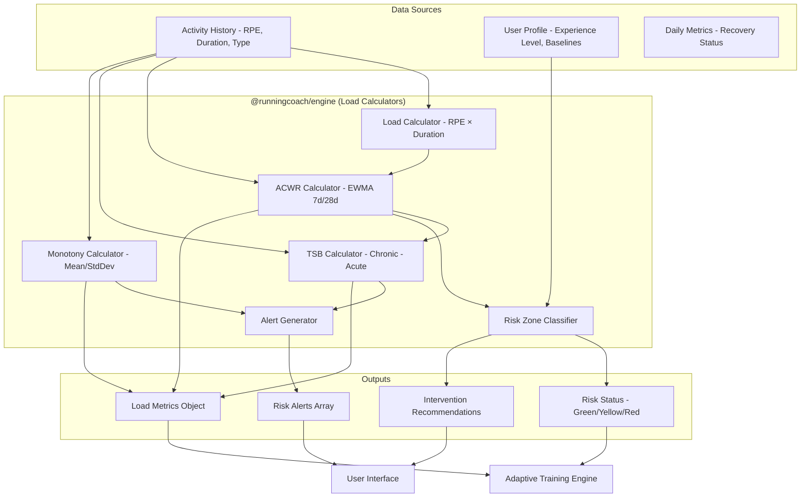

# RFC 0007: Load Management Service

| Status        | Draft |
| :---          | :--- |
| **RFC #**     | 0007 |
| **Author(s)** | Sports Science Lead |
| **Created**   | 2025-11-26 |
| **Updated**   | 2025-11-27 |

## 1. Introduction

### 1.1. Context

Load management is the cornerstone of RunningCoach's injury prevention philosophy. Research demonstrates that an Acute-to-Chronic Workload Ratio (ACWR) above 1.5 produces a **4-fold increase in injury risk**, making this system critical for athlete safety and training success.

Following the **hybrid thick-client architecture** defined in [RFC 0001: System Architecture](./0001-system-architecture.md), load calculation logic runs locally on devices via the `@runningcoach/engine` package. This ensures zero-latency monitoring, offline functionality, and consistent calculations across all platforms (mobile, web, watch).

The Load Management Service is tightly integrated with the Adaptive Training Engine ([RFC 0005](./0005-adaptive-training-engine.md)), providing the **Skeletal System** status within the 4-System Analysis Model and triggering immediate interventions when dangerous patterns emerge.

### 1.2. Problem Statement

Athletes and coaches need a system that:

*   **Prevents injury through load monitoring:** Detect dangerous load spikes before injury occurs
*   **Quantifies training stress:** Convert subjective effort into objective, actionable metrics
*   **Balances stimulus vs. recovery:** Maintain the "sweet spot" (ACWR 0.8-1.3) for optimal adaptation
*   **Provides early warning signals:** Alert to overtraining patterns (high monotony, excessive TSB)
*   **Works offline:** Calculate metrics locally without network dependency
*   **Remains consistent:** Identical calculations across mobile, web, and watch platforms

Current challenges include:
*   Athletes lack real-time visibility into cumulative load and injury risk
*   Manual RPE collection post-workout is critical but often forgotten
*   Cross-training activities must be properly weighted against running load
*   Historical "10% rule" has been debunked - ACWR provides superior injury prediction
*   Recovery weeks must be strategically inserted based on load data, not arbitrary schedules

### 1.3. Goals & Non-Goals

**Goals:**
*   **Accuracy:** Calculate internal load using Session RPE × Duration (validated metric)
*   **Real-Time Risk Assessment:** Update ACWR immediately after workout completion
*   **Traffic Light System:** Visual risk zones (Green/Yellow/Red) for athlete decision-making
*   **Actionable Alerts:** Trigger interventions when ACWR >1.5 for two consecutive weeks
*   **Cross-Training Integration:** Unified load metric for running, cycling, swimming, strength
*   **Offline Capability:** All calculations run locally without network access
*   **Explainability:** Users understand load metrics and why interventions are recommended

**Non-Goals:**
*   External load metrics (pace, distance) as primary injury predictors (used as secondary)
*   Real-time heart rate monitoring during workouts (handled by wearable integration)
*   Predictive ML models for injury risk (future phase)
*   Social comparisons or leaderboards (separate feature)
*   Coach-specific load customization (future consideration)

### 1.4. Dependencies

**Related PRDs:**
*   [07_LOAD_MANAGEMENT.md](../prd/07_LOAD_MANAGEMENT.md) - Load management requirements
*   [06_ADAPTIVE_TRAINING_ENGINE.md](../prd/06_ADAPTIVE_TRAINING_ENGINE.md) - Integration with training adaptation
*   [00_OVERARCHING_VISION.md](../prd/00_OVERARCHING_VISION.md) - Injury prevention philosophy

**Related RFCs:**
*   [RFC 0001: System Architecture](./0001-system-architecture.md) - Hybrid thick-client architecture
*   [RFC 0005: Adaptive Training Engine](./0005-adaptive-training-engine.md) - 4-System Analysis integration
*   [RFC 0004: Wearable Integration](./0004-wearable-integration-service.md) - Activity data sources

**External Dependencies:**
*   **@runningcoach/engine** - TypeScript calculation engine (portable package)
*   **WatermelonDB** - Local activity and metrics storage on mobile
*   **PostgreSQL** - Backend historical data storage
*   **Redis** - Cache for frequently accessed load calculations

### 1.5. Success Metrics

*   **ACWR Compliance:** ≥90% of training weeks within 0.8-1.3 safe zone
*   **Intervention Effectiveness:** When ACWR >1.5 flagged, injury occurrence within next 2 weeks <5%
*   **Overall Injury Rate:** Training interruptions due to injury <10% of athletes per training cycle
*   **RPE Collection Rate:** Session RPE captured within 30 minutes of workout ≥80% of activities
*   **Calculation Performance:** Load metrics calculated in <10ms on mobile devices
*   **Risk Alert Response:** Users acknowledge and adapt to red alerts ≥85% of time

---

## 2. Proposed Solution

### 2.1. High-Level Design

The Load Management Service is implemented as a **portable calculation module** within `@runningcoach/engine`, running identically on mobile, web, and backend. It receives activity data and produces load metrics, risk zones, and alerts.



**Key Architectural Decisions:**

1. **Local-First Calculation:** All load metrics calculated on-device for offline capability
2. **Deterministic Functions:** Pure functions with no side effects or I/O
3. **EWMA for ACWR:** Exponentially Weighted Moving Average (not simple rolling average) for better spike detection
4. **Multi-Tier Alerts:** Info, Warning, Critical severities with graduated interventions
5. **Session RPE as Primary Metric:** Internal load (RPE × Duration) prioritized over external load (distance/pace)

### 2.2. Detailed Design

#### 2.2.1. Core Metrics Definitions

**Training Load (Internal Load)**
*   **Formula:** `RPE (0-10) × Duration (minutes)`
*   **Unit:** Arbitrary load units (AU)
*   **Example:** 60-minute run at RPE 6 = 360 AU
*   **Cross-Training:** Same formula applies (60-minute hard swim at RPE 8 = 480 AU)
*   **Rationale:** Captures internal physiological stress, validated across populations

**Acute Load (7-Day EWMA)**
*   **Definition:** Short-term training stress (fatigue indicator)
*   **Window:** 7 days
*   **Method:** Exponentially Weighted Moving Average
*   **Decay Constant:** `α = 2 / (7 + 1) = 0.25`
*   **Formula:** `Acute_t = Load_t × α + Acute_{t-1} × (1 - α)`

**Chronic Load (28-Day EWMA)**
*   **Definition:** Long-term training adaptation (fitness indicator)
*   **Window:** 28 days
*   **Method:** Exponentially Weighted Moving Average
*   **Decay Constant:** `α = 2 / (28 + 1) = 0.069`
*   **Formula:** `Chronic_t = Load_t × α + Chronic_{t-1} × (1 - α)`

**ACWR (Acute-to-Chronic Workload Ratio)**
*   **Formula:** `ACWR = Acute Load / Chronic Load`
*   **Sweet Spot:** 0.8 - 1.3 (optimal adaptation, lowest injury risk)
*   **Caution Zone:** 1.3 - 1.5 (moderate risk)
*   **Danger Zone:** >1.5 (4× injury risk)
*   **Detraining Zone:** <0.8 (insufficient stimulus)

**TSB (Training Stress Balance)**
*   **Formula:** `TSB = Chronic Load - Acute Load`
*   **Interpretation:**
    *   Positive TSB → Freshness (good for racing)
    *   Negative TSB → Fatigue (normal during training)
    *   TSB < -30 → Excessive fatigue (intervention required)
*   **Target Ranges:**
    *   Base/Build: -5 to -15
    *   Peak weeks: -15 to -25
    *   Taper: Moving toward 0 to +10
    *   Race day: +10 to +25

**Training Monotony**
*   **Formula:** `Monotony = Weekly Mean Load / Weekly StdDev`
*   **Danger Threshold:** >2.0 signals dangerous lack of variation
*   **Rationale:** High monotony + high load = dramatically increased overtraining risk

**Training Strain**
*   **Formula:** `Strain = Weekly Total Load × Monotony`
*   **Risk Threshold:** >3000 AU requires close monitoring

#### 2.2.2. TypeScript Implementation

```typescript
// packages/engine/src/calculators/load.ts

export interface Activity {
  id: string;
  date: string; // YYYY-MM-DD
  type: 'running' | 'cycling' | 'swimming' | 'strength' | 'cross_train';
  durationSeconds: number;
  rpe?: number; // 0-10 scale
  avgHeartRate?: number;
  distanceMeters?: number;
  completed: boolean;
}

export interface LoadMetrics {
  todaysLoad: number;
  acuteLoad: number;
  chronicLoad: number;
  acwr: number;
  tsb: number;
  monotony: number;
  strain: number;
  riskZone: 'green' | 'yellow_low' | 'yellow_high' | 'red' | 'detraining';
  weeklyLoad: number;
  lastSevenDaysLoad: number;
  last28DaysLoad: number;
}

/**
 * Calculate training load for a single activity
 * Primary metric: Session RPE × Duration (minutes)
 */
export function calculateTrainingLoad(activity: Activity): number {
  if (!activity.completed) return 0;

  const durationMinutes = activity.durationSeconds / 60;
  const rpe = activity.rpe ?? estimateRPE(activity);

  return rpe * durationMinutes;
}

/**
 * Estimate RPE when not provided by user
 * Uses heart rate or activity type as fallback
 */
function estimateRPE(activity: Activity): number {
  // Heart rate-based estimation (if available)
  if (activity.avgHeartRate && activity.maxHr) {
    const hrRatio = activity.avgHeartRate / activity.maxHr;
    if (hrRatio < 0.60) return 2; // Very easy
    if (hrRatio < 0.70) return 4; // Easy
    if (hrRatio < 0.80) return 6; // Moderate
    if (hrRatio < 0.90) return 8; // Hard
    return 9; // Very hard
  }

  // Activity type-based estimation
  const typeRPE: Record<string, number> = {
    recovery: 2,
    easy: 4,
    long: 5,
    tempo: 7,
    intervals: 8,
    race: 9,
    strength: 6,
    cycling: 5,
    swimming: 6,
    cross_train: 5,
  };

  return typeRPE[activity.type] ?? 5;
}

/**
 * Calculate daily training loads from activity history
 */
export function getDailyLoads(
  activities: Activity[],
  endDate: string,
  days: number
): number[] {
  const dailyLoadMap = new Map<string, number>();

  // Calculate load for each activity
  activities.forEach(activity => {
    if (!activity.completed) return;

    const load = calculateTrainingLoad(activity);
    const currentLoad = dailyLoadMap.get(activity.date) ?? 0;
    dailyLoadMap.set(activity.date, currentLoad + load);
  });

  // Generate array for last N days (chronological order)
  const endDateObj = new Date(endDate);
  const loads: number[] = [];

  for (let i = days - 1; i >= 0; i--) {
    const date = new Date(endDateObj);
    date.setDate(date.getDate() - i);
    const dateStr = date.toISOString().split('T')[0];
    loads.push(dailyLoadMap.get(dateStr) ?? 0);
  }

  return loads;
}
```

```typescript
// packages/engine/src/calculators/acwr.ts

/**
 * Calculate ACWR using Exponentially Weighted Moving Average (EWMA)
 *
 * EWMA gives more weight to recent data while considering historical context
 * Superior to simple rolling average for detecting acute spikes
 */
export function calculateACWR(
  activities: Activity[],
  today: string
): {
  acuteLoad: number;
  chronicLoad: number;
  acwr: number;
  dailyLoads: number[];
} {
  // EWMA decay constants
  const acuteDecay = 2 / (7 + 1);    // 0.25 for 7-day window
  const chronicDecay = 2 / (28 + 1); // 0.069 for 28-day window

  // Get daily loads for last 28 days (need full chronic window)
  const dailyLoads = getDailyLoads(activities, today, 28);

  // Initialize EWMA accumulators
  let acuteLoad = 0;
  let chronicLoad = 0;

  // Calculate EWMA for each day
  dailyLoads.forEach((load, index) => {
    // Update both accumulators
    acuteLoad = load * acuteDecay + acuteLoad * (1 - acuteDecay);
    chronicLoad = load * chronicDecay + chronicLoad * (1 - chronicDecay);
  });

  // Calculate ratio (avoid division by zero)
  const acwr = chronicLoad > 0 ? acuteLoad / chronicLoad : 1.0;

  return {
    acuteLoad: Math.round(acuteLoad),
    chronicLoad: Math.round(chronicLoad),
    acwr: Math.round(acwr * 100) / 100, // 2 decimal places
    dailyLoads,
  };
}

/**
 * Calculate ACWR risk zone based on ratio
 */
export function getACWRRiskZone(
  acwr: number
): 'green' | 'yellow_low' | 'yellow_high' | 'red' | 'detraining' {
  if (acwr > 1.5) return 'red';        // Danger: 4× injury risk
  if (acwr > 1.3) return 'yellow_high'; // Caution: moderate risk
  if (acwr >= 0.8) return 'green';      // Sweet spot: optimal
  if (acwr >= 0.5) return 'yellow_low'; // Insufficient stimulus
  return 'detraining';                  // Serious detraining risk
}
```

```typescript
// packages/engine/src/calculators/tsb.ts

/**
 * Calculate Training Stress Balance (Form)
 *
 * TSB = Chronic Load - Acute Load
 * Positive = Fresh (good for racing)
 * Negative = Fatigued (normal during training)
 */
export function calculateTSB(
  acuteLoad: number,
  chronicLoad: number
): number {
  return Math.round(chronicLoad - acuteLoad);
}

/**
 * Get TSB status and interpretation
 */
export function getTSBStatus(tsb: number): {
  status: 'race_ready' | 'optimal' | 'fatigued' | 'concerning' | 'critical';
  message: string;
  directive: 'push' | 'maintain' | 'recover' | 'urgent_rest';
} {
  if (tsb > 10) {
    return {
      status: 'race_ready',
      message: 'Good freshness for racing or hard efforts',
      directive: 'push',
    };
  }

  if (tsb >= -5) {
    return {
      status: 'optimal',
      message: 'Well-balanced training stress',
      directive: 'maintain',
    };
  }

  if (tsb >= -15) {
    return {
      status: 'optimal',
      message: 'Productive training zone (expected fatigue)',
      directive: 'maintain',
    };
  }

  if (tsb >= -25) {
    return {
      status: 'fatigued',
      message: 'Building peak fitness, monitor recovery closely',
      directive: 'maintain',
    };
  }

  if (tsb >= -30) {
    return {
      status: 'concerning',
      message: 'Accumulated fatigue - recovery week recommended',
      directive: 'recover',
    };
  }

  return {
    status: 'critical',
    message: 'Excessive fatigue - immediate recovery required',
    directive: 'urgent_rest',
  };
}
```

```typescript
// packages/engine/src/calculators/monotony.ts

/**
 * Calculate Training Monotony (lack of variation)
 *
 * Monotony = Mean Daily Load / Standard Deviation of Daily Load
 * Higher values indicate dangerous sameness in training
 */
export function calculateMonotony(dailyLoads: number[]): number {
  if (dailyLoads.length === 0) return 0;

  const mean = dailyLoads.reduce((sum, load) => sum + load, 0) / dailyLoads.length;

  if (mean === 0) return 0;

  const variance = dailyLoads.reduce(
    (sum, load) => sum + Math.pow(load - mean, 2),
    0
  ) / dailyLoads.length;

  const stdDev = Math.sqrt(variance);

  // Avoid division by zero
  if (stdDev === 0) return 0;

  return Math.round((mean / stdDev) * 100) / 100;
}

/**
 * Calculate Training Strain (total stress magnitude)
 *
 * Strain = Total Weekly Load × Monotony
 * Captures both volume and lack of variation
 */
export function calculateStrain(
  weeklyLoad: number,
  monotony: number
): number {
  return Math.round(weeklyLoad * monotony);
}

/**
 * Get monotony risk assessment
 */
export function getMonotonyRisk(monotony: number): {
  risk: 'low' | 'moderate' | 'high' | 'critical';
  message: string;
} {
  if (monotony > 2.5) {
    return {
      risk: 'critical',
      message: 'Training is dangerously repetitive. Add variety immediately.',
    };
  }

  if (monotony > 2.0) {
    return {
      risk: 'high',
      message: 'Training lacks variation. Include easy days and different workout types.',
    };
  }

  if (monotony > 1.5) {
    return {
      risk: 'moderate',
      message: 'Training variation is adequate but could be improved.',
    };
  }

  return {
    risk: 'low',
    message: 'Good training variation across the week.',
  };
}
```

```typescript
// packages/engine/src/calculators/risk-assessment.ts

export interface Alert {
  id: string;
  severity: 'info' | 'warning' | 'critical';
  type: 'acwr' | 'tsb' | 'monotony' | 'single_run_spike' | 'recovery_needed';
  message: string;
  recommendation: string;
  actionRequired: boolean;
  timestamp: string;
}

/**
 * Main load metrics calculator - orchestrates all calculations
 */
export function calculateLoadMetrics(
  activities: Activity[],
  today: string
): LoadMetrics {
  // Calculate daily loads
  const allDailyLoads = getDailyLoads(activities, today, 28);
  const lastSevenDays = allDailyLoads.slice(-7);

  // Today's load
  const todaysActivities = activities.filter(a => a.date === today && a.completed);
  const todaysLoad = todaysActivities.reduce(
    (sum, activity) => sum + calculateTrainingLoad(activity),
    0
  );

  // ACWR calculation
  const { acuteLoad, chronicLoad, acwr } = calculateACWR(activities, today);

  // TSB calculation
  const tsb = calculateTSB(acuteLoad, chronicLoad);

  // Monotony calculation (last 7 days)
  const monotony = calculateMonotony(lastSevenDays);

  // Weekly and cumulative loads
  const weeklyLoad = lastSevenDays.reduce((sum, load) => sum + load, 0);
  const strain = calculateStrain(weeklyLoad, monotony);

  // Risk zone classification
  const riskZone = getACWRRiskZone(acwr);

  return {
    todaysLoad: Math.round(todaysLoad),
    acuteLoad: Math.round(acuteLoad),
    chronicLoad: Math.round(chronicLoad),
    acwr,
    tsb,
    monotony,
    strain,
    riskZone,
    weeklyLoad: Math.round(weeklyLoad),
    lastSevenDaysLoad: Math.round(weeklyLoad),
    last28DaysLoad: Math.round(allDailyLoads.reduce((sum, load) => sum + load, 0)),
  };
}

/**
 * Generate risk alerts based on load metrics
 */
export function generateLoadAlerts(
  metrics: LoadMetrics,
  historicalACWR: { date: string; acwr: number }[]
): Alert[] {
  const alerts: Alert[] = [];
  const now = new Date().toISOString();

  // Check for consecutive high ACWR
  const recentACWR = historicalACWR.slice(-14); // Last 2 weeks
  const highACWRWeeks = recentACWR.filter(d => d.acwr > 1.5).length;

  if (highACWRWeeks >= 14) {
    alerts.push({
      id: `acwr-critical-${Date.now()}`,
      severity: 'critical',
      type: 'acwr',
      message: 'ACWR has been above 1.5 for two consecutive weeks',
      recommendation: 'Mandatory recovery week: reduce load by 50% immediately. Research shows 4× increased injury risk at this level.',
      actionRequired: true,
      timestamp: now,
    });
  } else if (metrics.acwr > 1.5) {
    alerts.push({
      id: `acwr-warning-${Date.now()}`,
      severity: 'warning',
      type: 'acwr',
      message: 'ACWR is in the danger zone (>1.5)',
      recommendation: 'Reduce volume by 20-30% this week to bring ACWR back into safe zone (0.8-1.3).',
      actionRequired: true,
      timestamp: now,
    });
  } else if (metrics.acwr > 1.3) {
    alerts.push({
      id: `acwr-caution-${Date.now()}`,
      severity: 'warning',
      type: 'acwr',
      message: 'ACWR is elevated (1.3-1.5)',
      recommendation: 'Monitor closely. Avoid increasing volume further this week.',
      actionRequired: false,
      timestamp: now,
    });
  }

  // Check for detraining
  if (metrics.acwr < 0.8 && metrics.chronicLoad > 100) {
    alerts.push({
      id: `detraining-${Date.now()}`,
      severity: 'info',
      type: 'acwr',
      message: 'ACWR below 0.8 - insufficient training stimulus',
      recommendation: 'Consider gradually increasing training load by 10-15% if readiness permits.',
      actionRequired: false,
      timestamp: now,
    });
  }

  // Check TSB
  if (metrics.tsb < -30) {
    alerts.push({
      id: `tsb-critical-${Date.now()}`,
      severity: 'critical',
      type: 'tsb',
      message: 'Training Stress Balance is critically low (< -30)',
      recommendation: 'Immediate recovery week required. Fatigue is excessive.',
      actionRequired: true,
      timestamp: now,
    });
  }

  // Check Monotony
  if (metrics.monotony > 2.0) {
    alerts.push({
      id: `monotony-${Date.now()}`,
      severity: 'warning',
      type: 'monotony',
      message: 'Training Monotony is high (>2.0)',
      recommendation: 'Add variety: include easy days, different workout types, and cross-training to reduce monotony.',
      actionRequired: false,
      timestamp: now,
    });
  }

  // Check for single run spike (if today's load is >10% higher than any run in last 30 days)
  const recentMaxLoad = Math.max(...metrics.dailyLoads ?? []);
  if (metrics.todaysLoad > recentMaxLoad * 1.1) {
    alerts.push({
      id: `spike-${Date.now()}`,
      severity: 'warning',
      type: 'single_run_spike',
      message: 'Today\'s load is >10% higher than any recent workout',
      recommendation: 'Single run spikes increase injury risk by 64%. Consider scaling back intensity or duration.',
      actionRequired: false,
      timestamp: now,
    });
  }

  return alerts;
}
```

#### 2.2.3. Cross-Training Load Integration

All activities use the same `Session RPE × Duration` formula, ensuring unified internal load metric:

```typescript
// packages/engine/src/calculators/cross-training.ts

/**
 * Cross-training activities contribute to total training load
 * but are tracked separately for running-specific volume
 */
export interface CrossTrainingEquivalency {
  activityType: string;
  timeEquivalency: number; // Ratio to running time
  runningVolumeCredit: number; // 0-1, % of running-specific adaptation
  impactLevel: 'none' | 'low' | 'moderate' | 'high';
}

export const CROSS_TRAINING_METRICS: Record<string, CrossTrainingEquivalency> = {
  deep_water_running: {
    activityType: 'Deep Water Running',
    timeEquivalency: 1.0, // 60min DWR = 60min running
    runningVolumeCredit: 1.0, // 100% - maintains running fitness
    impactLevel: 'none',
  },
  cycling: {
    activityType: 'Cycling',
    timeEquivalency: 3.0, // 90min cycling ≈ 30min running
    runningVolumeCredit: 0.4, // 40% - partial transfer
    impactLevel: 'low',
  },
  elliptical: {
    activityType: 'Elliptical',
    timeEquivalency: 2.0, // 60min elliptical ≈ 30min running
    runningVolumeCredit: 0.6, // 60% - moderate transfer
    impactLevel: 'low',
  },
  swimming: {
    activityType: 'Swimming',
    timeEquivalency: 4.0, // 80min swimming ≈ 20min running
    runningVolumeCredit: 0.25, // 25% - minimal transfer
    impactLevel: 'none',
  },
  strength: {
    activityType: 'Strength Training',
    timeEquivalency: 0, // No time equivalency
    runningVolumeCredit: 0, // Different stimulus
    impactLevel: 'moderate',
  },
};

/**
 * Calculate load metrics with cross-training breakdown
 */
export function calculateLoadWithBreakdown(
  activities: Activity[],
  today: string
): {
  totalLoad: LoadMetrics;
  runningLoad: number;
  crossTrainingLoad: number;
  strengthLoad: number;
  runningVolumeKm: number;
} {
  const runningActivities = activities.filter(a => a.type === 'running');
  const crossTrainingActivities = activities.filter(a =>
    ['cycling', 'swimming', 'elliptical', 'deep_water_running'].includes(a.type)
  );
  const strengthActivities = activities.filter(a => a.type === 'strength');

  const totalLoad = calculateLoadMetrics(activities, today);

  const runningLoad = runningActivities.reduce(
    (sum, a) => sum + calculateTrainingLoad(a), 0
  );

  const crossTrainingLoad = crossTrainingActivities.reduce(
    (sum, a) => sum + calculateTrainingLoad(a), 0
  );

  const strengthLoad = strengthActivities.reduce(
    (sum, a) => sum + calculateTrainingLoad(a), 0
  );

  const runningVolumeKm = runningActivities.reduce(
    (sum, a) => sum + (a.distanceMeters ?? 0) / 1000, 0
  );

  return {
    totalLoad,
    runningLoad: Math.round(runningLoad),
    crossTrainingLoad: Math.round(crossTrainingLoad),
    strengthLoad: Math.round(strengthLoad),
    runningVolumeKm: Math.round(runningVolumeKm * 10) / 10,
  };
}
```

### 2.3. Data Model Changes

The load management system requires the following schema additions:

```prisma
// prisma/schema.prisma

model Activity {
  id                String    @id @default(cuid())
  userId            String
  user              User      @relation(fields: [userId], references: [id])

  // Timestamps
  startTime         DateTime
  endTime           DateTime?
  date              String    // YYYY-MM-DD for daily aggregation

  // Activity Details
  type              ActivityType
  durationSeconds   Int
  distanceMeters    Float?

  // Load Metrics
  rpe               Int?      // 0-10 scale
  rpeTimestamp      DateTime? // When RPE was logged
  trainingLoad      Float?    // Calculated: RPE × Duration

  // Heart Rate Data
  avgHeartRate      Int?
  maxHeartRate      Int?
  heartRateZones    Json?     // Time in each zone

  // External Load
  avgPaceSeconds    Int?      // Seconds per km
  elevationGain     Float?

  // Metadata
  source            String    // 'apple_watch', 'garmin', 'manual', etc.
  fitFileUrl        String?   // S3 URL if FIT file uploaded
  completed         Boolean   @default(false)
  plannedWorkoutId  String?

  // Notes
  notes             String?

  createdAt         DateTime  @default(now())
  updatedAt         DateTime  @updatedAt

  @@index([userId, date])
  @@index([userId, startTime])
}

model DailyLoadMetrics {
  id            String    @id @default(cuid())
  userId        String
  user          User      @relation(fields: [userId], references: [id])
  date          String    // YYYY-MM-DD

  // Calculated Metrics
  dailyLoad     Float     // Sum of all activity loads for the day
  acuteLoad     Float     // 7-day EWMA
  chronicLoad   Float     // 28-day EWMA
  acwr          Float     // Acute / Chronic
  tsb           Float     // Chronic - Acute

  // Weekly Metrics (calculated on Sundays)
  weeklyLoad    Float?
  monotony      Float?
  strain        Float?

  // Risk Assessment
  riskZone      RiskZone

  // Breakdown
  runningLoad   Float     @default(0)
  crossTrainLoad Float    @default(0)
  strengthLoad  Float     @default(0)

  createdAt     DateTime  @default(now())
  updatedAt     DateTime  @updatedAt

  @@unique([userId, date])
  @@index([userId, date])
}

model LoadAlert {
  id                String      @id @default(cuid())
  userId            String
  user              User        @relation(fields: [userId], references: [id])

  // Alert Details
  severity          AlertSeverity
  type              AlertType
  message           String
  recommendation    String
  actionRequired    Boolean

  // Status
  acknowledged      Boolean     @default(false)
  acknowledgedAt    DateTime?
  dismissed         Boolean     @default(false)
  dismissedAt       DateTime?

  // Context
  metricsSnapshot   Json        // Snapshot of metrics when alert triggered

  createdAt         DateTime    @default(now())
  updatedAt         DateTime    @updatedAt

  @@index([userId, createdAt])
  @@index([userId, acknowledged, dismissed])
}

enum ActivityType {
  running
  cycling
  swimming
  elliptical
  deep_water_running
  strength
  cross_train
  recovery
  race
}

enum RiskZone {
  green
  yellow_low
  yellow_high
  red
  detraining
}

enum AlertSeverity {
  info
  warning
  critical
}

enum AlertType {
  acwr
  tsb
  monotony
  single_run_spike
  recovery_needed
}
```

### 2.4. API Changes

**New tRPC Endpoints:**

```typescript
// packages/api/src/routers/load.router.ts

export const loadRouter = router({
  // Get current load metrics
  getCurrentMetrics: protectedProcedure
    .query(async ({ ctx }) => {
      const userId = ctx.user.id;
      const today = new Date().toISOString().split('T')[0];

      // Get activities from last 28 days
      const activities = await ctx.db.activity.findMany({
        where: {
          userId,
          date: { gte: getDateDaysAgo(28) },
          completed: true,
        },
        orderBy: { date: 'asc' },
      });

      // Calculate metrics using engine
      const metrics = calculateLoadMetrics(activities, today);

      // Get or create DailyLoadMetrics record
      await ctx.db.dailyLoadMetrics.upsert({
        where: {
          userId_date: { userId, date: today },
        },
        update: metrics,
        create: { userId, date: today, ...metrics },
      });

      return metrics;
    }),

  // Get historical load data
  getHistory: protectedProcedure
    .input(z.object({
      startDate: z.string(),
      endDate: z.string(),
    }))
    .query(async ({ ctx, input }) => {
      return ctx.db.dailyLoadMetrics.findMany({
        where: {
          userId: ctx.user.id,
          date: {
            gte: input.startDate,
            lte: input.endDate,
          },
        },
        orderBy: { date: 'asc' },
      });
    }),

  // Get active alerts
  getActiveAlerts: protectedProcedure
    .query(async ({ ctx }) => {
      return ctx.db.loadAlert.findMany({
        where: {
          userId: ctx.user.id,
          acknowledged: false,
          dismissed: false,
        },
        orderBy: { createdAt: 'desc' },
      });
    }),

  // Acknowledge alert
  acknowledgeAlert: protectedProcedure
    .input(z.object({ alertId: z.string() }))
    .mutation(async ({ ctx, input }) => {
      return ctx.db.loadAlert.update({
        where: { id: input.alertId },
        data: {
          acknowledged: true,
          acknowledgedAt: new Date(),
        },
      });
    }),

  // Log Session RPE (critical for load calculation)
  logSessionRPE: protectedProcedure
    .input(z.object({
      activityId: z.string(),
      rpe: z.number().min(0).max(10),
    }))
    .mutation(async ({ ctx, input }) => {
      // Update activity with RPE
      const activity = await ctx.db.activity.update({
        where: { id: input.activityId },
        data: {
          rpe: input.rpe,
          rpeTimestamp: new Date(),
          trainingLoad: calculateTrainingLoad({
            ...activity,
            rpe: input.rpe,
          }),
        },
      });

      // Recalculate metrics for that day
      const metrics = await recalculateMetricsForDate(
        ctx.user.id,
        activity.date
      );

      // Check for new alerts
      await generateAndStoreAlerts(ctx.user.id, metrics);

      return { activity, metrics };
    }),

  // Get load breakdown by activity type
  getLoadBreakdown: protectedProcedure
    .input(z.object({
      startDate: z.string(),
      endDate: z.string(),
    }))
    .query(async ({ ctx, input }) => {
      const activities = await ctx.db.activity.findMany({
        where: {
          userId: ctx.user.id,
          date: {
            gte: input.startDate,
            lte: input.endDate,
          },
          completed: true,
        },
      });

      const breakdown = calculateLoadWithBreakdown(
        activities,
        input.endDate
      );

      return breakdown;
    }),
});
```

### 2.5. Offline-First Considerations

**Local Storage Strategy:**
*   **Mobile (WatermelonDB):** Complete activity history cached locally for ACWR calculations
*   **Data Size:** ~28 days of activities = ~1-2 KB per day = ~30-60 KB total
*   **Calculation Engine:** `@runningcoach/engine` runs locally with zero network dependency

**Queued Operations:**
*   RPE logging immediately updates local database
*   Metrics recalculated in real-time on device
*   Sync to backend happens when connection restored

**Conflict Resolution:**
*   **RPE Data:** Client wins (user's subjective input is authoritative)
*   **Calculated Metrics:** Regenerated from source data (activities) on both sides

**Fallback Behavior:**
*   All load calculations work offline
*   Alerts generated locally
*   Historical data syncs when online (non-blocking)

### 2.6. Synchronization Strategy

**Mobile ↔ Backend Sync:**

1. **Activity Completion:**
   - Activity logged locally → Load metrics calculated immediately
   - Background sync queues activity + metrics for backend
   - Backend recalculates metrics for validation

2. **RPE Collection:**
   - User logs RPE → Local DB updated → Metrics recalculated
   - Sync RPE to backend on next connection
   - Backend updates stored metrics

3. **Alert Generation:**
   - Alerts generated locally for immediate feedback
   - Synced to backend for cross-device consistency
   - Backend can also generate alerts during batch processing

**Data Priority:**
- **Critical:** New RPE values, completed activities → sync within 5 minutes
- **High:** Load metrics, new alerts → sync within 15 minutes
- **Normal:** Historical metrics backfill → sync when convenient

---

## 3. Implementation Plan

### 3.1. Phasing

**Phase 1: Core Calculation Engine (Week 1)**
*   **Deliverables:**
    *   Load calculator (RPE × Duration)
    *   ACWR calculator (EWMA)
    *   TSB calculator
    *   Monotony calculator
    *   Unit tests with sample data
*   **Success Criteria:**
    *   Functions pass tests with known inputs
    *   Results match manual calculations
    *   Performance <10ms for 28 days of data

**Phase 2: Risk Assessment & Alerts (Week 2)**
*   **Deliverables:**
    *   Risk zone classifier
    *   Alert generator
    *   Multi-tier severity system
    *   Recommendation engine
*   **Success Criteria:**
    *   Alerts trigger correctly for dangerous patterns
    *   Recommendations are actionable
    *   No false positives for normal training

**Phase 3: Database Schema & Backend Integration (Week 3)**
*   **Deliverables:**
    *   Prisma schema changes
    *   Database migrations
    *   tRPC endpoints
    *   Background jobs for daily metric calculation
*   **Success Criteria:**
    *   Metrics persist to database
    *   API endpoints functional
    *   Historical data queryable

**Phase 4: Mobile UI Integration (Week 4)**
*   **Deliverables:**
    *   Load metrics dashboard
    *   ACWR gauge visualization
    *   Alert notification system
    *   RPE logging prompt (20-30 min post-workout)
*   **Success Criteria:**
    *   Real-time metrics display
    *   Users can log RPE easily
    *   Alerts appear prominently

**Phase 5: Cross-Training & Advanced Features (Week 5)**
*   **Deliverables:**
    *   Cross-training equivalency calculator
    *   Load breakdown by activity type
    *   Historical trend charts
    *   Export functionality
*   **Success Criteria:**
    *   All activity types contribute to load
    *   Breakdown visualized clearly
    *   Charts are responsive and accurate

**Phase 6: Adaptive Engine Integration (Week 6)**
*   **Deliverables:**
    *   Integration with RFC 0005 Adaptive Training Engine
    *   Skeletal system status populated from ACWR
    *   Workout adaptation triggered by load alerts
*   **Success Criteria:**
    *   High ACWR triggers workout modifications
    *   TSB < -30 forces recovery day
    *   Integration is seamless

### 3.2. Testing Strategy

**Unit Tests:**
*   Test each calculator function with edge cases:
    *   Empty activity arrays
    *   Single activity
    *   28+ days of activities
    *   Missing RPE values (estimation fallback)
    *   Zero chronic load (avoid division by zero)
*   **Coverage Target:** 95%+

**Integration Tests:**
*   End-to-end load calculation:
    *   Create activities → Calculate metrics → Generate alerts
    *   Test ACWR crossing thresholds
    *   Test monotony detection
    *   Test TSB critical levels
*   **Scenarios:**
    *   Normal training progression
    *   Sudden spike (injury risk)
    *   Recovery week (load drop)
    *   Detraining (prolonged rest)

**Scenario Tests (Real-World Data):**
*   **Healthy Progression:** 16-week marathon plan, gradual load increase
*   **Overtraining Detection:** 3 weeks of excessive load, ACWR >1.5
*   **Post-Illness Return:** Graduated return protocol
*   **Cross-Training Integration:** Runner replaces run with cycling

**Performance Tests:**
*   Benchmark calculation time for 28, 90, 365 days of activities
*   Target: <10ms for 28 days, <50ms for 365 days
*   Test on low-end mobile devices (iPhone 12, Pixel 5)

**Offline Transition Tests:**
*   Log activity offline → Go online → Verify sync
*   Log RPE offline → Metrics recalculated locally
*   Receive backend alert when online

### 3.3. Migration Strategy

**Initial Deployment:**
*   No existing load data to migrate
*   Athletes start with empty history
*   Baseline established over first 14-28 days

**Schema Migration:**
*   Use Prisma migrations for database changes
*   Backward compatible with existing Activity table

**Data Backfill:**
*   For existing beta users with activity history:
    *   Run batch job to calculate historical load metrics
    *   Populate DailyLoadMetrics for all past dates
    *   Generate initial ACWR baselines

### 3.4. Rollback Strategy

**Rollback Triggers:**
*   ACWR calculations producing incorrect values
*   Alert system generating excessive false positives
*   Performance degradation (>100ms calculation time)
*   Database migration failure

**Rollback Procedure:**

1. **Engine Rollback:**
   - Revert `@runningcoach/engine` to previous version
   - Update manifest in S3 to point to stable version
   - Mobile apps download previous bundle

2. **Backend Rollback:**
   - Revert database migration (down-migration)
   - Disable tRPC endpoints temporarily
   - Restore from backup if data corrupted

3. **Feature Flag Disable:**
   - Disable load management UI in mobile app
   - Hide alerts from users
   - Continue collecting data in background

**Data Integrity:**
*   Raw activity data preserved (source of truth)
*   Metrics can be regenerated from activities
*   No data loss risk during rollback

---

## 4. Alternatives Considered

| Alternative | Pros | Cons | Reason for Rejection |
|------------|------|------|---------------------|
| **Simple Rolling Average (vs EWMA)** | Easier to understand | Poor spike detection, all days weighted equally | EWMA provides better sensitivity to recent changes |
| **HR-based TRIMP (vs Session RPE)** | Objective measurement | Requires HR monitor, doesn't account for external stress | Session RPE validated and equipment-agnostic |
| **Weekly % Increase Rule (vs ACWR)** | Simple guideline | 10% rule debunked by research, ACWR superior | ACWR proven to predict injury risk better |
| **Daily ACWR Check (vs Weekly)** | More responsive | Too volatile, false positives | Weekly evaluation balances sensitivity and stability |
| **Backend-Only Calculation** | Easier updates | Requires internet, high latency | Offline-first is critical requirement |
| **ML-Based Risk Prediction** | Personalization | Requires training data, black box | Rule-based MVP first, ML future phase |

---

## 5. Cross-Cutting Concerns

### 5.1. Security

**Data Privacy:**
*   Training load data is health information (sensitive)
*   Encrypted at rest (database volume encryption)
*   Encrypted in transit (TLS 1.3)
*   User-scoped access (RLS policies)

**Authentication:**
*   All endpoints require valid JWT
*   User can only access their own load metrics
*   Alert acknowledgment validates ownership

**Threat Model:**
*   **Threat:** Unauthorized access to load data
    *   **Mitigation:** Row-level security, JWT validation
*   **Threat:** Tampering with RPE values
    *   **Mitigation:** RPE timestamp logged, audit trail preserved
*   **Threat:** Injection of fake activities
    *   **Mitigation:** Activity source tracked, wearable sync validated

### 5.2. Performance

**Latency:**
*   **Load Calculation:** <10ms for 28 days of activities
*   **Metric Query:** <50ms from local DB, <200ms from backend
*   **Alert Generation:** <20ms

**Optimization Strategies:**
*   EWMA is O(n) - single pass through daily loads
*   Daily loads pre-aggregated and cached
*   Historical metrics stored (don't recalculate on every query)

**Resource Usage:**
*   **Mobile:** <5 MB memory during calculation
*   **Storage:** ~100 KB for 1 year of daily metrics
*   **Battery:** Negligible (calculations run on activity completion, not continuously)

**Scalability:**
*   Backend batch jobs calculate metrics for all users nightly
*   Redis cache for frequently accessed metrics
*   Database indexes on `userId, date` for fast queries

### 5.3. Observability

**Logging:**
*   Log all load calculations (inputs, outputs, duration)
*   Log alert generation (metrics snapshot, alert type)
*   Log RPE collection success rate

**Metrics:**
*   **Product Metrics:**
    *   RPE collection rate (target: >80%)
    *   Alerts acknowledged rate (target: >85%)
    *   ACWR compliance (target: >90% in green zone)
    *   Average time to log RPE (target: <30 minutes)
*   **System Metrics:**
    *   Calculation latency (p50, p95, p99)
    *   Alert generation rate
    *   Sync failure rate

**Alerting:**
*   Monitor calculation errors (>1% error rate)
*   Alert if RPE collection drops below 60%
*   Alert if ACWR calculations take >100ms

**Dashboard:**
*   Aggregate ACWR distribution across all users
*   Injury report correlation with ACWR zones
*   Alert type frequency breakdown

### 5.4. Reliability

**Error Handling:**
*   Graceful degradation if RPE missing (use estimation)
*   Handle empty activity arrays (return baseline values)
*   Validate all inputs at function boundary

**Retries:**
*   Sync operations retry with exponential backoff
*   Alert generation retries on transient failures

**Data Integrity:**
*   Activity data is source of truth
*   Metrics can be regenerated from activities
*   Daily metrics stored for historical analysis
*   Audit trail for all RPE changes

**Circuit Breakers:**
*   If backend metrics endpoint fails, use locally calculated metrics
*   If alert storage fails, display alerts in UI only

**Disaster Recovery:**
*   Activity table backed up daily
*   Metrics can be recalculated from backup
*   No permanent data loss risk

---

## 6. Stakeholder Review

| Stakeholder | Role | Review Status | Sign-off Date |
|------------|------|---------------|---------------|
| Sports Science Lead | Author | Approved | 2025-11-27 |
| Lead Algorithm Engineer | Engine Integration | Pending | - |
| Mobile Lead | UI/UX Implementation | Pending | - |
| Backend Lead | API Implementation | Pending | - |
| Product Manager | Feature Priority | Pending | - |

---

## 7. Open Questions

*   **Baseline Establishment:** How do we handle new users with no activity history? (Proposal: Use estimated values for first 14 days, clearly communicate confidence level)
*   **RPE Compliance:** What if users consistently forget to log RPE? (Proposal: Push notifications, estimation fallback, gamification)
*   **Cross-Sport Athletes:** How to handle triathletes with high cycling/swimming volume? (Proposal: Separate "Impact Load" metric for skeletal stress)
*   **Injured Athletes:** Should ACWR be paused during injury? (Proposal: Yes, chronic load decays naturally, acute load stays at zero)
*   **Multi-Workout Days:** How to aggregate load for 2+ workouts per day? (Proposal: Sum all loads for the day)
*   **Recovery Metrics Integration:** Should HRV data influence ACWR thresholds? (Proposal: Future enhancement, keep ACWR purely load-based initially)
*   **Coach Override:** Should coaches be able to adjust ACWR thresholds? (Proposal: Not in MVP, future feature)

---

## 8. References

**Research Papers:**
*   Hulin et al. (2016) - "Spikes in acute workload are associated with increased injury risk in elite cricket fast bowlers"
*   Gabbett (2016) - "The training-injury prevention paradox: should athletes be training smarter and harder?"
*   Foster et al. (2001) - "A new approach to monitoring exercise training (Session RPE)"
*   Blanch & Gabbett (2016) - "Has the athlete trained enough to return to play safely?"
*   Murray et al. (2017) - "Calculating acute:chronic workload ratios using exponentially weighted moving averages"

**PRDs:**
*   [07_LOAD_MANAGEMENT.md](../prd/07_LOAD_MANAGEMENT.md) - Load management requirements
*   [06_ADAPTIVE_TRAINING_ENGINE.md](../prd/06_ADAPTIVE_TRAINING_ENGINE.md) - Training adaptation integration
*   [00_OVERARCHING_VISION.md](../prd/00_OVERARCHING_VISION.md) - Injury prevention philosophy

**RFCs:**
*   [RFC 0001: System Architecture](./0001-system-architecture.md) - Hybrid thick-client architecture
*   [RFC 0005: Adaptive Training Engine](./0005-adaptive-training-engine.md) - 4-System Analysis integration
*   [RFC 0004: Wearable Integration](./0004-wearable-integration-service.md) - Activity data sources

**External Documentation:**
*   [TrainingPeaks ACWR Guide](https://www.trainingpeaks.com/blog/applying-the-acute-chronic-workload-ratio/)
*   [Australian Institute of Sport - ACWR](https://www.sportaus.gov.au/__data/assets/pdf_file/0006/706184/Workload-monitoring-infographic.pdf)
*   [Session RPE Method - Foster](https://pubmed.ncbi.nlm.nih.gov/11474347/)
