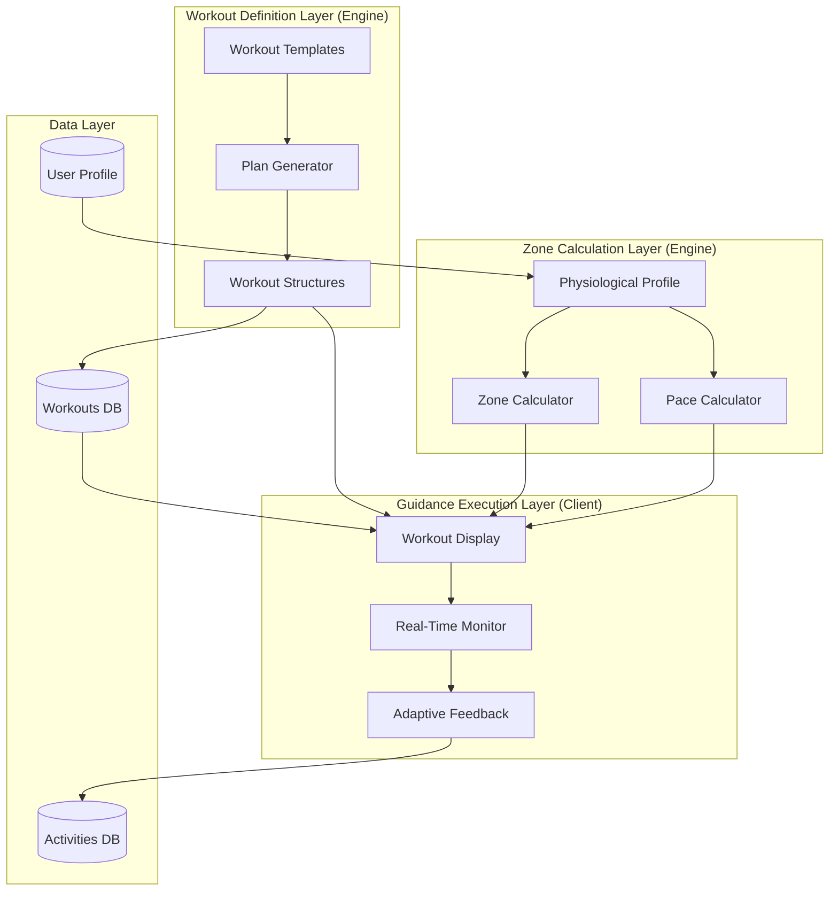

# RFC 0008: Training Guidance System

| Status        | Draft |
| :---          | :--- |
| **RFC #**     | 0008 |
| **Author(s)** | Training Systems Team |
| **Created**   | 2025-11-26 |
| **Updated**   | 2025-11-27 |
| **Related PRD** | [04_TRAINING_GUIDANCE.md](file:///Users/maksat/Projects/RunningCoach/RunningCoach/docs/prd/04_TRAINING_GUIDANCE.md) |

## 1. Introduction

### 1.1. Context

This RFC defines the implementation of the Training Guidance system, a critical component of the RunningCoach application that translates the "Holistic Coach" vision (PRD `00_OVERARCHING_VISION.md`) into concrete, actionable workout prescriptions. The system provides intelligent pre-workout context, real-time in-workout guidance, and post-workout feedback to athletes across all training modalities (running, strength, plyometrics, cross-training).

Following the **hybrid thick-client architecture** established in RFC 0001, the Training Guidance system runs as part of the `@runningcoach/engine` package. This allows workout generation, zone calculations, and adaptive adjustments to occur locally on devices (phone, watch, web) with zero latency and full offline capability.

The Training Guidance system embodies the "Mild" coaching philosophy: non-intrusive, educational, evidence-based, and balancing structure with flexibility. It respects the athlete's autonomy while providing expert direction rooted in exercise physiology.

### 1.2. Problem Statement

We need to solve several technical challenges to deliver effective training guidance:

1. **Complex Workout Structure Representation:** Running workouts range from simple "30 min easy" to complex interval sessions with multiple phases, each requiring structured data for warmup, intervals, recovery, cooldown.

2. **Personalized Zone Calculation:** Each athlete has unique heart rate and pace zones based on physiology (VO2max, lactate threshold, max HR). These zones must be calculated locally and updated dynamically as fitness improves.

3. **Real-Time Workout Adjustment:** During a workout, the athlete's actual heart rate may exceed target zones due to heat, fatigue, or elevation. The system must detect this and provide adaptive guidance ("Slow down 30 sec/mile to return to Zone 2").

4. **Multi-Modal Guidance:** The system must prescribe running, strength training, plyometrics, and cross-training equivalently, with appropriate structure and coaching notes for each modality.

5. **Offline-First Execution:** Watch apps must provide full guidance without phone connectivity, requiring pre-sync of workout context and execution of guidance logic locally.

6. **Educational Context:** Each workout needs a "Why?" explanation to build athlete understanding and trust ("This threshold run raises your lactate ceiling").

### 1.3. Goals & Non-Goals

**Goals:**
*   **Structured Workout Definitions:** Define TypeScript schemas for all workout types (Easy, Long, Threshold, Intervals, Recovery, Strength, Plyometrics, Cross-Training)
*   **Zone-Based Guidance:** Implement heart rate (5-zone system) and pace zone calculations personalized to each athlete
*   **Real-Time Adjustments:** Provide in-workout adaptive guidance when actual metrics deviate from targets
*   **Coaching Context:** Deliver pre-workout explanations ("What & Why"), in-workout guidance, and post-workout reflections
*   **Cross-Platform Execution:** Same workout structures execute on Phone (React Native), Watch (SwiftUI/MonkeyC), and Web (Next.js)
*   **Offline Capability:** Full guidance available without network connectivity
*   **Progressive Load Management:** Integrate with ACWR system (RFC 0007) to ensure workout prescriptions remain safe

**Non-Goals:**
*   Real-time video coaching or form analysis (future feature)
*   Social sharing or workout comparison features
*   Third-party coach integration (athletes managing other athletes)
*   Voice-guided workouts via smart speakers (watch provides audio cues)
*   Integration with gym equipment (treadmill, bike computers) beyond standard Bluetooth HR sensors

### 1.4. Dependencies

**Related PRDs:**
*   [04_TRAINING_GUIDANCE.md](file:///Users/maksat/Projects/RunningCoach/RunningCoach/docs/prd/04_TRAINING_GUIDANCE.md) - Workout types and coaching philosophy
*   [06_ADAPTIVE_TRAINING_ENGINE.md](file:///Users/maksat/Projects/RunningCoach/RunningCoach/docs/prd/06_ADAPTIVE_TRAINING_ENGINE.md) - 4-system analysis and daily adaptation
*   [07_LOAD_MANAGEMENT.md](file:///Users/maksat/Projects/RunningCoach/RunningCoach/docs/prd/07_LOAD_MANAGEMENT.md) - ACWR and load calculations
*   [08_STRENGTH_PLYOMETRICS.md](file:///Users/maksat/Projects/RunningCoach/RunningCoach/docs/prd/08_STRENGTH_PLYOMETRICS.md) - Strength workout structures
*   [00_OVERARCHING_VISION.md](file:///Users/maksat/Projects/RunningCoach/RunningCoach/docs/prd/00_OVERARCHING_VISION.md) - "Mild" coaching tone

**Related RFCs:**
*   [0001-system-architecture.md](file:///Users/maksat/Projects/RunningCoach/RunningCoach/docs/rfc/0001-system-architecture.md) - Hybrid architecture, shared engine package
*   [0002-mobile-app-architecture.md](file:///Users/maksat/Projects/RunningCoach/RunningCoach/docs/rfc/0002-mobile-app-architecture.md) - Mobile workout display and execution
*   RFC 0007 - Load Management System (ACWR calculations)

**External Dependencies:**
*   None (system operates independently once workout context is synced)

### 1.5. Success Metrics

*   **Workout Completion Rate:** ≥85% of prescribed workouts completed by athletes
*   **Zone Adherence:** Athletes spend ≥80% of target time in prescribed HR/pace zones during structured workouts
*   **Guidance Response Time:** Real-time adjustments suggested within 10 seconds of zone deviation on watch
*   **Coaching Clarity:** Athlete survey rating "I understand why I'm doing this workout" ≥4.5/5.0
*   **Offline Reliability:** 100% of watch workouts execute successfully without phone connectivity
*   **Cross-Platform Consistency:** Identical workout structures render identically on Phone, Watch, and Web
*   **Educational Impact:** Athletes report increased training knowledge after 8 weeks (measured via survey)

---

## 2. Proposed Solution

### 2.1. High-Level Design

The Training Guidance system consists of three logical layers that operate across all platforms:

1. **Workout Definition Layer:** Structured schemas defining workout types, phases, and targets
2. **Zone Calculation Layer:** Personalized heart rate and pace zone computation based on athlete physiology
3. **Guidance Execution Layer:** Real-time monitoring and adaptive feedback during workout execution



**Key Architectural Decisions:**

1. **Workout Structures as JSON:** All workout definitions stored as structured JSON in the database, portable across platforms
2. **Engine-Based Zone Calculation:** The `@runningcoach/engine` calculates zones deterministically from user profile (VO2max, threshold HR, max HR)
3. **Client-Side Execution:** Watch and Phone execute guidance logic locally using pre-synced workout structures
4. **Stateless Guidance:** Each guidance decision is a pure function of current state (HR, pace, elapsed time, workout structure)

### 2.2. Detailed Design

#### 2.2.1. Workout Type Definitions

The system supports multiple workout categories aligned with PRD 04_TRAINING_GUIDANCE:

**Running Workouts:**
*   **Easy Run:** Aerobic base building, conversation pace, Zone 1-2
*   **Long Run:** Marathon-specific endurance, glycogen depletion, Zone 1-2
*   **Threshold (Tempo) Run:** Lactate threshold work, "comfortably hard", Zone 3-4
*   **Intervals (VO2max):** High-intensity intervals, Zone 4-5
*   **Recovery Run:** Active recovery, "embarrassingly slow", Zone 1
*   **Race Pace Run:** Marathon-specific pace work, Zone 2-3

**Strength & Plyometrics:**
*   **Heavy Resistance:** 85-95% 1RM, 3-5 reps, neuromuscular adaptation
*   **Hypertrophy:** 60-75% 1RM, 8-12 reps, muscle building
*   **Plyometric Session:** Jump training, reactive power
*   **Injury Prevention:** Nordic curls, hip strengthening, core stability

**Cross-Training:**
*   **Deep Water Running:** 1:1 running equivalency
*   **Cycling:** Aerobic cross-training, lower impact
*   **Swimming:** Full-body cardio, minimal running-specific transfer
*   **Elliptical:** Moderate running equivalency

#### 2.2.2. Workout Structure Schema

**TypeScript Core Types:**

```typescript
// Core enums
enum WorkoutType {
  EASY = 'easy',
  LONG = 'long',
  THRESHOLD = 'threshold',
  INTERVALS = 'intervals',
  RECOVERY = 'recovery',
  RACE_PACE = 'race_pace',
  STRENGTH = 'strength',
  PLYOMETRIC = 'plyometric',
  CROSS_TRAINING = 'cross_training',
}

enum WorkoutModality {
  RUNNING = 'running',
  STRENGTH = 'strength',
  CYCLING = 'cycling',
  SWIMMING = 'swimming',
  WATER_RUNNING = 'water_running',
  ELLIPTICAL = 'elliptical',
}

enum IntensityZone {
  ZONE_1 = 1,  // Recovery (50-60% max HR)
  ZONE_2 = 2,  // Easy/Aerobic (60-70% max HR)
  ZONE_3 = 3,  // Tempo (70-80% max HR)
  ZONE_4 = 4,  // Threshold (80-90% max HR)
  ZONE_5 = 5,  // VO2max (90-100% max HR)
}

// Base workout structure
interface WorkoutStructure {
  id: string;
  type: WorkoutType;
  modality: WorkoutModality;
  targetDuration?: number;        // minutes
  targetDistance?: number;         // meters
  targetRPE?: number;              // 1-10 scale
  phases: WorkoutPhase[];
  coachingNotes: CoachingNotes;
}

// Workout phase (warmup, intervals, cooldown, etc.)
interface WorkoutPhase {
  id: string;
  name: string;                    // "Warmup", "Intervals", "Cooldown"
  type: PhaseType;
  duration?: number;               // minutes
  distance?: number;               // meters
  targetZone?: IntensityZone;
  targetPace?: PaceTarget;
  targetHR?: HeartRateTarget;
  intervals?: IntervalSet;
  instructions?: string;
}

enum PhaseType {
  WARMUP = 'warmup',
  WORK = 'work',
  RECOVERY = 'recovery',
  COOLDOWN = 'cooldown',
  INTERVALS = 'intervals',
}

// Interval structure
interface IntervalSet {
  repetitions: number;
  work: IntervalPhase;
  recovery: IntervalPhase;
}

interface IntervalPhase {
  duration?: number;               // minutes
  distance?: number;               // meters
  targetZone: IntensityZone;
  targetPace?: PaceTarget;
  targetHR?: HeartRateTarget;
}

// Heart rate target (bpm)
interface HeartRateTarget {
  min: number;
  max: number;
  optimal: number;
}

// Pace target (seconds per km)
interface PaceTarget {
  min: number;                     // slowest acceptable (sec/km)
  max: number;                     // fastest acceptable (sec/km)
  optimal: number;                 // target pace (sec/km)
}

// Coaching context
interface CoachingNotes {
  preWorkout: PreWorkoutGuidance;
  inWorkout: InWorkoutGuidance;
  postWorkout: PostWorkoutGuidance;
}

interface PreWorkoutGuidance {
  title: string;                   // "20 Min Tempo Run"
  purpose: string;                 // "Raise your lactate threshold"
  whatToExpect: string;            // "Comfortably hard effort..."
  keyPoints: string[];             // ["Start conservatively", "Focus on breathing"]
  warmupInstructions: string;
}

interface InWorkoutGuidance {
  startCues: string[];             // Displayed at workout start
  phaseCues: Record<string, string[]>;  // Cues per phase ID
  zoneFeedback: ZoneFeedback;
}

interface ZoneFeedback {
  tooSlow: string;                 // "Pick up the pace slightly"
  onTarget: string;                // "Perfect, maintain this effort"
  tooFast: string;                 // "Ease back, you're above zone"
}

interface PostWorkoutGuidance {
  cooldownInstructions: string;
  recoveryTips: string[];
  reflectionPrompts: string[];     // For RPE collection
  nextWorkoutPreview?: string;
}
```

**Example Workout Structure (Threshold Run):**

```json
{
  "id": "workout_threshold_20min",
  "type": "threshold",
  "modality": "running",
  "targetDuration": 50,
  "targetRPE": 7,
  "phases": [
    {
      "id": "phase_warmup",
      "name": "Warmup",
      "type": "warmup",
      "duration": 15,
      "targetZone": 2,
      "instructions": "Start very easy, gradually increase to Zone 2"
    },
    {
      "id": "phase_work",
      "name": "Threshold Effort",
      "type": "work",
      "duration": 20,
      "targetZone": 4,
      "targetPace": {
        "min": 270,
        "max": 250,
        "optimal": 260
      },
      "instructions": "Comfortably hard effort, should feel controlled"
    },
    {
      "id": "phase_cooldown",
      "name": "Cooldown",
      "type": "cooldown",
      "duration": 15,
      "targetZone": 1,
      "instructions": "Easy jog, let HR drop naturally"
    }
  ],
  "coachingNotes": {
    "preWorkout": {
      "title": "20 Minute Threshold Run",
      "purpose": "This run raises your lactate threshold - the pace you can sustain for ~60 minutes. A higher threshold means you can run faster before accumulating fatigue.",
      "whatToExpect": "After warmup, you'll run at a comfortably hard effort for 20 minutes. It should feel like an 8/10 effort - hard, but controlled. You should be able to speak in short phrases.",
      "keyPoints": [
        "Start conservatively - the first 5 minutes will feel easier than the last 5",
        "Focus on steady breathing rhythm",
        "Maintain consistent effort even if pace drifts slightly"
      ],
      "warmupInstructions": "Take 15 minutes to gradually increase from very easy to Zone 2. This prepares your cardiovascular system and muscles for the hard effort ahead."
    },
    "inWorkout": {
      "startCues": [
        "Find your rhythm",
        "Controlled breathing"
      ],
      "phaseCues": {
        "phase_work": [
          "5 min in: Still feeling strong? Good.",
          "10 min: Halfway there, maintain",
          "15 min: Final 5 minutes, dig in"
        ]
      },
      "zoneFeedback": {
        "tooSlow": "Increase effort slightly - you're below threshold zone",
        "onTarget": "Perfect effort, this is your threshold pace",
        "tooFast": "Ease back slightly - too fast for a 20 min effort"
      }
    },
    "postWorkout": {
      "cooldownInstructions": "Jog easily for 15 minutes to clear lactate and begin recovery. Walk if needed.",
      "recoveryTips": [
        "Protein + carbs within 60 minutes",
        "Hydrate with electrolytes",
        "Foam roll quads and calves tonight"
      ],
      "reflectionPrompts": [
        "Could you have held that pace for another 10 minutes?",
        "Did your breathing stay controlled throughout?"
      ],
      "nextWorkoutPreview": "Tomorrow is an easy recovery run - keep it truly easy to absorb today's work."
    }
  }
}
```

**Example Workout Structure (Intervals):**

```json
{
  "id": "workout_intervals_5x1km",
  "type": "intervals",
  "modality": "running",
  "targetDuration": 60,
  "targetRPE": 8,
  "phases": [
    {
      "id": "phase_warmup",
      "name": "Warmup",
      "type": "warmup",
      "duration": 20,
      "targetZone": 2
    },
    {
      "id": "phase_intervals",
      "name": "Intervals",
      "type": "intervals",
      "intervals": {
        "repetitions": 5,
        "work": {
          "distance": 1000,
          "targetZone": 5,
          "targetPace": {
            "min": 240,
            "max": 220,
            "optimal": 230
          }
        },
        "recovery": {
          "duration": 3,
          "targetZone": 1,
          "targetHR": {
            "min": 100,
            "max": 130,
            "optimal": 120
          }
        }
      },
      "instructions": "Run hard for 1km, jog easy for 3 minutes, repeat 5 times"
    },
    {
      "id": "phase_cooldown",
      "name": "Cooldown",
      "type": "cooldown",
      "duration": 10,
      "targetZone": 1
    }
  ],
  "coachingNotes": {
    "preWorkout": {
      "title": "5 × 1km Intervals @ VO2max Pace",
      "purpose": "VO2max intervals improve your aerobic capacity - the maximum rate your body can use oxygen. This translates directly to faster race times.",
      "whatToExpect": "After warmup, you'll run 5 hard 1km repeats with 3 minutes easy jogging between. The first repeat should feel manageable; the last will be tough.",
      "keyPoints": [
        "Don't go too fast on the first interval - save energy for the last",
        "Use recovery intervals to drop HR below 130 bpm",
        "Focus on form when fatigued"
      ],
      "warmupInstructions": "20 minutes easy running with 3-4 strides (short 20-30 second accelerations) to prepare for hard efforts."
    },
    "inWorkout": {
      "startCues": [
        "Smooth acceleration",
        "Relax shoulders"
      ],
      "phaseCues": {
        "phase_intervals": [
          "Interval 1: Find your rhythm, don't overcook it",
          "Interval 2: Settling in, same effort as #1",
          "Interval 3: Halfway done, stay strong",
          "Interval 4: This is where it counts",
          "Interval 5: Leave it all out here"
        ]
      },
      "zoneFeedback": {
        "tooSlow": "Push harder - this should feel like 9/10 effort",
        "onTarget": "Excellent pace, maintain this",
        "tooFast": "You're above target pace - too fast for 5 reps"
      }
    },
    "postWorkout": {
      "cooldownInstructions": "10 minutes very easy jogging to clear lactate and begin recovery.",
      "recoveryTips": [
        "30g protein + 50g carbs within 30 minutes",
        "Ice bath or cold shower optional for legs",
        "Easy day tomorrow - critical for adaptation"
      ],
      "reflectionPrompts": [
        "Did you pace the intervals evenly?",
        "Was the last interval your fastest or slowest?"
      ],
      "nextWorkoutPreview": "Tomorrow is an easy recovery run. Keep it Zone 1-2 to allow your legs to recover."
    }
  }
}
```

#### 2.2.3. Heart Rate Zone System (5-Zone Model)

The system uses a 5-zone model based on maximum heart rate and lactate threshold heart rate:

**Zone Calculation Logic:**

```typescript
interface UserPhysiologyProfile {
  maxHR: number;              // Max heart rate (bpm)
  restingHR: number;          // Resting heart rate (bpm)
  thresholdHR?: number;       // Lactate threshold HR (bpm) - optional, estimated if not available
  vo2max?: number;            // VO2max (ml/kg/min) - optional
}

interface HeartRateZones {
  zone1: { min: number; max: number; name: string; description: string };
  zone2: { min: number; max: number; name: string; description: string };
  zone3: { min: number; max: number; name: string; description: string };
  zone4: { min: number; max: number; name: string; description: string };
  zone5: { min: number; max: number; name: string; description: string };
}

class ZoneCalculator {
  /**
   * Calculate personalized HR zones using Karvonen formula (Heart Rate Reserve)
   * HRR = Max HR - Resting HR
   * Target HR = (HRR × %Intensity) + Resting HR
   */
  static calculateHRZones(profile: UserPhysiologyProfile): HeartRateZones {
    const { maxHR, restingHR, thresholdHR } = profile;
    const hrr = maxHR - restingHR; // Heart Rate Reserve

    // If threshold HR is available, use it to anchor Zone 3/4 boundary
    // Otherwise, estimate threshold at ~85% of max HR
    const ltHR = thresholdHR || Math.round(maxHR * 0.85);

    return {
      zone1: {
        min: Math.round(restingHR + hrr * 0.50),
        max: Math.round(restingHR + hrr * 0.60),
        name: 'Recovery',
        description: 'Very easy effort, conversation is effortless'
      },
      zone2: {
        min: Math.round(restingHR + hrr * 0.60),
        max: Math.round(restingHR + hrr * 0.70),
        name: 'Easy / Aerobic',
        description: 'Easy pace, can hold full conversation'
      },
      zone3: {
        min: Math.round(restingHR + hrr * 0.70),
        max: ltHR,
        name: 'Tempo',
        description: 'Moderate effort, can speak in sentences'
      },
      zone4: {
        min: ltHR,
        max: Math.round(restingHR + hrr * 0.90),
        name: 'Threshold',
        description: 'Hard effort, can speak in short phrases only'
      },
      zone5: {
        min: Math.round(restingHR + hrr * 0.90),
        max: maxHR,
        name: 'VO2max',
        description: 'Very hard effort, cannot speak more than 1-2 words'
      }
    };
  }

  /**
   * Get target HR range for a given zone
   */
  static getZoneRange(zones: HeartRateZones, zone: IntensityZone): { min: number; max: number } {
    switch (zone) {
      case IntensityZone.ZONE_1: return { min: zones.zone1.min, max: zones.zone1.max };
      case IntensityZone.ZONE_2: return { min: zones.zone2.min, max: zones.zone2.max };
      case IntensityZone.ZONE_3: return { min: zones.zone3.min, max: zones.zone3.max };
      case IntensityZone.ZONE_4: return { min: zones.zone4.min, max: zones.zone4.max };
      case IntensityZone.ZONE_5: return { min: zones.zone5.min, max: zones.zone5.max };
    }
  }
}
```

**Zone Distribution Philosophy (Polarized Training):**

As specified in PRD 04_TRAINING_GUIDANCE:
*   **80% Easy (Zone 1-2):** Builds aerobic base, mitochondrial density, fat oxidation
*   **20% Hard (Zone 4-5):** Race-specific adaptations, lactate tolerance, VO2max
*   **Avoid "Grey Zone" (Zone 3):** Moderate intensity that fatigues without specific benefit

#### 2.2.4. Pace Zone Calculation

Pace zones are calculated from VO2max and race performance predictions:

```typescript
interface PaceZones {
  easy: { min: number; max: number };          // sec/km
  marathon: { min: number; max: number };      // sec/km
  threshold: { min: number; max: number };     // sec/km
  interval: { min: number; max: number };      // sec/km
  repetition: { min: number; max: number };    // sec/km
}

class PaceCalculator {
  /**
   * Calculate pace zones from VO2max using Daniels' Running Formula
   * VDOT = VO2max adjusted for running economy
   */
  static calculatePaceZones(vo2max: number): PaceZones {
    // Convert VO2max to VDOT (approximation if no race times available)
    const vdot = vo2max;

    // Daniels' formulas for training paces (seconds per km)
    // These are empirical relationships from Jack Daniels' research
    return {
      easy: {
        min: this.vdotToPace(vdot, 0.65),  // 65-75% VO2max
        max: this.vdotToPace(vdot, 0.75)
      },
      marathon: {
        min: this.vdotToPace(vdot, 0.80),  // 80-85% VO2max
        max: this.vdotToPace(vdot, 0.85)
      },
      threshold: {
        min: this.vdotToPace(vdot, 0.85),  // 85-88% VO2max (~60 min race pace)
        max: this.vdotToPace(vdot, 0.88)
      },
      interval: {
        min: this.vdotToPace(vdot, 0.95),  // 95-100% VO2max
        max: this.vdotToPace(vdot, 1.00)
      },
      repetition: {
        min: this.vdotToPace(vdot, 1.05),  // 105-110% VO2max (short, fast)
        max: this.vdotToPace(vdot, 1.10)
      }
    };
  }

  /**
   * Convert VDOT and intensity % to pace (sec/km)
   * Formula from Daniels' Running Formula
   */
  private static vdotToPace(vdot: number, intensity: number): number {
    // Simplified formula: pace = k / (vdot * intensity)
    // where k is empirical constant (~29.54 for km, ~47.5 for miles)
    const k = 29.54;
    const velocity = vdot * intensity; // m/min
    const secPerKm = (k / velocity) * 60;
    return Math.round(secPerKm);
  }

  /**
   * Format pace for display
   */
  static formatPace(secPerKm: number): string {
    const minutes = Math.floor(secPerKm / 60);
    const seconds = Math.round(secPerKm % 60);
    return `${minutes}:${seconds.toString().padStart(2, '0')}/km`;
  }
}
```

#### 2.2.5. Real-Time Workout Adjustments

During workout execution, the system monitors actual metrics and provides adaptive guidance:

```typescript
enum WorkoutStatus {
  NOT_STARTED = 'not_started',
  IN_PROGRESS = 'in_progress',
  PAUSED = 'paused',
  COMPLETED = 'completed',
  ABANDONED = 'abandoned',
}

enum ZoneCompliance {
  BELOW_TARGET = 'below_target',
  ON_TARGET = 'on_target',
  ABOVE_TARGET = 'above_target',
}

interface WorkoutState {
  workoutId: string;
  status: WorkoutStatus;
  currentPhaseId: string;
  elapsedTime: number;           // seconds
  elapsedDistance: number;       // meters
  currentHR?: number;            // bpm
  currentPace?: number;          // sec/km
  zoneCompliance: ZoneCompliance;
}

interface AdaptiveGuidance {
  type: 'warning' | 'adjustment' | 'encouragement';
  message: string;
  suggestedAction?: string;
}

class WorkoutMonitor {
  /**
   * Monitor current workout state and provide real-time guidance
   */
  static evaluateWorkoutState(
    state: WorkoutState,
    workout: WorkoutStructure,
    zones: HeartRateZones
  ): AdaptiveGuidance | null {
    const currentPhase = workout.phases.find(p => p.id === state.currentPhaseId);
    if (!currentPhase) return null;

    // Check HR zone compliance
    if (state.currentHR && currentPhase.targetZone) {
      const targetRange = ZoneCalculator.getZoneRange(zones, currentPhase.targetZone);

      // Too high - most critical for easy runs
      if (state.currentHR > targetRange.max + 5) {
        return {
          type: 'warning',
          message: `Heart rate too high (${state.currentHR} bpm)`,
          suggestedAction: `Slow down to ${PaceCalculator.formatPace(state.currentPace! + 15)} to return to Zone ${currentPhase.targetZone}`
        };
      }

      // Slightly high
      if (state.currentHR > targetRange.max) {
        return {
          type: 'adjustment',
          message: `Ease effort slightly`,
          suggestedAction: `Target HR: ${targetRange.min}-${targetRange.max} bpm`
        };
      }

      // Too low (only flag on hard workouts)
      if (currentPhase.targetZone >= IntensityZone.ZONE_4 && state.currentHR < targetRange.min - 5) {
        return {
          type: 'adjustment',
          message: `Increase effort`,
          suggestedAction: `Target HR: ${targetRange.min}-${targetRange.max} bpm`
        };
      }
    }

    // Check pace compliance (if available)
    if (state.currentPace && currentPhase.targetPace) {
      const { min, max, optimal } = currentPhase.targetPace;

      if (state.currentPace > max + 10) { // Too slow
        return {
          type: 'adjustment',
          message: `Increase pace to ${PaceCalculator.formatPace(optimal)}`,
          suggestedAction: 'Pick up effort slightly'
        };
      }

      if (state.currentPace < min - 10) { // Too fast
        return {
          type: 'warning',
          message: `You're too fast - slow down to ${PaceCalculator.formatPace(optimal)}`,
          suggestedAction: 'Conserve energy for later'
        };
      }
    }

    // On target - encouragement
    if (state.zoneCompliance === ZoneCompliance.ON_TARGET) {
      return {
        type: 'encouragement',
        message: 'Perfect effort, maintain',
        suggestedAction: undefined
      };
    }

    return null;
  }

  /**
   * Detect if workout should be modified due to environmental factors
   * Called by Adaptive Engine based on readiness score
   */
  static shouldModifyWorkout(
    workout: WorkoutStructure,
    readinessScore: number,
    environmentalFactors: { temperature: number; humidity: number }
  ): WorkoutStructure | null {
    // If readiness is Red (< 3/10) or environmental stress is high
    if (readinessScore < 3 || environmentalFactors.temperature > 30) {
      // Reduce intensity by one zone
      const modifiedPhases = workout.phases.map(phase => ({
        ...phase,
        targetZone: phase.targetZone ? Math.max(1, phase.targetZone - 1) : undefined
      }));

      return {
        ...workout,
        phases: modifiedPhases,
        coachingNotes: {
          ...workout.coachingNotes,
          preWorkout: {
            ...workout.coachingNotes.preWorkout,
            whatToExpect: `Modified workout: Reduced intensity due to ${
              readinessScore < 3 ? 'low readiness' : 'high heat'
            }. Focus on completing the duration at lower effort.`
          }
        }
      };
    }

    return null;
  }
}
```

#### 2.2.6. Strength Training Workout Structure

Strength workouts use a different structure optimized for resistance training:

```typescript
interface StrengthWorkoutStructure {
  id: string;
  type: WorkoutType.STRENGTH;
  modality: WorkoutModality.STRENGTH;
  phase: 'base' | 'build' | 'peak' | 'taper';
  targetDuration: number;          // minutes
  targetRPE: number;
  exercises: StrengthExercise[];
  coachingNotes: CoachingNotes;
}

interface StrengthExercise {
  id: string;
  name: string;
  category: 'compound' | 'isolation' | 'plyometric' | 'core';
  sets: number;
  reps: number;
  intensity: string;               // "85-95% 1RM" or "bodyweight" or "20kg"
  restPeriod: number;              // seconds between sets
  videoUrl?: string;
  formCues: string[];
  commonMistakes: string[];
}

// Example: Base Phase Strength Session
const baseStrengthWorkout: StrengthWorkoutStructure = {
  id: 'strength_base_week3',
  type: WorkoutType.STRENGTH,
  modality: WorkoutModality.STRENGTH,
  phase: 'base',
  targetDuration: 60,
  targetRPE: 6,
  exercises: [
    {
      id: 'ex_warmup_mobility',
      name: 'Hip Mobility & Dynamic Warmup',
      category: 'core',
      sets: 1,
      reps: 10,
      intensity: 'bodyweight',
      restPeriod: 0,
      formCues: ['Full range of motion', 'Control movement']
    },
    {
      id: 'ex_squat',
      name: 'Back Squat',
      category: 'compound',
      sets: 4,
      reps: 10,
      intensity: '65% 1RM',
      restPeriod: 120,
      videoUrl: 'https://...',
      formCues: [
        'Depth to parallel (thigh parallel to ground)',
        'Knees track over toes',
        'Neutral spine throughout',
        'Drive through heels'
      ],
      commonMistakes: [
        'Knees caving inward (valgus)',
        'Heels lifting off ground',
        'Rounding lower back'
      ]
    },
    {
      id: 'ex_nordic_curl',
      name: 'Nordic Hamstring Curl',
      category: 'isolation',
      sets: 3,
      reps: 6,
      intensity: 'bodyweight',
      restPeriod: 90,
      formCues: [
        'Lower slowly (3-4 seconds)',
        'Catch with hands before face hits ground',
        'Push back up with arms'
      ],
      commonMistakes: ['Dropping too fast', 'Not going deep enough']
    }
  ],
  coachingNotes: {
    preWorkout: {
      title: 'Base Phase Strength - Week 3',
      purpose: 'Build anatomical foundation for marathon training. Focus on movement quality and building work capacity.',
      whatToExpect: 'Moderate weights (65% 1RM), higher reps (8-12), focus on form. Should feel challenging but not maximal.',
      keyPoints: [
        'Prioritize form over weight',
        'Rest 2 minutes between heavy sets',
        'Track weights used for progression'
      ],
      warmupInstructions: '10 minutes dynamic warmup focusing on hips, ankles, and posterior chain.'
    },
    inWorkout: {
      startCues: ['Focus on breathing', 'Quality over speed'],
      phaseCues: {},
      zoneFeedback: {
        tooSlow: '',
        onTarget: 'Good tempo, maintain control',
        tooFast: 'Slow down - control the eccentric'
      }
    },
    postWorkout: {
      cooldownInstructions: '5 minutes static stretching for quads, hamstrings, hip flexors.',
      recoveryTips: [
        '20-30g protein within 30 minutes',
        'Foam roll tonight',
        'Easy run tomorrow to promote blood flow'
      ],
      reflectionPrompts: ['Did you maintain form on the last set?'],
      nextWorkoutPreview: 'Tomorrow is easy run - keep legs fresh.'
    }
  }
};
```

#### 2.2.7. Pre-Workout and Post-Workout Guidance

**Pre-Workout Flow (Mobile/Web):**
1. User opens "Today" tab, sees scheduled workout
2. Tap workout card to view details
3. Pre-Workout Guidance screen displays:
   *   Workout title and duration
   *   Purpose explanation ("Why am I doing this?")
   *   What to expect during the workout
   *   Key coaching points
   *   Warmup instructions
   *   "Start Workout" button (syncs to watch if connected)

**In-Workout Flow (Watch):**
1. Watch displays current phase name and target zones
2. Real-time metrics: Current HR, Pace, Duration, Distance
3. Zone compliance indicator (color-coded)
4. Audio/haptic alerts when out of zone for >15 seconds
5. Lap/split timing for intervals
6. "Pause" and "End Workout" options

**Post-Workout Flow (Mobile):**
1. Workout auto-completes when watch syncs or user manually ends
2. 5 minutes later, RPE collection prompt appears (see RFC 0007)
3. Post-Workout Guidance screen displays:
   *   Workout summary (duration, distance, avg HR/pace)
   *   Zone compliance visualization
   *   Cooldown instructions
   *   Recovery tips
   *   Reflection prompts
   *   Next workout preview

### 2.3. Data Model Changes

**Prisma Schema Extensions:**

```prisma
// Workout entity (scheduled workout)
model Workout {
  id                String           @id @default(uuid())
  userId            String
  user              User             @relation(fields: [userId], references: [id])
  planId            String?
  plan              TrainingPlan?    @relation(fields: [planId], references: [id])

  scheduledDate     DateTime
  type              WorkoutType
  modality          WorkoutModality
  status            WorkoutStatus    @default(PLANNED)

  // Workout structure (JSON)
  structure         Json             // WorkoutStructure as JSON

  // Completion data
  completedAt       DateTime?
  actualDuration    Int?             // seconds
  actualDistance    Int?             // meters
  activityId        String?          // Link to recorded Activity
  activity          Activity?        @relation(fields: [activityId], references: [id])

  // RPE and feedback
  rpe               Int?             // 1-10 scale
  notes             String?

  // Adaptive adjustments
  wasModified       Boolean          @default(false)
  modificationReason String?         // "Low readiness", "Heat", etc.
  originalStructure Json?            // Original before modification

  // Sync metadata
  createdAt         DateTime         @default(now())
  updatedAt         DateTime         @updatedAt

  @@index([userId, scheduledDate])
  @@index([userId, status])
}

enum WorkoutType {
  EASY
  LONG
  THRESHOLD
  INTERVALS
  RECOVERY
  RACE_PACE
  STRENGTH
  PLYOMETRIC
  CROSS_TRAINING
}

enum WorkoutModality {
  RUNNING
  STRENGTH
  CYCLING
  SWIMMING
  WATER_RUNNING
  ELLIPTICAL
}

enum WorkoutStatus {
  PLANNED
  IN_PROGRESS
  COMPLETED
  SKIPPED
  MISSED
  ABANDONED
}

// User physiological profile (for zone calculations)
model UserProfile {
  id            String    @id @default(uuid())
  userId        String    @unique
  user          User      @relation(fields: [userId], references: [id])

  // Heart rate data
  maxHR         Int?
  restingHR     Int?
  thresholdHR   Int?      // Lactate threshold HR

  // VO2max and pace zones
  vo2max        Float?

  // Calculated zones (cached for performance)
  hrZones       Json?     // HeartRateZones as JSON
  paceZones     Json?     // PaceZones as JSON

  // Zone calculation metadata
  zonesLastCalculated DateTime?

  createdAt     DateTime  @default(now())
  updatedAt     DateTime  @updatedAt
}

// Activity (completed workout with actual data)
model Activity {
  id                String      @id @default(uuid())
  userId            String
  user              User        @relation(fields: [userId], references: [id])
  workoutId         String?
  workouts          Workout[]   // Reverse relation

  startTime         DateTime
  endTime           DateTime
  duration          Int         // seconds
  distance          Int?        // meters

  // Metrics
  avgHR             Int?
  maxHR             Int?
  avgPace           Int?        // sec/km
  elevationGain     Int?        // meters
  calories          Int?

  // Detailed data
  samples           Json?       // Time-series HR, GPS, pace
  fitFileUrl        String?     // S3 URL

  // Source
  source            String      // 'watch_apple', 'watch_garmin', 'manual'

  // Load calculations (from RFC 0007)
  rpe               Int?
  trainingLoad      Int?        // RPE × duration

  createdAt         DateTime    @default(now())
  updatedAt         DateTime    @updatedAt

  @@index([userId, startTime])
}
```

### 2.4. API Changes

**New tRPC Endpoints:**

```typescript
// Workout retrieval
workout.getUpcoming(days: number)                     // Get next N days of scheduled workouts
workout.getById(workoutId: string)                    // Get full workout with structure
workout.getHistory(startDate: Date, endDate: Date)    // Historical workouts

// Workout execution
workout.start(workoutId: string)                      // Mark workout as in-progress
workout.pause(workoutId: string)                      // Pause workout
workout.resume(workoutId: string)                     // Resume workout
workout.complete(workoutId: string, data: ActivityData) // Complete and log activity
workout.abandon(workoutId: string, reason: string)    // Mark as abandoned

// Zone calculations
zones.calculate(userId: string)                       // Recalculate user's HR and pace zones
zones.get(userId: string)                             // Get cached zones

// Guidance
guidance.getPreWorkout(workoutId: string)             // Get pre-workout coaching notes
guidance.getRealTime(workoutId: string, state: WorkoutState) // Get real-time adaptive guidance
guidance.getPostWorkout(workoutId: string)            // Get post-workout guidance

// Workout modifications (used by Adaptive Engine)
workout.modify(workoutId: string, modifications: WorkoutModification) // Adaptive adjustment
workout.swap(workoutId: string, newType: WorkoutType) // Swap workout type
workout.skip(workoutId: string, reason: string)       // Skip workout
```

### 2.5. Offline-First Considerations

**Local Storage Requirements:**

| Platform | Data Stored Locally | Storage Size |
|----------|-------------------|--------------|
| **Mobile** | Next 14 days of workouts with full structures, User zones, Last 90 days of activities | ~5 MB |
| **Watch** | Next 3 days of workouts, User zones, Current workout state | ~500 KB |
| **Web** | Same as mobile (IndexedDB) | ~5 MB |

**Queued Operations:**
*   Workout start/pause/complete actions queued locally
*   Activity data (HR samples, GPS track) stored locally until sync
*   RPE entries queued for server sync
*   Zone recalculations trigger server update when connected

**Conflict Resolution:**
*   **Workout completion:** Client wins (actual activity data is authoritative)
*   **Workout modifications:** Server wins (Adaptive Engine on server has latest readiness data)
*   **Zone updates:** Server wins (calculations may use updated algorithm)

**Fallback Behavior:**
*   If workout structure fails to load, display basic workout (type, duration, target zone)
*   If zones unavailable, use estimated zones from maxHR approximation (220 - age)
*   If guidance unavailable, show workout structure only without coaching notes

### 2.6. Synchronization Strategy

**Workout Context Sync (Server → Client):**
*   **Trigger:** Daily at 6:00 AM, when user opens app, when plan changes
*   **Payload:** Next 14 days of scheduled workouts with full structures, Updated user zones
*   **Priority:** High (needed for workout execution)

**Activity Data Sync (Client → Server):**
*   **Trigger:** Immediately after workout completion (if connected), Periodic retry every 15 min if failed, Background sync when app enters foreground
*   **Payload:** Activity record with metrics, Workout completion status, RPE entry, GPS/HR samples (if available)
*   **Priority:** Critical (load calculations depend on this)

**Watch ↔ Phone Sync:**
*   **Pre-Workout (Phone → Watch):**
    *   Today's and tomorrow's workouts
    *   User zones (HR, pace)
    *   Last activity summary (for continuity)
*   **Post-Workout (Watch → Phone):**
    *   Complete activity data (HR, GPS, pace samples)
    *   Workout completion status
    *   RPE (if collected on watch)

---

## 3. Implementation Plan

### 3.1. Phasing

**Phase 1: Core Workout Schema & Zone Calculation (Weeks 1-2)**
*   **Deliverables:**
    *   Define TypeScript types for WorkoutStructure, WorkoutPhase, Zones
    *   Implement ZoneCalculator and PaceCalculator in `@runningcoach/engine`
    *   Create Prisma schema migrations for Workout and UserProfile
    *   Unit tests for zone calculation algorithms
*   **Success Criteria:**
    *   Zones calculate correctly for various user profiles
    *   Workout structures serialize/deserialize from JSON
    *   Schema deployed to development database

**Phase 2: Workout Templates & Coach's Notes (Weeks 3-4)**
*   **Deliverables:**
    *   Create workout templates for all workout types (Easy, Long, Threshold, Intervals, etc.)
    *   Write coaching notes (pre/in/post workout guidance)
    *   Implement workout template library in engine
    *   Create seed data with 20+ workout templates
*   **Success Criteria:**
    *   Template library covers all workout types from PRD
    *   Coaching notes follow "Mild" tone from PRD
    *   Templates can be instantiated with personalized zones

**Phase 3: Mobile Workout Display (Weeks 5-6)**
*   **Dependencies:** Phase 1, Phase 2, RFC 0002 Phase 2 (Mobile Core UI)
*   **Deliverables:**
    *   Pre-workout guidance screen (mobile)
    *   Workout structure display with phases
    *   Zone visualization (HR/pace ranges)
    *   "Start Workout" button with watch sync
*   **Success Criteria:**
    *   User can view workout details and coaching notes
    *   Zones display with personalized values
    *   UI matches design system

**Phase 4: Real-Time Workout Monitoring (Weeks 7-9)**
*   **Dependencies:** Phase 3, RFC 0001 Phase 5 (Watch Integration)
*   **Deliverables:**
    *   WorkoutMonitor class in engine
    *   Real-time zone compliance detection
    *   Adaptive guidance message generation
    *   Watch app workout execution mode
    *   Audio/haptic alerts for zone deviations
*   **Success Criteria:**
    *   Watch provides real-time HR zone guidance
    *   Alerts trigger within 10 seconds of zone deviation
    *   Guidance messages are contextual and helpful
    *   Workout executes fully offline on watch

**Phase 5: Post-Workout Flow & RPE Collection (Weeks 10-11)**
*   **Dependencies:** Phase 4, RFC 0007 (Load Management)
*   **Deliverables:**
    *   Post-workout guidance screen
    *   RPE collection modal (5 min delay trigger)
    *   Activity summary with zone compliance visualization
    *   Integration with load calculation system
*   **Success Criteria:**
    *   RPE collected ≥80% of workouts
    *   Activity syncs to server within 30 seconds
    *   Training load calculated immediately

**Phase 6: Strength & Cross-Training Workouts (Weeks 12-13)**
*   **Dependencies:** Phase 5
*   **Deliverables:**
    *   Strength workout structure schema
    *   Exercise library with videos
    *   Strength workout templates (Base/Build/Peak/Taper phases)
    *   Cross-training workout templates
*   **Success Criteria:**
    *   Strength workouts display with exercise details
    *   Video demonstrations load successfully
    *   Periodization aligns with PRD 08

**Phase 7: Adaptive Workout Modification (Weeks 14-15)**
*   **Dependencies:** Phase 6, RFC 0006 (Adaptive Training Engine)
*   **Deliverables:**
    *   Workout modification logic in engine
    *   UI for displaying modified workouts
    *   Modification reason explanations
    *   Original workout comparison view
*   **Success Criteria:**
    *   Low readiness triggers appropriate workout reduction
    *   User understands why workout was modified
    *   Modified workouts maintain training intent

**Phase 8: Polish & Testing (Week 16)**
*   **Deliverables:**
    *   End-to-end testing of complete workout flow
    *   Offline scenario testing
    *   Performance optimization (zone calculation caching)
    *   Documentation and user guides
*   **Success Criteria:**
    *   All offline scenarios handled gracefully
    *   Workout flow completion rate >90% in testing
    *   Performance benchmarks met

### 3.2. Testing Strategy

**Unit Tests:**
*   **Zone Calculations:** Test ZoneCalculator with various user profiles (high/low max HR, with/without threshold HR)
*   **Pace Calculations:** Test PaceCalculator with various VO2max values
*   **Workout Monitor:** Test zone compliance detection with mock workout states
*   **Guidance Generation:** Test adaptive guidance message selection
*   **Target Coverage:** 90%+ for engine logic

**Integration Tests:**
*   **Workout CRUD:** Create, read, update, complete workouts via tRPC
*   **Zone Sync:** User profile update triggers zone recalculation and sync to clients
*   **Activity Logging:** Complete workout → Activity created → Training load calculated
*   **Watch Sync:** Workout context pushed to watch, activity returned to phone

**End-to-End Tests:**
*   **Complete Workout Flow (Mobile):**
    1.  User opens app, sees today's workout
    2.  Views pre-workout guidance
    3.  Starts workout (syncs to watch)
    4.  Watch provides real-time guidance
    5.  Completes workout, data syncs to phone
    6.  RPE prompt appears, user enters RPE
    7.  Post-workout guidance displayed
    8.  Training load updated in Progress tab
*   **Offline Workout (Watch Only):**
    1.  Watch disconnected from phone
    2.  User starts workout on watch
    3.  Real-time guidance works offline
    4.  Completes workout, data stored locally
    5.  Phone reconnects, data syncs automatically
*   **Adaptive Modification Flow:**
    1.  User reports low readiness in morning check-in
    2.  Today's hard workout automatically modified to easier version
    3.  User sees modification explanation
    4.  Completes modified workout

**Offline/Online Transition Tests:**
*   Start workout online, go offline mid-workout, verify guidance continues
*   Complete workout offline, verify data queues and syncs when online
*   Modify workout offline, verify sync resolves conflicts (server wins)

**Performance Tests:**
*   Zone calculation: <50ms for any user profile
*   Workout structure rendering: <100ms for complex interval workout
*   Real-time guidance evaluation: <10ms per update
*   Watch pre-sync: <5 seconds for 3 days of workouts

### 3.3. Migration Strategy

**Initial Deployment:**
*   Database migrations for Workout, UserProfile, Activity tables
*   Seed workout templates for development/staging environments
*   Gradual rollout of workout guidance feature via feature flag

**Data Migration:**
*   Existing users: Calculate zones from existing VO2max/max HR data
*   New users: Prompt for initial assessment or estimate from age
*   Backfill workout structures for any existing scheduled workouts

**Backward Compatibility:**
*   Mobile app version N must support workout structures from server version N-1
*   Watch app maintains compatibility with phone app version N-1 for 30 days
*   Old workout structures (if any exist) converted to new schema on first read

**Feature Rollout:**
*   Alpha: Internal team (10 users) - basic workout display
*   Beta: Invited runners (100 users) - full guidance with real-time monitoring
*   Soft Launch: Limited availability - all features enabled
*   Full Launch: Global availability

### 3.4. Rollback Strategy

**Rollback Triggers:**
*   Zone calculation errors affecting >5% of users
*   Real-time guidance causing watch app crashes
*   Workout sync failures >10%
*   Negative user feedback on coaching tone

**Rollback Procedure:**

**Feature Flag Rollback:**
1.  Disable "Training Guidance" feature flag on server
2.  Clients fall back to basic workout display (type, duration only)
3.  Coaching notes hidden, zones not displayed
4.  Workouts still completable, just without guidance

**Database Rollback:**
1.  Workout and UserProfile tables designed to be backward compatible
2.  If schema change required, down-migration script restores previous version
3.  Workout structures stored as JSON, so old clients can ignore new fields

**Engine Logic Rollback:**
1.  Revert `@runningcoach/engine` to previous version
2.  Push OTA update to mobile clients (EAS Update)
3.  Watch apps sync previous engine version from phone

**User Impact:**
*   Workouts remain accessible, just without detailed guidance
*   Completed activities preserved (no data loss)
*   Users notified via in-app banner: "Advanced guidance temporarily unavailable"

---

## 4. Alternatives Considered

| Alternative | Pros | Cons | Reason for Rejection |
|------------|------|------|---------------------|
| **Hardcoded Workout Types** | Simpler implementation, less storage | Inflexible, requires app releases to change workouts | Need dynamic workout generation and modification for adaptive training |
| **3-Zone HR System** | Simpler for beginners | Less precise for training adaptations | 5-zone system is industry standard and better for polarized training |
| **Pace-Only Guidance (No HR)** | Works without HR monitor | Ignores internal response to training | Heart rate accounts for heat, fatigue, illness - critical for injury prevention |
| **HR-Only Guidance (No Pace)** | More physiologically accurate | Useless on treadmill, less intuitive | Pace provides additional feedback and is more familiar to runners |
| **Server-Side Workout Execution** | Easier to update logic | Requires connectivity, high latency | Offline-first requirement demands local execution |
| **Generic Coaching Notes** | Less content creation work | Not educational, not personalized | Athlete education is core to "Mild" coaching philosophy |
| **Voice-Only Guidance** | Hands-free | Requires audio, doesn't work in all environments | Visual + audio + haptic provides flexibility |
| **Detailed Workout Plans (PDF)** | Familiar format for coaches | Static, not adaptive, not executable | Need dynamic, real-time guidance integrated with execution |

---

## 5. Cross-Cutting Concerns

### 5.1. Security

**Data Protection:**
*   **Workout Data:** Stored with user-level encryption, accessible only by authenticated user
*   **Coaching Notes:** Public content, no sensitive data
*   **Activity Data:** Contains health metrics (HR), treated as sensitive PII
*   **Zone Data:** Derived from physiological profile, considered sensitive

**Privacy Considerations:**
*   Workout structures contain no PII
*   Coaching notes are generic and user-agnostic
*   Activity GPS tracks are not shared publicly by default
*   User can export or delete all workout data via GDPR compliance features

**Threat Mitigation:**
*   **Malicious Workout Injection:** Workout structures validated with Zod schemas before execution
*   **Zone Tampering:** Zones recalculated from authoritative user profile, not user-modifiable
*   **Guidance Manipulation:** Guidance logic runs in sandboxed engine, no code injection possible

### 5.2. Performance

**Latency Targets:**
*   Zone calculation: <50ms
*   Workout structure parsing: <100ms
*   Real-time guidance evaluation: <10ms
*   Workout sync (phone ↔ cloud): <2s for 14 days of workouts
*   Watch pre-sync (phone → watch): <5s for 3 days of workouts

**Resource Usage:**
*   **Mobile:**
    *   Workout structures: ~50 KB per workout (14 days = ~700 KB)
    *   Coaching notes: ~5 KB per workout (text only)
    *   Total storage: <1 MB for guidance system
*   **Watch:**
    *   Workout contexts: ~50 KB per workout (3 days = ~150 KB)
    *   Engine logic (lite): ~100 KB
    *   Total storage: ~250 KB

**Optimization Strategies:**
*   Cache calculated zones in user profile (recalculate only when profile changes)
*   Pre-compile workout structures during plan generation (not at display time)
*   Lazy-load coaching notes (fetch only when user views pre-workout screen)
*   Compress workout structures for watch sync (gzip reduces size 60%)

**Scalability:**
*   Zone calculations are stateless, horizontally scalable
*   Workout templates stored in database, cached in Redis (100ms → 5ms)
*   Guidance evaluation is pure function, no database queries needed

### 5.3. Observability

**Logging:**
*   **Backend:**
    *   Workout creation: Log user ID, workout type, scheduled date
    *   Zone calculation: Log user ID, input values, calculated zones
    *   Workout modification: Log reason, original vs modified structure
    *   Errors: Log validation failures, missing user data
*   **Mobile:**
    *   Workout start/complete events with duration and type
    *   RPE collection success/failure
    *   Sync failures with error details

**Metrics:**
*   **Product Metrics (PostHog):**
    *   Workout completion rate by type
    *   Zone adherence (% time in target zone)
    *   RPE collection rate
    *   Pre-workout guidance view rate
    *   Workout modification frequency by reason
*   **Technical Metrics (Prometheus):**
    *   Zone calculation latency (p50, p95, p99)
    *   Workout sync success rate
    *   Watch sync transfer time
    *   Real-time guidance evaluation latency

**Tracing:**
*   Distributed trace for workout completion flow:
    *   Watch → Phone (activity data)
    *   Phone → API (activity sync)
    *   API → Database (activity storage)
    *   API → Engine (load calculation)
    *   API → Database (update metrics)

**Alerting:**
*   Zone calculation failure rate >1% → Slack alert
*   Workout sync failure rate >5% → PagerDuty alert
*   RPE collection rate <60% → Dashboard flag (investigate UX)
*   Real-time guidance latency >100ms → Email alert (performance degradation)

### 5.4. Reliability

**Error Handling:**
*   **Missing User Zones:** Fallback to age-estimated zones (220 - age) with warning
*   **Invalid Workout Structure:** Display basic workout info, log error, prompt user to sync
*   **Watch Sync Failure:** Retry with exponential backoff (3 attempts), queue for later
*   **RPE Collection Timeout:** Allow manual entry later via workout history

**Retries:**
*   Workout sync: 3 retries with 2s, 4s, 8s delays
*   Zone recalculation: Automatic retry on next profile update
*   Activity upload: Infinite retries until successful (queued locally)

**Data Integrity:**
*   Workout structures validated with Zod before storage
*   Zone calculations verified (min < max, zones don't overlap)
*   Activity data checksummed before sync (detect corruption)

**Disaster Recovery:**
*   Workout templates backed up in S3 (versioned)
*   User zones recalculable from profile (no data loss risk)
*   Completed activities have point-in-time backups (7 days)

---

## 6. Stakeholder Review

| Stakeholder | Role | Review Status | Sign-off Date |
|------------|------|---------------|---------------|
| Training Systems Team | Implementation | Pending | - |
| System Architect | Architecture Review | Pending | - |
| Mobile Lead | Client Integration | Pending | - |
| UX Designer | Coaching Tone & Clarity | Pending | - |
| Product Manager | Feature Alignment | Pending | - |

---

## 7. Open Questions

*   **Zone Recalculation Frequency:** How often should we recalculate zones? After every activity? Weekly? Only when user manually updates profile?
    *   **Proposed:** Recalculate when VO2max changes >2% or max HR changes >3 bpm (detected from recent activities)

*   **Watch Storage Limits:** What's the minimum watch storage we must support? Some older Garmin watches have <5 MB available.
    *   **Proposed:** Support devices with ≥1 MB free storage; reduce to 1 day of workout context if needed

*   **Coaching Tone Personalization:** Should users be able to adjust coaching tone (e.g., "Motivational" vs "Analytical" vs "Minimal")?
    *   **Proposed:** Start with single "Mild" tone, add personalization in future based on user feedback

*   **Multi-Language Support:** Coaching notes are extensive - how do we handle internationalization?
    *   **Proposed:** MVP English only, use i18n framework for future translations

*   **Workout Template Versioning:** If we improve a workout template, should existing scheduled workouts update or stay on old version?
    *   **Proposed:** Existing workouts stay on old version (consistency), new workouts use latest template

*   **Real-Time Guidance Frequency:** How often should we evaluate zone compliance on watch? Every second? Every 5 seconds?
    *   **Proposed:** Evaluate every 5 seconds, alert if out-of-zone for 15+ seconds (avoid false alarms)

---

## 8. References

*   [PRD 04: Training Guidance](file:///Users/maksat/Projects/RunningCoach/RunningCoach/docs/prd/04_TRAINING_GUIDANCE.md) - Workout types and coaching philosophy
*   [PRD 06: Adaptive Training Engine](file:///Users/maksat/Projects/RunningCoach/RunningCoach/docs/prd/06_ADAPTIVE_TRAINING_ENGINE.md) - Daily adaptation logic
*   [PRD 07: Load Management](file:///Users/maksat/Projects/RunningCoach/RunningCoach/docs/prd/07_LOAD_MANAGEMENT.md) - ACWR and RPE collection
*   [PRD 08: Strength & Plyometrics](file:///Users/maksat/Projects/RunningCoach/RunningCoach/docs/prd/08_STRENGTH_PLYOMETRICS.md) - Strength workout structures
*   [Jack Daniels' Running Formula](https://www.amazon.com/Daniels-Running-Formula-Jack/dp/1450431836) - Zone calculation and training paces
*   [Heart Rate Training Zones](https://www.trainingpeaks.com/blog/power-training-levels/) - 5-zone HR system
*   [Polarized Training Research](https://www.ncbi.nlm.nih.gov/pmc/articles/PMC6763680/) - 80/20 intensity distribution
*   [RFC 0001: System Architecture](file:///Users/maksat/Projects/RunningCoach/RunningCoach/docs/rfc/0001-system-architecture.md) - Hybrid thick-client architecture
*   [RFC 0002: Mobile Architecture](file:///Users/maksat/Projects/RunningCoach/RunningCoach/docs/rfc/0002-mobile-app-architecture.md) - Mobile workout execution
