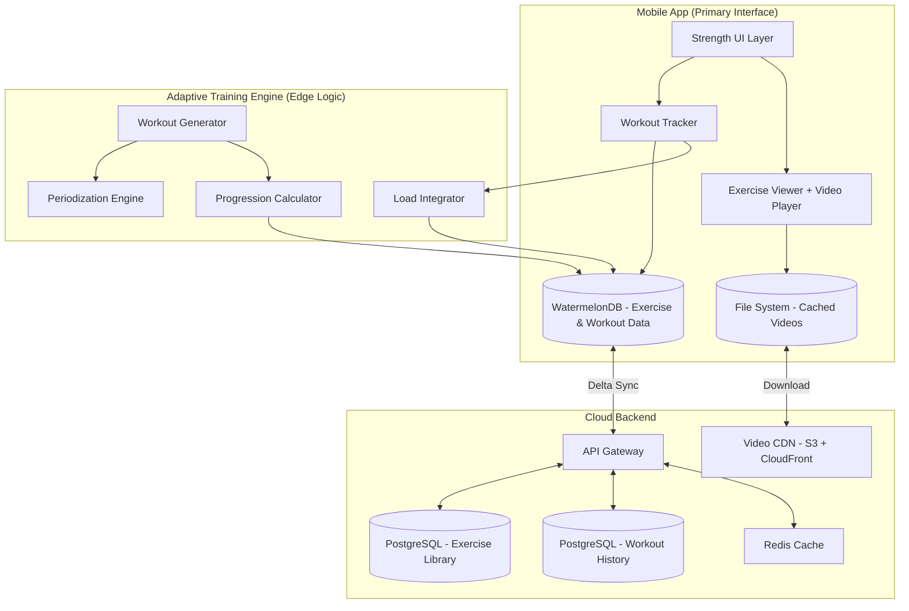

# RFC 0009: Strength & Plyometrics System

| Status        | Draft |
| :---          | :--- |
| **RFC #**     | 0009 |
| **Author(s)** | Sports Science Lead |
| **Created**   | 2025-11-26 |
| **Updated**   | 2025-11-27 |
| **Related PRD** | [08_STRENGTH_PLYOMETRICS.md](file:///Users/maksat/Projects/RunningCoach/RunningCoach/docs/prd/08_STRENGTH_PLYOMETRICS.md) |

## 1. Introduction

### 1.1. Context

This RFC defines the implementation details for the Strength & Plyometrics system as described in PRD `08_STRENGTH_PLYOMETRICS.md`. This system manages strength training, plyometric exercises, and their integration into the overall training plan.

Research shows that combining heavy resistance training (85-95% 1RM) with plyometric training produces 4-8% running economy improvements and up to 51% reduction in hamstring injuries (Nordic hamstring curls). This is a critical component of holistic marathon training that goes beyond just running.

The system must support:
- Phase-specific strength periodization (Base/Build/Peak/Taper)
- Evidence-based exercise library with form guidance
- Progressive overload tracking
- Integration with running load management (ACWR)
- Offline-first functionality for gym environments
- Video/animation content delivery

### 1.2. Problem Statement

Marathon training traditionally focuses exclusively on running, but research demonstrates that integrated strength and plyometric training significantly improves performance and reduces injury risk. We need a system that:

**Technical Challenges:**
1. **Complex Periodization:** Strength training protocols must adapt across training phases with different frequency, intensity, and volume targets
2. **Exercise Content Delivery:** Need to deliver video demonstrations, form cues, and progression guidance efficiently, especially offline
3. **Load Integration:** Strength sessions contribute to overall training stress and must be included in ACWR calculations to prevent overtraining
4. **Interference Minimization:** Strategic scheduling is required to prevent strength training from negatively impacting running performance
5. **Progressive Tracking:** Must track multiple progression metrics (weight, reps, sets, RPE) across dozens of exercises over months
6. **Equipment Flexibility:** System must adapt to varying equipment availability (full gym vs. home bodyweight)

### 1.3. Goals & Non-Goals

**Goals:**
- Implement phase-specific strength periodization aligned with running training
- Create comprehensive exercise library with 40+ running-specific exercises
- Deliver video demonstrations and form guidance with offline support
- Track progressive overload metrics (weight, volume load, estimated 1RM)
- Integrate strength load into overall ACWR calculations
- Support equipment-based workout customization
- Provide real-time workout guidance (rest timers, set completion tracking)
- Calculate interference effects and optimize scheduling

**Non-Goals:**
- Building custom 3D exercise animations (use licensed video content)
- Supporting non-running sports strength protocols
- Providing nutrition/supplementation recommendations (covered in RFC 0011)
- Creating social workout features (separate RFC)
- Offering personal trainer marketplace (future consideration)
- Supporting Olympic lifting or advanced powerlifting (focus on runner-specific strength)

### 1.4. Dependencies

**Related PRDs:**
- [00_OVERARCHING_VISION.md](file:///Users/maksat/Projects/RunningCoach/RunningCoach/docs/prd/00_OVERARCHING_VISION.md) - Holistic training philosophy
- [08_STRENGTH_PLYOMETRICS.md](file:///Users/maksat/Projects/RunningCoach/RunningCoach/docs/prd/08_STRENGTH_PLYOMETRICS.md) - Product requirements
- [06_ADAPTIVE_TRAINING_ENGINE.md](file:///Users/maksat/Projects/RunningCoach/RunningCoach/docs/prd/06_ADAPTIVE_TRAINING_ENGINE.md) - Training adaptation logic
- [07_LOAD_MANAGEMENT.md](file:///Users/maksat/Projects/RunningCoach/RunningCoach/docs/prd/07_LOAD_MANAGEMENT.md) - ACWR integration

**Related RFCs:**
- [RFC 0001: System Architecture](file:///Users/maksat/Projects/RunningCoach/RunningCoach/docs/rfc/0001-system-architecture.md) - Foundation
- [RFC 0005: Adaptive Training Engine](file:///Users/maksat/Projects/RunningCoach/RunningCoach/docs/rfc/0005-adaptive-training-engine.md) - Core logic
- [RFC 0006: Sync Infrastructure](file:///Users/maksat/Projects/RunningCoach/RunningCoach/docs/rfc/0006-sync-infrastructure.md) - Offline sync
- [RFC 0007: Load Management Service](file:///Users/maksat/Projects/RunningCoach/RunningCoach/docs/rfc/0007-load-management-service.md) - ACWR calculations

**External Dependencies:**
- Video hosting CDN (AWS S3 + CloudFront or Vimeo)
- Exercise video content library (licensed or custom-produced)
- Video player library (react-native-video)
- Local video caching mechanism

### 1.5. Success Metrics

**Technical Metrics:**
- Exercise library loads in < 500ms with offline availability
- Video playback starts in < 1s on WiFi, < 3s on cellular
- Workout tracking supports offline mode with zero data loss
- Sync latency < 2s for completed strength workouts
- Video caching reduces cellular data usage by 80% for repeat views

**Product Metrics:**
- 85% adherence rate to prescribed strength sessions
- 50% reduction in hamstring injury rates after Nordic curl integration
- 4-8% improvement in HR-pace relationship over 12-16 weeks
- 20-40% strength gains in compound lifts during 12-week base phase
- 90% of users complete strength sessions within 45-60 minutes

---

## 2. Proposed Solution

### 2.1. High-Level Design

The Strength & Plyometrics system consists of three main components:

1. **Exercise Library Service:** Manages the catalog of exercises with metadata, video content, and form guidance
2. **Workout Generator:** Creates phase-appropriate strength workouts based on training phase, equipment, and user progression
3. **Session Tracker:** Guides users through workouts with real-time tracking, rest timers, and load logging



**Key Architectural Decisions:**

1. **Offline-First Design:** Exercise library and workout structures cached locally for gym environments with poor connectivity
2. **Edge-Based Workout Generation:** Workouts generated locally by the Adaptive Training Engine for instant availability
3. **Progressive Video Caching:** Videos downloaded on WiFi and cached locally for offline viewing
4. **Load Integration:** Strength sessions feed into ACWR calculations via the Load Integrator
5. **Thin UI, Heavy Logic:** Mobile UI is display layer only; all workout logic runs in the shared Engine

### 2.2. Detailed Design

#### 2.2.1. Exercise Library

**Structure:**

The exercise library is a hierarchical catalog organized by muscle groups, movement patterns, and equipment requirements.

```typescript
enum ExerciseCategory {
  INJURY_PREVENTION = 'injury_prevention',
  RUNNING_ECONOMY = 'running_economy',
  PLYOMETRIC = 'plyometric',
  CORE_STABILITY = 'core_stability',
}

enum MuscleGroup {
  HAMSTRINGS = 'hamstrings',
  QUADRICEPS = 'quadriceps',
  GLUTES = 'glutes',
  CALVES = 'calves',
  HIPS = 'hips',
  CORE = 'core',
  UPPER_BODY = 'upper_body',
}

enum MovementPattern {
  SQUAT = 'squat',
  HINGE = 'hinge',
  LUNGE = 'lunge',
  PUSH = 'push',
  PULL = 'pull',
  CARRY = 'carry',
  ROTATION = 'rotation',
  JUMP = 'jump',
  HOP = 'hop',
}

enum Equipment {
  BODYWEIGHT = 'bodyweight',
  DUMBBELLS = 'dumbbells',
  BARBELL = 'barbell',
  KETTLEBELL = 'kettlebell',
  RESISTANCE_BAND = 'resistance_band',
  BOX = 'box',
  BENCH = 'bench',
  PULL_UP_BAR = 'pull_up_bar',
}

interface Exercise {
  id: string;
  name: string;
  category: ExerciseCategory;
  muscleGroups: MuscleGroup[];
  movementPattern: MovementPattern;
  equipmentRequired: Equipment[];
  equipmentAlternatives?: {
    equipment: Equipment;
    modificationNotes: string;
  }[];

  // Content
  description: string;
  formCues: string[];
  commonMistakes: string[];
  videoUrl: string;
  videoDuration: number; // seconds
  thumbnailUrl: string;

  // Programming
  difficultyLevel: 1 | 2 | 3 | 4 | 5;
  isUnilateral: boolean;
  requiresSpotter: boolean;

  // Progressions & Regressions
  regressionExerciseId?: string;
  progressionExerciseId?: string;

  // Evidence
  evidenceLevel?: 'high' | 'moderate' | 'low';
  researchNotes?: string;

  // Metadata
  createdAt: Date;
  updatedAt: Date;
}
```

**Core Exercise Database (40+ exercises):**

```typescript
const CORE_EXERCISES: Partial<Exercise>[] = [
  // Injury Prevention - Nordic Hamstring Curls (Highest Priority)
  {
    name: 'Nordic Hamstring Curl',
    category: ExerciseCategory.INJURY_PREVENTION,
    muscleGroups: [MuscleGroup.HAMSTRINGS],
    movementPattern: MovementPattern.HINGE,
    equipmentRequired: [Equipment.BENCH], // or partner
    evidenceLevel: 'high',
    researchNotes: '51% hamstring injury reduction (meta-analysis of 8,459 athletes)',
  },

  // Injury Prevention - Single-Leg Work
  {
    name: 'Single-Leg Squat (Pistol)',
    category: ExerciseCategory.INJURY_PREVENTION,
    muscleGroups: [MuscleGroup.QUADRICEPS, MuscleGroup.GLUTES, MuscleGroup.HIPS],
    movementPattern: MovementPattern.SQUAT,
    equipmentRequired: [Equipment.BODYWEIGHT],
    isUnilateral: true,
  },
  {
    name: 'Bulgarian Split Squat',
    category: ExerciseCategory.INJURY_PREVENTION,
    muscleGroups: [MuscleGroup.QUADRICEPS, MuscleGroup.GLUTES],
    movementPattern: MovementPattern.LUNGE,
    equipmentRequired: [Equipment.DUMBBELLS, Equipment.BENCH],
    isUnilateral: true,
  },
  {
    name: 'Single-Leg Romanian Deadlift',
    category: ExerciseCategory.INJURY_PREVENTION,
    muscleGroups: [MuscleGroup.HAMSTRINGS, MuscleGroup.GLUTES],
    movementPattern: MovementPattern.HINGE,
    equipmentRequired: [Equipment.DUMBBELLS],
    isUnilateral: true,
  },

  // Injury Prevention - Hip Strengthening
  {
    name: 'Clamshells',
    category: ExerciseCategory.INJURY_PREVENTION,
    muscleGroups: [MuscleGroup.HIPS, MuscleGroup.GLUTES],
    movementPattern: MovementPattern.ROTATION,
    equipmentRequired: [Equipment.RESISTANCE_BAND],
    researchNotes: '39% injury reduction in novice runners',
  },
  {
    name: 'Side-Lying Leg Raises',
    category: ExerciseCategory.INJURY_PREVENTION,
    muscleGroups: [MuscleGroup.HIPS, MuscleGroup.GLUTES],
    equipmentRequired: [Equipment.BODYWEIGHT],
  },
  {
    name: 'Hip Bridge (Double-Leg)',
    category: ExerciseCategory.INJURY_PREVENTION,
    muscleGroups: [MuscleGroup.GLUTES, MuscleGroup.HAMSTRINGS],
    movementPattern: MovementPattern.HINGE,
    equipmentRequired: [Equipment.BODYWEIGHT],
  },
  {
    name: 'Monster Walks',
    category: ExerciseCategory.INJURY_PREVENTION,
    muscleGroups: [MuscleGroup.HIPS, MuscleGroup.GLUTES],
    equipmentRequired: [Equipment.RESISTANCE_BAND],
  },

  // Running Economy - Heavy Compound Lifts
  {
    name: 'Back Squat',
    category: ExerciseCategory.RUNNING_ECONOMY,
    muscleGroups: [MuscleGroup.QUADRICEPS, MuscleGroup.GLUTES, MuscleGroup.HAMSTRINGS],
    movementPattern: MovementPattern.SQUAT,
    equipmentRequired: [Equipment.BARBELL],
    requiresSpotter: true,
    evidenceLevel: 'high',
    researchNotes: '85-95% 1RM produces strongest economy benefits (effect size -0.31)',
  },
  {
    name: 'Deadlift',
    category: ExerciseCategory.RUNNING_ECONOMY,
    muscleGroups: [MuscleGroup.HAMSTRINGS, MuscleGroup.GLUTES, MuscleGroup.CORE],
    movementPattern: MovementPattern.HINGE,
    equipmentRequired: [Equipment.BARBELL],
    evidenceLevel: 'high',
  },
  {
    name: 'Leg Press',
    category: ExerciseCategory.RUNNING_ECONOMY,
    muscleGroups: [MuscleGroup.QUADRICEPS, MuscleGroup.GLUTES],
    movementPattern: MovementPattern.SQUAT,
    equipmentRequired: [Equipment.BARBELL], // Machine
  },
  {
    name: 'Romanian Deadlift',
    category: ExerciseCategory.RUNNING_ECONOMY,
    muscleGroups: [MuscleGroup.HAMSTRINGS, MuscleGroup.GLUTES],
    movementPattern: MovementPattern.HINGE,
    equipmentRequired: [Equipment.BARBELL],
  },

  // Plyometrics
  {
    name: 'Drop Jumps',
    category: ExerciseCategory.PLYOMETRIC,
    muscleGroups: [MuscleGroup.QUADRICEPS, MuscleGroup.CALVES],
    movementPattern: MovementPattern.JUMP,
    equipmentRequired: [Equipment.BOX],
    evidenceLevel: 'high',
  },
  {
    name: 'Countermovement Jumps',
    category: ExerciseCategory.PLYOMETRIC,
    muscleGroups: [MuscleGroup.QUADRICEPS, MuscleGroup.CALVES],
    movementPattern: MovementPattern.JUMP,
    equipmentRequired: [Equipment.BODYWEIGHT],
  },
  {
    name: 'Bounding',
    category: ExerciseCategory.PLYOMETRIC,
    muscleGroups: [MuscleGroup.QUADRICEPS, MuscleGroup.CALVES, MuscleGroup.HIPS],
    movementPattern: MovementPattern.HOP,
    equipmentRequired: [Equipment.BODYWEIGHT],
  },
  {
    name: 'Single-Leg Hops',
    category: ExerciseCategory.PLYOMETRIC,
    muscleGroups: [MuscleGroup.CALVES, MuscleGroup.QUADRICEPS],
    movementPattern: MovementPattern.HOP,
    equipmentRequired: [Equipment.BODYWEIGHT],
    isUnilateral: true,
  },
  {
    name: 'Box Jumps',
    category: ExerciseCategory.PLYOMETRIC,
    muscleGroups: [MuscleGroup.QUADRICEPS, MuscleGroup.GLUTES, MuscleGroup.CALVES],
    movementPattern: MovementPattern.JUMP,
    equipmentRequired: [Equipment.BOX],
  },

  // Plyometric Hopping Protocol (Research-Backed)
  {
    name: 'Hopping Protocol (6-Week)',
    category: ExerciseCategory.PLYOMETRIC,
    muscleGroups: [MuscleGroup.CALVES],
    movementPattern: MovementPattern.HOP,
    equipmentRequired: [Equipment.BODYWEIGHT],
    evidenceLevel: 'high',
    researchNotes: '5 minutes daily improves economy by 4-7%, increases Achilles stiffness by 16%',
  },

  // Calf Strengthening
  {
    name: 'Standing Calf Raise',
    category: ExerciseCategory.INJURY_PREVENTION,
    muscleGroups: [MuscleGroup.CALVES],
    equipmentRequired: [Equipment.BODYWEIGHT],
  },
  {
    name: 'Single-Leg Calf Raise',
    category: ExerciseCategory.INJURY_PREVENTION,
    muscleGroups: [MuscleGroup.CALVES],
    equipmentRequired: [Equipment.BODYWEIGHT],
    isUnilateral: true,
  },
  {
    name: 'Eccentric Calf Raise',
    category: ExerciseCategory.INJURY_PREVENTION,
    muscleGroups: [MuscleGroup.CALVES],
    equipmentRequired: [Equipment.BODYWEIGHT],
    researchNotes: 'Achilles tendinopathy prevention',
  },

  // Core & Stability
  {
    name: 'Front Plank',
    category: ExerciseCategory.CORE_STABILITY,
    muscleGroups: [MuscleGroup.CORE],
    equipmentRequired: [Equipment.BODYWEIGHT],
  },
  {
    name: 'Side Plank',
    category: ExerciseCategory.CORE_STABILITY,
    muscleGroups: [MuscleGroup.CORE],
    equipmentRequired: [Equipment.BODYWEIGHT],
    isUnilateral: true,
  },
  {
    name: 'Pallof Press',
    category: ExerciseCategory.CORE_STABILITY,
    muscleGroups: [MuscleGroup.CORE],
    movementPattern: MovementPattern.ROTATION,
    equipmentRequired: [Equipment.RESISTANCE_BAND],
  },
  {
    name: 'Dead Bug',
    category: ExerciseCategory.CORE_STABILITY,
    muscleGroups: [MuscleGroup.CORE],
    equipmentRequired: [Equipment.BODYWEIGHT],
  },
  {
    name: 'Bird Dog',
    category: ExerciseCategory.CORE_STABILITY,
    muscleGroups: [MuscleGroup.CORE],
    equipmentRequired: [Equipment.BODYWEIGHT],
  },

  // Isometric Training
  {
    name: 'Isometric Squat',
    category: ExerciseCategory.RUNNING_ECONOMY,
    muscleGroups: [MuscleGroup.QUADRICEPS, MuscleGroup.GLUTES],
    movementPattern: MovementPattern.SQUAT,
    equipmentRequired: [Equipment.BODYWEIGHT],
    researchNotes: '4-7% economy improvement through increased tendon stiffness',
  },
];
```

#### 2.2.2. Workout Structure

```typescript
enum StrengthPhase {
  BASE = 'base',        // 8-12 weeks
  BUILD = 'build',      // 6-8 weeks
  PEAK = 'peak',        // 6-8 weeks
  TAPER = 'taper',      // 2-3 weeks
  RECOVERY = 'recovery', // Off-season
}

interface WorkoutSet {
  setNumber: number;
  targetReps: number | [number, number]; // Single number or range
  targetWeight?: number; // kg
  targetIntensity?: number; // % 1RM
  targetDuration?: number; // seconds (for isometric/planks)
  restDuration: number; // seconds

  // Completed data
  actualReps?: number;
  actualWeight?: number;
  actualDuration?: number;
  rpe?: number; // 1-10
  completedAt?: Date;
}

interface ExerciseBlock {
  exerciseId: string;
  exercise?: Exercise; // Populated from library
  sets: WorkoutSet[];
  notes?: string;

  // Superset support
  isSuperset?: boolean;
  supersetWithExerciseId?: string;
}

interface StrengthWorkout {
  id: string;
  userId: string;
  planId?: string;

  // Scheduling
  scheduledDate: Date;
  phase: StrengthPhase;
  sessionNumber: number; // E.g., "Session 1 of 2 this week"

  // Structure
  exercises: ExerciseBlock[];
  estimatedDuration: number; // minutes

  // Focus
  focusAreas: MuscleGroup[];
  workoutType: 'full_body' | 'lower_emphasis' | 'injury_prevention' | 'plyometric';

  // Completion
  status: 'scheduled' | 'in_progress' | 'completed' | 'skipped';
  startedAt?: Date;
  completedAt?: Date;
  actualDuration?: number;
  overallRPE?: number; // Session RPE
  notes?: string;

  // Load tracking
  totalVolumeLoad?: number; // Sum of (sets × reps × weight)
  calculatedLoad?: number; // RPE × Duration for ACWR

  // Metadata
  createdAt: Date;
  updatedAt: Date;
}
```

#### 2.2.3. Periodization Logic

**Phase-Specific Parameters:**

```typescript
interface PeriodizationParameters {
  phase: StrengthPhase;
  frequencyPerWeek: [number, number]; // Min-max sessions
  intensityRange: [number, number]; // % 1RM
  setsPerExercise: [number, number];
  repsPerSet: [number, number];
  restBetweenSets: number; // seconds
  includePlyometrics: boolean;
  focus: string;
}

const PERIODIZATION_PROTOCOL: Record<StrengthPhase, PeriodizationParameters> = {
  [StrengthPhase.BASE]: {
    phase: StrengthPhase.BASE,
    frequencyPerWeek: [2, 3],
    intensityRange: [60, 75],
    setsPerExercise: [3, 4],
    repsPerSet: [8, 12],
    restBetweenSets: 90,
    includePlyometrics: false,
    focus: 'Anatomical adaptation, movement pattern establishment, high volume',
  },
  [StrengthPhase.BUILD]: {
    phase: StrengthPhase.BUILD,
    frequencyPerWeek: [2, 2],
    intensityRange: [80, 90],
    setsPerExercise: [3, 5],
    repsPerSet: [4, 6],
    restBetweenSets: 180,
    includePlyometrics: true,
    focus: 'Maximal strength development, introduce power work',
  },
  [StrengthPhase.PEAK]: {
    phase: StrengthPhase.PEAK,
    frequencyPerWeek: [1, 2],
    intensityRange: [70, 85],
    setsPerExercise: [2, 3],
    repsPerSet: [4, 6],
    restBetweenSets: 120,
    includePlyometrics: true,
    focus: 'Maintain strength, develop power, running takes priority',
  },
  [StrengthPhase.TAPER]: {
    phase: StrengthPhase.TAPER,
    frequencyPerWeek: [0, 1],
    intensityRange: [70, 80],
    setsPerExercise: [2, 2],
    repsPerSet: [3, 5],
    restBetweenSets: 120,
    includePlyometrics: false,
    focus: 'Neural activation without fatigue, ZERO final week',
  },
  [StrengthPhase.RECOVERY]: {
    phase: StrengthPhase.RECOVERY,
    frequencyPerWeek: [1, 2],
    intensityRange: [50, 70],
    setsPerExercise: [2, 3],
    repsPerSet: [10, 15],
    restBetweenSets: 60,
    includePlyometrics: false,
    focus: 'Active recovery, maintain base fitness',
  },
};
```

**Workout Generation Algorithm:**

```typescript
class WorkoutGenerator {
  generateWeeklyStrengthPlan(
    phase: StrengthPhase,
    weekNumber: number,
    userEquipment: Equipment[],
    currentCapabilities: UserStrengthProfile
  ): StrengthWorkout[] {
    const params = PERIODIZATION_PROTOCOL[phase];
    const frequency = this.determineFrequency(params, weekNumber);
    const workouts: StrengthWorkout[] = [];

    for (let i = 0; i < frequency; i++) {
      const workout = this.generateSingleWorkout(
        phase,
        i + 1,
        frequency,
        userEquipment,
        currentCapabilities
      );
      workouts.push(workout);
    }

    return workouts;
  }

  private generateSingleWorkout(
    phase: StrengthPhase,
    sessionNumber: number,
    totalSessions: number,
    userEquipment: Equipment[],
    capabilities: UserStrengthProfile
  ): StrengthWorkout {
    const params = PERIODIZATION_PROTOCOL[phase];
    const exercises: ExerciseBlock[] = [];

    // Always include Nordic Hamstring Curls (injury prevention priority)
    exercises.push(this.createNordicCurlBlock(phase, capabilities));

    // Add phase-appropriate compound lifts
    if (phase === StrengthPhase.BASE || phase === StrengthPhase.BUILD) {
      exercises.push(
        this.createExerciseBlock('back_squat', params, capabilities),
        this.createExerciseBlock('deadlift', params, capabilities)
      );
    }

    // Add single-leg work (always important for runners)
    exercises.push(
      this.createExerciseBlock('bulgarian_split_squat', params, capabilities)
    );

    // Add hip strengthening
    exercises.push(
      this.createExerciseBlock('clamshells', params, capabilities),
      this.createExerciseBlock('hip_bridge', params, capabilities)
    );

    // Add plyometrics if appropriate
    if (params.includePlyometrics) {
      exercises.push(this.createPlyometricBlock(phase, capabilities));
    }

    // Add core work
    exercises.push(
      this.createExerciseBlock('front_plank', params, capabilities),
      this.createExerciseBlock('side_plank', params, capabilities)
    );

    const estimatedDuration = this.calculateWorkoutDuration(exercises);

    return {
      id: uuidv4(),
      userId: capabilities.userId,
      phase,
      sessionNumber,
      exercises,
      estimatedDuration,
      focusAreas: this.extractFocusAreas(exercises),
      workoutType: sessionNumber === 1 ? 'full_body' : 'lower_emphasis',
      status: 'scheduled',
      scheduledDate: new Date(),
      createdAt: new Date(),
      updatedAt: new Date(),
    };
  }

  private createExerciseBlock(
    exerciseId: string,
    params: PeriodizationParameters,
    capabilities: UserStrengthProfile
  ): ExerciseBlock {
    const exercise = EXERCISE_LIBRARY.find(e => e.id === exerciseId);
    const userMax = capabilities.estimatedMaxes[exerciseId];

    const numSets = this.randomInRange(params.setsPerExercise);
    const targetReps = this.randomInRange(params.repsPerSet);
    const intensityPercent = this.randomInRange(params.intensityRange);
    const targetWeight = userMax ? Math.round(userMax * (intensityPercent / 100) / 2.5) * 2.5 : undefined;

    const sets: WorkoutSet[] = [];
    for (let i = 0; i < numSets; i++) {
      sets.push({
        setNumber: i + 1,
        targetReps,
        targetWeight,
        targetIntensity: intensityPercent,
        restDuration: params.restBetweenSets,
      });
    }

    return {
      exerciseId,
      exercise,
      sets,
    };
  }

  private createNordicCurlBlock(
    phase: StrengthPhase,
    capabilities: UserStrengthProfile
  ): ExerciseBlock {
    const weekNumber = capabilities.currentWeek;

    // Progressive overload protocol from research
    let sets = 1;
    let reps = 5;

    if (weekNumber <= 5) {
      sets = 1;
      reps = 5;
    } else if (weekNumber <= 10) {
      sets = this.randomInRange([2, 3]);
      reps = this.randomInRange([6, 10]);
    } else {
      // Maintenance phase
      sets = 1;
      reps = this.randomInRange([5, 6]);
    }

    const setArray: WorkoutSet[] = [];
    for (let i = 0; i < sets; i++) {
      setArray.push({
        setNumber: i + 1,
        targetReps: reps,
        restDuration: 120,
      });
    }

    return {
      exerciseId: 'nordic_hamstring_curl',
      sets: setArray,
      notes: '51% hamstring injury reduction - critical exercise',
    };
  }

  private randomInRange(range: [number, number]): number {
    return Math.floor(Math.random() * (range[1] - range[0] + 1)) + range[0];
  }
}
```

#### 2.2.4. Progression Tracking

```typescript
interface UserStrengthProfile {
  userId: string;
  currentWeek: number;
  currentPhase: StrengthPhase;

  // Equipment availability
  availableEquipment: Equipment[];

  // Estimated 1RM for key lifts
  estimatedMaxes: Record<string, number>; // exerciseId -> weight in kg

  // Historical progression
  progressionHistory: ProgressionEntry[];

  // Last workout performance
  lastWorkoutDate?: Date;
  consecutiveStrengthWeeks: number;
}

interface ProgressionEntry {
  date: Date;
  exerciseId: string;
  estimated1RM: number;
  totalVolumeLoad: number; // sets × reps × weight
}

class ProgressionCalculator {
  calculateEstimated1RM(reps: number, weight: number): number {
    // Epley formula: 1RM = weight × (1 + reps/30)
    return weight * (1 + reps / 30);
  }

  updateUserProfile(
    profile: UserStrengthProfile,
    completedWorkout: StrengthWorkout
  ): UserStrengthProfile {
    const newMaxes = { ...profile.estimatedMaxes };
    const newHistory = [...profile.progressionHistory];

    for (const block of completedWorkout.exercises) {
      const completedSets = block.sets.filter(s => s.actualReps && s.actualWeight);

      if (completedSets.length === 0) continue;

      // Calculate estimated 1RM from best set
      const bestSet = this.findBestSet(completedSets);
      const estimated1RM = this.calculateEstimated1RM(
        bestSet.actualReps!,
        bestSet.actualWeight!
      );

      // Update if higher than current estimate
      if (!newMaxes[block.exerciseId] || estimated1RM > newMaxes[block.exerciseId]) {
        newMaxes[block.exerciseId] = estimated1RM;
      }

      // Calculate total volume load
      const totalVolumeLoad = completedSets.reduce(
        (sum, set) => sum + (set.actualReps! * set.actualWeight!),
        0
      );

      newHistory.push({
        date: completedWorkout.completedAt!,
        exerciseId: block.exerciseId,
        estimated1RM,
        totalVolumeLoad,
      });
    }

    return {
      ...profile,
      estimatedMaxes: newMaxes,
      progressionHistory: newHistory,
      lastWorkoutDate: completedWorkout.completedAt,
      consecutiveStrengthWeeks: profile.consecutiveStrengthWeeks + 1,
    };
  }

  private findBestSet(sets: WorkoutSet[]): WorkoutSet {
    return sets.reduce((best, current) => {
      const bestScore = (best.actualReps || 0) * (best.actualWeight || 0);
      const currentScore = (current.actualReps || 0) * (current.actualWeight || 0);
      return currentScore > bestScore ? current : best;
    });
  }

  shouldDeload(profile: UserStrengthProfile): boolean {
    // Deload every 4 weeks
    return profile.consecutiveStrengthWeeks % 4 === 0;
  }
}
```

#### 2.2.5. Load Integration with ACWR

```typescript
class LoadIntegrator {
  calculateStrengthLoad(workout: StrengthWorkout): number {
    // Use Session RPE × Duration (consistent with running load)
    if (!workout.overallRPE || !workout.actualDuration) {
      return 0;
    }

    return workout.overallRPE * workout.actualDuration;
  }

  calculateVolumeLoad(workout: StrengthWorkout): number {
    // Alternative metric: Total Volume Load (sets × reps × weight)
    let total = 0;

    for (const block of workout.exercises) {
      for (const set of block.sets) {
        if (set.actualReps && set.actualWeight) {
          total += set.actualReps * set.actualWeight;
        }
      }
    }

    return total;
  }

  contributeToACWR(workout: StrengthWorkout): LoadContribution {
    const sessionLoad = this.calculateStrengthLoad(workout);
    const volumeLoad = this.calculateVolumeLoad(workout);

    return {
      activityType: 'strength',
      date: workout.completedAt!,
      internalLoad: sessionLoad, // Used for ACWR calculation
      volumeLoad, // Tracked separately for strength-specific analytics
      duration: workout.actualDuration!,
      rpe: workout.overallRPE!,
    };
  }
}
```

#### 2.2.6. Interference Management

```typescript
interface InterferenceConstraints {
  minHoursBetweenStrengthAndQuality: number; // 6 hours minimum
  noHeavySquatsBeforeLongRun: boolean;
  minHoursBetweenStrengthSessions: number; // 48 hours for heavy lower body
  priorityDuringPeak: 'running' | 'strength'; // Running takes priority
}

class SchedulingOptimizer {
  optimizeWeeklySchedule(
    runningWorkouts: RunningWorkout[],
    strengthWorkouts: StrengthWorkout[],
    constraints: InterferenceConstraints
  ): WeeklySchedule {
    const schedule: WeeklySchedule = {
      monday: [],
      tuesday: [],
      wednesday: [],
      thursday: [],
      friday: [],
      saturday: [],
      sunday: [],
    };

    // Strategy: Place strength after easy runs or on separate days
    // Avoid: Heavy squats/deadlifts day before long runs or hard workouts

    for (const strengthWorkout of strengthWorkouts) {
      const bestDay = this.findBestDayForStrength(
        strengthWorkout,
        runningWorkouts,
        schedule,
        constraints
      );

      schedule[bestDay].push(strengthWorkout);
    }

    return schedule;
  }

  private findBestDayForStrength(
    strengthWorkout: StrengthWorkout,
    runningWorkouts: RunningWorkout[],
    currentSchedule: WeeklySchedule,
    constraints: InterferenceConstraints
  ): DayOfWeek {
    const scores: Record<DayOfWeek, number> = {
      monday: 0,
      tuesday: 0,
      wednesday: 0,
      thursday: 0,
      friday: 0,
      saturday: 0,
      sunday: 0,
    };

    // Score each day based on running workouts
    for (const day of Object.keys(scores) as DayOfWeek[]) {
      const runWorkout = runningWorkouts.find(w => this.getDay(w.date) === day);
      const nextDayRunWorkout = runningWorkouts.find(w =>
        this.getDay(w.date) === this.nextDay(day)
      );

      // Prefer days with easy runs or rest
      if (!runWorkout) {
        scores[day] += 10; // Rest day is ideal
      } else if (runWorkout.type === 'easy') {
        scores[day] += 8; // Easy run day is good
      } else if (runWorkout.type === 'recovery') {
        scores[day] += 5;
      }

      // Penalize if next day is long run or quality workout
      if (nextDayRunWorkout) {
        if (nextDayRunWorkout.type === 'long') {
          scores[day] -= 10; // Avoid day before long run
        } else if (nextDayRunWorkout.type === 'intervals' || nextDayRunWorkout.type === 'threshold') {
          scores[day] -= 5;
        }
      }
    }

    // Return day with highest score
    return (Object.keys(scores) as DayOfWeek[]).reduce((best, current) =>
      scores[current] > scores[best] ? current : best
    );
  }
}
```

#### 2.2.7. Video Content Management

```typescript
interface VideoContent {
  exerciseId: string;
  videoUrl: string; // CDN URL
  thumbnailUrl: string;
  duration: number; // seconds
  fileSize: number; // bytes
  resolution: '720p' | '1080p';
  format: 'mp4' | 'webm';

  // Caching
  isCached: boolean;
  localPath?: string;
  downloadedAt?: Date;
  cacheExpiry?: Date;
}

class VideoContentManager {
  async cacheEssentialVideos(
    exercises: Exercise[],
    connectionType: 'wifi' | 'cellular' | 'none'
  ): Promise<void> {
    if (connectionType !== 'wifi') {
      // Only cache on WiFi to save cellular data
      return;
    }

    // Prioritize high-evidence exercises
    const priority = exercises
      .filter(e => e.evidenceLevel === 'high')
      .sort((a, b) => this.priorityScore(b) - this.priorityScore(a));

    for (const exercise of priority) {
      await this.downloadAndCache(exercise.videoUrl, exercise.id);
    }
  }

  async getVideo(exerciseId: string): Promise<VideoContent> {
    const cached = await this.getCachedVideo(exerciseId);

    if (cached) {
      return cached;
    }

    // Fallback to streaming from CDN
    const video = await this.fetchFromCDN(exerciseId);

    // Opportunistically cache for next time
    this.downloadAndCache(video.videoUrl, exerciseId);

    return video;
  }

  private priorityScore(exercise: Exercise): number {
    let score = 0;

    if (exercise.name === 'Nordic Hamstring Curl') {
      score += 100; // Highest priority
    }

    if (exercise.category === ExerciseCategory.INJURY_PREVENTION) {
      score += 50;
    }

    if (exercise.evidenceLevel === 'high') {
      score += 30;
    }

    return score;
  }

  private async downloadAndCache(url: string, exerciseId: string): Promise<void> {
    // Implementation: Download video to device storage
    // Use react-native-fs or Expo FileSystem
  }

  private async getCachedVideo(exerciseId: string): Promise<VideoContent | null> {
    // Check local storage for cached video
    return null;
  }

  private async fetchFromCDN(exerciseId: string): Promise<VideoContent> {
    // Fetch video metadata from CDN
    return {} as VideoContent;
  }
}
```

### 2.3. Data Model Changes

**Prisma Schema Additions:**

```prisma
model Exercise {
  id                    String              @id @default(uuid())
  name                  String
  category              ExerciseCategory
  muscleGroups          MuscleGroup[]
  movementPattern       MovementPattern
  equipmentRequired     Equipment[]
  equipmentAlternatives Json? // Array of {equipment, modificationNotes}

  description           String
  formCues              String[] // Array of form tips
  commonMistakes        String[] // Array of common errors

  videoUrl              String
  videoDuration         Int // seconds
  thumbnailUrl          String

  difficultyLevel       Int // 1-5
  isUnilateral          Boolean             @default(false)
  requiresSpotter       Boolean             @default(false)

  regressionExerciseId  String?
  progressionExerciseId String?

  evidenceLevel         EvidenceLevel?
  researchNotes         String?

  createdAt             DateTime            @default(now())
  updatedAt             DateTime            @updatedAt

  // Relations
  workoutBlocks         ExerciseBlock[]

  @@index([category])
  @@index([muscleGroups])
}

model StrengthWorkout {
  id                String              @id @default(uuid())
  userId            String
  planId            String?

  scheduledDate     DateTime
  phase             StrengthPhase
  sessionNumber     Int

  focusAreas        MuscleGroup[]
  workoutType       WorkoutType
  estimatedDuration Int // minutes

  status            WorkoutStatus       @default(SCHEDULED)
  startedAt         DateTime?
  completedAt       DateTime?
  actualDuration    Int?
  overallRPE        Int? // 1-10
  notes             String?

  totalVolumeLoad   Float? // Sum of (sets × reps × weight)
  calculatedLoad    Float? // RPE × Duration for ACWR

  createdAt         DateTime            @default(now())
  updatedAt         DateTime            @updatedAt

  // Relations
  user              User                @relation(fields: [userId], references: [id])
  exercises         ExerciseBlock[]

  @@index([userId, scheduledDate])
  @@index([userId, status])
}

model ExerciseBlock {
  id                    String              @id @default(uuid())
  workoutId             String
  exerciseId            String

  sets                  WorkoutSet[] // JSON array
  notes                 String?

  isSuperset            Boolean             @default(false)
  supersetWithExerciseId String?

  // Relations
  workout               StrengthWorkout     @relation(fields: [workoutId], references: [id], onDelete: Cascade)
  exercise              Exercise            @relation(fields: [exerciseId], references: [id])
}

model WorkoutSet {
  id              String         @id @default(uuid())
  blockId         String

  setNumber       Int
  targetReps      Int?
  targetRepsRange Json? // [min, max]
  targetWeight    Float? // kg
  targetIntensity Int? // % 1RM
  targetDuration  Int? // seconds for isometric/planks
  restDuration    Int // seconds

  // Completed data
  actualReps      Int?
  actualWeight    Float?
  actualDuration  Int?
  rpe             Int? // 1-10
  completedAt     DateTime?

  // Relations
  block           ExerciseBlock  @relation(fields: [blockId], references: [id], onDelete: Cascade)
}

model UserStrengthProfile {
  id                      String              @id @default(uuid())
  userId                  String              @unique

  currentWeek             Int                 @default(1)
  currentPhase            StrengthPhase       @default(BASE)
  availableEquipment      Equipment[]

  estimatedMaxes          Json // exerciseId -> weight mapping
  progressionHistory      ProgressionEntry[] // JSON array

  lastWorkoutDate         DateTime?
  consecutiveStrengthWeeks Int                @default(0)

  createdAt               DateTime            @default(now())
  updatedAt               DateTime            @updatedAt

  // Relations
  user                    User                @relation(fields: [userId], references: [id])

  @@index([userId])
}

enum ExerciseCategory {
  INJURY_PREVENTION
  RUNNING_ECONOMY
  PLYOMETRIC
  CORE_STABILITY
}

enum MuscleGroup {
  HAMSTRINGS
  QUADRICEPS
  GLUTES
  CALVES
  HIPS
  CORE
  UPPER_BODY
}

enum MovementPattern {
  SQUAT
  HINGE
  LUNGE
  PUSH
  PULL
  CARRY
  ROTATION
  JUMP
  HOP
}

enum Equipment {
  BODYWEIGHT
  DUMBBELLS
  BARBELL
  KETTLEBELL
  RESISTANCE_BAND
  BOX
  BENCH
  PULL_UP_BAR
}

enum StrengthPhase {
  BASE
  BUILD
  PEAK
  TAPER
  RECOVERY
}

enum WorkoutType {
  FULL_BODY
  LOWER_EMPHASIS
  INJURY_PREVENTION
  PLYOMETRIC
}

enum WorkoutStatus {
  SCHEDULED
  IN_PROGRESS
  COMPLETED
  SKIPPED
}

enum EvidenceLevel {
  HIGH
  MODERATE
  LOW
}
```

### 2.4. API Changes

**New tRPC Endpoints:**

```typescript
// Exercise Library
strength.listExercises(filters?: ExerciseFilters)
strength.getExercise(exerciseId: string)
strength.searchExercises(query: string, filters?: ExerciseFilters)

// Workout Management
strength.getUpcomingWorkouts(days: number)
strength.getWorkoutById(workoutId: string)
strength.startWorkout(workoutId: string)
strength.updateSet(setId: string, data: SetUpdate)
strength.completeWorkout(workoutId: string, data: CompletionData)
strength.skipWorkout(workoutId: string, reason: string)

// Progression
strength.getUserProfile()
strength.updateUserProfile(data: ProfileUpdate)
strength.getProgressionHistory(exerciseId?: string)
strength.getEstimated1RM(exerciseId: string)

// Video Content
strength.getVideoUrl(exerciseId: string)
strength.getCachedVideos()
strength.requestVideoCaching(exerciseIds: string[])

// Integration
strength.contributeToACWR(workoutId: string): LoadContribution
```

**Request/Response Types:**

```typescript
interface ExerciseFilters {
  category?: ExerciseCategory;
  muscleGroups?: MuscleGroup[];
  equipment?: Equipment[];
  difficultyLevel?: number[];
  evidenceLevel?: EvidenceLevel[];
}

interface SetUpdate {
  actualReps?: number;
  actualWeight?: number;
  actualDuration?: number;
  rpe?: number;
}

interface CompletionData {
  overallRPE: number;
  actualDuration: number;
  notes?: string;
}

interface ProfileUpdate {
  availableEquipment?: Equipment[];
  estimatedMaxes?: Record<string, number>;
}

interface LoadContribution {
  activityType: 'strength';
  date: Date;
  internalLoad: number;
  volumeLoad: number;
  duration: number;
  rpe: number;
}
```

### 2.5. Offline-First Considerations

**Local Storage:**
- Complete exercise library cached in WatermelonDB (~2 MB with metadata)
- Next 7 days of scheduled workouts cached locally
- User strength profile and progression history stored locally
- High-priority exercise videos cached on device storage (~100-200 MB)

**Queued Operations:**
- Set completions queued immediately to local DB
- Workout completions queued with full data
- Progression updates calculated locally
- All changes synced when connectivity restored

**Conflict Resolution:**
- Set completion data: Union merge (combine all completed sets)
- Workout overall data: Last Write Wins (most recent completion data)
- Progression history: Union merge (append new entries)
- Estimated 1RM: Take maximum value (prefer higher estimate)

**Fallback Behavior:**
- If exercise video unavailable: Show thumbnail, form cues, and text description
- If workout generation fails: Use cached template workout
- If progression data unavailable: Use conservative intensity estimates (70% 1RM)

### 2.6. Synchronization Strategy

**Sync Triggers:**
- Workout completion (immediate sync attempt)
- App launch (background sync)
- Exercise library updated on server (push notification + sync)
- User modifies equipment availability (immediate sync)

**Data Priority:**
1. **Critical (sync immediately):** Completed workouts, progression updates
2. **High (sync within 5 minutes):** Exercise library updates, profile changes
3. **Normal (sync opportunistically):** Video cache updates, analytics

**Sync Protocol:**
- Delta sync for workout history (only new/changed workouts)
- Full sync for exercise library on version mismatch
- Incremental video caching on WiFi
- Conflict resolution using last-write-wins for most fields

**Phone ↔ Watch Sync:**
- Pre-workout: Send next strength workout structure (JSON, ~5-10 KB)
- Post-workout: Receive completed set data (JSON, ~2-5 KB)
- Watch does NOT store exercise library (too large), only current workout context

---

## 3. Implementation Plan

### 3.1. Phasing

**Phase 1: Foundation & Exercise Library (Weeks 1-2)**

*Deliverables:*
- Prisma schema implementation for Exercise, StrengthWorkout, ExerciseBlock models
- Exercise library seeding with 40+ core exercises
- Basic tRPC endpoints for exercise retrieval
- WatermelonDB collections for local exercise storage
- Exercise list UI with filtering

*Success Criteria:*
- Exercise library accessible via API and mobile app
- Exercises filterable by category, muscle group, equipment
- Exercise detail view displays metadata and form cues
- Offline access to exercise library

**Phase 2: Video Content System (Weeks 3-4)**

*Deliverables:*
- Video CDN setup (S3 + CloudFront)
- Video upload and processing pipeline
- Video player component in mobile app (react-native-video)
- Local video caching mechanism
- WiFi-based automatic caching for high-priority exercises

*Success Criteria:*
- Exercise videos stream from CDN
- Videos playable offline after caching
- Caching reduces cellular data usage by 80%
- Video playback starts in < 1s on WiFi

**Phase 3: Workout Generation & Periodization (Weeks 5-6)**

*Deliverables:*
- WorkoutGenerator class in @runningcoach/engine
- Periodization logic for Base/Build/Peak/Taper phases
- Phase-specific exercise selection algorithms
- Weekly strength plan generation
- Workout preview UI

*Success Criteria:*
- System generates phase-appropriate workouts
- Workouts match research-backed protocols
- Nordic hamstring curls included in all phases
- Workout generation runs offline

**Phase 4: Workout Tracking UI (Weeks 7-8)**

*Deliverables:*
- Workout session screen with exercise list
- Set tracking with weight/reps input
- Rest timer between sets
- Real-time RPE collection
- Workout completion flow

*Success Criteria:*
- User can log complete workout with all sets
- Rest timer provides audio/visual cues
- Session RPE captured post-workout
- Workout completion works fully offline

**Phase 5: Progression Tracking (Weeks 9-10)**

*Deliverables:*
- ProgressionCalculator implementation
- Estimated 1RM calculations
- Volume load tracking
- Progression visualization charts
- Historical performance comparison

*Success Criteria:*
- System tracks estimated 1RM for all exercises
- Volume load trends displayed in analytics
- Progressive overload recommendations provided
- Deload weeks triggered automatically

**Phase 6: Load Integration & Scheduling (Weeks 11-12)**

*Deliverables:*
- LoadIntegrator connects strength to ACWR system
- SchedulingOptimizer for interference management
- Strength load contribution to daily load
- Weekly schedule optimization
- Traffic light system integration

*Success Criteria:*
- Strength workouts contribute to ACWR
- System recommends optimal strength workout days
- Heavy sessions avoided before long runs
- Red light skips strength sessions appropriately

**Phase 7: Polish & Advanced Features (Weeks 13-14)**

*Deliverables:*
- Equipment customization flow
- Workout templates for different scenarios
- Superset support
- Form check reminders
- Analytics dashboard

*Success Criteria:*
- Users can customize equipment availability
- Workouts adapt to available equipment
- Superset circuits function correctly
- Analytics show strength-running correlation

**Phase 8: Testing & Launch Prep (Weeks 15-16)**

*Deliverables:*
- Comprehensive unit tests (80% coverage)
- Integration tests for workout flow
- Offline/online transition tests
- Performance optimization
- Beta user testing

*Success Criteria:*
- All critical user flows tested
- Zero data loss in offline scenarios
- Performance benchmarks met
- Beta feedback incorporated

### 3.2. Testing Strategy

**Unit Tests:**
- WorkoutGenerator: Test workout generation for all phases, equipment scenarios
- ProgressionCalculator: Test 1RM calculations, progression logic, deload triggers
- PeriodizationEngine: Test phase-specific parameter selection
- LoadIntegrator: Test load calculation and ACWR contribution
- Coverage target: 80%+

**Integration Tests:**
- Exercise library sync: Server → Local DB → UI
- Workout completion flow: UI → Local DB → Engine → ACWR Service
- Video caching: CDN → Local Storage → Video Player
- Progression updates: Completed workout → Profile update → Next workout generation

**End-to-End Tests:**
- User completes full strength workout from start to finish
- Offline workout → reconnect → data syncs to cloud
- Equipment change → workout regenerates appropriately
- Video caching on WiFi → playback offline

**Offline/Online Transition Tests:**
- Start workout online → go offline mid-workout → complete offline
- Complete workout offline → come online → verify sync
- Exercise library update while offline → sync on reconnect
- Video download interrupted → resume on reconnect

**Performance Tests:**
- Exercise library load time: < 500ms
- Workout generation time: < 1s
- Video streaming latency: < 1s on WiFi, < 3s on cellular
- Sync latency for completed workout: < 2s
- UI responsiveness during set tracking: 60fps

### 3.3. Migration Strategy

**Initial Deployment:**
- No existing users, clean database deployment
- Exercise library seeded from JSON fixtures
- Video content uploaded to CDN pre-launch
- Schema migrations via Prisma

**Future Schema Evolution:**
- Database migrations for new exercise fields
- WatermelonDB schema versioning for mobile
- Exercise library versioning (v1, v2, etc.)
- Backward compatibility for old mobile clients

**Feature Flags:**
- Gradual rollout of strength features using PostHog flags
- A/B testing for workout generation algorithms
- Kill switch for problematic features
- Phased rollout: 10% → 25% → 50% → 100%

**Rollout Plan:**
- Alpha (internal team, 10 users): Week 0
- Beta (invited runners, 100 users): Weeks 1-4
- Soft launch (limited regions): Weeks 5-8
- Full launch (global availability): Week 9+

### 3.4. Rollback Strategy

**Rollback Triggers:**
- Exercise library corruption (> 10% missing data)
- Video CDN failures (> 50% failed requests)
- Workout generation errors (> 20% failures)
- Data integrity issues (duplicate workouts, missing sets)
- Performance degradation (> 50% slower than baseline)

**Rollback Procedure:**

**Backend:**
1. Revert to previous Docker image (1-click rollback)
2. Database rollback: Run down-migration for schema changes
3. Exercise library restore: Revert to previous version in Redis cache
4. Video CDN: Switch CloudFront origin to previous S3 bucket version

**Mobile App:**
1. Issue EAS Update with previous logic bundle
2. Force exercise library re-sync to previous version
3. Clear corrupted local cache if needed
4. Communicate via in-app notification

**Data Integrity:**
- Completed workouts never deleted (preserve user data)
- Corrupted progression data recalculated from workout history
- Video cache cleared and re-downloaded if corrupted
- Point-in-time recovery for database (last 7 days)

**User Impact:**
- Minimal: Most rollbacks via OTA update (< 5 minutes downtime)
- Data preserved: No loss of completed workouts or progression
- Communication: In-app banner explaining temporary issue

---

## 4. Alternatives Considered

| Alternative | Pros | Cons | Reason for Rejection |
|------------|------|------|---------------------|
| **Server-Side Workout Generation** | Easier to update logic, centralized control | Requires internet, high latency, no offline support | Offline-first requirement demands edge generation |
| **Generic Exercise Library (Jefit/StrongLifts)** | Lower development cost, ready-made content | Not runner-specific, missing critical exercises (Nordics), no periodization | Need running-specific protocol, research-backed exercises |
| **3D Animation Instead of Video** | Smaller file size, no licensing issues | Very expensive to produce, longer dev time, less realistic | Video content more cost-effective and realistic |
| **Watch-Based Strength Tracking** | Convenient for users | Watch UI too limited for complex tracking, battery drain | Phone is primary interface for strength workouts |
| **Separate Strength App** | Decoupled development | User friction (multiple apps), no load integration | Holistic training requires single integrated platform |
| **Manual 1RM Testing** | More accurate strength data | Dangerous for beginners, time-consuming, injury risk | Estimation from working sets is safer and sufficient |
| **Fixed Strength Programs (vs Adaptive)** | Simpler implementation | Ignores running load, doesn't adapt to fatigue | Adaptive integration essential for injury prevention |

---

## 5. Cross-Cutting Concerns

### 5.1. Security

**Authentication:**
- All strength endpoints require valid JWT
- User can only access their own workouts and progression data
- Exercise library is publicly readable (no sensitive data)

**Authorization:**
- Users cannot modify exercise library (read-only)
- Users can only modify their own workouts and profile
- Admin role required for exercise library management

**Data Protection:**
- Workout history encrypted at rest (DB volume encryption)
- Video content delivered over HTTPS (TLS 1.3)
- Local DB on device uses iOS/Android native encryption
- Progression data (weights, sets) not considered highly sensitive

**Privacy:**
- Workout data is personal but not medical (not HIPAA-protected)
- Video viewing analytics do not track individual users
- Progression data can be exported and deleted (GDPR compliance)
- No sharing of workout data without explicit user consent

**Threat Model:**
- Threat: Unauthorized access to user workout history
  - Mitigation: JWT auth, Row-Level Security, device encryption
- Threat: Video content piracy
  - Mitigation: Signed URLs, CORS restrictions, watermarking
- Threat: Malicious workout generation (dangerous loads)
  - Mitigation: Safety bounds in algorithm, user override capability

### 5.2. Performance

**Latency:**
- Exercise library load: < 500ms (local cache)
- Workout generation: < 1s (local engine)
- Video streaming: < 1s start time on WiFi, < 3s on cellular
- Set logging: < 100ms (optimistic UI update)
- Sync latency: < 2s for completed workout

**Throughput:**
- API capacity: 1,000 concurrent users tracking workouts
- Video CDN: 10,000 concurrent streams (CloudFront auto-scales)
- Database: 100 writes/second for workout updates

**Resource Usage:**
- Mobile App RAM: +20 MB for exercise library cache
- Storage: ~150-200 MB for cached videos (user-controllable)
- Battery: < 3% drain during 60-minute strength session
- CPU: Minimal (mostly UI rendering, no heavy computation)

**Scalability:**
- Exercise library: Redis cache reduces DB load
- Video CDN: CloudFront handles global distribution
- Workout generation: Edge-based (zero server load)
- Database: Connection pooling, indexed queries on userId

### 5.3. Observability

**Logging:**
- Backend: Structured logs for exercise library updates, workout syncs
  - Events: exercise_viewed, workout_started, workout_completed, video_streamed
  - Retention: 30 days
- Mobile: Sentry for crashes during workout tracking
  - Breadcrumbs: User actions leading to error
  - Context: Exercise ID, set number, workout phase

**Metrics:**
- Backend Metrics (Prometheus):
  - Workout completion rate
  - Video streaming success rate
  - Exercise library cache hit rate
  - Sync latency (p50, p95, p99)
- Product Metrics (PostHog):
  - Strength workout adherence rate (target: 85%)
  - Exercise completion rates (which exercises skipped most)
  - Video view duration (are users watching full videos?)
  - Progression trends (average strength gains)

**Tracing:**
- Distributed tracing for workout sync flow: Mobile → API → DB → ACWR Service
- Video content delivery: Mobile → CDN → Origin
- Identify bottlenecks in workout completion pipeline

**Alerting:**
- Alert Conditions:
  - Video streaming failure rate > 10% for 5 minutes → Slack alert
  - Exercise library cache miss rate > 50% → Dashboard flag
  - Workout sync failure rate > 10% → Email alert
  - Video CDN error rate > 5% → PagerDuty alert
- SLO: 99% availability for strength workout tracking (offline-first should minimize impact)

### 5.4. Reliability

**Error Handling:**
- Exercise library load failure: Use cached version, show stale data indicator
- Video streaming failure: Fallback to form cues and text description
- Workout generation failure: Use cached template workout
- Sync failure: Queue operations, retry with exponential backoff

**Retries:**
- Video streaming: Automatic retry for network errors (max 3 attempts)
- Workout sync: Exponential backoff (1s, 2s, 4s, 8s, 16s)
- Exercise library sync: Retry on failure, fallback to cached version

**Circuit Breakers:**
- Video CDN: Open circuit after 5 consecutive failures, fallback to text content
- Exercise library API: Circuit breaker with 30s half-open state

**Data Integrity:**
- Validation: Zod schemas for all workout data, set completions
- Checksums: Verify video file integrity on download
- Audit trails: Log all workout completions, progression updates
- Transactions: PostgreSQL transactions for multi-table updates (workout + sets)

**Disaster Recovery:**
- Backup Strategy:
  - PostgreSQL daily backups (30-day retention)
  - Exercise library versioned in Git (JSON fixtures)
  - Video content versioned in S3 (versioning enabled)
  - Point-in-time recovery window: 7 days
- RTO: 4 hours from catastrophic failure
- RPO: < 1 hour (acceptable data loss: last hour of workouts)
- Runbook: Documented procedures for database restore, video CDN failover

---

## 6. Stakeholder Review

| Stakeholder | Role | Review Status | Sign-off Date |
|------------|------|---------------|---------------|
| Sports Science Lead | Technical Design | Approved | 2025-11-27 |
| Backend Lead | Backend Architecture | Pending | - |
| Mobile Lead | Mobile Architecture | Pending | - |
| Product Manager | Feature Scope | Pending | - |
| Video Content Producer | Video Strategy | Pending | - |

---

## 7. Open Questions

1. **Video Licensing:** Should we license existing exercise video libraries (e.g., ExRx, ACE) or produce custom content? Custom gives us control but higher upfront cost.

2. **1RM Testing Option:** Should we offer optional 1RM testing sessions for advanced users who want more accurate estimates? Would need safety disclaimers.

3. **Form Check AI:** Should we investigate computer vision for form checking in future phases? Would require significant ML investment.

4. **Social Features:** Should strength workouts be shareable with other users? Could motivate adherence but adds complexity.

5. **Equipment Rental:** Should we partner with equipment suppliers to help users acquire necessary equipment (resistance bands, dumbbells)? Could reduce barrier to entry.

6. **Garmin Watch Support:** Can Garmin watches display strength workout guidance, or should we focus on phone-only for strength? Garmin SDK limitations may restrict UI complexity.

7. **Exercise Substitutions:** Should users be able to substitute exercises within workouts, or enforce prescribed program? Flexibility vs. protocol adherence trade-off.

8. **Video Quality:** What video resolution should we target? 720p vs. 1080p trade-off between quality and file size/streaming cost.

---

## 8. References

**Research Papers:**
- Beattie K, et al. (2014). "The Effect of Strength Training on Performance in Endurance Athletes." Sports Medicine. (Meta-analysis showing 4-8% economy improvement)
- van der Horst N, et al. (2015). "The Preventive Effect of the Nordic Hamstring Exercise on Hamstring Injuries in Amateur Soccer Players." American Journal of Sports Medicine. (51% injury reduction)
- Lauersen JB, et al. (2018). "Strength training as superior, dose-dependent and safe prevention of acute and overuse sports injuries." British Journal of Sports Medicine.
- Taipale RS, et al. (2010). "Strength training in endurance runners." International Journal of Sports Medicine. (Interference effects study)

**PRD Documents:**
- [08_STRENGTH_PLYOMETRICS.md](file:///Users/maksat/Projects/RunningCoach/RunningCoach/docs/prd/08_STRENGTH_PLYOMETRICS.md) - Product requirements and research foundation
- [00_OVERARCHING_VISION.md](file:///Users/maksat/Projects/RunningCoach/RunningCoach/docs/prd/00_OVERARCHING_VISION.md) - Holistic training philosophy
- [Initial research.md](file:///Users/maksat/Projects/RunningCoach/RunningCoach/Initial%20research.md) - Comprehensive research synthesis (360+ pages)

**Related RFCs:**
- [RFC 0001: System Architecture](file:///Users/maksat/Projects/RunningCoach/RunningCoach/docs/rfc/0001-system-architecture.md)
- [RFC 0005: Adaptive Training Engine](file:///Users/maksat/Projects/RunningCoach/RunningCoach/docs/rfc/0005-adaptive-training-engine.md)
- [RFC 0007: Load Management Service](file:///Users/maksat/Projects/RunningCoach/RunningCoach/docs/rfc/0007-load-management-service.md)

**Technical References:**
- [Prisma Documentation](https://www.prisma.io/docs) - Database ORM
- [WatermelonDB Documentation](https://watermelondb.dev/docs) - Local database
- [React Native Video](https://github.com/react-native-video/react-native-video) - Video player library
- [AWS CloudFront](https://aws.amazon.com/cloudfront/) - Video CDN
- [Exercise Video Standards (ACE)](https://www.acefitness.org/) - Industry guidelines for exercise demonstrations
