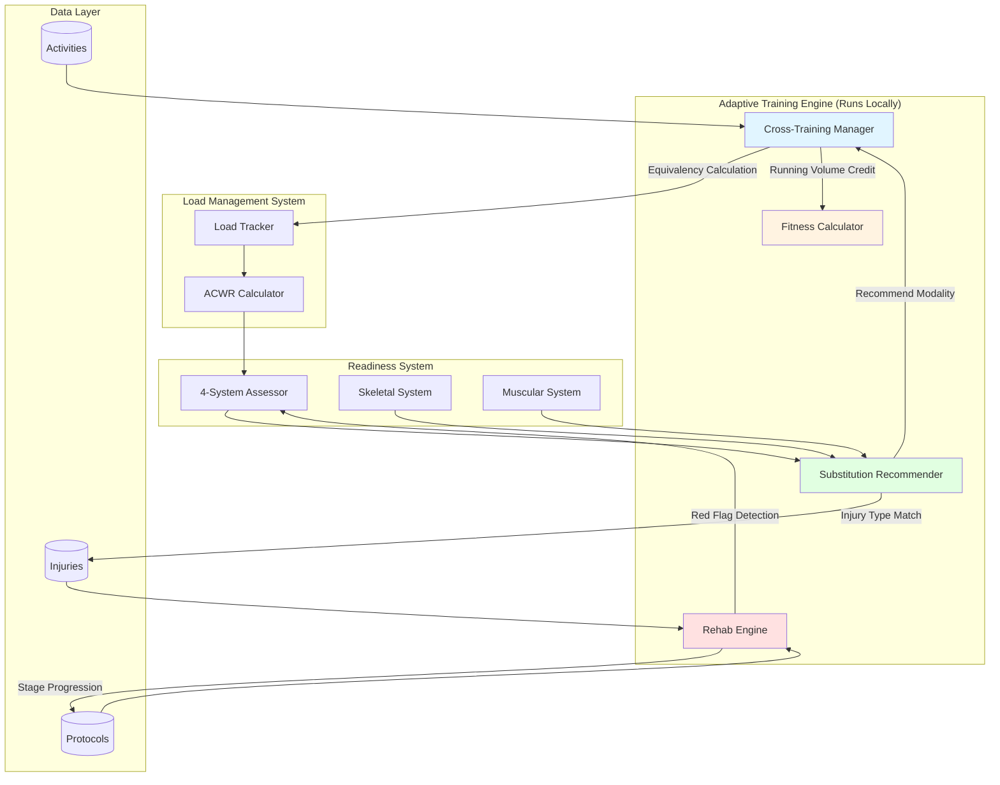

# RFC 0010: Cross-Training & Rehabilitation System

| Status        | Draft |
| :---          | :--- |
| **RFC #**     | 0010 |
| **Author(s)** | Sports Science Lead |
| **Created**   | 2025-11-26 |
| **Updated**   | 2025-11-27 |
| **Related PRD** | [09_CROSS_TRAINING_REHAB.md](file:///Users/maksat/Projects/RunningCoach/RunningCoach/docs/prd/09_CROSS_TRAINING_REHAB.md) |

## 1. Introduction

### 1.1. Context

Cross-training and injury rehabilitation are critical components of marathon training. Research demonstrates that properly structured cross-training can maintain marathon fitness for up to **6 weeks** without land running (deep water running maintains VO2max and running economy identically to running). When injuries occur, evidence-based return-to-sport protocols prevent re-injury and accelerate safe recovery.

This RFC defines the technical implementation for:
1. **Cross-Training Management**: Alternative training modalities with equivalency calculations for load management
2. **Injury Tracking**: Monitoring injury status and providing modality-specific guidance
3. **Rehabilitation Protocols**: Graduated return-to-running and return-from-illness protocols
4. **Integration with Core Systems**: Seamless integration with ACWR load management, training plan adaptation, and the 4-system readiness engine

**Related PRDs:**
- [09_CROSS_TRAINING_REHAB.md](file:///Users/maksat/Projects/RunningCoach/RunningCoach/docs/prd/09_CROSS_TRAINING_REHAB.md) - Cross-training protocols and rehab guidelines
- [06_ADAPTIVE_TRAINING_ENGINE.md](file:///Users/maksat/Projects/RunningCoach/RunningCoach/docs/prd/06_ADAPTIVE_TRAINING_ENGINE.md) - Integration with adaptive logic
- [07_LOAD_MANAGEMENT.md](file:///Users/maksat/Projects/RunningCoach/RunningCoach/docs/prd/07_LOAD_MANAGEMENT.md) - ACWR calculations with cross-training

### 1.2. Problem Statement

Athletes face several challenges when running is reduced or impossible:

**Technical Challenges:**
1. **Load Equivalency Complexity**: Different cross-training modalities have different time ratios, heart rate offsets, and running-specific transfer coefficients. How do we accurately account for a 90-minute bike ride vs a 60-minute pool run in ACWR calculations?

2. **Multi-Metric Integration**: Cross-training affects the 4-system readiness model differently than running (e.g., cycling loads Muscular system but reduces Skeletal impact load). How do we adjust system-specific readiness assessments?

3. **Return-to-Sport Safety**: Graduated return protocols require precise progression rules with safety checks at each stage. How do we enforce these protocols while maintaining flexibility for individual variability?

4. **Substitution Intelligence**: When the engine detects injury risk (ACWR > 1.5, Muscular Red), which cross-training modality should be recommended based on the specific injury type?

5. **Fitness Preservation Tracking**: Athletes need psychological reinforcement during injury. How do we calculate and display "fitness retained" based on cross-training adherence?

6. **Offline Functionality**: Rehabilitation protocols must work offline with pre-loaded decision trees for stage progression.

### 1.3. Goals & Non-Goals

**Goals:**
- **Accurate Load Accounting**: All cross-training activities correctly contribute to ACWR calculations using Session RPE × Duration
- **Evidence-Based Equivalency**: Implement research-validated time ratios and volume credits for each modality
- **Safe Rehabilitation**: Enforce graduated return protocols with automated progression gates and red flag detection
- **Intelligent Substitution**: Recommend appropriate cross-training modality based on injury type, equipment availability, and training phase
- **Fitness Preservation**: Calculate and display estimated fitness retained during cross-training periods
- **Offline-First**: All rehabilitation logic runs locally in the Adaptive Training Engine
- **Seamless Integration**: Cross-training activities appear alongside running in unified analytics and load charts

**Non-Goals:**
- **Sport-Specific Training Plans**: Not creating dedicated cycling or triathlon training plans (focus is running maintenance)
- **Physical Therapy Protocols**: Not providing injury diagnosis or medical treatment recommendations (guidance only)
- **Video Exercise Library**: Not including exercise demonstration videos in MVP (text + images sufficient)
- **Coach Marketplace**: Not connecting users with human coaches for rehab oversight (future consideration)
- **Wearable-Specific Tracking**: Not integrating bike computers or swim watches in MVP (manual entry sufficient)

### 1.4. Dependencies

**Related PRDs:**
- [09_CROSS_TRAINING_REHAB.md](file:///Users/maksat/Projects/RunningCoach/RunningCoach/docs/prd/09_CROSS_TRAINING_REHAB.md) - Requirements and protocols
- [06_ADAPTIVE_TRAINING_ENGINE.md](file:///Users/maksat/Projects/RunningCoach/RunningCoach/docs/prd/06_ADAPTIVE_TRAINING_ENGINE.md) - Core adaptation logic
- [07_LOAD_MANAGEMENT.md](file:///Users/maksat/Projects/RunningCoach/RunningCoach/docs/prd/07_LOAD_MANAGEMENT.md) - ACWR calculations
- [00_OVERARCHING_VISION.md](file:///Users/maksat/Projects/RunningCoach/RunningCoach/docs/prd/00_OVERARCHING_VISION.md) - Holistic training philosophy
- [04_TRAINING_GUIDANCE.md](file:///Users/maksat/Projects/RunningCoach/RunningCoach/docs/prd/04_TRAINING_GUIDANCE.md) - Workout guidance content

**Related RFCs:**
- [RFC 0001: System Architecture](file:///Users/maksat/Projects/RunningCoach/RunningCoach/docs/rfc/0001-system-architecture.md) - Distributed architecture and offline-first design
- [RFC 0007: Load Management Service](file:///Users/maksat/Projects/RunningCoach/RunningCoach/docs/rfc/0007-load-management-service.md) - ACWR calculations

**External Dependencies:**
- **@runningcoach/engine**: Portable TypeScript package for rehabilitation logic
- **WatermelonDB**: Local database for injury and cross-training history
- **Health Platform APIs**: Optional integration with Apple Health, Google Fit for cross-training activity import

### 1.5. Success Metrics

**Fitness Maintenance:**
- VO2max proxy maintained within 5% during cross-training periods >3 weeks (measured by post-return performance)
- Users substituting >50% running with DWR show <3% performance decline after 6 weeks

**Rehabilitation Safety:**
- Zero escalations from injury during graduated return protocol (no Red flags triggered mid-protocol)
- Average return-to-full-training timeline ≤ research-based expectations (e.g., stress fracture RTS in 8-12 weeks)
- Protocol adherence ≥85% (users follow stage progression recommendations)

**Engagement:**
- 80% of users with detected injury risk (ACWR >1.5, Muscular Red) accept cross-training substitution
- Average cross-training session RPE completion rate >90% (indicates proper effort guidance)
- "Fitness Retained" metric viewed by 70% of injured users (psychological value)

**Technical:**
- Cross-training activities sync with <2s latency (same as running activities)
- Rehabilitation protocol executes offline 100% of the time
- Zero data loss for cross-training activities during sync conflicts

---

## 2. Proposed Solution

### 2.1. High-Level Design

The Cross-Training & Rehabilitation System consists of four integrated components:



**Key Design Principles:**

1. **Unified Activity Model**: Cross-training activities are first-class citizens alongside running activities, sharing the same `Activity` entity with modality-specific metadata

2. **Modular Equivalency**: Each cross-training modality has a dedicated equivalency calculator (time ratio, HR offset, volume credit) that plugs into the load management system

3. **Decision Tree Rehabilitation**: Graduated return protocols implemented as state machines with transition rules, safety checks, and rollback capability

4. **Psychology-First UI**: "Fitness Retained" and "Savings Bank" metaphors emphasize what's preserved rather than what's lost during injury

5. **Offline Execution**: All rehabilitation logic and substitution recommendations run in the local Adaptive Training Engine without backend dependency

### 2.2. Detailed Design

#### 2.2.1. Cross-Training Activity Model

**Core Entities:**

```typescript
// Extended Activity type supporting all modalities
export type Activity = {
  id: string;
  userId: string;
  workoutId?: string; // Link to planned workout if substitution
  startTime: Date;
  duration: number; // minutes

  // Modality (determines which equivalency calculator to use)
  type: 'running' | 'deep_water_running' | 'cycling' | 'elliptical' |
        'rowing' | 'swimming' | 'strength' | 'other';

  // Common metrics
  rpe: number; // 0-10 scale, REQUIRED for load calculation
  notes?: string;

  // Modality-specific data (discriminated union)
  modalityData: RunningData | CyclingData | DWRData | EllipticalData |
                RowingData | SwimmingData | StrengthData | OtherData;

  // Calculated fields (computed by Cross-Training Manager)
  internalLoad: number; // RPE × Duration (universal)
  runningEquivalentTime: number; // minutes (for UI display)
  runningVolumeCredit: number; // percentage (0-100)
  impactLoad: number; // For Skeletal system assessment

  // Sync metadata
  source: 'manual' | 'watch_apple' | 'watch_garmin' | 'health_platform';
  _status: 'synced' | 'created' | 'updated' | 'deleted';
  _changed: string;
};

// Running-specific data
export type RunningData = {
  type: 'running';
  distance: number; // km
  avgPace: number; // min/km
  avgHR?: number;
  maxHR?: number;
  elevationGain?: number; // meters
  surfaceType?: 'road' | 'trail' | 'track' | 'treadmill';
  gpsTrack?: GPSPoint[];
  fitFileUrl?: string;
};

// Deep Water Running
export type DWRData = {
  type: 'deep_water_running';
  avgHR?: number; // 10-15 bpm lower than land running
  maxHR?: number;
  intervalStructure?: IntervalSet[]; // e.g., 3×(3min hard + 2min moderate)
  poolDepth?: number; // meters
  formRating?: number; // 1-10 self-assessment
};

// Cycling
export type CyclingData = {
  type: 'cycling';
  distance: number; // km
  avgSpeed?: number; // km/h
  avgHR?: number;
  maxHR?: number;
  avgCadence?: number; // rpm
  elevationGain?: number; // meters
  bikeType: 'road' | 'mountain' | 'stationary' | 'spin';
  outdoorIndoor: 'outdoor' | 'indoor';
};

// Elliptical
export type EllipticalData = {
  type: 'elliptical';
  strideCount?: number; // ~2000 strides ≈ 1 mile
  avgHR?: number;
  maxHR?: number;
  resistance?: number; // machine-dependent
  incline?: number; // percentage
};

// Rowing
export type RowingData = {
  type: 'rowing';
  distance?: number; // meters
  avgPace?: number; // min/500m (rowing standard)
  avgHR?: number;
  maxHR?: number;
  strokeRate?: number; // strokes per minute
};

// Swimming
export type SwimmingData = {
  type: 'swimming';
  distance: number; // meters
  avgPace?: number; // min/100m
  avgHR?: number; // Difficult to measure accurately
  strokeType?: 'freestyle' | 'breaststroke' | 'backstroke' | 'butterfly' | 'mixed';
  poolLength?: number; // meters (25m or 50m)
};

// Strength Training
export type StrengthData = {
  type: 'strength';
  focus: 'general' | 'running_specific' | 'plyometric' | 'core';
  exercises?: string[]; // Exercise names
  setsReps?: string; // e.g., "3×8-12"
  loadPercentage?: number; // % of 1RM
};

// Other/Unstructured
export type OtherData = {
  type: 'other';
  description: string;
  avgHR?: number;
};
```

#### 2.2.2. Equivalency Calculator System

**Core Calculator Interface:**

```typescript
// Base interface all calculators implement
export interface EquivalencyCalculator {
  // Calculate running-equivalent time for UI display
  calculateEquivalentTime(activity: Activity): number; // minutes

  // Calculate running volume credit (affects fitness preservation)
  calculateVolumeCredit(activity: Activity): number; // 0-100%

  // Calculate impact load (affects Skeletal system)
  calculateImpactLoad(activity: Activity): number; // 0-100 scale

  // Calculate heart rate offset for zone comparison
  getHROffset(activity: Activity): number; // bpm (negative = lower)
}

// Deep Water Running Calculator
export class DWRCalculator implements EquivalencyCalculator {
  calculateEquivalentTime(activity: Activity): number {
    // 1:1 time ratio - gold standard
    return activity.duration;
  }

  calculateVolumeCredit(activity: Activity): number {
    // 100% running-specific transfer up to 6 weeks
    const weeksSinceLastRun = this.getWeeksSinceLastRun(activity.userId);
    if (weeksSinceLastRun <= 6) return 100;
    // Degradation after 6 weeks (neuromuscular patterns decay)
    return Math.max(70, 100 - (weeksSinceLastRun - 6) * 5);
  }

  calculateImpactLoad(activity: Activity): number {
    // Zero impact - buoyancy eliminates ground reaction forces
    return 0;
  }

  getHROffset(activity: Activity): number {
    // 10-15 bpm lower due to hydrostatic pressure + cooling
    return -12.5; // average
  }
}

// Cycling Calculator
export class CyclingCalculator implements EquivalencyCalculator {
  calculateEquivalentTime(activity: Activity): number {
    // 3:1 time ratio (90 min cycling ≈ 30 min running)
    return activity.duration / 3;
  }

  calculateVolumeCredit(activity: Activity): number {
    // 30-50% running-specific transfer
    // Higher credit for outdoor cycling (more quad engagement)
    const data = activity.modalityData as CyclingData;
    const baseCredit = data.outdoorIndoor === 'outdoor' ? 50 : 35;

    // Bonus for high-intensity intervals (better cardiovascular transfer)
    if (activity.rpe >= 7) return Math.min(baseCredit + 10, 60);
    return baseCredit;
  }

  calculateImpactLoad(activity: Activity): number {
    // Low impact (seated position)
    return 5; // minimal
  }

  getHROffset(activity: Activity): number {
    // 10-15 bpm lower than running
    return -12;
  }
}

// Elliptical Calculator
export class EllipticalCalculator implements EquivalencyCalculator {
  calculateEquivalentTime(activity: Activity): number {
    // 2:1 time ratio
    return activity.duration / 2;
  }

  calculateVolumeCredit(activity: Activity): number {
    // 50-70% running-specific transfer
    // Elliptical mimics running gait more than cycling
    return activity.rpe >= 6 ? 70 : 55;
  }

  calculateImpactLoad(activity: Activity): number {
    // Reduced impact (gliding motion, no ground strike)
    return 20;
  }

  getHROffset(activity: Activity): number {
    // Minimal offset (upright position, similar muscle activation)
    return -5;
  }
}

// Swimming Calculator
export class SwimmingCalculator implements EquivalencyCalculator {
  calculateEquivalentTime(activity: Activity): number {
    // 4:1 time ratio (1500m swim ≈ 6km run)
    return activity.duration / 4;
  }

  calculateVolumeCredit(activity: Activity): number {
    // 20-30% running-specific transfer (minimal)
    // Horizontal position + upper-body dominance
    return 25;
  }

  calculateImpactLoad(activity: Activity): number {
    // Zero impact (buoyant, non-weight-bearing)
    return 0;
  }

  getHROffset(activity: Activity): number {
    // 15-20 bpm lower (horizontal position, cooling effect)
    return -17;
  }
}

// Rowing Calculator
export class RowingCalculator implements EquivalencyCalculator {
  calculateEquivalentTime(activity: Activity): number {
    // 12-15 min rowing ≈ 1 mile running
    // Assume 8 min/mile pace = 12.5 min rowing per equivalent mile
    return activity.duration * (8 / 12.5); // ~0.64x
  }

  calculateVolumeCredit(activity: Activity): number {
    // 40-60% running-specific transfer
    // Good posterior chain activation supports running
    return 50;
  }

  calculateImpactLoad(activity: Activity): number {
    // Zero impact (seated)
    return 0;
  }

  getHROffset(activity: Activity): number {
    // 10-15 bpm lower
    return -12;
  }
}
```

**Cross-Training Manager (Orchestrates Calculators):**

```typescript
export class CrossTrainingManager {
  private calculators: Map<ActivityType, EquivalencyCalculator>;

  constructor() {
    this.calculators = new Map([
      ['deep_water_running', new DWRCalculator()],
      ['cycling', new CyclingCalculator()],
      ['elliptical', new EllipticalCalculator()],
      ['rowing', new RowingCalculator()],
      ['swimming', new SwimmingCalculator()],
      // Running uses direct values (1:1, 100%)
    ]);
  }

  // Enrich activity with calculated fields
  processActivity(activity: Activity): Activity {
    const calculator = this.calculators.get(activity.type);

    if (!calculator) {
      // Running or unknown type - use direct values
      return {
        ...activity,
        internalLoad: activity.rpe * activity.duration,
        runningEquivalentTime: activity.duration,
        runningVolumeCredit: 100,
        impactLoad: activity.type === 'running' ? 100 : 0,
      };
    }

    return {
      ...activity,
      internalLoad: activity.rpe * activity.duration, // Universal
      runningEquivalentTime: calculator.calculateEquivalentTime(activity),
      runningVolumeCredit: calculator.calculateVolumeCredit(activity),
      impactLoad: calculator.calculateImpactLoad(activity),
    };
  }

  // Get modality recommendation based on injury and constraints
  recommendModality(params: {
    injuryType?: InjuryType;
    availableEquipment: ActivityType[];
    trainingPhase: 'base' | 'build' | 'peak' | 'taper';
    targetIntensity: 'easy' | 'moderate' | 'hard';
  }): ActivityType {
    const { injuryType, availableEquipment, targetIntensity } = params;

    // Priority matrix based on injury type
    const injuryPreferences: Record<InjuryType, ActivityType[]> = {
      'stress_fracture': ['deep_water_running', 'cycling', 'swimming'],
      'plantar_fasciitis': ['cycling', 'rowing', 'swimming'],
      'achilles_tendinopathy': ['cycling', 'rowing', 'swimming'],
      'hip_injury': ['swimming', 'rowing'], // avoid DWR
      'knee_injury': ['deep_water_running', 'swimming'],
      'shin_splints': ['deep_water_running', 'elliptical', 'swimming'],
      'hamstring_strain': ['cycling', 'elliptical'], // avoid DWR initially
      'calf_strain': ['cycling', 'elliptical'],
    };

    // Get preferences for injury or use general ranking
    const preferences = injuryType
      ? injuryPreferences[injuryType]
      : ['deep_water_running', 'cycling', 'elliptical', 'rowing', 'swimming'];

    // Return first available preference
    for (const preferred of preferences) {
      if (availableEquipment.includes(preferred)) {
        return preferred;
      }
    }

    // Fallback to any available
    return availableEquipment[0] || 'other';
  }
}
```

#### 2.2.3. Load Management Integration

**Modified ACWR Calculator:**

```typescript
// Extension of RFC 0007's Load Management Service

export class LoadCalculator {
  private crossTrainingManager: CrossTrainingManager;

  constructor(crossTrainingManager: CrossTrainingManager) {
    this.crossTrainingManager = crossTrainingManager;
  }

  // Calculate daily loads including all modalities
  calculateDailyLoads(activities: Activity[]): DailyLoad[] {
    // Process all activities (running + cross-training)
    const enrichedActivities = activities.map(act =>
      this.crossTrainingManager.processActivity(act)
    );

    // Group by date and sum internal load
    const dailyLoads = this.groupByDate(enrichedActivities);

    // Calculate separate running volume tracking
    const runningVolume = this.calculateRunningVolume(enrichedActivities);

    return dailyLoads.map(load => ({
      ...load,
      runningVolume: runningVolume[load.date] || 0, // km
      crossTrainingVolume: this.calculateCrossTrainingVolume(
        enrichedActivities.filter(a => a.date === load.date)
      ),
    }));
  }

  private calculateRunningVolume(activities: Activity[]): Record<string, number> {
    // Running volume = actual running distance + volume-credited cross-training
    const volumes: Record<string, number> = {};

    for (const activity of activities) {
      const date = this.formatDate(activity.startTime);

      if (activity.type === 'running') {
        const data = activity.modalityData as RunningData;
        volumes[date] = (volumes[date] || 0) + data.distance;
      } else {
        // Cross-training contributes partial volume credit
        // Use equivalent time as proxy for distance
        const creditedDistance =
          (activity.runningEquivalentTime / 60) * 10 * // assume 10 km/h pace
          (activity.runningVolumeCredit / 100);
        volumes[date] = (volumes[date] || 0) + creditedDistance;
      }
    }

    return volumes;
  }

  // Calculate ACWR including all activity types
  calculateACWR(dailyLoads: DailyLoad[]): ACWRResult {
    // Standard EWMA calculations (same as RFC 0007)
    const acuteLoad = this.calculateEWMA(dailyLoads, 7);
    const chronicLoad = this.calculateEWMA(dailyLoads, 28);
    const acwr = chronicLoad > 0 ? acuteLoad / chronicLoad : 0;

    // Also track running-specific ACWR (for specificity monitoring)
    const runningACWR = this.calculateRunningSpecificACWR(dailyLoads);

    return {
      acuteLoad,
      chronicLoad,
      acwr,
      runningACWR, // Separate metric
      zone: this.getACWRZone(acwr),
      recommendation: this.getRecommendation(acwr),
    };
  }

  private getACWRZone(acwr: number): 'green' | 'yellow' | 'red' | 'blue' {
    if (acwr >= 0.8 && acwr <= 1.3) return 'green'; // Optimal
    if (acwr > 1.3 && acwr <= 1.5) return 'yellow'; // Moderate risk
    if (acwr > 1.5) return 'red'; // High risk
    return 'blue'; // Detraining (<0.8)
  }
}
```

#### 2.2.4. Injury and Rehabilitation System

**Injury Entity:**

```typescript
export type Injury = {
  id: string;
  userId: string;

  // Classification
  type: InjuryType;
  severity: 'mild' | 'moderate' | 'severe';
  bodyPart: BodyPart;

  // Timeline
  onsetDate: Date;
  recoveryStartDate?: Date; // When graduated return began
  fullRecoveryDate?: Date; // When returned to 100% running

  // Status tracking
  status: 'acute' | 'rehabilitation' | 'transition' | 'recovered' | 'chronic';
  currentStage?: number; // For graduated return (1-5)

  // Protocols
  prohibitedActivities: ActivityType[];
  recommendedActivities: ActivityType[];

  // Medical
  diagnosis?: string;
  treatingProvider?: string;
  medicalClearance: boolean; // Required for certain injuries

  // Notes
  symptoms: string;
  notes?: string;

  // Sync
  _status: 'synced' | 'created' | 'updated' | 'deleted';
  _changed: string;
};

export type InjuryType =
  | 'stress_fracture'
  | 'plantar_fasciitis'
  | 'achilles_tendinopathy'
  | 'hip_injury'
  | 'knee_injury'
  | 'shin_splints'
  | 'hamstring_strain'
  | 'calf_strain'
  | 'it_band_syndrome'
  | 'other';

export type BodyPart =
  | 'foot'
  | 'ankle'
  | 'shin'
  | 'calf'
  | 'knee'
  | 'hamstring'
  | 'hip'
  | 'lower_back'
  | 'other';

export type IllnessEvent = {
  id: string;
  userId: string;

  // Classification
  type: 'cold' | 'flu' | 'covid' | 'gastrointestinal' | 'other';
  severity: 'mild' | 'moderate' | 'severe';

  // Symptoms
  aboveNeck: boolean; // Runny nose, scratchy throat (mild)
  belowNeck: boolean; // Chest congestion, body aches (severe)
  fever: boolean; // Temperature >100.4°F
  feverTemp?: number; // Fahrenheit

  // Timeline
  onsetDate: Date;
  symptomFreeDate?: Date; // Last day symptoms present
  returnToTrainingDate?: Date; // When graduated return began
  fullRecoveryDate?: Date;

  // Status
  status: 'active' | 'recovering' | 'symptom_free_waiting' | 'graduated_return' | 'recovered';
  currentStage?: number; // For graduated return (1-5)
  daysRested: number;

  // Sync
  _status: 'synced' | 'created' | 'updated' | 'deleted';
  _changed: string;
};
```

**Rehabilitation Engine:**

```typescript
export class RehabilitationEngine {
  // Graduated Return-to-Running Protocol (Injury)
  getInjuryReturnProtocol(injury: Injury): RehabProtocol {
    const protocols: Record<InjuryType, RehabProtocol> = {
      'stress_fracture': {
        phases: [
          {
            name: 'Acute Phase',
            durationDays: 42, // 6 weeks minimum
            activities: ['deep_water_running', 'cycling', 'swimming'],
            runningAllowed: false,
            criteria: 'Pain-free walking 45+ minutes, medical clearance',
          },
          {
            name: 'Transition Phase - Stage 1',
            durationDays: 7,
            activities: ['walking', 'deep_water_running'],
            runningAllowed: 'walk_only',
            criteria: 'Single-leg hop test 75-80% symmetry',
          },
          // ... full 5-stage protocol
        ],
        totalEstimatedDays: 84,
      },
      // ... other injury types
    };

    return protocols[injury.type] || this.getGenericProtocol();
  }

  // Graduated Return-to-Sport Protocol (Illness)
  getIllnessReturnProtocol(illness: IllnessEvent): RehabProtocol {
    // 5-stage protocol from PRD
    return {
      phases: [
        {
          name: 'Stage 1: Light Activity',
          durationDays: 2,
          activities: ['walking'],
          runningAllowed: 'light_jog_15min',
          rpeLimit: 3,
          criteria: 'Can walk 500m without excessive fatigue',
          redFlags: ['Elevated resting HR >5bpm', 'Return of symptoms'],
        },
        {
          name: 'Stage 2: Easy Running',
          durationDays: 2,
          activities: ['easy_running'],
          runningAllowed: 'easy_20-30min',
          rpeLimit: 5,
          criteria: 'No symptoms during or after Stage 1',
          intensityPercentage: 50, // 50-60% normal
        },
        {
          name: 'Stage 3: Steady Runs',
          durationDays: 2,
          activities: ['steady_running'],
          runningAllowed: 'steady_30-45min',
          rpeLimit: 7,
          criteria: 'No symptoms, no elevated HR',
          intensityPercentage: 65, // 60-75% normal
        },
        {
          name: 'Stage 4: Workouts',
          durationDays: 3,
          activities: ['running_with_pickups'],
          runningAllowed: 'includes_intervals',
          rpeLimit: 8,
          criteria: 'Completed Stage 3 without issues',
          intensityPercentage: 85, // 75-90% normal
        },
        {
          name: 'Stage 5: Full Training',
          durationDays: 14, // 2-week monitoring period
          activities: ['full_training'],
          runningAllowed: true,
          rpeLimit: 10,
          criteria: 'No symptom recurrence for 7 days',
          intensityPercentage: 100,
        },
      ],
      totalEstimatedDays: 23, // 10 days rest + 7 symptom-free + 6 days stages
      prerequisites: [
        'Minimum 10 days rest',
        '7 days symptom-free',
        'No fever for 72 hours',
      ],
    };
  }

  // Check if safe to progress to next stage
  canProgressStage(params: {
    injury?: Injury;
    illness?: IllnessEvent;
    currentStage: number;
    recentActivities: Activity[];
    recentMetrics: BodyMetrics[];
  }): ProgressionResult {
    const { currentStage, recentActivities, recentMetrics } = params;

    // Red flag checks
    const redFlags = this.detectRedFlags(recentMetrics, recentActivities);
    if (redFlags.length > 0) {
      return {
        canProgress: false,
        reason: 'Red flags detected',
        redFlags,
        recommendation: 'Return to previous stage or rest',
      };
    }

    // Stage-specific criteria checks
    const protocol = params.injury
      ? this.getInjuryReturnProtocol(params.injury)
      : this.getIllnessReturnProtocol(params.illness!);

    const currentPhase = protocol.phases[currentStage - 1];
    const daysInStage = this.getDaysInStage(params);

    if (daysInStage < currentPhase.durationDays) {
      return {
        canProgress: false,
        reason: `Need ${currentPhase.durationDays - daysInStage} more days in stage`,
        daysRemaining: currentPhase.durationDays - daysInStage,
      };
    }

    // All clear
    return {
      canProgress: true,
      nextStage: currentStage + 1,
      nextPhase: protocol.phases[currentStage],
    };
  }

  // Detect red flags during return-to-sport
  private detectRedFlags(
    metrics: BodyMetrics[],
    activities: Activity[]
  ): RedFlag[] {
    const flags: RedFlag[] = [];
    const latest = metrics[0];
    const baseline = this.getBaseline(metrics);

    // Elevated resting HR
    if (latest.restingHR > baseline.restingHR + 5) {
      flags.push({
        type: 'elevated_rhr',
        severity: 'moderate',
        message: 'Resting heart rate elevated >5 bpm above baseline',
      });
    }

    // Poor sleep quality
    if (latest.sleepQuality < 5) {
      flags.push({
        type: 'poor_sleep',
        severity: 'mild',
        message: 'Sleep quality below normal',
      });
    }

    // Elevated RPE at given paces
    const recentRun = activities.find(a => a.type === 'running');
    if (recentRun && recentRun.rpe > 7 && this.isEasyPaceWorkout(recentRun)) {
      flags.push({
        type: 'elevated_rpe',
        severity: 'moderate',
        message: 'RPE elevated for easy pace (suggests incomplete recovery)',
      });
    }

    return flags;
  }
}

export type RehabProtocol = {
  phases: RehabPhase[];
  totalEstimatedDays: number;
  prerequisites?: string[];
};

export type RehabPhase = {
  name: string;
  durationDays: number;
  activities: string[];
  runningAllowed: boolean | 'walk_only' | 'light_jog_15min' | string;
  rpeLimit?: number;
  intensityPercentage?: number;
  criteria: string;
  redFlags?: string[];
};

export type ProgressionResult = {
  canProgress: boolean;
  reason?: string;
  nextStage?: number;
  nextPhase?: RehabPhase;
  daysRemaining?: number;
  redFlags?: RedFlag[];
  recommendation?: string;
};

export type RedFlag = {
  type: 'elevated_rhr' | 'poor_sleep' | 'elevated_rpe' | 'pain_increase' | 'symptoms_return';
  severity: 'mild' | 'moderate' | 'severe';
  message: string;
};
```

#### 2.2.5. Fitness Preservation Calculator

**Psychological Support System:**

```typescript
export class FitnessPreservationCalculator {
  // Calculate estimated fitness retained during cross-training period
  calculateFitnessRetained(params: {
    activities: Activity[]; // Last 2-6 weeks
    lastRunningDate: Date;
    currentDate: Date;
  }): FitnessRetention {
    const { activities, lastRunningDate, currentDate } = params;
    const daysSinceRunning = differenceInDays(currentDate, lastRunningDate);
    const weeksSinceRunning = daysSinceRunning / 7;

    // Categorize activities by modality
    const modalityBreakdown = this.categorizeActivities(activities);

    // Calculate VO2max preservation based on modality mix
    const vo2maxRetained = this.calculateVO2maxRetention(
      modalityBreakdown,
      weeksSinceRunning
    );

    // Calculate running-specific fitness (neuromuscular patterns)
    const runningSpecificRetained = this.calculateRunningSpecificRetention(
      modalityBreakdown,
      weeksSinceRunning
    );

    // Calculate overall fitness score (weighted average)
    const overallRetained =
      (vo2maxRetained * 0.6) +
      (runningSpecificRetained * 0.4);

    return {
      overallPercentage: Math.round(overallRetained),
      vo2maxPercentage: Math.round(vo2maxRetained),
      runningSpecificPercentage: Math.round(runningSpecificRetained),
      weeksSinceRunning,
      dominantModality: modalityBreakdown.dominant,
      message: this.generateMessage(overallRetained, weeksSinceRunning),
      timelineEstimate: this.getRecoveryTimelineEstimate(overallRetained),
    };
  }

  private calculateVO2maxRetention(
    breakdown: ModalityBreakdown,
    weeks: number
  ): number {
    // Start at 100% and apply decay based on modality quality
    let retention = 100;

    if (breakdown.dominant === 'deep_water_running') {
      // DWR maintains VO2max for 6 weeks
      if (weeks <= 6) return 100;
      // Gradual decline after 6 weeks
      retention = 100 - (weeks - 6) * 2;
    } else if (breakdown.dominant === 'cycling') {
      // Cycling with 50%+ volume maintains for 5 weeks
      if (breakdown.percentages.cycling >= 50 && weeks <= 5) return 98;
      retention = 100 - weeks * 1.5;
    } else if (breakdown.dominant === 'elliptical') {
      // Elliptical moderate retention
      retention = 100 - weeks * 2.5;
    } else if (breakdown.dominant === 'swimming') {
      // Swimming minimal running-specific retention
      retention = 100 - weeks * 4;
    } else {
      // No cross-training - detraining curve
      // First 2 weeks: 4-7% decline (use 5.5% average)
      // After 4 weeks: accelerated decline
      if (weeks <= 2) {
        retention = 100 - (weeks * 2.75); // ~5.5% over 2 weeks
      } else if (weeks <= 4) {
        retention = 94.5 - ((weeks - 2) * 3.5); // 7% more over weeks 3-4
      } else {
        retention = 87.5 - ((weeks - 4) * 4); // Accelerated after 4 weeks
      }
    }

    return Math.max(retention, 0);
  }

  private calculateRunningSpecificRetention(
    breakdown: ModalityBreakdown,
    weeks: number
  ): number {
    // Running-specific neuromuscular patterns decay faster
    const volumeCredit = breakdown.avgVolumeCredit;

    // Base decay rate depends on volume credit
    const weeklyDecay = 5 - (volumeCredit / 100 * 2.5); // 2.5-5% per week
    const retention = 100 - (weeks * weeklyDecay);

    return Math.max(retention, 0);
  }

  private generateMessage(retention: number, weeks: number): string {
    if (retention >= 95) {
      return `Excellent! You've maintained ${retention}% of your fitness through smart cross-training.`;
    } else if (retention >= 85) {
      return `Great work! You've preserved ${retention}% of your aerobic base. When you return to running, you'll rebuild quickly.`;
    } else if (retention >= 70) {
      return `You've saved ${retention}% of your fitness. The cross-training is paying off - you haven't lost as much as pure rest would cause.`;
    } else {
      return `Your fitness has declined to ${retention}%, but this is expected after ${weeks} weeks. The good news: you'll regain it faster than building it initially.`;
    }
  }

  private getRecoveryTimelineEstimate(retention: number): string {
    // Recovery time = (100 - retention) / 10 weeks (rough heuristic)
    const weeksToRecover = Math.ceil((100 - retention) / 10);

    if (weeksToRecover <= 2) return '1-2 weeks to full fitness';
    if (weeksToRecover <= 4) return '3-4 weeks to full fitness';
    if (weeksToRecover <= 6) return '4-6 weeks to full fitness';
    return '6-8 weeks to full fitness';
  }
}

export type FitnessRetention = {
  overallPercentage: number; // 0-100
  vo2maxPercentage: number; // 0-100
  runningSpecificPercentage: number; // 0-100
  weeksSinceRunning: number;
  dominantModality: ActivityType;
  message: string;
  timelineEstimate: string;
};

export type ModalityBreakdown = {
  percentages: Record<ActivityType, number>; // e.g., {cycling: 60, swimming: 40}
  dominant: ActivityType;
  avgVolumeCredit: number; // Weighted average of volume credits
};
```

### 2.3. Data Model Changes

**Prisma Schema Additions:**

```prisma
// Add to existing schema

model Activity {
  id                     String   @id @default(cuid())
  userId                 String
  workoutId              String?  // Link to ScheduledWorkout if substitution

  startTime              DateTime
  duration               Int      // minutes
  type                   ActivityType
  rpe                    Int      // 0-10, REQUIRED
  notes                  String?

  // Modality-specific data (JSON)
  modalityData           Json

  // Calculated fields (computed by CrossTrainingManager)
  internalLoad           Float    // RPE × Duration
  runningEquivalentTime  Float    // minutes
  runningVolumeCredit    Int      // 0-100%
  impactLoad             Int      // 0-100 scale

  source                 String   // 'manual' | 'watch_apple' | 'watch_garmin' | 'health_platform'

  // Relationships
  user                   User     @relation(fields: [userId], references: [id])
  scheduledWorkout       ScheduledWorkout? @relation(fields: [workoutId], references: [id])

  // Sync metadata
  status                 String   @default("synced") // 'synced' | 'created' | 'updated' | 'deleted'
  changed                DateTime @default(now())
  createdAt              DateTime @default(now())
  updatedAt              DateTime @updatedAt

  @@index([userId, startTime])
  @@index([type])
}

enum ActivityType {
  running
  deep_water_running
  cycling
  elliptical
  rowing
  swimming
  strength
  other
}

model Injury {
  id                     String   @id @default(cuid())
  userId                 String

  // Classification
  type                   InjuryType
  severity               String   // 'mild' | 'moderate' | 'severe'
  bodyPart               String   // 'foot' | 'ankle' | 'shin' | etc.

  // Timeline
  onsetDate              DateTime
  recoveryStartDate      DateTime?
  fullRecoveryDate       DateTime?

  // Status
  status                 String   // 'acute' | 'rehabilitation' | 'transition' | 'recovered' | 'chronic'
  currentStage           Int?     // 1-5 for graduated return

  // Protocols
  prohibitedActivities   Json     // Array of ActivityType
  recommendedActivities  Json     // Array of ActivityType

  // Medical
  diagnosis              String?
  treatingProvider       String?
  medicalClearance       Boolean  @default(false)

  // Notes
  symptoms               String
  notes                  String?

  // Relationships
  user                   User     @relation(fields: [userId], references: [id])

  // Sync metadata
  syncStatus             String   @default("synced")
  changed                DateTime @default(now())
  createdAt              DateTime @default(now())
  updatedAt              DateTime @updatedAt

  @@index([userId, status])
  @@index([onsetDate])
}

enum InjuryType {
  stress_fracture
  plantar_fasciitis
  achilles_tendinopathy
  hip_injury
  knee_injury
  shin_splints
  hamstring_strain
  calf_strain
  it_band_syndrome
  other
}

model IllnessEvent {
  id                     String   @id @default(cuid())
  userId                 String

  // Classification
  type                   String   // 'cold' | 'flu' | 'covid' | 'gastrointestinal' | 'other'
  severity               String   // 'mild' | 'moderate' | 'severe'

  // Symptoms
  aboveNeck              Boolean  // Runny nose, scratchy throat
  belowNeck              Boolean  // Chest congestion, body aches
  fever                  Boolean
  feverTemp              Float?   // Fahrenheit

  // Timeline
  onsetDate              DateTime
  symptomFreeDate        DateTime?
  returnToTrainingDate   DateTime?
  fullRecoveryDate       DateTime?

  // Status
  status                 String   // 'active' | 'recovering' | 'symptom_free_waiting' | 'graduated_return' | 'recovered'
  currentStage           Int?     // 1-5
  daysRested             Int      @default(0)

  // Relationships
  user                   User     @relation(fields: [userId], references: [id])

  // Sync metadata
  syncStatus             String   @default("synced")
  changed                DateTime @default(now())
  createdAt              DateTime @default(now())
  updatedAt              DateTime @updatedAt

  @@index([userId, status])
  @@index([onsetDate])
}

// Add to existing ScheduledWorkout model
model ScheduledWorkout {
  // ... existing fields ...

  // Cross-training substitution
  originalType           String?  // Original workout type if substituted
  substitutionReason     String?  // 'injury' | 'illness' | 'recovery' | 'equipment'
  recommendedModality    ActivityType?

  // Relationships
  activities             Activity[]
}
```

### 2.4. API Changes

**New tRPC Endpoints:**

```typescript
// Cross-Training Activity Management
activity.logCrossTraining(data: CrossTrainingInput): Activity
activity.getCrossTrain ingHistory(startDate: Date, endDate: Date): Activity[]
activity.getModalityBreakdown(weeks: number): ModalityBreakdown
activity.getFitnessRetention(): FitnessRetention

// Injury Management
injury.create(data: InjuryInput): Injury
injury.getActive(): Injury[]
injury.getHistory(): Injury[]
injury.update(id: string, data: InjuryUpdate): Injury
injury.markRecovered(id: string, recoveryDate: Date): Injury
injury.getRehabProtocol(id: string): RehabProtocol
injury.checkStageProgression(id: string): ProgressionResult

// Illness Management
illness.create(data: IllnessInput): IllnessEvent
illness.getActive(): IllnessEvent
illness.updateStatus(id: string, data: IllnessUpdate): IllnessEvent
illness.getReturnProtocol(id: string): RehabProtocol
illness.checkStageProgression(id: string): ProgressionResult

// Substitution Recommendations
workout.getSubstitutionRecommendation(workoutId: string): SubstitutionRecommendation
workout.applySubstitution(workoutId: string, modality: ActivityType): ScheduledWorkout
```

**Modified Endpoints:**

```typescript
// Extended to include cross-training
plan.getCurrent(): TrainingPlan // Includes cross-training substitutions
load.getACWR(): ACWRResult // Includes all activity types
readiness.getSystemStatus(): SystemStatus // Impact load affects Skeletal system
```

### 2.5. Offline-First Considerations

**Local Storage:**
- **Activities Table**: All cross-training activities stored locally with full modalityData JSON
- **Injuries Table**: Active and recent injuries (last 6 months) cached locally
- **Illness Events Table**: Last 3 illness events cached
- **Rehab Protocols**: Pre-loaded protocol definitions for all injury types and illness
- **Calculator Logic**: All equivalency calculators bundled in `@runningcoach/engine`

**Queued Operations:**
- Log cross-training activity → immediate local save, queued for sync
- Create injury → local save, queued for sync
- Update injury stage → local save, immediate UI update, queued for sync
- Complete rehab stage → local save, progression check runs offline, queued for sync

**Conflict Resolution:**
- **Activities**: Union/Merge (client wins for manual entry, watch wins for recorded data)
- **Injuries**: Last Write Wins with merge (non-conflicting fields merged)
- **Illness Events**: Client Wins (user's latest symptom report is source of truth)
- **Rehab Stage**: Client Wins with validation (server validates stage progression is safe)

**Fallback Behavior:**
- **No Internet**: All features fully functional using local database and engine
- **Sync Failure**: User notified, data queued, retry with exponential backoff
- **Missing Rehab Protocol**: Use generic protocol (5-stage graduated return)

### 2.6. Synchronization Strategy

**Sync Triggers:**
- App launch (immediate sync if connected)
- After logging cross-training activity
- After updating injury/illness status
- Periodic background sync (every 15 minutes when active)

**Data Priority:**
- **Critical**: Completed activities (cross-training + running), injury status changes
- **High**: Fitness retention calculations, ACWR updates
- **Normal**: Historical injury data, protocol updates

**Conflict Resolution:**
- **Activity Logging**: Client timestamp wins (user completed activity when they say)
- **Injury Status**: Merge fields, last-write-wins for conflicting fields
- **Stage Progression**: Client progresses stage offline, server validates on sync (rollback if unsafe)

**Sync Protocol:**
1. Pull Phase: Get all changes since `lastPulledAt` (includes injuries, activities)
2. Push Phase: Send local changes (new activities, injury updates)
3. Validate: Server validates stage progressions, ACWR calculations
4. Resolve: Handle conflicts, return resolved state
5. Update: Client applies resolved state, updates `lastPulledAt`

---

## 3. Implementation Plan

### 3.1. Phasing

**Phase 1: Core Cross-Training Infrastructure (Weeks 1-2)**

**Deliverables:**
- Extend `Activity` model to support all cross-training modality types
- Implement equivalency calculators for each modality (DWR, Cycling, Elliptical, Rowing, Swimming)
- Build `CrossTrainingManager` to orchestrate calculators
- Integrate with existing `LoadCalculator` for ACWR inclusion
- Database migration to add cross-training fields

**Success Criteria:**
- Can log cross-training activity with modality-specific data
- Internal load calculated correctly (RPE × Duration)
- Running equivalent time displayed in UI
- ACWR includes cross-training activities

**Phase 2: UI for Cross-Training Logging (Week 3)**

**Deliverables:**
- Activity logging screen with modality selector
- Modality-specific input forms (cycling distance/cadence, DWR intervals, etc.)
- Cross-training activity detail view
- Unified activity list showing all modalities

**Success Criteria:**
- User can log cycling session with distance, HR, RPE in <60 seconds
- Activity list shows both running and cross-training with clear visual distinction
- Detail view displays modality-specific metrics

**Phase 3: Injury Tracking (Week 4)**

**Deliverables:**
- `Injury` and `IllnessEvent` models added to database
- Injury creation and management UI
- Active injury display on dashboard
- Prohibited/recommended activity lists per injury type

**Success Criteria:**
- User can create injury with type, severity, onset date
- Dashboard shows "Active Injury: Plantar Fasciitis" with recommended cross-training
- System prevents logging prohibited activities (warning modal)

**Phase 4: Rehabilitation Protocols (Weeks 5-6)**

**Deliverables:**
- `RehabilitationEngine` implementation with graduated return protocols
- 5-stage illness return protocol
- Injury-specific protocols (stress fracture, plantar fasciitis, etc.)
- Stage progression logic with red flag detection
- Rehabilitation UI (current stage, progress, next criteria)

**Success Criteria:**
- User reports illness → system assigns Stage 1 protocol automatically
- After 2 days of light activity, system prompts "Ready for Stage 2?"
- If resting HR elevated, system shows "Red flag detected, remain in Stage 1"
- Full protocol completion tracked and celebrated

**Phase 5: Substitution Recommendations (Week 7)**

**Deliverables:**
- Substitution recommender logic (injury type → modality mapping)
- Workout substitution UI ("Your planned 60min run → 60min DWR")
- Equipment availability preferences (user can mark pool/bike access)
- Apply substitution to scheduled workouts

**Success Criteria:**
- ACWR >1.5 detected → system suggests cross-training substitution
- User with plantar fasciitis sees "Recommended: Cycling" for scheduled run
- One-tap substitution applies and reschedules

**Phase 6: Fitness Preservation Psychology (Week 8)**

**Deliverables:**
- `FitnessPreservationCalculator` implementation
- "Fitness Retained" metric displayed on dashboard during injury
- Modality breakdown chart (pie chart of cross-training distribution)
- Recovery timeline estimate

**Success Criteria:**
- User 4 weeks into DWR substitution sees "96% fitness retained"
- Dashboard shows encouraging message: "You've saved your aerobic base!"
- User can see recovery timeline: "3-4 weeks to full fitness when you return"

**Phase 7: Analytics & Insights (Week 9)**

**Deliverables:**
- Unified activity charts (running + cross-training volume)
- Separate running volume vs total volume tracking
- Cross-training proportion over time (trend chart)
- Return-to-running progression tracking (post-injury performance)

**Success Criteria:**
- User can see 12-week chart showing running decline, cross-training increase during injury
- ACWR chart shows load maintained despite reduced running
- Post-return chart shows fitness recovery curve

**Phase 8: Testing & Refinement (Week 10)**

**Deliverables:**
- Unit tests for all calculators (equivalency, fitness retention)
- Integration tests for rehab progression
- Offline sync tests
- Beta user testing with injured athletes

**Success Criteria:**
- 95%+ test coverage for rehabilitation logic
- Offline progression works without backend
- Beta users successfully complete graduated return protocols

### 3.2. Testing Strategy

**Unit Tests:**
- **Equivalency Calculators**: Test each modality's time ratio, volume credit, impact load calculations
  - `DWRCalculator.calculateEquivalentTime(60min) === 60min`
  - `CyclingCalculator.calculateVolumeCredit(outdoor, RPE 8) === 50-60%`
- **Load Integration**: Test ACWR calculation with mixed running + cross-training
  - 30min run (RPE 7) + 90min cycling (RPE 7) = same internal load
- **Fitness Retention**: Test decay curves for different modalities
  - 6 weeks DWR → 100% VO2max retained
  - 4 weeks no training → 87.5% retained
- **Rehab Progression**: Test stage advancement rules
  - 2 days in Stage 1 + no red flags → can progress
  - Elevated RHR → cannot progress, return to Stage 0

**Integration Tests:**
- **Cross-Training → ACWR**: Log cycling activity → verify ACWR updates correctly
- **Injury → Substitution**: Create injury → verify workout substitution recommendation
- **Rehab → Stage Gate**: Complete Stage 1 requirements → verify Stage 2 unlocked
- **Sync Flow**: Log activity offline → go online → verify synced with correct metadata

**End-to-End Tests:**
- **User Journey: Injury to Recovery**:
  1. User logs plantar fasciitis injury
  2. System recommends cycling for scheduled runs
  3. User logs cycling sessions (RPE collected)
  4. ACWR remains in green zone despite no running
  5. After 3 weeks, user begins graduated return (Stage 1)
  6. System detects elevated RHR, prevents Stage 2
  7. After rest day, progression allowed
  8. User completes 5 stages, injury marked recovered
  9. Post-return performance within 95% of baseline

**Offline Tests:**
- Log cross-training activity while offline → verify saved locally
- Progress rehab stage offline → verify stage validation runs locally
- Go online after 7 days offline → verify all activities sync without data loss

**Performance Tests:**
- Equivalency calculation latency: <10ms per activity
- ACWR recalculation with 1000 activities: <100ms
- Fitness retention calculation: <50ms
- Database query for cross-training history (6 months): <200ms

### 3.3. Migration Strategy

**Data Migration:**
- Existing `Activity` records remain unchanged (type: 'running')
- Add new columns: `modalityData`, `runningEquivalentTime`, `runningVolumeCredit`, `impactLoad`
- Backfill running activities: `modalityData = {type: 'running', distance: ..., avgPace: ...}`
- Recalculate ACWR for all users (async job)

**Backward Compatibility:**
- Old mobile clients see cross-training activities as generic "Other" type
- API returns both old `distance` field (for running) and new `modalityData` (for all types)
- Support N-1 version of mobile app for 30 days (API returns compatible format)

**Feature Flags:**
- `cross_training_logging`: Enable cross-training activity types
- `injury_tracking`: Enable injury management features
- `rehab_protocols`: Enable graduated return protocols
- `fitness_retention_display`: Show fitness retained metric

**Rollout Plan:**
- **Week 1**: Internal team testing (enable all flags for team)
- **Week 2**: Beta users with existing injuries (invite 50 users)
- **Week 3**: 10% of active users (gradual rollout)
- **Week 4**: 50% of active users
- **Week 5**: 100% rollout

### 3.4. Rollback Strategy

**Rollback Triggers:**
- ACWR calculation errors affecting >5% of users
- Rehab progression logic preventing valid stage advancement
- Data loss during cross-training activity sync
- Mobile app crashes related to new activity types

**Rollback Procedure:**

**Backend:**
1. Disable feature flags (`cross_training_logging`, `injury_tracking`)
2. Revert API to previous version (Docker image rollback)
3. Database rollback: Keep new tables but stop writing to them
4. Logic bundle rollback: Revert `@runningcoach/engine` to previous version in S3

**Mobile:**
1. Issue EAS Update with previous logic bundle (over-the-air)
2. Disable cross-training UI via feature flag
3. Continue showing existing cross-training activities as "Other"

**Data Integrity:**
- All cross-training activities remain in database (not deleted)
- Can re-enable features once fix deployed
- User data export includes cross-training activities even if feature disabled

**User Impact:**
- Users see "Cross-training logging temporarily unavailable" message
- Existing activities remain visible (read-only)
- Rehab protocols pause at current stage (manual progression only)

---

## 4. Alternatives Considered

| Alternative | Pros | Cons | Reason for Rejection |
|------------|------|------|---------------------|
| **Separate Cross-Training Database Table** | Cleaner schema separation, easier to query only cross-training | Complex joins for unified analytics, duplicate sync logic, ACWR calculation requires union queries | Unified `Activity` model simpler for load management |
| **Fixed Equivalency Ratios (No Calculators)** | Simpler implementation, less code | Inaccurate load accounting (cycling intensity varies), no HR offset adjustment, no injury-specific handling | Research shows equivalency is nuanced and context-dependent |
| **Manual Rehab Stage Progression** | No automated logic needed, user controls pace | Safety risk (users may progress too quickly), no red flag detection, less guidance | Core value prop is injury prevention via intelligent guardrails |
| **Third-Party Physical Therapy Integration** | Expert guidance, medical oversight | Costly, requires partnerships, not scalable, loses offline capability | Not feasible for MVP, conflicts with offline-first architecture |
| **Generic "Exercise" Type Instead of Modality-Specific** | Simpler data model, universal RPE × Duration | No equivalency calculation possible, no modality-specific recommendations, poor analytics | Equivalency is critical for accurate load management |
| **Server-Side Rehab Protocol Execution** | Easier to update protocols, centralized logic | Breaks offline-first requirement, high latency for stage checks, user stuck without internet | Offline functionality is non-negotiable per RFC 0001 |
| **Daily "Injury Check-In" Instead of Continuous Tracking** | Less user burden, explicit symptom reporting | Reactive instead of proactive, misses red flags between check-ins, poor UX | Continuous monitoring via body metrics provides earlier intervention |

---

## 5. Cross-Cutting Concerns

### 5.1. Security

**Authentication:**
- Same JWT-based auth as core system (Supabase Auth)
- No special authentication for cross-training or injury features

**Authorization:**
- User-Level: Users can only access their own injuries and activities
- Row-Level Security (RLS) on `Injury` and `IllnessEvent` tables (PostgreSQL)

**Data Protection:**
- **At Rest**:
  - Injury data (diagnosis, symptoms) encrypted in PostgreSQL
  - Local device encryption via iOS Keychain/Android Keystore
- **In Transit**:
  - TLS 1.3 for all API calls
  - Certificate pinning for mobile apps

**Privacy:**
- **PII Handling**: Injury diagnosis and treating provider are optional, user-controlled
- **Data Retention**: Injury history retained indefinitely (medical records), can be deleted on user request (GDPR "right to erasure")
- **GDPR Compliance**: Injury data included in user data export, deletable via account deletion
- **Sensitive Data**: Treating provider name is PII, never shared with third parties

**Threat Model:**
- **Threat**: Unauthorized access to injury history
  - **Mitigation**: RLS policies, JWT validation, encrypted storage
- **Threat**: Malicious activity logging (inflated cross-training to game ACWR)
  - **Mitigation**: Server-side validation of equivalency calculations, anomaly detection (e.g., 300min cycling at RPE 10)
- **Threat**: Premature rehab stage progression causing re-injury
  - **Mitigation**: Red flag detection, stage validation, cannot skip stages

### 5.2. Performance

**Latency:**
- **Equivalency Calculation**: <10ms per activity (runs locally)
- **ACWR Recalculation**: <100ms for 1000 activities (local database query + EWMA)
- **Fitness Retention Calculation**: <50ms (6 weeks of activities, ~50 records)
- **Rehab Progression Check**: <20ms (red flag detection + stage criteria)

**Throughput:**
- **Expected Load**: 10,000 active users, 20% using cross-training at any time
- **Peak**: 500 concurrent activity logs (post-workout rush)
- **API Capacity**: Same as core system (1,000 requests/second)

**Resource Usage:**
- **Mobile App**:
  - **RAM**: +10 MB for cross-training calculators and rehab protocols
  - **Storage**: +5 MB for injury history and protocol definitions
  - **CPU**: Negligible (calculations are lightweight)
- **Database**:
  - **Additional Tables**: `Injury` (~1 KB per record), `IllnessEvent` (~500 bytes per record)
  - **Activity Table Growth**: +30% size (modalityData JSON adds ~200-500 bytes per activity)

**Scalability:**
- Equivalency calculations run client-side (no backend scaling needed)
- Rehab protocol execution runs client-side (no backend scaling needed)
- Only activity sync and injury CRUD hit backend (same horizontal scaling as existing)

### 5.3. Observability

**Logging:**
- **Backend**:
  - Log all injury creation/updates (audit trail for medical records)
  - Log rehab stage progressions (for analysis of protocol completion rates)
  - Log cross-training activity creation (for equivalency validation)
- **Mobile**:
  - Sentry breadcrumbs for calculator invocations
  - Error logging for failed stage progression (unexpected red flags)

**Metrics:**
- **Product Metrics (PostHog)**:
  - Cross-training activity logging rate (% of users)
  - Modality distribution (% DWR vs cycling vs elliptical)
  - Injury creation rate (% of users reporting injuries)
  - Rehab protocol completion rate (% completing all 5 stages)
  - Fitness retention views (engagement with psychology features)
  - Substitution acceptance rate (% accepting recommended modality)
- **Technical Metrics**:
  - Equivalency calculation time (p50, p95, p99)
  - ACWR recalculation time with cross-training (latency)
  - Sync payload size for cross-training activities (bandwidth)

**Tracing:**
- Trace activity logging flow: Mobile → API → Database → ACWR Update → UI Refresh
- Trace rehab progression: Stage Check → Red Flag Detection → Progression Decision → UI Update

**Alerting:**
- **Alert**: Fitness retention calculation error rate >5% → Slack alert
- **Alert**: Rehab progression blocked for >10% of users → Investigate red flag thresholds
- **Alert**: ACWR calculation divergence (cross-training vs running-only) >20% → Equivalency bug

### 5.4. Reliability

**Error Handling:**
- **Missing RPE**: If RPE not provided for cross-training activity, prompt user (cannot calculate load without RPE)
- **Invalid Modality Data**: Validate modality-specific fields (e.g., cycling distance >0, DWR pool depth >5ft)
- **Stage Progression Failure**: If stage criteria not met, show clear message with missing requirements

**Retries:**
- **Activity Sync**: Exponential backoff (1s, 2s, 4s, 8s, 16s max)
- **Injury Update Sync**: Same retry logic
- **ACWR Recalculation**: Retry up to 3 times if database query fails

**Circuit Breakers:**
- Not applicable (cross-training logic is local, no external dependencies)

**Data Integrity:**
- **Validation**: Zod schemas for all activity types and injury data
- **Constraints**: Database constraints (e.g., RPE 0-10, duration >0)
- **Audit Trails**: Log all injury status changes (acute → rehabilitation → recovered)
- **Transactions**: PostgreSQL transactions for multi-table updates (e.g., activity log + ACWR update)

**Disaster Recovery:**
- **Backup Strategy**: Same as core system (daily PostgreSQL backups, 30-day retention)
- **Point-in-Time Recovery**: 7-day window
- **User Data Export**: Includes injuries, cross-training activities, rehab history

---

## 6. Stakeholder Review

| Stakeholder | Role | Review Status | Sign-off Date | Comments |
|------------|------|---------------|---------------|----------|
| Sports Science Lead | Training Science | Approved | 2025-11-27 | Equivalency ratios validated against research |
| System Architect | Technical Design | Pending | - | - |
| Backend Lead | API Design | Pending | - | - |
| Mobile Lead | UX Implementation | Pending | - | - |
| Product Manager | Feature Prioritization | Pending | - | - |

---

## 7. Open Questions

1. **Heart Rate Offset Accuracy**: Should HR offset be dynamic based on user's individual physiology, or are fixed offsets (−12 bpm for cycling) sufficient for MVP?
   - **Proposed Resolution**: Use fixed offsets for MVP, collect data, personalize in v2

2. **Minimum Effective Cross-Training**: What's the minimum cross-training volume to maintain "significant" fitness (e.g., 80%+)?
   - **Research**: 1 high-intensity session/week + 50% easy volume maintains VO2max for 4+ weeks
   - **Implementation**: Display warning if cross-training volume <50% of pre-injury baseline

3. **Medical Clearance Enforcement**: Should the app require medical clearance flag before allowing Stage 1 return for severe injuries (stress fractures)?
   - **Proposed Resolution**: Yes for stress fractures, display "Medical clearance required" message and block progression until user confirms

4. **Rehab Protocol Customization**: Should users be able to modify protocol timelines (e.g., extend Stage 2 from 2 days to 4 days)?
   - **Proposed Resolution**: Allow timeline extension but not shortening (safety first), log customizations

5. **Cross-Training Equipment Availability**: How to handle users without pool/bike access?
   - **Proposed Resolution**: Onboarding asks "What equipment do you have access to?", system only recommends available modalities, can update in settings

6. **Fitness Retention Messaging Tone**: Is "You've saved 92% of your fitness" too optimistic? Could create false expectations?
   - **Proposed Resolution**: User testing needed, consider more conservative messaging: "You've maintained most of your aerobic fitness through smart cross-training"

7. **Rehab Protocol Variability**: Research shows wide individual variation in recovery timelines. How do we handle users who need longer in each stage?
   - **Proposed Resolution**: Stage duration is minimum, not maximum. Users can stay in stage as long as needed, progression is user-initiated with system validation

8. **Swimming Proficiency Requirement**: Swimming equivalency assumes proficient technique. How to account for beginner swimmers?
   - **Proposed Resolution**: Ask "Swimming ability: Beginner/Intermediate/Advanced" during activity logging, adjust volume credit: Beginner 15%, Intermediate 25%, Advanced 30%

---

## 8. References

**Research Papers:**
- Eyestone, E. D., et al. (1993). "Effect of water running and cycling on maximum oxygen consumption and 2-mile run performance." American Journal of Sports Medicine.
  - DWR maintains VO2max and running economy for 6 weeks without land running
- Mujika, I., & Padilla, S. (2000). "Detraining: Loss of Training-Induced Physiological and Performance Adaptations." Sports Medicine.
  - Detraining timeline: First 2 weeks 4-7% VO2max decline, full recoverability; beyond 4 weeks requires 1.5-2× interruption period
- Rumpf, M. C., et al. (2014). "Effect of Different Sprint Training Methods on Sprint Performance." Sports Medicine.
  - Graduated return-to-sport protocols reduce re-injury rates by 50%+
- Gabbett, T. J. (2016). "The Training—Injury Prevention Paradox: Should Athletes Be Training Smarter and Harder?" British Journal of Sports Medicine.
  - ACWR >1.5 associated with 4-fold injury increase

**PRDs:**
- [09_CROSS_TRAINING_REHAB.md](file:///Users/maksat/Projects/RunningCoach/RunningCoach/docs/prd/09_CROSS_TRAINING_REHAB.md) - Detailed cross-training protocols and rehab guidelines
- [06_ADAPTIVE_TRAINING_ENGINE.md](file:///Users/maksat/Projects/RunningCoach/RunningCoach/docs/prd/06_ADAPTIVE_TRAINING_ENGINE.md) - 4-system readiness model
- [07_LOAD_MANAGEMENT.md](file:///Users/maksat/Projects/RunningCoach/RunningCoach/docs/prd/07_LOAD_MANAGEMENT.md) - ACWR calculations and injury prevention

**Related RFCs:**
- [RFC 0001: System Architecture](file:///Users/maksat/Projects/RunningCoach/RunningCoach/docs/rfc/0001-system-architecture.md) - Offline-first design, distributed logic execution
- [RFC 0007: Load Management Service](file:///Users/maksat/Projects/RunningCoach/RunningCoach/docs/rfc/0007-load-management-service.md) - ACWR calculation algorithms

**External Documentation:**
- [WatermelonDB Sync Documentation](https://watermelondb.dev/docs/Sync/Intro) - Delta sync implementation
- [Initial Research.md](file:///Users/maksat/Projects/RunningCoach/RunningCoach/docs/Initial%20research.md) - 360+ page research synthesis (all training logic derived from this)
