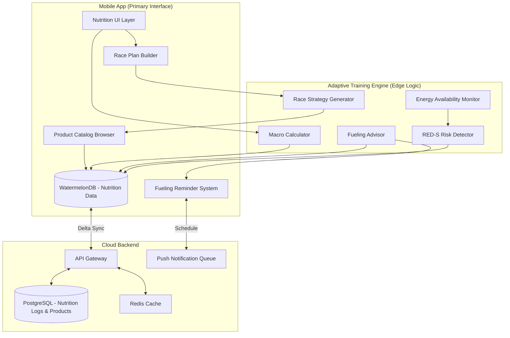

# RFC 0011: Nutrition & Fueling System

| Status        | Draft |
| :---          | :--- |
| **RFC #**     | 0011 |
| **Author(s)** | Sports Science Lead |
| **Created**   | 2025-11-26 |
| **Updated**   | 2025-11-27 |
| **Related PRD** | [10_NUTRITION_FUELING.md](file:///Users/maksat/Projects/RunningCoach/RunningCoach/docs/prd/10_NUTRITION_FUELING.md) |

## 1. Introduction

### 1.1. Context

This RFC defines the implementation details for the Nutrition & Fueling system as described in PRD `10_NUTRITION_FUELING.md`. This system provides evidence-based nutrition guidance and fueling strategies for daily training and race day execution.

Proper nutrition is a controllable variable that significantly impacts training adaptation, recovery, and race performance. Research demonstrates that:
- Carbohydrate periodization (5-12 g/kg/day) optimizes training adaptation and glycogen availability
- Dual-source carbohydrate intake (60-90g/hour glucose:fructose 2:1) improves marathon performance by 8-19%
- Modern carb loading protocols (10-12 g/kg for 36-48 hours) increase glycogen stores by 90% without depletion phases
- Protein timing (0.3 g/kg every 3-5 hours) maximizes muscle protein synthesis and recovery

The system must support:
- Dynamic macronutrient targets based on training phase and daily load
- Pre-workout, during-workout, and post-workout fueling protocols
- Race week carb loading guidance
- Race day execution strategy with gut training protocols
- RED-S (Relative Energy Deficiency in Sport) risk detection
- Integration with training load and adaptation status

### 1.2. Problem Statement

Marathon training creates highly variable daily energy and macronutrient demands. A runner's nutrition needs on an easy recovery day (5 g/kg carbs) are drastically different from a 3-hour long run day (10-12 g/kg carbs). We need a system that:

**Technical Challenges:**
1. **Dynamic Target Calculation:** Nutrition targets must recalculate daily based on training load, phase, and workout type
2. **Context-Aware Guidance:** System must provide timely reminders (e.g., "Fuel within 30 min post-workout") based on workout completion
3. **Race Day Complexity:** Marathon fueling requires minute-by-minute execution plans with product-specific recommendations
4. **Gut Training Protocol:** Need to track fueling tolerance over multiple long runs to build race day confidence
5. **RED-S Detection:** Must monitor energy availability (EA = Energy Intake - Exercise Energy / FFM) and flag dangerous patterns
6. **Product Database:** Need searchable catalog of gels, chews, drinks with accurate carb/sodium content for planning
7. **Offline Functionality:** Nutrition guidance must work during workouts without connectivity

### 1.3. Goals & Non-Goals

**Goals:**
- Calculate dynamic daily macronutrient targets based on training phase and load
- Provide context-aware fueling reminders (pre/during/post-workout)
- Generate race day fueling execution plans with product-specific recommendations
- Track gut training progression across long runs (tolerance, GI distress)
- Detect RED-S risk patterns using energy availability calculations
- Support comprehensive fueling product database (gels, chews, drinks, real food)
- Enable "Train Low" (fasted training) protocols for metabolic adaptations
- Calculate hydration needs with sodium targets for heavy sweaters
- Deliver all guidance offline-first

**Non-Goals:**
- Full meal planning with recipes (focus on macro targets, not meal design)
- Calorie counting for weight loss/gain (performance nutrition only)
- Supplement recommendations (legal/liability considerations)
- Integration with food tracking apps (MyFitnessPal, Cronometer) - future consideration
- Detailed micronutrient tracking (vitamins, minerals) - beyond MVP scope
- Personalized metabolic testing integration (RMR, substrate utilization) - future premium feature

### 1.4. Dependencies

**Related PRDs:**
- [00_OVERARCHING_VISION.md](file:///Users/maksat/Projects/RunningCoach/RunningCoach/docs/prd/00_OVERARCHING_VISION.md) - Holistic training philosophy
- [10_NUTRITION_FUELING.md](file:///Users/maksat/Projects/RunningCoach/RunningCoach/docs/prd/10_NUTRITION_FUELING.md) - Product requirements
- [06_ADAPTIVE_TRAINING_ENGINE.md](file:///Users/maksat/Projects/RunningCoach/RunningCoach/docs/prd/06_ADAPTIVE_TRAINING_ENGINE.md) - Training phase context
- [07_LOAD_MANAGEMENT.md](file:///Users/maksat/Projects/RunningCoach/RunningCoach/docs/prd/07_LOAD_MANAGEMENT.md) - Training load data

**Related RFCs:**
- [RFC 0001: System Architecture](file:///Users/maksat/Projects/RunningCoach/RunningCoach/docs/rfc/0001-system-architecture.md) - Foundation
- [RFC 0005: Adaptive Training Engine](file:///Users/maksat/Projects/RunningCoach/RunningCoach/docs/rfc/0005-adaptive-training-engine.md) - Training phase logic
- [RFC 0006: Sync Infrastructure](file:///Users/maksat/Projects/RunningCoach/RunningCoach/docs/rfc/0006-sync-infrastructure.md) - Offline sync

**External Dependencies:**
- USDA FoodData Central API (optional for real food nutrition data)
- Push notification service (for timely fueling reminders)
- Local notification scheduling (iOS/Android native)

### 1.5. Success Metrics

**Technical Metrics:**
- Nutrition targets calculate in < 100ms
- Fueling reminders trigger within 30 seconds of workout completion
- Race plan generator creates full plan in < 500ms
- Offline functionality: 100% of guidance available without connectivity
- Sync latency < 2s for nutrition logs

**Product Metrics:**
- 80% adherence to high-carb days (proper fueling for key workouts)
- 90% of long runs include practiced fueling (gut training protocol)
- 50% reduction in GI distress reports over 8-week gut training period
- 95% of users complete race with planned fueling strategy
- RED-S risk flags identify at-risk athletes within 2 weeks of onset

---

## 2. Proposed Solution

### 2.1. High-Level Design

The Nutrition & Fueling system consists of four main components:

1. **Macro Calculator:** Computes daily macronutrient targets based on training phase, load, and user profile
2. **Fueling Advisor:** Provides context-aware guidance for pre/during/post-workout nutrition
3. **Race Strategy Builder:** Generates minute-by-minute race day fueling execution plans
4. **Energy Monitor:** Tracks energy availability and detects RED-S risk patterns



**Key Architectural Decisions:**

1. **Edge-Based Calculation:** All macro calculations run locally in the Adaptive Training Engine for instant, offline availability
2. **Contextual Triggers:** Fueling reminders triggered by workout state changes (pre-workout, completed, upcoming long run)
3. **Local Product Database:** Comprehensive fueling product catalog cached locally for offline race plan building
4. **Passive Monitoring:** RED-S detection runs automatically via background analysis, no user action required
5. **Notification-Driven UX:** System proactively surfaces guidance at optimal times rather than requiring manual checking

### 2.2. Detailed Design

#### 2.2.1. Daily Macro Calculator

**Purpose:** Calculate daily macronutrient targets based on training phase, daily load, and user body weight.

**Algorithm:**

```typescript
interface UserProfile {
  bodyWeight: number; // kg
  sex: 'male' | 'female';
  fatFreeMass?: number; // kg (if body composition known)
}

interface DailyTrainingLoad {
  trainingPhase: 'base' | 'build' | 'peak' | 'taper' | 'recovery';
  plannedDuration: number; // minutes
  plannedIntensity: 'easy' | 'moderate' | 'hard' | 'race';
  workoutType: 'easy' | 'threshold' | 'intervals' | 'long' | 'race' | 'strength' | 'rest';
  estimatedEnergyExpenditure?: number; // kcal (from workout prediction)
}

interface MacroTargets {
  carbs: {
    min: number; // grams
    max: number; // grams
    perKg: number; // g/kg
  };
  protein: {
    min: number; // grams
    max: number; // grams
    perKg: number; // g/kg
  };
  fat: {
    min: number; // grams
    percentOfTotal: number; // % of total energy
  };
  totalEnergyTarget: number; // kcal
  rationale: string; // human-readable explanation
}

function calculateDailyMacros(
  user: UserProfile,
  load: DailyTrainingLoad
): MacroTargets {
  const { bodyWeight } = user;
  const { plannedDuration, plannedIntensity, workoutType, trainingPhase } = load;

  // Carbohydrate Target Logic
  let carbsPerKg: number;

  if (workoutType === 'rest') {
    carbsPerKg = 5; // 5 g/kg on rest days
  } else if (plannedDuration < 60) {
    carbsPerKg = 5; // Light day: 5 g/kg
  } else if (plannedDuration >= 60 && plannedDuration < 120) {
    carbsPerKg = 6; // Moderate day: 6 g/kg
  } else if (plannedDuration >= 120 && plannedDuration < 180) {
    carbsPerKg = 8; // Heavy day: 8 g/kg
  } else {
    carbsPerKg = 10; // Very heavy day (3+ hours): 10 g/kg
  }

  // Phase Modifiers
  if (trainingPhase === 'peak') {
    carbsPerKg += 1; // Increase carbs during peak training
  } else if (trainingPhase === 'taper') {
    carbsPerKg -= 1; // Reduce carbs during taper (unless race week)
  }

  // Race Week Carb Loading (if within 48 hours of goal race)
  // Handled by separate race week protocol (see 2.2.4)

  // Protein Target Logic
  let proteinPerKg: number;

  if (trainingPhase === 'base' || trainingPhase === 'build') {
    proteinPerKg = 1.6; // Higher protein during strength-focused phases
  } else if (plannedIntensity === 'hard' || workoutType === 'intervals') {
    proteinPerKg = 1.8; // Highest protein on hard training days
  } else {
    proteinPerKg = 1.4; // Baseline protein
  }

  // Calculate absolute targets
  const carbsMin = Math.round(carbsPerKg * bodyWeight);
  const carbsMax = Math.round((carbsPerKg + 1) * bodyWeight); // Range of 1 g/kg

  const proteinMin = Math.round(proteinPerKg * bodyWeight);
  const proteinMax = Math.round((proteinPerKg + 0.4) * bodyWeight);

  // Fat target: minimum 20% of total energy
  const carbCalories = carbsMin * 4; // 4 kcal/g
  const proteinCalories = proteinMin * 4; // 4 kcal/g
  const totalEnergyTarget = carbCalories + proteinCalories + (load.estimatedEnergyExpenditure || 0);
  const fatMinCalories = totalEnergyTarget * 0.2;
  const fatMin = Math.round(fatMinCalories / 9); // 9 kcal/g

  const rationale = generateRationale(load, carbsPerKg, proteinPerKg);

  return {
    carbs: {
      min: carbsMin,
      max: carbsMax,
      perKg: carbsPerKg,
    },
    protein: {
      min: proteinMin,
      max: proteinMax,
      perKg: proteinPerKg,
    },
    fat: {
      min: fatMin,
      percentOfTotal: 20,
    },
    totalEnergyTarget,
    rationale,
  };
}

function generateRationale(
  load: DailyTrainingLoad,
  carbsPerKg: number,
  proteinPerKg: number
): string {
  const { plannedDuration, workoutType, trainingPhase } = load;

  if (workoutType === 'long') {
    return `Long run day (${Math.round(plannedDuration / 60)}h): High carbs (${carbsPerKg} g/kg) to fuel glycogen stores and support recovery.`;
  } else if (workoutType === 'intervals' || workoutType === 'threshold') {
    return `Quality workout day: Elevated carbs (${carbsPerKg} g/kg) and protein (${proteinPerKg} g/kg) for performance and repair.`;
  } else if (workoutType === 'rest') {
    return `Rest day: Moderate carbs (${carbsPerKg} g/kg) to maintain baseline glycogen without overconsuming.`;
  } else if (trainingPhase === 'peak') {
    return `Peak training phase: Maximum carbs (${carbsPerKg} g/kg) to support high training volume.`;
  } else {
    return `Moderate training day: Balanced macros (${carbsPerKg} g/kg carbs, ${proteinPerKg} g/kg protein) for training and recovery.`;
  }
}
```

**Output Display:**

```typescript
interface DailyNutritionCard {
  date: Date;
  macros: MacroTargets;
  todaysWorkout: string; // e.g., "16km Easy Run"
  keyMessage: string; // e.g., "High-carb day! Fuel your long run."
  mealSuggestions?: string[]; // Optional simple suggestions
}
```

#### 2.2.2. Workout Fueling Advisor

**Purpose:** Provide context-aware fueling guidance before, during, and after workouts.

**Pre-Workout Fueling Protocol:**

```typescript
interface PreWorkoutGuidance {
  timing: string; // e.g., "1-4 hours before"
  carbTarget: number; // grams
  guidance: string;
  examples: string[];
}

function getPreWorkoutGuidance(
  workout: ScheduledWorkout,
  timeUntilWorkout: number // minutes
): PreWorkoutGuidance {
  const { duration, intensity } = workout;

  if (timeUntilWorkout >= 180 && timeUntilWorkout <= 240) {
    // 3-4 hours out: Large meal
    return {
      timing: '3-4 hours before',
      carbTarget: Math.round(1.5 * user.bodyWeight), // 1-4 g/kg (using conservative 1.5)
      guidance: 'Eat a substantial meal with easily digestible carbs, moderate protein, low fat/fiber.',
      examples: [
        'Oatmeal with banana and honey',
        'White rice with chicken breast',
        'Pasta with tomato sauce',
        'Bagel with peanut butter and jam',
      ],
    };
  } else if (timeUntilWorkout >= 45 && timeUntilWorkout <= 90) {
    // 1 hour out: Snack
    return {
      timing: '1 hour before',
      carbTarget: Math.round(0.7 * user.bodyWeight), // 0.5-1 g/kg
      guidance: 'Have a light snack with fast-acting carbs. Avoid fat, fiber, and protein.',
      examples: [
        'Toast with jam',
        'Sports drink',
        'Banana',
        'Energy bar (low fiber)',
      ],
    };
  } else if (timeUntilWorkout <= 30) {
    // 15-30 min out: Gel/quick carb
    return {
      timing: '15-30 min before',
      carbTarget: 15,
      guidance: 'Optional quick carb boost if feeling low energy. Not necessary for easy runs.',
      examples: ['Energy gel', 'Sports drink', 'Few dates'],
    };
  }

  return null; // No guidance needed
}
```

**During-Workout Fueling Protocol:**

```typescript
interface DuringWorkoutGuidance {
  required: boolean;
  carbsPerHour: number; // grams
  strategy: string;
  products: FuelingProduct[];
  schedule: FuelingEvent[];
}

interface FuelingEvent {
  time: number; // minutes into workout
  carbs: number; // grams
  product: string;
  instruction: string;
}

function getDuringWorkoutGuidance(workout: ScheduledWorkout): DuringWorkoutGuidance {
  const { duration, type } = workout;

  if (duration < 45) {
    return {
      required: false,
      carbsPerHour: 0,
      strategy: 'No fueling needed for workouts under 45 minutes.',
      products: [],
      schedule: [],
    };
  } else if (duration >= 45 && duration < 75) {
    return {
      required: false,
      carbsPerHour: 0,
      strategy: 'Optional carb mouth rinse (sip sports drink, spit out) for psychological benefit.',
      products: [],
      schedule: [],
    };
  } else if (duration >= 75 && duration < 150) {
    // 1-2.5 hours: 30-60g/hour (single source)
    return {
      required: true,
      carbsPerHour: 45,
      strategy: '30-60g carbs/hour using single-source glucose (maltodextrin gels/drinks).',
      products: getProductRecommendations('single-source', 45),
      schedule: generateFuelingSchedule(duration, 45, 'single'),
    };
  } else {
    // 2.5+ hours (long runs, marathon): 60-90g/hour (dual source)
    return {
      required: true,
      carbsPerHour: 75,
      strategy: '60-90g carbs/hour using dual-source glucose:fructose 2:1 ratio for maximum absorption.',
      products: getProductRecommendations('dual-source', 75),
      schedule: generateFuelingSchedule(duration, 75, 'dual'),
    };
  }
}

function generateFuelingSchedule(
  duration: number,
  carbsPerHour: number,
  sourceType: 'single' | 'dual'
): FuelingEvent[] {
  const schedule: FuelingEvent[] = [];
  const intervalMinutes = 20; // Fuel every 20 minutes
  const carbsPerInterval = (carbsPerHour / 60) * intervalMinutes;

  let currentTime = 20; // Start fueling at 20 min mark

  while (currentTime < duration) {
    schedule.push({
      time: currentTime,
      carbs: Math.round(carbsPerInterval),
      product: 'Energy Gel (25g) or 200ml Sports Drink',
      instruction: `At ${currentTime} min: Consume ${Math.round(carbsPerInterval)}g carbs`,
    });
    currentTime += intervalMinutes;
  }

  return schedule;
}
```

**Post-Workout Recovery Nutrition:**

```typescript
interface PostWorkoutGuidance {
  urgency: 'immediate' | 'standard';
  carbTarget: number;
  proteinTarget: number;
  timing: string;
  rationale: string;
}

function getPostWorkoutGuidance(
  completedWorkout: Activity,
  nextWorkout?: ScheduledWorkout
): PostWorkoutGuidance {
  const hoursUntilNextWorkout = nextWorkout
    ? (nextWorkout.scheduledDate.getTime() - completedWorkout.endTime.getTime()) / (1000 * 60 * 60)
    : 24;

  if (hoursUntilNextWorkout < 8) {
    // Rapid recovery needed
    return {
      urgency: 'immediate',
      carbTarget: Math.round(1.2 * user.bodyWeight), // 1.0-1.2 g/kg per hour for 4 hours
      proteinTarget: Math.round(0.3 * user.bodyWeight), // 0.3 g/kg
      timing: 'Within 30 minutes. Repeat every hour for 4 hours.',
      rationale: 'Quick turnaround before next workout. Maximize glycogen resynthesis.',
    };
  } else if (completedWorkout.type === 'long' || completedWorkout.type === 'intervals') {
    // Quality workout, normal recovery
    return {
      urgency: 'standard',
      carbTarget: Math.round(0.8 * user.bodyWeight),
      proteinTarget: Math.round(0.3 * user.bodyWeight),
      timing: 'Within 2 hours post-workout.',
      rationale: 'Quality session completed. Prioritize recovery meal with carbs and protein.',
    };
  } else {
    // Easy run, daily totals matter most
    return {
      urgency: 'standard',
      carbTarget: Math.round(0.5 * user.bodyWeight),
      proteinTarget: Math.round(0.25 * user.bodyWeight),
      timing: 'Within 2-4 hours. Daily totals matter most.',
      rationale: 'Easy run completed. No rush, focus on meeting daily macro targets.',
    };
  }
}
```

#### 2.2.3. Race Strategy Builder

**Purpose:** Generate minute-by-minute race day fueling execution plans with product-specific recommendations.

**Race Week Carb Loading Protocol:**

```typescript
interface CarbLoadingProtocol {
  startDate: Date; // 48 hours before race
  endDate: Date; // race morning
  dailyCarbTarget: number; // 10-12 g/kg
  expectedWeightGain: string; // "1-2kg (water + glycogen)"
  guidance: string;
  mealExamples: string[];
}

function getCarbLoadingProtocol(
  raceDate: Date,
  user: UserProfile
): CarbLoadingProtocol {
  const startDate = new Date(raceDate);
  startDate.setHours(startDate.getHours() - 48); // 48 hours before

  const carbTarget = Math.round(11 * user.bodyWeight); // 10-12 g/kg (using 11 as midpoint)

  return {
    startDate,
    endDate: raceDate,
    dailyCarbTarget: carbTarget,
    expectedWeightGain: '1-2kg (water stored with glycogen, beneficial for hydration)',
    guidance: `For 48 hours before race, consume ${carbTarget}g carbs per day. Reduce fat and fiber, increase simple carbs. No depletion phase needed.`,
    mealExamples: [
      `Breakfast: White toast with jam, banana, orange juice (80-100g carbs)`,
      `Snack: Sports drink, pretzels (50g carbs)`,
      `Lunch: White rice with chicken, white bread (120g carbs)`,
      `Snack: Bagel with honey (60g carbs)`,
      `Dinner: Pasta with tomato sauce, white bread (150g carbs)`,
      `Evening: Rice cakes, sports drink (40g carbs)`,
    ],
  };
}
```

**Race Day Execution Plan:**

```typescript
interface RaceDayPlan {
  raceDistance: number; // km
  estimatedFinishTime: number; // minutes
  preRaceFueling: {
    timing: string;
    carbTarget: number;
    mealSuggestion: string;
  };
  duringRaceFueling: {
    totalCarbsNeeded: number;
    carbsPerHour: number;
    fuelingEvents: RaceFuelingEvent[];
  };
  hydrationStrategy: {
    fluidPerHour: number; // ml
    sodiumPerHour: number; // mg
    guidance: string;
  };
  caffeineStrategy?: {
    dosage: number; // mg
    timing: string;
  };
}

interface RaceFuelingEvent {
  distanceMarker: number; // km
  timeEstimate: number; // minutes
  product: FuelingProduct;
  carbs: number;
  instruction: string;
}

function generateRaceDayPlan(
  race: Goal,
  user: UserProfile,
  gutTrainingHistory: GutTrainingLog[]
): RaceDayPlan {
  const { distance, targetTime } = race;
  const estimatedFinishTime = targetTime || predictFinishTime(user, distance);

  // Pre-Race Fueling
  const preRace = {
    timing: '3-4 hours before race start',
    carbTarget: Math.round(3 * user.bodyWeight), // 1-4 g/kg, using 3 as recommended
    mealSuggestion: 'Familiar breakfast: white toast with jam, banana, coffee. Low fiber/fat.',
  };

  // During-Race Fueling (60-90g/hour)
  const hoursOfRace = estimatedFinishTime / 60;
  const carbsPerHour = determineRaceCarbsPerHour(gutTrainingHistory, hoursOfRace);
  const totalCarbsNeeded = Math.round(carbsPerHour * hoursOfRace);

  // Generate fueling event schedule
  const fuelingEvents = generateRaceFuelingSchedule(
    distance,
    estimatedFinishTime,
    carbsPerHour,
    user.preferredProducts
  );

  // Hydration Strategy
  const hydration = {
    fluidPerHour: 500, // ml (drink to thirst, not on schedule)
    sodiumPerHour: user.isHeavySweater ? 600 : 400, // mg
    guidance: 'Drink to thirst at aid stations. Do not overdrink (hyponatremia risk).',
  };

  // Caffeine Strategy
  const caffeine = user.bodyWeight > 0
    ? {
        dosage: Math.round(4 * user.bodyWeight), // 3-6 mg/kg
        timing: '60 minutes before race start',
      }
    : undefined;

  return {
    raceDistance: distance,
    estimatedFinishTime,
    preRaceFueling: preRace,
    duringRaceFueling: {
      totalCarbsNeeded,
      carbsPerHour,
      fuelingEvents,
    },
    hydrationStrategy: hydration,
    caffeineStrategy: caffeine,
  };
}

function generateRaceFuelingSchedule(
  distance: number,
  estimatedFinishTime: number,
  carbsPerHour: number,
  preferredProducts?: FuelingProduct[]
): RaceFuelingEvent[] {
  const events: RaceFuelingEvent[] = [];
  const pacePerKm = estimatedFinishTime / distance; // min/km
  const fuelingIntervalKm = 5; // Every 5km
  const carbsPerInterval = (carbsPerHour / 60) * (fuelingIntervalKm * pacePerKm);

  let currentDistance = 5; // Start fueling at 5km

  while (currentDistance < distance) {
    const timeEstimate = Math.round(currentDistance * pacePerKm);
    const product = selectFuelingProduct(preferredProducts, carbsPerInterval);

    events.push({
      distanceMarker: currentDistance,
      timeEstimate,
      product,
      carbs: Math.round(carbsPerInterval),
      instruction: `At ${currentDistance}km (~${Math.round(timeEstimate)} min): ${product.name} (${product.carbsPerServing}g carbs)`,
    });

    currentDistance += fuelingIntervalKm;
  }

  return events;
}

function determineRaceCarbsPerHour(
  gutTrainingHistory: GutTrainingLog[],
  raceHours: number
): number {
  // Start conservative (60g/hour), increase based on gut training success
  const successfulHighIntakeRuns = gutTrainingHistory.filter(
    (log) => log.carbsPerHour >= 75 && log.giDistress === 'none'
  ).length;

  if (successfulHighIntakeRuns >= 3 && raceHours > 2.5) {
    return 90; // Trained for high intake, long race
  } else if (successfulHighIntakeRuns >= 1 && raceHours > 2.5) {
    return 75; // Some gut training, long race
  } else if (raceHours > 2.5) {
    return 60; // No gut training, play it safe
  } else {
    return 45; // Shorter race, lower intake needed
  }
}
```

#### 2.2.4. Fueling Product Database

**Purpose:** Comprehensive catalog of energy gels, chews, drinks, and real food with accurate macronutrient data.

```typescript
enum ProductCategory {
  GEL = 'gel',
  CHEW = 'chew',
  DRINK = 'drink',
  BAR = 'bar',
  REAL_FOOD = 'real_food',
}

enum CarbSource {
  GLUCOSE = 'glucose', // Maltodextrin, dextrose
  FRUCTOSE = 'fructose',
  SUCROSE = 'sucrose', // Table sugar (50/50 glucose/fructose)
  DUAL_SOURCE = 'dual_source', // 2:1 glucose:fructose
}

interface FuelingProduct {
  id: string;
  name: string;
  brand: string;
  category: ProductCategory;

  // Nutrition per serving
  carbsPerServing: number; // grams
  carbSource: CarbSource;
  sodiumPerServing: number; // mg
  caffeinePerServing?: number; // mg
  calories: number;

  // Practical details
  servingSize: string; // "1 gel", "200ml", "1 chew"
  flavor?: string;

  // User metadata
  isPracticed: boolean; // Has user successfully used in training?
  giDistressReports: number; // Count of GI issues
  lastUsedDate?: Date;
  userRating?: number; // 1-5 stars

  // Metadata
  imageUrl?: string;
  purchaseUrl?: string;
  createdAt: Date;
  updatedAt: Date;
}

// Example Product Database
const FUELING_PRODUCTS: FuelingProduct[] = [
  {
    id: 'maurten-gel100',
    name: 'Gel 100',
    brand: 'Maurten',
    category: ProductCategory.GEL,
    carbsPerServing: 25,
    carbSource: CarbSource.DUAL_SOURCE,
    sodiumPerServing: 43,
    calories: 100,
    servingSize: '1 gel (40g)',
  },
  {
    id: 'sis-isotonic-gel',
    name: 'GO Isotonic Energy Gel',
    brand: 'Science in Sport',
    category: ProductCategory.GEL,
    carbsPerServing: 22,
    carbSource: CarbSource.GLUCOSE,
    sodiumPerServing: 55,
    calories: 87,
    servingSize: '1 gel (60ml)',
  },
  {
    id: 'tailwind-endurance',
    name: 'Endurance Fuel',
    brand: 'Tailwind',
    category: ProductCategory.DRINK,
    carbsPerServing: 25,
    carbSource: CarbSource.DUAL_SOURCE,
    sodiumPerServing: 303,
    calories: 100,
    servingSize: '200ml (1 scoop)',
  },
  {
    id: 'banana',
    name: 'Banana',
    brand: 'Real Food',
    category: ProductCategory.REAL_FOOD,
    carbsPerServing: 27,
    carbSource: CarbSource.FRUCTOSE,
    sodiumPerServing: 1,
    calories: 105,
    servingSize: '1 medium banana',
  },
  // ... 20-30 more products
];
```

#### 2.2.5. Gut Training Tracker

**Purpose:** Track fueling tolerance across long runs to build race day confidence and minimize GI distress.

```typescript
interface GutTrainingLog {
  id: string;
  userId: string;
  activityId: string; // Link to completed Activity
  date: Date;

  // Workout details
  duration: number; // minutes
  distance: number; // km
  workoutType: 'long' | 'race_pace' | 'race';

  // Fueling details
  productsConsumed: {
    product: FuelingProduct;
    quantity: number;
    timeConsumed: number; // minutes into workout
  }[];
  totalCarbs: number; // grams
  carbsPerHour: number; // calculated

  // Outcomes
  giDistress: 'none' | 'mild' | 'moderate' | 'severe';
  distressSymptoms?: string[]; // ['nausea', 'cramping', 'bloating', 'diarrhea']
  distressOnsetTime?: number; // minutes into workout
  energyLevel: 1 | 2 | 3 | 4 | 5; // How did you feel energetically?

  // Notes
  notes?: string;

  // Metadata
  createdAt: Date;
  updatedAt: Date;
}

interface GutTrainingProgress {
  totalLongRuns: number;
  runsWithFueling: number;
  adherenceRate: number; // % of long runs with fueling

  // Tolerance progression
  averageCarbsPerHour: number;
  maxToleratedCarbsPerHour: number;
  giDistressRate: number; // % of runs with moderate/severe distress

  // Readiness assessment
  raceReady: boolean; // Have they practiced 75-90g/hr successfully?
  recommendedRaceCarbsPerHour: number;
}

function calculateGutTrainingProgress(logs: GutTrainingLog[]): GutTrainingProgress {
  const totalRuns = logs.length;
  const runsWithFueling = logs.filter((log) => log.totalCarbs > 0).length;
  const adherenceRate = (runsWithFueling / totalRuns) * 100;

  const carbsPerHourValues = logs.map((log) => log.carbsPerHour);
  const averageCarbsPerHour = carbsPerHourValues.reduce((a, b) => a + b, 0) / carbsPerHourValues.length;

  const successfulRuns = logs.filter(
    (log) => log.giDistress === 'none' || log.giDistress === 'mild'
  );
  const maxToleratedCarbsPerHour = Math.max(...successfulRuns.map((log) => log.carbsPerHour));

  const distressRuns = logs.filter(
    (log) => log.giDistress === 'moderate' || log.giDistress === 'severe'
  ).length;
  const giDistressRate = (distressRuns / totalRuns) * 100;

  const highIntakeSuccessful = successfulRuns.filter((log) => log.carbsPerHour >= 75).length >= 2;
  const raceReady = highIntakeSuccessful;

  const recommendedRaceCarbsPerHour = raceReady
    ? Math.min(maxToleratedCarbsPerHour, 90)
    : Math.min(maxToleratedCarbsPerHour, 60);

  return {
    totalLongRuns: totalRuns,
    runsWithFueling,
    adherenceRate,
    averageCarbsPerHour,
    maxToleratedCarbsPerHour,
    giDistressRate,
    raceReady,
    recommendedRaceCarbsPerHour,
  };
}
```

#### 2.2.6. RED-S Risk Detection

**Purpose:** Monitor energy availability and detect Relative Energy Deficiency in Sport (RED-S) risk patterns.

**Energy Availability Calculation:**

```typescript
interface EnergyAvailability {
  date: Date;
  energyIntake: number; // kcal (self-reported or estimated)
  exerciseEnergyExpenditure: number; // kcal (calculated from workouts)
  fatFreeMass: number; // kg (estimated if not measured)
  ea: number; // Energy Availability = (EI - EEE) / FFM
  status: 'optimal' | 'low' | 'critical';
}

enum REDSRiskLevel {
  LOW = 'low',
  MODERATE = 'moderate',
  HIGH = 'high',
  CRITICAL = 'critical',
}

interface REDSRiskAssessment {
  riskLevel: REDSRiskLevel;
  indicators: string[];
  recommendedActions: string[];
  weeksAtRisk: number;
}

function calculateEnergyAvailability(
  user: UserProfile,
  dailyEnergyIntake: number,
  workouts: Activity[]
): EnergyAvailability {
  const exerciseEnergyExpenditure = workouts.reduce(
    (total, workout) => total + (workout.estimatedCalories || 0),
    0
  );

  const fatFreeMass = user.fatFreeMass || estimateFatFreeMass(user.bodyWeight, user.sex);
  const ea = (dailyEnergyIntake - exerciseEnergyExpenditure) / fatFreeMass;

  let status: 'optimal' | 'low' | 'critical';
  if (ea >= 30) {
    status = 'optimal'; // EA > 30 kcal/kg FFM/day
  } else if (ea >= 20) {
    status = 'low'; // EA 20-30 kcal/kg FFM/day (subclinical)
  } else {
    status = 'critical'; // EA < 20 kcal/kg FFM/day (clinical RED-S)
  }

  return {
    date: new Date(),
    energyIntake: dailyEnergyIntake,
    exerciseEnergyExpenditure,
    fatFreeMass,
    ea,
    status,
  };
}

function assessREDSRisk(
  user: UserProfile,
  eaHistory: EnergyAvailability[],
  bodyMetrics: BodyMetrics[]
): REDSRiskAssessment {
  const indicators: string[] = [];
  let riskScore = 0;

  // Energy Availability: Prolonged low EA (most important indicator)
  const recentEA = eaHistory.slice(-14); // Last 2 weeks
  const lowEADays = recentEA.filter((ea) => ea.ea < 30).length;
  const weeksAtRisk = Math.floor(lowEADays / 7);

  if (lowEADays >= 10) {
    indicators.push(`Low energy availability for ${lowEADays} of last 14 days (EA < 30 kcal/kg FFM)`);
    riskScore += 3;
  } else if (lowEADays >= 5) {
    indicators.push(`Borderline energy availability for ${lowEADays} days`);
    riskScore += 1;
  }

  // Resting Heart Rate: Significant drop (cardiovascular impairment)
  const recentRHR = bodyMetrics.slice(-14).map((m) => m.restingHR);
  const avgRHRRecent = recentRHR.reduce((a, b) => a + b, 0) / recentRHR.length;
  const baselineRHR = bodyMetrics.slice(-90, -30).map((m) => m.restingHR);
  const avgRHRBaseline = baselineRHR.reduce((a, b) => a + b, 0) / baselineRHR.length;

  if (avgRHRRecent < avgRHRBaseline - 5) {
    indicators.push(`Resting HR dropped ${Math.round(avgRHRBaseline - avgRHRRecent)} bpm (possible cardiovascular impairment)`);
    riskScore += 2;
  }

  // HRV: Significant drop (autonomic dysfunction)
  const recentHRV = bodyMetrics.slice(-14).map((m) => m.hrv);
  const avgHRVRecent = recentHRV.reduce((a, b) => a + b, 0) / recentHRV.length;
  const baselineHRV = bodyMetrics.slice(-90, -30).map((m) => m.hrv);
  const avgHRVBaseline = baselineHRV.reduce((a, b) => a + b, 0) / baselineHRV.length;

  if (avgHRVRecent < avgHRVBaseline * 0.8) {
    indicators.push(`HRV dropped ${Math.round(((avgHRVBaseline - avgHRVRecent) / avgHRVBaseline) * 100)}% (possible autonomic dysfunction)`);
    riskScore += 2;
  }

  // Weight Loss: Significant unintentional weight loss
  const recentWeight = bodyMetrics[bodyMetrics.length - 1]?.weight;
  const baselineWeight = bodyMetrics[Math.max(0, bodyMetrics.length - 90)]?.weight;
  if (recentWeight && baselineWeight && recentWeight < baselineWeight * 0.95) {
    const weightLoss = baselineWeight - recentWeight;
    indicators.push(`Unintentional weight loss of ${weightLoss.toFixed(1)}kg in last 3 months`);
    riskScore += 2;
  }

  // Menstrual Dysfunction (female athletes)
  if (user.sex === 'female' && user.menstrualCycleDays) {
    const recentCycles = user.menstrualCycleDays.slice(-3);
    const irregularCycles = recentCycles.filter(
      (cycle) => cycle < 21 || cycle > 35 || cycle === 0
    ).length;

    if (irregularCycles >= 2) {
      indicators.push('Menstrual irregularities detected (oligomenorrhea/amenorrhea)');
      riskScore += 3; // High priority indicator
    }
  }

  // Subjective Recovery: Persistently poor recovery
  const recentRecovery = bodyMetrics.slice(-14).map((m) => m.readinessScore);
  const avgRecovery = recentRecovery.reduce((a, b) => a + b, 0) / recentRecovery.length;
  if (avgRecovery < 4) {
    indicators.push(`Poor recovery scores (avg ${avgRecovery.toFixed(1)}/7 over 14 days)`);
    riskScore += 1;
  }

  // Determine Risk Level
  let riskLevel: REDSRiskLevel;
  if (riskScore >= 7) {
    riskLevel = REDSRiskLevel.CRITICAL;
  } else if (riskScore >= 4) {
    riskLevel = REDSRiskLevel.HIGH;
  } else if (riskScore >= 2) {
    riskLevel = REDSRiskLevel.MODERATE;
  } else {
    riskLevel = REDSRiskLevel.LOW;
  }

  // Recommended Actions
  const actions: string[] = [];
  if (riskLevel === REDSRiskLevel.CRITICAL || riskLevel === REDSRiskLevel.HIGH) {
    actions.push('Consult with a sports medicine physician or registered dietitian immediately');
    actions.push('Consider reducing training volume by 20-30% until energy balance improves');
    actions.push('Increase daily caloric intake by 300-500 kcal, focusing on carbohydrates');
  } else if (riskLevel === REDSRiskLevel.MODERATE) {
    actions.push('Monitor energy intake closely and aim to meet daily macro targets');
    actions.push('Ensure at least 1 full rest day per week');
    actions.push('Consider consulting with a sports nutritionist');
  } else {
    actions.push('Continue monitoring energy availability and body metrics');
  }

  return {
    riskLevel,
    indicators,
    recommendedActions: actions,
    weeksAtRisk,
  };
}

function estimateFatFreeMass(bodyWeight: number, sex: 'male' | 'female'): number {
  // Rough estimation based on typical body fat % for athletes
  const typicalBodyFatPercent = sex === 'male' ? 0.10 : 0.18; // 10% male, 18% female
  return bodyWeight * (1 - typicalBodyFatPercent);
}
```

### 2.3. Data Model Changes

**Prisma Schema Additions:**

```prisma
// Nutrition-related models

model DailyNutrition {
  id        String   @id @default(cuid())
  userId    String
  user      User     @relation(fields: [userId], references: [id], onDelete: Cascade)
  date      DateTime @db.Date

  // Calculated targets (from Macro Calculator)
  targetCarbs    Float // grams
  targetProtein  Float // grams
  targetFat      Float // grams
  targetCalories Float // kcal
  rationale      String // human-readable explanation

  // Actual intake (optional logging)
  actualCarbs    Float? // grams
  actualProtein  Float? // grams
  actualFat      Float? // grams
  actualCalories Float? // kcal

  // Energy Availability tracking
  exerciseEnergyExpenditure Float? // kcal (from workouts)
  energyAvailability        Float? // kcal/kg FFM/day
  eaStatus                  String? // 'optimal' | 'low' | 'critical'

  // Sync metadata
  status       String   @default("synced") // 'synced' | 'created' | 'updated'
  lastSyncedAt DateTime @default(now())
  createdAt    DateTime @default(now())
  updatedAt    DateTime @updatedAt

  @@unique([userId, date])
  @@index([userId, date])
}

model FuelingProduct {
  id       String @id @default(cuid())
  name     String
  brand    String
  category String // 'gel' | 'chew' | 'drink' | 'bar' | 'real_food'

  // Nutrition per serving
  carbsPerServing    Float
  carbSource         String // 'glucose' | 'fructose' | 'sucrose' | 'dual_source'
  sodiumPerServing   Float // mg
  caffeinePerServing Float? // mg
  calories           Float

  // Practical details
  servingSize String
  flavor      String?

  // Content
  imageUrl    String?
  purchaseUrl String?
  description String?

  // Metadata
  isSystemProduct Boolean  @default(true) // Built-in vs user-created
  createdAt       DateTime @default(now())
  updatedAt       DateTime @updatedAt

  // Relations
  userProducts UserFuelingProduct[]
  gutTrainingLogs GutTrainingProductLog[]
  racePlans       RacePlanProduct[]

  @@index([category, carbSource])
}

model UserFuelingProduct {
  id        String   @id @default(cuid())
  userId    String
  user      User     @relation(fields: [userId], references: [id], onDelete: Cascade)
  productId String
  product   FuelingProduct @relation(fields: [productId], references: [id], onDelete: Cascade)

  // User-specific metadata
  isPracticed          Boolean  @default(false) // Successfully used in training
  giDistressReports    Int      @default(0) // Count of GI issues
  lastUsedDate         DateTime?
  userRating           Int? // 1-5 stars
  notes                String?

  // Sync metadata
  status       String   @default("synced")
  lastSyncedAt DateTime @default(now())
  createdAt    DateTime @default(now())
  updatedAt    DateTime @updatedAt

  @@unique([userId, productId])
  @@index([userId])
}

model GutTrainingLog {
  id         String   @id @default(cuid())
  userId     String
  user       User     @relation(fields: [userId], references: [id], onDelete: Cascade)
  activityId String
  activity   Activity @relation(fields: [activityId], references: [id], onDelete: Cascade)
  date       DateTime @db.Date

  // Workout details
  duration    Float // minutes
  distance    Float // km
  workoutType String // 'long' | 'race_pace' | 'race'

  // Fueling details
  totalCarbs   Float // grams
  carbsPerHour Float // calculated

  // Outcomes
  giDistress        String // 'none' | 'mild' | 'moderate' | 'severe'
  distressSymptoms  String[] // JSON array: ['nausea', 'cramping', ...]
  distressOnsetTime Float? // minutes into workout
  energyLevel       Int // 1-5

  // Notes
  notes String?

  // Sync metadata
  status       String   @default("synced")
  lastSyncedAt DateTime @default(now())
  createdAt    DateTime @default(now())
  updatedAt    DateTime @updatedAt

  // Relations
  productsConsumed GutTrainingProductLog[]

  @@unique([userId, activityId])
  @@index([userId, date])
}

model GutTrainingProductLog {
  id               String           @id @default(cuid())
  gutTrainingLogId String
  gutTrainingLog   GutTrainingLog   @relation(fields: [gutTrainingLogId], references: [id], onDelete: Cascade)
  productId        String
  product          FuelingProduct   @relation(fields: [productId], references: [id])

  quantity     Int // number of servings
  timeConsumed Float // minutes into workout

  createdAt DateTime @default(now())

  @@index([gutTrainingLogId])
}

model RaceDayPlan {
  id           String   @id @default(cuid())
  userId       String
  user         User     @relation(fields: [userId], references: [id], onDelete: Cascade)
  goalId       String?
  goal         Goal?    @relation(fields: [goalId], references: [id], onDelete: SetNull)
  raceDate     DateTime @db.Date
  raceDistance Float // km

  // Pre-race fueling
  preRaceTiming      String // "3-4 hours before"
  preRaceCarbTarget  Float // grams
  preRaceMeal        String // description

  // During-race fueling
  carbsPerHour      Float // 60-90g
  totalCarbsNeeded  Float // grams

  // Hydration
  fluidPerHour   Float // ml
  sodiumPerHour  Float // mg
  hydrationNotes String?

  // Caffeine
  caffeineDosage Float? // mg
  caffeineTiming String? // "60 min before start"

  // Race strategy notes
  notes String?

  // Sync metadata
  status       String   @default("synced")
  lastSyncedAt DateTime @default(now())
  createdAt    DateTime @default(now())
  updatedAt    DateTime @updatedAt

  // Relations
  fuelingEvents RacePlanEvent[]

  @@index([userId, raceDate])
}

model RacePlanEvent {
  id           String       @id @default(cuid())
  racePlanId   String
  racePlan     RaceDayPlan  @relation(fields: [racePlanId], references: [id], onDelete: Cascade)

  distanceMarker Float // km
  timeEstimate   Float // minutes
  carbs          Float // grams
  instruction    String

  createdAt DateTime @default(now())

  // Relations
  products RacePlanProduct[]

  @@index([racePlanId])
}

model RacePlanProduct {
  id            String          @id @default(cuid())
  eventId       String
  event         RacePlanEvent   @relation(fields: [eventId], references: [id], onDelete: Cascade)
  productId     String
  product       FuelingProduct  @relation(fields: [productId], references: [id])

  quantity Int // number of servings

  createdAt DateTime @default(now())

  @@index([eventId])
}

model REDSAssessment {
  id     String   @id @default(cuid())
  userId String
  user   User     @relation(fields: [userId], references: [id], onDelete: Cascade)
  date   DateTime @db.Date

  // Risk assessment
  riskLevel   String // 'low' | 'moderate' | 'high' | 'critical'
  riskScore   Int
  indicators  String[] // JSON array of risk indicators
  weeksAtRisk Int

  // Recommended actions
  actions String[] // JSON array of recommendations

  // Energy Availability data
  avgEnergyAvailability Float // kcal/kg FFM/day over assessment period

  // Sync metadata
  status       String   @default("synced")
  lastSyncedAt DateTime @default(now())
  createdAt    DateTime @default(now())
  updatedAt    DateTime @updatedAt

  @@unique([userId, date])
  @@index([userId, date])
}

// Add to existing User model
model User {
  // ... existing fields ...

  // Nutrition-related fields
  isHeavySweater      Boolean @default(false)
  fatFreeMass         Float? // kg (optional body composition data)
  menstrualCycleDays  Int[] // Track last 6 months of cycle lengths (female athletes)

  // Relations
  dailyNutrition      DailyNutrition[]
  userFuelingProducts UserFuelingProduct[]
  gutTrainingLogs     GutTrainingLog[]
  raceDayPlans        RaceDayPlan[]
  redsAssessments     REDSAssessment[]
}

// Add to existing Activity model
model Activity {
  // ... existing fields ...

  // Relations
  gutTrainingLogs GutTrainingLog[]
}

// Add to existing Goal model
model Goal {
  // ... existing fields ...

  // Relations
  raceDayPlans RaceDayPlan[]
}
```

### 2.4. API Changes

**New tRPC Endpoints:**

```typescript
// Nutrition Router
const nutritionRouter = router({
  // Daily Macro Targets
  getDailyTargets: protectedProcedure
    .input(z.object({ date: z.date() }))
    .query(async ({ ctx, input }) => {
      // Calculate and return daily macro targets
    }),

  logDailyNutrition: protectedProcedure
    .input(
      z.object({
        date: z.date(),
        carbs: z.number(),
        protein: z.number(),
        fat: z.number(),
        calories: z.number(),
      })
    )
    .mutation(async ({ ctx, input }) => {
      // Log actual nutrition intake
    }),

  // Fueling Products
  listProducts: protectedProcedure
    .input(
      z.object({
        category: z.enum(['gel', 'chew', 'drink', 'bar', 'real_food']).optional(),
        carbSource: z.enum(['glucose', 'fructose', 'sucrose', 'dual_source']).optional(),
      })
    )
    .query(async ({ ctx, input }) => {
      // Return fueling product catalog
    }),

  getUserProducts: protectedProcedure.query(async ({ ctx }) => {
    // Return user's practiced products with metadata
  }),

  updateProductMetadata: protectedProcedure
    .input(
      z.object({
        productId: z.string(),
        isPracticed: z.boolean().optional(),
        userRating: z.number().min(1).max(5).optional(),
        notes: z.string().optional(),
      })
    )
    .mutation(async ({ ctx, input }) => {
      // Update user-specific product metadata
    }),

  // Gut Training
  logGutTraining: protectedProcedure
    .input(
      z.object({
        activityId: z.string(),
        totalCarbs: z.number(),
        giDistress: z.enum(['none', 'mild', 'moderate', 'severe']),
        distressSymptoms: z.array(z.string()).optional(),
        energyLevel: z.number().min(1).max(5),
        productsConsumed: z.array(
          z.object({
            productId: z.string(),
            quantity: z.number(),
            timeConsumed: z.number(),
          })
        ),
        notes: z.string().optional(),
      })
    )
    .mutation(async ({ ctx, input }) => {
      // Log gut training session
    }),

  getGutTrainingProgress: protectedProcedure.query(async ({ ctx }) => {
    // Return gut training progression metrics
  }),

  // Race Day Planning
  generateRacePlan: protectedProcedure
    .input(
      z.object({
        goalId: z.string(),
        raceDate: z.date(),
        distance: z.number(),
        targetTime: z.number().optional(),
      })
    )
    .mutation(async ({ ctx, input }) => {
      // Generate complete race day fueling plan
    }),

  getRacePlan: protectedProcedure
    .input(z.object({ planId: z.string() }))
    .query(async ({ ctx, input }) => {
      // Get existing race plan
    }),

  updateRacePlan: protectedProcedure
    .input(
      z.object({
        planId: z.string(),
        carbsPerHour: z.number().optional(),
        fuelingEvents: z.array(z.any()).optional(),
      })
    )
    .mutation(async ({ ctx, input }) => {
      // Update race plan with user modifications
    }),

  // Carb Loading Protocol
  getCarbLoadingProtocol: protectedProcedure
    .input(z.object({ raceDate: z.date() }))
    .query(async ({ ctx, input }) => {
      // Return 48-hour carb loading protocol
    }),

  // RED-S Monitoring
  getREDSAssessment: protectedProcedure
    .input(z.object({ date: z.date().optional() }))
    .query(async ({ ctx, input }) => {
      // Return latest RED-S risk assessment
    }),

  calculateEnergyAvailability: protectedProcedure
    .input(z.object({ startDate: z.date(), endDate: z.date() }))
    .query(async ({ ctx, input }) => {
      // Calculate EA over date range
    }),
});
```

### 2.5. Offline-First Considerations

**Local Storage:**

All nutrition guidance must function fully offline:

| Data Type | Storage Mechanism | Offline Availability |
|-----------|------------------|---------------------|
| **Daily Macro Targets** | WatermelonDB | Calculated locally by Engine, 100% offline |
| **Fueling Product Catalog** | WatermelonDB | Full catalog cached, searchable offline |
| **User Product Metadata** | WatermelonDB | All user ratings/notes available offline |
| **Gut Training Logs** | WatermelonDB | Log offline, sync when connected |
| **Race Day Plans** | WatermelonDB | Full plan generated and stored offline |
| **RED-S Assessments** | WatermelonDB | Calculated locally using cached body metrics |

**Queued Operations:**

All mutations queued for later sync:
- Nutrition intake logs
- Gut training session logs
- Product metadata updates (ratings, notes)
- Race plan creation/edits

**Conflict Resolution:**

| Data Type | Resolution Strategy | Rationale |
|-----------|---------------------|-----------|
| **Nutrition Logs** | Client Wins (Last Write Wins) | User's latest entry is most accurate |
| **Product Metadata** | Merge Non-Conflicting | Combine ratings, notes from multiple devices |
| **Race Plans** | Last Write Wins | Most recent edit reflects user's intent |
| **RED-S Assessments** | Server Recalculates | Algorithm-generated, server is source of truth |

**Fallback Behavior:**

- If sync fails, all guidance continues working with local data
- User notified of sync status via subtle UI indicator
- Fueling reminders scheduled locally (no server dependency)
- Race plans generated completely offline

### 2.6. Synchronization Strategy

**Sync Triggers:**
- App launch (immediate sync if connected)
- After logging nutrition or gut training session
- Background sync every 15 minutes when app active
- User-initiated (pull-to-refresh)

**Data Priority:**
- **Critical:** Gut training logs after long runs → sync immediately
- **High:** Daily nutrition logs, race plan updates → sync within minutes
- **Normal:** Product catalog updates, historical data → sync when convenient

**Conflict Resolution:**
- Client-side validation before sync (prevent invalid data)
- Server validates macros against user weight (sanity checks)
- Vector clocks for Last Write Wins on user-generated content

**Sync Protocol:**
- Delta sync: only changes since last sync
- Compressed JSON payloads for efficiency
- Idempotent operations for safe retries

---

## 3. Implementation Plan

### 3.1. Phasing

**Phase 1: Core Macro Calculator & Daily Targets (Weeks 1-2)**
- **Deliverables:**
  - Implement `MacroCalculator` in Adaptive Training Engine
  - Create `DailyNutrition` data model and API endpoints
  - Build "Today" nutrition card UI showing daily macro targets
  - Unit tests for macro calculation logic
- **Success Criteria:**
  - User sees daily macro targets based on training phase and load
  - Targets update dynamically as workout plans change
  - Rationale explains why targets are set (educational component)

**Phase 2: Fueling Product Database & Catalog UI (Weeks 3-4)**
- **Deliverables:**
  - Seed database with 30+ common fueling products
  - Build product catalog browsing UI with category filters
  - Implement user product metadata (practiced, ratings, notes)
  - Offline product search functionality
- **Success Criteria:**
  - Users can browse and search fueling products offline
  - Product details include nutrition facts and usage guidance
  - Users can mark products as "practiced" and rate them

**Phase 3: Pre/Post-Workout Fueling Guidance (Weeks 5-6)**
- **Deliverables:**
  - Implement `FuelingAdvisor` logic in Adaptive Training Engine
  - Build pre-workout fueling reminder system (3-4 hours, 1 hour before)
  - Build post-workout fueling reminder (triggered after workout completion)
  - Context-aware notifications with specific carb/protein targets
- **Success Criteria:**
  - User receives timely pre-workout fueling reminders
  - Post-workout reminder triggers within 30 seconds of workout completion
  - Guidance adjusts based on workout type and duration

**Phase 4: Gut Training Tracker (Weeks 7-8)**
- **Deliverables:**
  - Build gut training log UI (post-long-run flow)
  - Implement `GutTrainingLog` data model and API
  - Create gut training progress dashboard showing tolerance progression
  - GI distress tracking with symptom selection
- **Success Criteria:**
  - User can log fueling details and GI outcomes after long runs
  - Progress dashboard shows carbs/hour progression and distress trends
  - System identifies successful high-intake runs (75-90g/hr)

**Phase 5: Race Day Plan Generator (Weeks 9-11)**
- **Deliverables:**
  - Implement `RaceStrategyGenerator` in Adaptive Training Engine
  - Build race plan builder UI with product selection
  - Generate minute-by-minute fueling schedule based on race pace
  - Carb loading protocol display (48-hour pre-race)
  - Race plan export (PDF or printable view)
- **Success Criteria:**
  - User can generate complete race day fueling plan in < 500ms
  - Plan includes distance markers, time estimates, and product recommendations
  - Carb loading protocol displays 48 hours before race

**Phase 6: RED-S Risk Detection (Weeks 12-13)**
- **Deliverables:**
  - Implement `EnergyMonitor` and `REDSDetector` logic
  - Build energy availability calculation using workout and nutrition data
  - Create RED-S risk assessment UI with indicators and actions
  - Weekly background job to assess RED-S risk
  - Alert system for high/critical risk levels
- **Success Criteria:**
  - System calculates daily energy availability (EA)
  - RED-S risk flagged within 2 weeks of sustained low EA
  - User receives educational alert with actionable recommendations

**Phase 7: Polish & Integration (Weeks 14-15)**
- **Deliverables:**
  - Integration with training plan (macro targets linked to scheduled workouts)
  - Nutrition insights on analytics dashboard
  - Performance optimizations (cache layer, query optimization)
  - Comprehensive testing (unit, integration, E2E)
- **Success Criteria:**
  - Nutrition system seamlessly integrated with training flow
  - All features work offline with zero data loss
  - Performance benchmarks met

### 3.2. Testing Strategy

**Unit Tests:**
- **Macro Calculator:** Test all carb/protein calculations across training phases and workout types
- **Fueling Advisor:** Test pre/during/post-workout guidance logic for all scenarios
- **Race Strategy Generator:** Test fueling schedule generation with various race distances and paces
- **Energy Monitor:** Test EA calculations and RED-S risk scoring algorithms
- **Target Coverage:** 90%+ for nutrition calculation logic

**Integration Tests:**
- **API Tests:** Automated tests for all nutrition tRPC endpoints
- **Database Tests:** Verify Prisma schema and relations work correctly
- **Sync Tests:** Test offline nutrition logging → online sync flow
- **Notification Tests:** Verify fueling reminders trigger at correct times

**End-to-End Tests:**
- **User Journey: Long Run Fueling**
  1. View upcoming long run with high-carb target
  2. Receive pre-run fueling reminder
  3. Complete long run
  4. Log gut training session with products consumed
  5. View updated gut training progress
- **User Journey: Race Day Planning**
  1. Select goal race
  2. Generate race day fueling plan
  3. Browse products and add to plan
  4. View carb loading protocol 48 hours before race
  5. Export race plan

**Offline/Online Transition Tests:**
- **Offline Macro Calculation:** Generate daily targets without internet
- **Offline Product Browsing:** Search and view products offline
- **Offline Gut Training Logging:** Log session offline, verify sync when online
- **Offline Race Plan Creation:** Build full race plan offline
- **Conflict Resolution:** Log nutrition on two devices, verify merge

**Performance Tests:**
- **Macro Calculation Speed:** < 100ms for daily target calculation
- **Product Search:** < 200ms for catalog search (30+ products)
- **Race Plan Generation:** < 500ms for full race plan with 8+ fueling events
- **Database Query Performance:** < 50ms for typical nutrition queries

### 3.3. Migration Strategy

**Initial Deployment:**
- No existing nutrition data, so no migration needed for first release
- Seed database with 30+ system fueling products
- Default user preferences (no heavy sweater, estimate FFM)

**Future Schema Evolution:**
- Versioned database migrations via Prisma
- WatermelonDB schema migrations for mobile local DB
- Backward compatibility for N-1 app version

**Feature Flags:**
- RED-S detection: gradual rollout (potential sensitivity, need user feedback)
- Advanced gut training features: A/B test engagement
- Kill switch for notification system if performance issues

**Rollout Plan:**
- **Alpha (Week 0):** Internal team testing (10 users)
- **Beta (Weeks 1-4):** Invited runners training for spring marathons (100 users)
- **Soft Launch (Weeks 5-8):** Limited availability, gather feedback
- **Full Launch (Week 9+):** Global availability with all features

### 3.4. Rollback Strategy

**Rollback Triggers:**
- RED-S false positives causing user anxiety (> 20% of alerts invalid)
- Macro calculation errors (carb targets significantly wrong)
- Performance degradation (macro calc > 500ms)
- Critical bug in race plan generator

**Rollback Procedure:**

**Backend:**
1. Revert to previous Docker image (1-click rollback)
2. Database rollback if schema changed (run down-migration)
3. Disable problematic features via feature flags
4. Monitor error rates return to baseline

**Mobile App:**
1. Issue EAS Update with previous Engine bundle (OTA)
2. Disable affected features client-side via remote config
3. Communicate with users via in-app notification

**Data Integrity:**
- All nutrition logs preserved during rollback
- Race plans remain accessible (read-only if generator disabled)
- User product metadata never deleted

**User Impact:**
- Features gracefully disabled with explanation
- No data loss for user-entered logs
- Historical data remains viewable

---

## 4. Alternatives Considered

| Alternative | Pros | Cons | Reason for Rejection |
|------------|------|------|---------------------|
| **Integration with MyFitnessPal API** | Leverage existing food database, user familiarity | API costs, dependency on third party, not runner-specific | Need custom runner-focused product catalog and fueling logic |
| **Full Meal Planning (Recipes)** | More comprehensive nutrition guidance | Scope creep, dietary preferences complex, not core value prop | Focus on performance macros and race fueling, not meal design |
| **Real-Time Carb Counting** | Precise tracking | Requires constant user input, friction | Macro targets sufficient, don't need calorie counting app |
| **Metabolic Testing Integration** | Personalized substrate utilization | Expensive equipment, limited user access | Use validated formulas and self-reported data |
| **Supplement Recommendations** | Potential performance gains | Legal/liability risks, regulatory complexity | Out of scope for MVP, defer to medical professionals |
| **Social Meal Sharing** | Community engagement | Privacy concerns, feature creep | Focus on individual guidance, not social features |
| **AI Meal Photo Analysis** | Automatic nutrition logging | Computer vision accuracy issues, complex implementation | Require manual logging or integration, not reliable enough |

---

## 5. Cross-Cutting Concerns

### 5.1. Security

**Authentication:**
- All nutrition API endpoints require valid JWT
- User can only access their own nutrition data
- Admin role for managing system product catalog

**Authorization:**
- Row-Level Security (RLS) policies in PostgreSQL
- Users cannot modify system fueling products
- Users can only create/edit their own race plans

**Data Protection:**
- **At Rest:**
  - Database: AES-256 encryption (AWS RDS encryption)
  - Local device: iOS/Android native encryption for nutrition logs
- **In Transit:**
  - TLS 1.3 for all HTTPS connections
  - Certificate pinning for mobile apps

**Privacy:**
- **PII Handling:** Body weight, menstrual cycle data are sensitive
- **GDPR Compliance:** User can export all nutrition data, delete account deletes all data
- **RED-S Alerts:** Handled sensitively, non-stigmatizing language
- **Data Retention:** Nutrition logs retained indefinitely unless user deletes account

**Threat Model:**
- **Threat:** Unauthorized access to body composition data (FFM, menstrual cycle)
  - **Mitigation:** Encryption at rest, RLS policies, strict auth
- **Threat:** RED-S alert causing user anxiety or eating disorder triggers
  - **Mitigation:** Carefully worded alerts, educational resources, "consult professional" guidance
- **Threat:** Malicious product data injection
  - **Mitigation:** Only system admins can create system products, user products are scoped

### 5.2. Performance

**Latency:**
- **Macro Calculation:** < 100ms (runs locally on device, no network call)
- **Product Search:** < 200ms for catalog search (30+ products, local DB)
- **Race Plan Generation:** < 500ms including product recommendations
- **API Response Time:** p95 < 300ms for nutrition endpoints

**Throughput:**
- **Expected Load:** 10,000 active users, 50% log nutrition daily = 5,000 logs/day
- **Peak:** 1,000 users generating race plans simultaneously (race week spike)
- **API Capacity:** 100 requests/second for nutrition endpoints

**Resource Usage:**
- **Mobile App:**
  - **RAM:** < 20 MB additional for nutrition features
  - **Storage:** ~5 MB for product catalog, ~10 MB for 1 year of logs
  - **Battery:** Negligible (no background processing except scheduled notifications)
- **Database:**
  - **Storage:** ~1 KB per daily nutrition log, ~5 KB per race plan
  - **Estimate:** 10,000 users × 365 logs/year × 1 KB = 3.65 GB/year

**Scalability:**
- **Horizontal Scaling:** Stateless backend scales horizontally
- **Database:** Indexed queries on userId + date for fast lookups
- **Caching:** Redis cache for system product catalog (rarely changes)

### 5.3. Observability

**Logging:**
- **Backend:** Log all nutrition-related API calls with userId, endpoint, response time
- **Events Logged:**
  - Daily macro target calculations
  - Race plan generation requests
  - RED-S risk assessments
  - Fueling reminder notifications sent
- **Log Retention:** 30 days in CloudWatch or Datadog

**Metrics:**
- **Product Metrics (PostHog):**
  - % of users viewing daily macro targets
  - % of long runs with gut training logs
  - Race plan generation rate (% of goal races with plans)
  - RED-S alert rate and false positive rate
  - Fueling product adoption (most popular products)
- **Technical Metrics (Prometheus + Grafana):**
  - Macro calculation latency (p50, p95, p99)
  - Race plan generation latency
  - API request rate and error rate
  - Database query performance

**Tracing:**
- Distributed tracing for race plan generation (Engine → Product DB → API)
- Trace sync flow for nutrition logs (Mobile → API → Database)

**Alerting:**
- **Alert Conditions:**
  - Race plan generation failure rate > 5% → Slack alert
  - RED-S false positive rate > 20% (based on user reports) → Dashboard flag
  - Macro calculation latency > 500ms → Email alert
  - Notification delivery failure rate > 10% → PagerDuty alert
- **SLO:**
  - 99.5% uptime for nutrition API endpoints
  - 100% offline availability for macro calculation

### 5.4. Reliability

**Error Handling:**
- **Macro Calculator:** Graceful degradation if workout data missing (use phase defaults)
- **Race Plan Generator:** Handle missing gut training data (default to conservative 60g/hr)
- **Product Catalog:** Fallback to system products if user products fail to load

**Retries:**
- **Sync Operations:** Exponential backoff for failed nutrition log syncs
- **Notifications:** Retry failed fueling reminders (max 3 attempts)
- **API Calls:** Automatic retry for 5xx errors (max 3 attempts)

**Circuit Breakers:**
- Not applicable (no external nutrition APIs in MVP)

**Data Integrity:**
- **Validation:** Zod schemas for all nutrition inputs (prevent negative carbs, unrealistic values)
- **Sanity Checks:** Flag daily carbs > 20 g/kg (likely data entry error)
- **Audit Trails:** Log all nutrition logs with timestamp and device ID

**Disaster Recovery:**
- **Backup Strategy:** PostgreSQL automated daily backups (retained 30 days)
- **RTO:** 4 hours from catastrophic failure
- **RPO:** < 1 hour (acceptable data loss up to last backup)

---

## 6. Stakeholder Review

| Stakeholder | Role | Review Status | Sign-off Date |
|------------|------|---------------|---------------|
| Sports Science Lead | Technical Design | Pending | - |
| Backend Lead | Backend Architecture | Pending | - |
| Mobile Lead | Mobile Architecture | Pending | - |
| Product Manager | Roadmap Alignment | Pending | - |
| Medical Advisor | RED-S Detection Safety | Pending | - |

---

## 7. Open Questions

- **RED-S Sensitivity:** How do we balance early detection with avoiding false positives that cause user anxiety? Need medical advisor input on alert thresholds and messaging.
- **Menstrual Cycle Tracking:** Should we build full cycle tracking UI or integrate with existing apps (Apple Health, Clue)? Privacy and scope considerations.
- **Product Database Maintenance:** Who manages updates to fueling product catalog (new products, formula changes, discontinued items)? Need content management workflow.
- **Nutrition Logging UX:** Should we build full meal logging (like MyFitnessPal) or keep it optional/lightweight? Risk of feature creep vs. completeness.
- **Energy Intake Estimation:** How do we estimate daily energy intake if user doesn't log meals? Use heuristics (BMR × activity factor) or require manual logging?
- **Gut Training Protocol Variations:** Should we support different protocols (e.g., FODMAP elimination for sensitive athletes)? Complexity vs. personalization.
- **Race Plan Sharing:** Should users be able to share race plans with coaches or training partners? Privacy and social feature scope.
- **Product Recommendations:** Should we recommend specific products based on gut training success, or remain brand-neutral? Commercial considerations.

---

## 8. References

**Research Papers:**
- Burke, L. M., et al. (2011). Carbohydrates for training and competition. *Journal of Sports Sciences*, 29(sup1), S17-S27. DOI: 10.1080/02640414.2011.585473
- Jeukendrup, A. E. (2014). A step towards personalized sports nutrition: Carbohydrate intake during exercise. *Sports Medicine*, 44(1), 25-33. DOI: 10.1007/s40279-014-0148-z
- Mountjoy, M., et al. (2014). The IOC consensus statement: Beyond the Female Athlete Triad—Relative Energy Deficiency in Sport (RED-S). *British Journal of Sports Medicine*, 48(7), 491-497. DOI: 10.1136/bjsports-2014-093502
- Thomas, D. T., Erdman, K. A., & Burke, L. M. (2016). Position of the Academy of Nutrition and Dietetics, Dietitians of Canada, and the American College of Sports Medicine: Nutrition and Athletic Performance. *Journal of the Academy of Nutrition and Dietetics*, 116(3), 501-528.
- Betts, J. A., & Williams, C. (2010). Short-term recovery from prolonged exercise: Exploring the potential for protein ingestion to accentuate the benefits of carbohydrate supplements. *Sports Medicine*, 40(11), 941-959.

**Related Documentation:**
- [PRD: Nutrition & Fueling](file:///Users/maksat/Projects/RunningCoach/RunningCoach/docs/prd/10_NUTRITION_FUELING.md) - Product requirements
- [RFC 0001: System Architecture](file:///Users/maksat/Projects/RunningCoach/RunningCoach/docs/rfc/0001-system-architecture.md) - Foundation
- [RFC 0005: Adaptive Training Engine](file:///Users/maksat/Projects/RunningCoach/RunningCoach/docs/rfc/0005-adaptive-training-engine.md) - Core training logic
- [RFC 0007: Load Management Service](file:///Users/maksat/Projects/RunningCoach/RunningCoach/docs/rfc/0007-load-management-service.md) - ACWR calculations
- [Initial Research.md](file:///Users/maksat/Projects/RunningCoach/RunningCoach/docs/Initial%20research.md) - Comprehensive research synthesis

**External Resources:**
- [USDA FoodData Central](https://fdc.nal.usda.gov/) - Food nutrition database
- [IOC Consensus Statement on RED-S](https://bjsm.bmj.com/content/48/7/491) - Clinical guidelines
- [Sports Dietitians Australia Fact Sheets](https://www.sportsdietitians.com.au/factsheets/) - Evidence-based nutrition guidance
