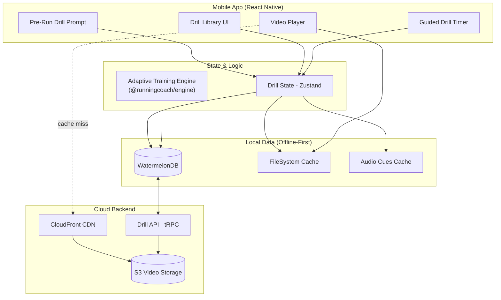

# RFC 0012: Running Drills & Technique System

| Status        | Draft |
| :---          | :--- |
| **RFC #**     | 0012 |
| **Author(s)** | System Architect |
| **Created**   | 2025-11-26 |
| **Updated**   | 2025-11-27 |
| **Related PRD** | [11_RUNNING_DRILLS_TECHNIQUE.md](../prd/11_RUNNING_DRILLS_TECHNIQUE.md) |

## 1. Introduction

### 1.1. Context
This RFC defines the technical implementation of the Running Drills & Technique System as outlined in [PRD 11: Running Drills & Technique](../prd/11_RUNNING_DRILLS_TECHNIQUE.md). Research demonstrates that structured drill work produces **4-7% running economy improvements** through enhanced neuromuscular coordination and tendon stiffness, making this a high-ROI feature for marathon preparation.

The system integrates with the broader RunningCoach architecture defined in [RFC 0001: System Architecture](./0001-system-architecture.md), following the **hybrid thick-client architecture** where drill content is cached locally for offline access while drill progression and completion data syncs with the cloud.

**Key Research Foundations:**
- **Plyometric Hopping Protocol:** 6-week program (5 min/day) produces 4-7% economy improvement and 16% increase in Achilles tendon stiffness
- **Frequency:** 2-3×/week during base phase, 1-2×/week during build/peak for maintenance
- **Timing:** Perform BEFORE easy runs when fresh, NOT before hard workouts or after long runs
- **Integration:** Drills complement but don't overlap with strength training plyometrics

### 1.2. Problem Statement
We need a comprehensive drill management system that:
1. **Delivers Educational Content Offline:** Athletes must access drill videos, form cues, and instructions without internet connectivity
2. **Provides Guided Drill Sessions:** Built-in timers and audio cues guide athletes through complex drill circuits (e.g., Week 3 plyometric hopping: 20 sets × 10 sec hopping, 10 sec rest)
3. **Integrates with Training Plans:** Automatically schedule drill sessions on appropriate days (before easy runs, 2-3×/week)
4. **Tracks Adherence and Progression:** Monitor completion rates and correlate with running economy improvements
5. **Periodizes Drill Work:** Adapt drill volume and focus across training phases (Base → Build → Peak → Taper)
6. **Prevents Overuse:** Ensure drill work doesn't contribute to excessive training load or ACWR violations

### 1.3. Goals & Non-Goals
**Goals:**
- **Comprehensive Drill Library:** Store and deliver 12+ core drills (A-skips, B-skips, high knees, butt kicks, bounding, strides, etc.) with multi-angle video demonstrations
- **Progressive Plyometric Protocol:** Implement research-backed 6-week hopping protocol with weekly volume progression
- **Guided Timer Features:** Audio/haptic cues for interval-based drills with built-in rest periods
- **Offline-First Delivery:** Cache all drill content (videos, cues, progressions) locally for zero-latency access
- **Training Plan Integration:** Automatically schedule drill sessions on appropriate training days based on periodization phase
- **Adherence Tracking:** Log drill completion, calculate adherence rates, correlate with cadence and economy improvements
- **Phase-Based Periodization:** Adjust drill frequency and focus across Base (2-3×/week), Build (2×/week), Peak (1×/week), and Taper (strides only)

**Non-Goals:**
- **Video Recording/Upload:** No user-generated video analysis in MVP (future feature)
- **AI Form Analysis:** No computer vision for real-time form correction (future consideration)
- **Custom Drill Creation:** Users cannot create custom drills; library is curated by coaches
- **Social Sharing:** No sharing of drill completions or videos to social platforms (out of scope)
- **Wearable Integration:** Drills are not tracked via watch sensors (they're performed before runs, not during)

### 1.4. Dependencies
**Related PRDs:**
- [00_OVERARCHING_VISION.md](../prd/00_OVERARCHING_VISION.md) - Holistic training approach philosophy
- [01_MOBILE_CLIENT.md](../prd/01_MOBILE_CLIENT.md) - Mobile UI for drill timer and library
- [04_TRAINING_GUIDANCE.md](../prd/04_TRAINING_GUIDANCE.md) - Educational content delivery patterns
- [06_ADAPTIVE_TRAINING_ENGINE.md](../prd/06_ADAPTIVE_TRAINING_ENGINE.md) - Integration into training schedule
- [08_STRENGTH_PLYOMETRICS.md](../prd/08_STRENGTH_PLYOMETRICS.md) - Complementary plyometric work (avoid overlap)
- [11_RUNNING_DRILLS_TECHNIQUE.md](../prd/11_RUNNING_DRILLS_TECHNIQUE.md) - Full drill specifications and research

**Related RFCs:**
- [0001-system-architecture.md](./0001-system-architecture.md) - System-wide architecture
- [0002-mobile-app-architecture.md](./0002-mobile-app-architecture.md) - Mobile implementation patterns
- [0003-backend-api-design.md](./0003-backend-api-design.md) - API contracts

**External Dependencies:**
- **AWS S3 + CloudFront:** Video hosting and CDN delivery
- **Expo AV:** Video playback on mobile (`expo-av` for React Native)
- **Expo Notifications:** Local notifications for drill reminders
- **Expo Audio:** Background audio cues during drill timers
- **Expo Haptics:** Haptic feedback for interval transitions

### 1.5. Success Metrics
**Technical Metrics:**
- **Video Load Time:** < 2 seconds for first frame (via CDN caching and local cache)
- **Offline Availability:** 100% of drill content functional without internet after initial download
- **Timer Accuracy:** < 50ms drift over 10-minute drill session
- **Storage Efficiency:** < 200 MB for full drill library cache (compressed video)

**Product Metrics (from PRD):**
- **Adherence:** ≥70% completion of prescribed drill sessions
- **Running Economy:** 4-7% improvement in HR-pace relationship over 12 weeks for users completing plyometric protocol
- **Cadence Improvement:** 2-5 SPM increase in average cadence for users performing drills 2-3×/week
- **Injury Rate:** No increase in Achilles or hamstring injuries compared to control group (drill work should not increase injury risk when performed correctly)

---

## 2. Proposed Solution

### 2.1. High-Level Design

The Running Drills & Technique System follows the **offline-first, thick-client architecture** with a clear separation between static content (drills, videos) and dynamic data (sessions, completion tracking).



**Data Flow:**

1. **Initial Setup:**
   - Backend serves drill metadata (names, descriptions, cues, progressions) via tRPC
   - Videos hosted on S3, delivered via CloudFront CDN
   - Mobile app downloads and caches drill library on first launch

2. **Drill Session:**
   - Pre-run prompt triggers based on training plan (if drill day)
   - User selects drill circuit or plyometric protocol
   - Timer runs locally with offline audio/haptic cues
   - Completion logged to local DB, queued for sync

3. **Content Updates:**
   - New drills added to backend as database records
   - Mobile app pulls updates during sync
   - Videos download progressively (on-demand or background)

### 2.2. Detailed Design

#### 2.2.1. Drill Content Model

The drill library consists of structured content with multiple media types and instructional layers.

**Core Drill Entity:**

```typescript
// packages/types/src/drills.ts
export type DrillCategory =
  | 'plyometric'      // Hopping, bounding
  | 'technique'       // A-skips, B-skips
  | 'activation'      // High knees, butt kicks
  | 'mobility'        // Dynamic stretching, leg swings
  | 'strides';        // Accelerations

export type DrillDifficulty = 'beginner' | 'intermediate' | 'advanced';

export type DrillPhase = 'base' | 'build' | 'peak' | 'taper' | 'all';

export interface Drill {
  id: string;
  slug: string;                    // URL-friendly: "a-skips", "plyometric-hopping"
  name: string;                    // Display name: "A-Skips"
  category: DrillCategory;
  difficulty: DrillDifficulty;
  phases: DrillPhase[];            // Which training phases this drill applies to

  // Instructional content
  description: string;             // 2-3 sentence overview
  purpose: string;                 // "Hip flexor activation, midfoot striking, cadence"
  formCues: string[];              // 3-5 concise coaching points
  commonMistakes: string[];        // 2-3 mistakes to avoid

  // Execution parameters
  volume: DrillVolume;             // Distance, time, or reps
  sets: number;
  restBetweenSets: number;         // Seconds

  // Media assets
  videos: DrillVideo[];            // Multiple angles/speeds
  thumbnailUrl: string;

  // Progressions
  prerequisites?: string[];        // Drill IDs that should be mastered first
  progressionTo?: string[];        // Next-level drills

  // Safety
  injuryWarnings?: string[];       // "Avoid if Achilles pain present"

  // Metadata
  researchNotes?: string;          // Citation for evidence base
  createdAt: Date;
  updatedAt: Date;
}

export interface DrillVolume {
  type: 'distance' | 'time' | 'reps';
  value: number;
  unit: string;  // "meters", "seconds", "reps"
}

export interface DrillVideo {
  id: string;
  url: string;                     // S3/CloudFront URL
  type: 'demonstration' | 'slow_motion' | 'common_mistake' | 'front_view' | 'side_view';
  duration: number;                // Seconds
  fileSize: number;                // Bytes (for download estimation)
  thumbnailUrl: string;
  caption?: string;
}
```

**Plyometric Hopping Protocol (Special Drill Type):**

The research-backed 6-week hopping protocol requires structured weekly progression:

```typescript
export interface PlyometricWeek {
  weekNumber: 1 | 2 | 3 | 4 | 5 | 6;
  sets: number;
  workDuration: number;    // Seconds per set
  restDuration: number;    // Seconds between sets
  totalDuration: number;   // Minutes (for UI display)
}

export const PLYOMETRIC_PROTOCOL: PlyometricWeek[] = [
  { weekNumber: 1, sets: 12, workDuration: 10, restDuration: 15, totalDuration: 5.0 },
  { weekNumber: 2, sets: 16, workDuration: 10, restDuration: 12, totalDuration: 5.9 },
  { weekNumber: 3, sets: 20, workDuration: 10, restDuration: 10, totalDuration: 6.7 },
  { weekNumber: 4, sets: 24, workDuration: 10, restDuration: 7,  totalDuration: 6.8 },
  { weekNumber: 5, sets: 26, workDuration: 10, restDuration: 6,  totalDuration: 6.9 },
  { weekNumber: 6, sets: 28, workDuration: 10, restDuration: 5,  totalDuration: 7.0 },
];

export interface PlyometricSession {
  id: string;
  userId: string;
  weekNumber: number;
  scheduledDate: Date;
  completed: boolean;
  completedAt?: Date;
  setsCompleted?: number;
  formRating?: number;     // User self-assessment 1-5
  notes?: string;
}
```

#### 2.2.2. Drill Routines & Circuits

Pre-built drill sequences for efficient pre-run warm-ups:

```typescript
export interface DrillRoutine {
  id: string;
  name: string;                    // "Base Phase Full Circuit", "Quick Strides Only"
  description: string;
  phase: DrillPhase;
  duration: number;                // Estimated total minutes
  drills: DrillRoutineItem[];
  recommendedFrequency: string;    // "2-3×/week before easy runs"
}

export interface DrillRoutineItem {
  drillId: string;
  order: number;
  sets?: number;                   // Override drill default if needed
  notes?: string;                  // Context-specific coaching
}

// Example routines
export const BASE_PHASE_CIRCUIT: DrillRoutine = {
  id: 'base-full-circuit',
  name: 'Base Phase Full Circuit',
  description: 'Complete drill circuit for neuromuscular foundation',
  phase: 'base',
  duration: 18,
  drills: [
    { drillId: 'a-skips', order: 1, sets: 2 },
    { drillId: 'b-skips', order: 2, sets: 2 },
    { drillId: 'high-knees', order: 3, sets: 2 },
    { drillId: 'butt-kicks', order: 4, sets: 2 },
    { drillId: 'bounding', order: 5, sets: 2 },
    { drillId: 'strides', order: 6, sets: 6, notes: 'Focus on relaxed form' },
  ],
  recommendedFrequency: '2-3×/week before easy runs',
};

export const BUILD_PHASE_ABBREVIATED: DrillRoutine = {
  id: 'build-abbreviated',
  name: 'Build Phase Abbreviated',
  description: 'Focused drill work maintaining adaptations',
  phase: 'build',
  duration: 12,
  drills: [
    { drillId: 'a-skips', order: 1, sets: 2 },
    { drillId: 'b-skips', order: 2, sets: 2 },
    { drillId: 'bounding', order: 3, sets: 2 },
    { drillId: 'strides', order: 4, sets: 4 },
  ],
  recommendedFrequency: '2×/week before easy runs',
};
```

#### 2.2.3. Drill Session Tracking

```typescript
export interface DrillSession {
  id: string;
  userId: string;
  date: Date;

  // Session structure
  type: 'routine' | 'plyometric' | 'custom';
  routineId?: string;              // If type === 'routine'
  plyometricWeek?: number;         // If type === 'plyometric'
  drillsPerformed: DrillCompletion[];

  // Completion tracking
  plannedDuration: number;         // Minutes
  actualDuration?: number;         // Minutes (if completed)
  completed: boolean;
  completedAt?: Date;

  // Subjective feedback
  perceivedDifficulty?: number;    // 1-10 scale
  formQuality?: number;            // 1-5 scale
  notes?: string;

  // Context
  workoutId?: string;              // Link to run that followed (if applicable)
  surfaceType?: 'track' | 'grass' | 'turf' | 'road' | 'trail';

  // Sync metadata
  _status: 'synced' | 'created' | 'updated';
  _changed: string;
  lastSyncedAt?: number;
}

export interface DrillCompletion {
  drillId: string;
  setsCompleted: number;
  skipped: boolean;
  skippedReason?: string;          // "Felt pain", "Too fatigued", etc.
}
```

#### 2.2.4. Guided Drill Timer Implementation

The timer is the core UX feature, providing audio/haptic guidance through complex drill circuits.

**Timer State Machine:**

```typescript
export type TimerState =
  | 'idle'           // Not started
  | 'pre_drill'      // Countdown before first drill (5 sec)
  | 'drill_active'   // Performing drill work interval
  | 'rest'           // Rest between sets
  | 'transition'     // Moving to next drill (10 sec)
  | 'complete';      // Session finished

export interface TimerContext {
  // Session configuration
  routine: DrillRoutine;
  currentDrillIndex: number;
  currentSet: number;
  totalSets: number;

  // Time tracking
  elapsedTime: number;             // Total session time (seconds)
  intervalElapsedTime: number;     // Current interval time
  intervalDuration: number;        // Target duration for current interval

  // State
  state: TimerState;
  isPaused: boolean;

  // Completion tracking
  completedDrills: DrillCompletion[];
}

export interface TimerAction {
  type: 'START' | 'PAUSE' | 'RESUME' | 'SKIP_DRILL' | 'SKIP_SET' | 'COMPLETE' | 'RESET' | 'TICK';
  payload?: any;
}
```

**Timer UI Flow:**

1. **Session Start:**
   - Display drill circuit overview (total drills, estimated time)
   - "Start Drill Circuit" button
   - 5-second countdown with audio cue

2. **During Drill:**
   - **Visual:** Large timer display, current drill name, set count (e.g., "Set 2 of 3")
   - **Audio Cues:**
     - "A-skips. Go!" (start of drill)
     - "10 seconds" (halfway warning for time-based drills)
     - "Done. Rest 30 seconds" (end of set)
   - **Haptic:** Vibration at start/end of intervals

3. **Between Sets:**
   - Rest timer countdown
   - Display next drill name and preview image
   - "Skip Rest" button if user ready early

4. **Session Complete:**
   - Summary screen: total time, drills completed
   - Optional feedback form (form quality 1-5, notes)
   - "Log Session" button saves to database

**Implementation Strategy:**

```typescript
// hooks/useDrillTimer.ts
import { useReducer, useEffect, useRef } from 'react';
import * as Audio from 'expo-av';
import * as Haptics from 'expo-haptics';

export function useDrillTimer(routine: DrillRoutine) {
  const [context, dispatch] = useReducer(timerReducer, initialContext);
  const intervalRef = useRef<NodeJS.Timeout | null>(null);

  // Start/stop interval loop
  useEffect(() => {
    if (context.state !== 'idle' && !context.isPaused) {
      intervalRef.current = setInterval(() => {
        dispatch({ type: 'TICK' });
      }, 1000); // 1-second tick

      return () => {
        if (intervalRef.current) clearInterval(intervalRef.current);
      };
    }
  }, [context.state, context.isPaused]);

  // Audio cues at state transitions
  useEffect(() => {
    const currentDrill = routine.drills[context.currentDrillIndex];

    if (context.state === 'drill_active' && context.intervalElapsedTime === 0) {
      playAudioCue(`${currentDrill.drillId}_start`); // "A-skips. Go!"
      Haptics.impactAsync(Haptics.ImpactFeedbackStyle.Medium);
    }

    if (context.state === 'rest' && context.intervalElapsedTime === 0) {
      playAudioCue('rest_start'); // "Rest. 30 seconds"
      Haptics.notificationAsync(Haptics.NotificationFeedbackType.Success);
    }

    // Halfway warning for long intervals
    if (context.intervalDuration >= 20 && context.intervalElapsedTime === context.intervalDuration / 2) {
      playAudioCue('halfway'); // "Halfway"
    }

    // Final countdown
    if (context.intervalElapsedTime === context.intervalDuration - 3) {
      playAudioCue('countdown_3'); // "3... 2... 1..."
    }
  }, [context.state, context.intervalElapsedTime]);

  const playAudioCue = async (cueId: string) => {
    const sound = await Audio.Sound.createAsync(
      { uri: `file://audio_cues/${cueId}.mp3` }, // Cached locally
      { shouldPlay: true }
    );
    await sound.sound.playAsync();
  };

  return {
    context,
    start: () => dispatch({ type: 'START' }),
    pause: () => dispatch({ type: 'PAUSE' }),
    resume: () => dispatch({ type: 'RESUME' }),
    skipDrill: () => dispatch({ type: 'SKIP_DRILL' }),
    complete: () => dispatch({ type: 'COMPLETE' }),
  };
}
```

#### 2.2.5. Training Plan Integration

Drill sessions must be automatically scheduled based on training phase and run type.

**Scheduling Logic (in Adaptive Training Engine):**

```typescript
// packages/engine/src/drills/scheduling.ts

export interface DrillSchedulingConfig {
  phase: TrainingPhase;
  weeklyFrequency: number;         // 2-3×/week base, 2×/week build, 1×/week peak
  preferredDays: string[];         // "before_easy_run", "standalone"
  includesPlyometric: boolean;     // Add plyometric protocol?
  routineType: 'full' | 'abbreviated' | 'strides_only';
}

export function getPhaseConfig(phase: TrainingPhase): DrillSchedulingConfig {
  switch (phase) {
    case 'base':
      return {
        phase: 'base',
        weeklyFrequency: 3,
        preferredDays: ['before_easy_run'],
        includesPlyometric: true,
        routineType: 'full',
      };

    case 'build':
      return {
        phase: 'build',
        weeklyFrequency: 2,
        preferredDays: ['before_easy_run'],
        includesPlyometric: true,
        routineType: 'abbreviated',
      };

    case 'peak':
      return {
        phase: 'peak',
        weeklyFrequency: 1,
        preferredDays: ['before_easy_run'],
        includesPlyometric: false,
        routineType: 'strides_only',
      };

    case 'taper':
      return {
        phase: 'taper',
        weeklyFrequency: 1,  // Week 1-2 only
        preferredDays: ['standalone'],
        includesPlyometric: false,
        routineType: 'strides_only',
      };

    default:
      return {
        phase: 'recovery',
        weeklyFrequency: 0,
        preferredDays: [],
        includesPlyometric: false,
        routineType: 'strides_only',
      };
  }
}

export function scheduleDrills(
  trainingPlan: TrainingPlan,
  week: TrainingWeek
): DrillSession[] {
  const config = getPhaseConfig(trainingPlan.phase);
  const drillSessions: DrillSession[] = [];

  // Find easy run days for drill attachment
  const easyRunDays = week.workouts.filter(w => w.type === 'easy');

  for (let i = 0; i < config.weeklyFrequency && i < easyRunDays.length; i++) {
    const workout = easyRunDays[i];
    const drillSession: DrillSession = {
      id: generateId(),
      userId: trainingPlan.userId,
      date: workout.date,
      type: 'routine',
      routineId: getRoutineForPhase(config.phase, config.routineType),
      plannedDuration: config.routineType === 'full' ? 18 : 12,
      completed: false,
      drillsPerformed: [],
      _status: 'created',
      _changed: new Date().toISOString(),
    };

    drillSessions.push(drillSession);

    // Link drill session to workout
    workout.preDrillSessionId = drillSession.id;
  }

  // Add plyometric protocol if in first 6 weeks of base phase
  if (config.includesPlyometric && trainingPlan.weeksCompleted < 6) {
    const plyoSession: PlyometricSession = {
      id: generateId(),
      userId: trainingPlan.userId,
      weekNumber: trainingPlan.weeksCompleted + 1,
      scheduledDate: week.startDate,
      completed: false,
    };

    // Attach to first drill session of week
    if (drillSessions.length > 0) {
      drillSessions[0].plyometricWeek = plyoSession.weekNumber;
    }
  }

  return drillSessions;
}
```

**Pre-Run Prompt:**

```typescript
// screens/TodayScreen.tsx (Dashboard)
// Display prompt if today has scheduled drill session

export function PreRunDrillPrompt({ drillSession, workout }: Props) {
  const navigation = useNavigation();

  if (!drillSession || drillSession.completed) return null;

  return (
    <GlassCard>
      <View style={styles.promptContainer}>
        <Icon name="play-circle" size={32} color={colors.signalGreen} />
        <Text style={styles.promptTitle}>Today is a Drill Day</Text>
        <Text style={styles.promptBody}>
          Complete {drillSession.plannedDuration}-minute circuit before your {workout.type} run?
        </Text>
        <View style={styles.buttonRow}>
          <Button mode="text" onPress={() => dismissPrompt()}>
            Skip
          </Button>
          <Button mode="contained" onPress={() => navigation.navigate('DrillTimer', { drillSession })}>
            Start Drills
          </Button>
        </View>
      </View>
    </GlassCard>
  );
}
```

#### 2.2.6. Video Content Delivery & Caching

**Video Storage Architecture:**

- **S3 Bucket:** `runningcoach-drill-videos`
- **CloudFront Distribution:** `cdn.runningcoach.app/drills/`
- **Video Format:** MP4, H.264 codec, 720p (optimize for mobile)
- **File Naming:** `{drill-slug}-{type}.mp4` (e.g., `a-skips-demonstration.mp4`, `a-skips-slow-motion.mp4`)

**Progressive Caching Strategy:**

```typescript
// services/DrillContentService.ts
import * as FileSystem from 'expo-file-system';

export class DrillContentService {
  private cacheDir = `${FileSystem.documentDirectory}drills/`;

  async downloadDrill(drill: Drill): Promise<void> {
    // Download primary demonstration video first
    const primaryVideo = drill.videos.find(v => v.type === 'demonstration');
    if (!primaryVideo) return;

    await this.downloadVideo(primaryVideo);

    // Queue other angles for background download
    const otherVideos = drill.videos.filter(v => v.type !== 'demonstration');
    for (const video of otherVideos) {
      await this.queueBackgroundDownload(video);
    }
  }

  async downloadVideo(video: DrillVideo): Promise<string> {
    const localPath = `${this.cacheDir}${video.id}.mp4`;

    // Check if already cached
    const fileInfo = await FileSystem.getInfoAsync(localPath);
    if (fileInfo.exists) return localPath;

    // Download from CDN
    const downloadResult = await FileSystem.downloadAsync(
      video.url,
      localPath,
      {
        headers: {
          'Cache-Control': 'max-age=31536000', // 1 year
        },
      }
    );

    return downloadResult.uri;
  }

  async getCachedVideoUri(videoId: string): Promise<string | null> {
    const localPath = `${this.cacheDir}${videoId}.mp4`;
    const fileInfo = await FileSystem.getInfoAsync(localPath);
    return fileInfo.exists ? localPath : null;
  }

  async prefetchAllDrills(drills: Drill[]): Promise<void> {
    // Download all demonstration videos on WiFi
    for (const drill of drills) {
      await this.downloadDrill(drill);
    }
  }

  async clearCache(): Promise<void> {
    await FileSystem.deleteAsync(this.cacheDir, { idempotent: true });
  }

  async getCacheSize(): Promise<number> {
    const files = await FileSystem.readDirectoryAsync(this.cacheDir);
    let totalSize = 0;

    for (const file of files) {
      const info = await FileSystem.getInfoAsync(`${this.cacheDir}${file}`);
      if (info.exists) totalSize += info.size;
    }

    return totalSize;
  }
}
```

**Video Player Component:**

```typescript
// components/DrillVideoPlayer.tsx
import { Video, ResizeMode } from 'expo-av';

export function DrillVideoPlayer({ video }: { video: DrillVideo }) {
  const [videoUri, setVideoUri] = useState<string | null>(null);
  const [loading, setLoading] = useState(true);
  const contentService = useDrillContentService();

  useEffect(() => {
    loadVideo();
  }, [video.id]);

  const loadVideo = async () => {
    setLoading(true);

    // Try local cache first
    let uri = await contentService.getCachedVideoUri(video.id);

    // Fallback to CDN if not cached
    if (!uri) {
      uri = video.url;
      // Download in background for future use
      contentService.downloadVideo(video);
    }

    setVideoUri(uri);
    setLoading(false);
  };

  if (loading) return <ActivityIndicator />;

  return (
    <Video
      source={{ uri: videoUri }}
      style={styles.video}
      useNativeControls
      resizeMode={ResizeMode.CONTAIN}
      shouldPlay={false}
      isLooping
    />
  );
}
```

#### 2.2.7. Adherence Tracking & Analytics

Track drill completion and correlate with running performance metrics.

**Analytics Queries:**

```typescript
// packages/engine/src/drills/analytics.ts

export interface DrillAdherenceStats {
  userId: string;
  period: 'week' | 'month' | '12_weeks';

  // Completion metrics
  sessionsScheduled: number;
  sessionsCompleted: number;
  adherenceRate: number;          // Percentage

  // Performance correlations
  cadenceChange?: number;          // SPM delta vs baseline
  economyChange?: number;          // HR-pace improvement percentage
  injuryIncidents: number;

  // Drill-specific
  plyometricWeeksCompleted?: number;
  mostSkippedDrill?: string;
  averageSessionDuration: number;
}

export function calculateAdherence(
  userId: string,
  startDate: Date,
  endDate: Date
): DrillAdherenceStats {
  const sessions = queryDrillSessions(userId, startDate, endDate);
  const scheduled = sessions.filter(s => s.date <= new Date());
  const completed = sessions.filter(s => s.completed);

  const adherenceRate = (completed.length / scheduled.length) * 100;

  // Calculate cadence change
  const baselineCadence = getAverageCadence(userId, subMonths(startDate, 1), startDate);
  const currentCadence = getAverageCadence(userId, startDate, endDate);
  const cadenceChange = currentCadence - baselineCadence;

  // Calculate economy change (HR-pace relationship)
  const economyChange = calculateEconomyImprovement(userId, startDate, endDate);

  return {
    userId,
    period: '12_weeks',
    sessionsScheduled: scheduled.length,
    sessionsCompleted: completed.length,
    adherenceRate,
    cadenceChange,
    economyChange,
    injuryIncidents: queryInjuryReports(userId, startDate, endDate).length,
    plyometricWeeksCompleted: completed.filter(s => s.plyometricWeek).length,
    averageSessionDuration: average(completed.map(s => s.actualDuration)),
  };
}

// Display in Progress tab
export function DrillProgressCard({ stats }: { stats: DrillAdherenceStats }) {
  return (
    <GlassCard>
      <Text variant="headlineSmall">Drill Work Progress</Text>

      <ProgressBar progress={stats.adherenceRate / 100} />
      <Text>{stats.adherenceRate.toFixed(0)}% adherence</Text>
      <Text variant="bodySmall">{stats.sessionsCompleted} of {stats.sessionsScheduled} sessions</Text>

      {stats.cadenceChange && stats.cadenceChange > 2 && (
        <View style={styles.improvement}>
          <Icon name="trending-up" color={colors.signalGreen} />
          <Text>+{stats.cadenceChange.toFixed(1)} SPM cadence improvement</Text>
        </View>
      )}

      {stats.economyChange && stats.economyChange > 3 && (
        <View style={styles.improvement}>
          <Icon name="trending-up" color={colors.signalGreen} />
          <Text>{stats.economyChange.toFixed(1)}% running economy improvement</Text>
        </View>
      )}
    </GlassCard>
  );
}
```

### 2.3. Data Model Changes

**New Tables (Prisma Schema):**

```prisma
// prisma/schema.prisma

model Drill {
  id              String         @id @default(uuid())
  slug            String         @unique
  name            String
  category        DrillCategory
  difficulty      DrillDifficulty
  phases          TrainingPhase[]

  description     String
  purpose         String
  formCues        String[]
  commonMistakes  String[]

  volumeType      String         // "distance", "time", "reps"
  volumeValue     Int
  volumeUnit      String
  sets            Int
  restBetweenSets Int            // Seconds

  thumbnailUrl    String
  researchNotes   String?

  videos          DrillVideo[]
  prerequisites   Drill[]        @relation("DrillProgression")
  progressionTo   Drill[]        @relation("DrillProgression")

  createdAt       DateTime       @default(now())
  updatedAt       DateTime       @updatedAt

  @@index([category, difficulty])
}

model DrillVideo {
  id           String     @id @default(uuid())
  drillId      String
  drill        Drill      @relation(fields: [drillId], references: [id], onDelete: Cascade)

  url          String
  type         VideoType  // "demonstration", "slow_motion", "common_mistake", "front_view", "side_view"
  duration     Int        // Seconds
  fileSize     BigInt     // Bytes
  thumbnailUrl String
  caption      String?

  createdAt    DateTime   @default(now())

  @@index([drillId])
}

model DrillRoutine {
  id                     String              @id @default(uuid())
  name                   String
  description            String
  phase                  TrainingPhase
  duration               Int                 // Minutes
  recommendedFrequency   String

  drills                 DrillRoutineItem[]
  sessions               DrillSession[]

  createdAt              DateTime            @default(now())
  updatedAt              DateTime            @updatedAt
}

model DrillRoutineItem {
  id         String        @id @default(uuid())
  routineId  String
  routine    DrillRoutine  @relation(fields: [routineId], references: [id], onDelete: Cascade)
  drillId    String

  order      Int
  sets       Int?          // Override default
  notes      String?

  @@unique([routineId, order])
  @@index([routineId])
}

model DrillSession {
  id                String             @id @default(uuid())
  userId            String
  user              User               @relation(fields: [userId], references: [id], onDelete: Cascade)
  date              DateTime

  type              SessionType        // "routine", "plyometric", "custom"
  routineId         String?
  routine           DrillRoutine?      @relation(fields: [routineId], references: [id], onDelete: SetNull)
  plyometricWeek    Int?

  plannedDuration   Int                // Minutes
  actualDuration    Int?
  completed         Boolean            @default(false)
  completedAt       DateTime?

  perceivedDifficulty Int?             // 1-10
  formQuality       Int?               // 1-5
  notes             String?

  workoutId         String?            // Link to run that followed
  surfaceType       SurfaceType?

  drillsPerformed   DrillCompletion[]

  // Sync metadata
  _status           SyncStatus         @default(CREATED)
  _changed          DateTime           @default(now())
  lastSyncedAt      DateTime?

  createdAt         DateTime           @default(now())
  updatedAt         DateTime           @updatedAt

  @@index([userId, date])
  @@index([userId, completed])
}

model DrillCompletion {
  id              String       @id @default(uuid())
  sessionId       String
  session         DrillSession @relation(fields: [sessionId], references: [id], onDelete: Cascade)
  drillId         String

  setsCompleted   Int
  skipped         Boolean      @default(false)
  skippedReason   String?

  @@index([sessionId])
}

model PlyometricSession {
  id             String    @id @default(uuid())
  userId         String
  user           User      @relation(fields: [userId], references: [id], onDelete: Cascade)
  weekNumber     Int       // 1-6
  scheduledDate  DateTime

  completed      Boolean   @default(false)
  completedAt    DateTime?
  setsCompleted  Int?
  formRating     Int?      // 1-5
  notes          String?

  // Sync metadata
  _status        SyncStatus @default(CREATED)
  _changed       DateTime   @default(now())
  lastSyncedAt   DateTime?

  createdAt      DateTime  @default(now())
  updatedAt      DateTime  @updatedAt

  @@unique([userId, weekNumber])
  @@index([userId, completed])
}

enum DrillCategory {
  PLYOMETRIC
  TECHNIQUE
  ACTIVATION
  MOBILITY
  STRIDES
}

enum DrillDifficulty {
  BEGINNER
  INTERMEDIATE
  ADVANCED
}

enum VideoType {
  DEMONSTRATION
  SLOW_MOTION
  COMMON_MISTAKE
  FRONT_VIEW
  SIDE_VIEW
}

enum SessionType {
  ROUTINE
  PLYOMETRIC
  CUSTOM
}

enum SurfaceType {
  TRACK
  GRASS
  TURF
  ROAD
  TRAIL
}
```

**WatermelonDB Schema (Mobile):**

```typescript
// mobile/src/database/schema.ts
import { appSchema, tableSchema } from '@nozbe/watermelondb';

export const drillSchema = appSchema({
  version: 1,
  tables: [
    tableSchema({
      name: 'drills',
      columns: [
        { name: 'slug', type: 'string', isIndexed: true },
        { name: 'name', type: 'string' },
        { name: 'category', type: 'string', isIndexed: true },
        { name: 'difficulty', type: 'string', isIndexed: true },
        { name: 'phases', type: 'string' }, // JSON array
        { name: 'description', type: 'string' },
        { name: 'purpose', type: 'string' },
        { name: 'form_cues', type: 'string' }, // JSON array
        { name: 'common_mistakes', type: 'string' }, // JSON array
        { name: 'volume_type', type: 'string' },
        { name: 'volume_value', type: 'number' },
        { name: 'volume_unit', type: 'string' },
        { name: 'sets', type: 'number' },
        { name: 'rest_between_sets', type: 'number' },
        { name: 'thumbnail_url', type: 'string' },
        { name: 'videos', type: 'string' }, // JSON array
        { name: 'created_at', type: 'number' },
        { name: 'updated_at', type: 'number' },
      ],
    }),

    tableSchema({
      name: 'drill_routines',
      columns: [
        { name: 'name', type: 'string' },
        { name: 'description', type: 'string' },
        { name: 'phase', type: 'string', isIndexed: true },
        { name: 'duration', type: 'number' },
        { name: 'drills', type: 'string' }, // JSON array of DrillRoutineItem
        { name: 'recommended_frequency', type: 'string' },
        { name: 'created_at', type: 'number' },
        { name: 'updated_at', type: 'number' },
      ],
    }),

    tableSchema({
      name: 'drill_sessions',
      columns: [
        { name: 'user_id', type: 'string', isIndexed: true },
        { name: 'date', type: 'number', isIndexed: true },
        { name: 'type', type: 'string' },
        { name: 'routine_id', type: 'string', isOptional: true },
        { name: 'plyometric_week', type: 'number', isOptional: true },
        { name: 'planned_duration', type: 'number' },
        { name: 'actual_duration', type: 'number', isOptional: true },
        { name: 'completed', type: 'boolean', isIndexed: true },
        { name: 'completed_at', type: 'number', isOptional: true },
        { name: 'perceived_difficulty', type: 'number', isOptional: true },
        { name: 'form_quality', type: 'number', isOptional: true },
        { name: 'notes', type: 'string', isOptional: true },
        { name: 'workout_id', type: 'string', isOptional: true },
        { name: 'surface_type', type: 'string', isOptional: true },
        { name: 'drills_performed', type: 'string' }, // JSON array
        { name: '_status', type: 'string' },
        { name: '_changed', type: 'string' },
        { name: 'last_synced_at', type: 'number', isOptional: true },
        { name: 'created_at', type: 'number' },
        { name: 'updated_at', type: 'number' },
      ],
    }),

    tableSchema({
      name: 'plyometric_sessions',
      columns: [
        { name: 'user_id', type: 'string', isIndexed: true },
        { name: 'week_number', type: 'number', isIndexed: true },
        { name: 'scheduled_date', type: 'number' },
        { name: 'completed', type: 'boolean', isIndexed: true },
        { name: 'completed_at', type: 'number', isOptional: true },
        { name: 'sets_completed', type: 'number', isOptional: true },
        { name: 'form_rating', type: 'number', isOptional: true },
        { name: 'notes', type: 'string', isOptional: true },
        { name: '_status', type: 'string' },
        { name: '_changed', type: 'string' },
        { name: 'last_synced_at', type: 'number', isOptional: true },
        { name: 'created_at', type: 'number' },
        { name: 'updated_at', type: 'number' },
      ],
    }),
  ],
});
```

### 2.4. API Changes

**New tRPC Router: `drills.*`**

```typescript
// packages/api/src/routers/drills.router.ts

export const drillsRouter = router({
  /**
   * Get complete drill library with videos and metadata
   * @returns Array of all drills
   */
  list: protectedProcedure
    .query(async ({ ctx }) => {
      const drills = await ctx.prisma.drill.findMany({
        include: {
          videos: true,
        },
        orderBy: [
          { category: 'asc' },
          { difficulty: 'asc' },
        ],
      });
      return drills;
    }),

  /**
   * Get single drill by ID or slug
   * @input drillId or slug
   * @returns Drill with full details and related drills
   */
  getById: protectedProcedure
    .input(z.object({
      id: z.string().optional(),
      slug: z.string().optional(),
    }))
    .query(async ({ ctx, input }) => {
      const drill = await ctx.prisma.drill.findFirst({
        where: {
          OR: [
            { id: input.id },
            { slug: input.slug },
          ],
        },
        include: {
          videos: true,
          prerequisites: true,
          progressionTo: true,
        },
      });

      if (!drill) throw new TRPCError({ code: 'NOT_FOUND' });
      return drill;
    }),

  /**
   * Get recommended drill routine for training phase
   * @input phase
   * @returns Recommended DrillRoutine with drills
   */
  getRecommendedRoutine: protectedProcedure
    .input(z.object({
      phase: z.enum(['base', 'build', 'peak', 'taper']),
    }))
    .query(async ({ ctx, input }) => {
      const routine = await ctx.prisma.drillRoutine.findFirst({
        where: { phase: input.phase },
        include: {
          drills: {
            include: {
              drill: {
                include: {
                  videos: {
                    where: { type: 'DEMONSTRATION' },
                  },
                },
              },
            },
            orderBy: { order: 'asc' },
          },
        },
      });

      return routine;
    }),

  /**
   * Get all drill sessions for user
   * @input startDate, endDate (optional)
   * @returns Array of DrillSession
   */
  getSessions: protectedProcedure
    .input(z.object({
      startDate: z.date().optional(),
      endDate: z.date().optional(),
    }))
    .query(async ({ ctx, input }) => {
      const sessions = await ctx.prisma.drillSession.findMany({
        where: {
          userId: ctx.user.id,
          date: {
            gte: input.startDate,
            lte: input.endDate,
          },
        },
        include: {
          routine: true,
          drillsPerformed: true,
        },
        orderBy: { date: 'desc' },
      });

      return sessions;
    }),

  /**
   * Create new drill session
   * @input sessionData
   * @returns Created DrillSession
   */
  createSession: protectedProcedure
    .input(z.object({
      date: z.date(),
      type: z.enum(['routine', 'plyometric', 'custom']),
      routineId: z.string().optional(),
      plyometricWeek: z.number().min(1).max(6).optional(),
      plannedDuration: z.number(),
      workoutId: z.string().optional(),
    }))
    .mutation(async ({ ctx, input }) => {
      const session = await ctx.prisma.drillSession.create({
        data: {
          userId: ctx.user.id,
          ...input,
        },
      });

      return session;
    }),

  /**
   * Complete drill session with results
   * @input sessionId, completionData
   * @returns Updated DrillSession
   */
  completeSession: protectedProcedure
    .input(z.object({
      sessionId: z.string(),
      actualDuration: z.number(),
      perceivedDifficulty: z.number().min(1).max(10).optional(),
      formQuality: z.number().min(1).max(5).optional(),
      notes: z.string().optional(),
      drillsPerformed: z.array(z.object({
        drillId: z.string(),
        setsCompleted: z.number(),
        skipped: z.boolean(),
        skippedReason: z.string().optional(),
      })),
      surfaceType: z.enum(['track', 'grass', 'turf', 'road', 'trail']).optional(),
    }))
    .mutation(async ({ ctx, input }) => {
      const session = await ctx.prisma.drillSession.update({
        where: { id: input.sessionId },
        data: {
          completed: true,
          completedAt: new Date(),
          actualDuration: input.actualDuration,
          perceivedDifficulty: input.perceivedDifficulty,
          formQuality: input.formQuality,
          notes: input.notes,
          surfaceType: input.surfaceType,
          drillsPerformed: {
            create: input.drillsPerformed,
          },
        },
        include: {
          drillsPerformed: true,
        },
      });

      return session;
    }),

  /**
   * Get plyometric protocol sessions for user
   * @returns Array of PlyometricSession (weeks 1-6)
   */
  getPlyometricProgress: protectedProcedure
    .query(async ({ ctx }) => {
      const sessions = await ctx.prisma.plyometricSession.findMany({
        where: { userId: ctx.user.id },
        orderBy: { weekNumber: 'asc' },
      });

      return sessions;
    }),

  /**
   * Complete plyometric session
   * @input sessionId, completionData
   * @returns Updated PlyometricSession
   */
  completePlyometric: protectedProcedure
    .input(z.object({
      sessionId: z.string(),
      setsCompleted: z.number(),
      formRating: z.number().min(1).max(5).optional(),
      notes: z.string().optional(),
    }))
    .mutation(async ({ ctx, input }) => {
      const session = await ctx.prisma.plyometricSession.update({
        where: { id: input.sessionId },
        data: {
          completed: true,
          completedAt: new Date(),
          setsCompleted: input.setsCompleted,
          formRating: input.formRating,
          notes: input.notes,
        },
      });

      return session;
    }),

  /**
   * Get drill adherence statistics
   * @input period (week, month, 12_weeks)
   * @returns DrillAdherenceStats
   */
  getAdherenceStats: protectedProcedure
    .input(z.object({
      period: z.enum(['week', 'month', '12_weeks']),
    }))
    .query(async ({ ctx, input }) => {
      const endDate = new Date();
      const startDate = (() => {
        switch (input.period) {
          case 'week': return subWeeks(endDate, 1);
          case 'month': return subMonths(endDate, 1);
          case '12_weeks': return subWeeks(endDate, 12);
        }
      })();

      const stats = await calculateAdherence(ctx.user.id, startDate, endDate);
      return stats;
    }),
});
```

### 2.5. Offline-First Considerations

**Local Storage Strategy:**

- **Drill Library:** Full library cached in WatermelonDB (metadata only, ~50 KB)
- **Video Files:** Progressive download to FileSystem cache (~200 MB for full library)
- **Audio Cues:** Pre-bundled with app (~5 MB)
- **Drill Sessions:** All user sessions stored locally, synced in background

**Queued Operations:**

All drill session mutations (create, complete) are immediately applied to local DB and queued for sync:

```typescript
// services/DrillSyncService.ts
export async function completeSession(
  sessionId: string,
  completionData: SessionCompletionData
): Promise<void> {
  // Apply locally first (optimistic update)
  await database.write(async () => {
    const session = await drillSessionsCollection.find(sessionId);
    await session.update(s => {
      s.completed = true;
      s.completedAt = new Date();
      s.actualDuration = completionData.actualDuration;
      s._status = 'updated';
      s._changed = new Date().toISOString();
    });
  });

  // Queue for cloud sync
  await syncQueue.enqueue({
    type: 'drill.completeSession',
    payload: { sessionId, completionData },
    timestamp: Date.now(),
  });

  // Trigger sync if online
  if (isOnline()) {
    syncManager.triggerSync();
  }
}
```

**Conflict Resolution:**

- **Drill Library (Read-Only):** Server always wins; no conflicts possible
- **Drill Sessions:** Last write wins (LWW) with timestamp comparison
- **Completion Status:** If marked complete on device, cannot be uncompleted by server (client authoritative)

**Fallback Behavior:**

- **Video Unavailable:** Show thumbnail + text instructions
- **Sync Failed:** Session remains in queue, user notified with subtle indicator
- **Timer Runs Offline:** Full timer functionality without internet (no server dependency)

### 2.6. Synchronization Strategy

**Sync Triggers:**

- **App Launch:** Pull new drills/routines if added by backend
- **Session Completion:** Push completed session immediately if online
- **Daily Background Sync:** Check for new drill content (WiFi only)

**Data Priority:**

- **Critical:** Completed drill sessions (sync immediately)
- **High:** New drill library content (sync within hours)
- **Normal:** Video downloads (background, WiFi only)

**Conflict Resolution:**

- Drill sessions use Last Write Wins based on `_changed` timestamp
- Server-side validation ensures no data corruption

**Device-to-Device Sync:**

- Drill sessions sync: Phone ↔ Cloud (no direct watch sync needed)
- Watch receives workout context via BLE but not drill session details

---

## 3. Implementation Plan

### 3.1. Phasing

**Phase 1: Backend & Data Model (Weeks 1-2)**
**Deliverables:**
- Prisma schema for drills, videos, routines, sessions
- Database migrations with seed data (12 core drills)
- tRPC router (`drills.*`) with all endpoints
- Video upload pipeline to S3 + CloudFront setup
- Admin script to bulk-import drills from JSON

**Success Criteria:**
- All endpoints return valid TypeScript types
- Video CDN delivers content < 2s first byte
- Database queries optimized with proper indexes

**Phase 2: Mobile UI & Drill Library (Weeks 3-4)**
**Dependencies:** Phase 1 complete
**Deliverables:**
- Drill Library screen with category filtering
- Drill Detail screen with video player
- Video caching service implementation
- Offline storage for drill metadata
- Form cues and coaching points UI

**Success Criteria:**
- User can browse and watch all drills offline
- Video cache limits respected (200 MB max)
- Smooth video playback (no stuttering)

**Phase 3: Guided Timer & Session Tracking (Weeks 5-6)**
**Dependencies:** Phase 2 complete
**Deliverables:**
- Drill timer state machine implementation
- Audio cues integrated with timer
- Haptic feedback at transitions
- Session completion flow with feedback form
- Drill session database models (WatermelonDB)

**Success Criteria:**
- Timer accurate within 50ms over 10 minutes
- Audio cues play correctly without app focus
- Sessions saved locally and queued for sync

**Phase 4: Training Plan Integration (Week 7)**
**Dependencies:** Phase 3 complete, RFC 0006 (Training Engine) complete
**Deliverables:**
- Drill scheduling logic in Adaptive Training Engine
- Pre-run drill prompt on Dashboard
- Phase-based periodization (2-3×/week → 1×/week)
- Plyometric protocol integration (6-week progression)

**Success Criteria:**
- Drills automatically scheduled on easy run days
- Frequency adjusts based on training phase
- Plyometric protocol advances weekly

**Phase 5: Analytics & Adherence Tracking (Week 8)**
**Dependencies:** Phase 4 complete
**Deliverables:**
- Adherence calculation service
- Drill progress card on Progress tab
- Correlation with cadence and economy metrics
- Coach's notes highlighting improvements

**Success Criteria:**
- Adherence rate calculated correctly
- Performance correlations displayed when significant (>2 SPM, >3% economy)
- No performance impact from analytics queries

**Phase 6: Polish & Testing (Weeks 9-10)**
**Dependencies:** All phases complete
**Deliverables:**
- Performance optimization (lazy loading, memoization)
- Offline edge case testing
- Video cache management UI (clear cache, download settings)
- User onboarding flow for drill feature
- Integration tests for timer and sync

**Success Criteria:**
- App launches < 2s with full drill library cached
- Zero crashes during offline usage
- 90%+ adherence tracking accuracy

### 3.2. Testing Strategy

**Unit Tests:**
- **Timer State Machine:** Test all state transitions and edge cases (pause, skip, complete)
- **Scheduling Logic:** Verify correct drill frequency per phase
- **Adherence Calculation:** Test stats accuracy with mock data
- **Video Cache Service:** Test download, retrieval, cleanup logic
- **Target Coverage:** 85%+ for core logic

**Integration Tests:**
- **API Tests:** All tRPC endpoints with valid/invalid inputs
- **Sync Flow:** Drill session creation → local save → cloud sync → conflict resolution
- **Video Delivery:** CDN → cache → player pipeline
- **Database Queries:** Performance tests for adherence analytics

**End-to-End Tests:**
- **User Journey (Maestro/Detox):**
  1. Open Drill Library → watch demonstration video
  2. Start drill circuit timer → complete 3-drill routine
  3. Submit feedback form → verify session saved
  4. View Progress tab → confirm adherence stats
- **Offline Journey:**
  1. Enable airplane mode
  2. Start drill timer → complete session
  3. Go online → verify sync to cloud

**Offline/Online Transition Tests:**
- **Mid-Session Network Loss:** Timer continues, data queued correctly
- **Sync Queue Recovery:** Verify all queued sessions sync on reconnect
- **Video Fallback:** Confirm text instructions shown if video unavailable

**Performance Tests:**
- **Video Load Time:** CDN delivery < 2s for first frame
- **Timer Accuracy:** < 50ms drift over 10-minute session
- **App Launch:** < 2s with full drill library cached
- **Cache Size:** Verify 200 MB limit enforced

### 3.3. Migration Strategy

**Initial Deployment:**
- Database migrations create new tables (drills, drill_sessions, etc.)
- Seed script populates 12 core drills with videos
- No user data migration (new feature)

**Future Content Updates:**
- **New Drills:** Added via admin API, synced to clients automatically
- **Video Updates:** Replace S3 objects, CloudFront cache invalidation
- **Schema Changes:** Standard Prisma migrations with backward compatibility

**Feature Flags:**
- `drills_feature_enabled`: Gradual rollout to users
- `plyometric_protocol_v2`: A/B test protocol variations
- `drill_video_quality`: Test 720p vs 480p for bandwidth optimization

**Rollout Plan:**
- **Alpha (Week 11):** Internal testing with 10 team members
- **Beta (Week 12-13):** 100 beta users, monitor adherence and video performance
- **Soft Launch (Week 14-15):** 10% of user base via feature flag
- **Full Launch (Week 16):** 100% rollout after validation

### 3.4. Rollback Strategy

**Rollback Triggers:**
- Video delivery failure rate > 5%
- Timer crashes affecting > 1% of sessions
- Sync failures > 10%
- Database migration errors

**Rollback Procedure:**

**Backend Rollback:**
1. Disable feature flag `drills_feature_enabled` immediately
2. Revert database migration if schema changed
3. Keep drill data intact (no data loss)
4. Return previous API version

**Mobile App Rollback:**
1. Push EAS Update removing drill UI (routes hidden)
2. Retain local drill data for future re-enable
3. If needed, publish hotfix to App Store/Play Store

**Data Integrity:**
- All drill session data preserved during rollback
- Video cache retained locally (no re-download needed)
- Sync queue continues processing background operations

**User Impact:**
- Drill Library tab hidden but data not lost
- Scheduled drill sessions removed from training plan temporarily
- Re-enable seamless when issue resolved

---

## 4. Alternatives Considered

| Alternative | Pros | Cons | Reason for Rejection |
|------------|------|------|---------------------|
| **YouTube Embed for Videos** | No hosting costs, reliable delivery | Requires internet, no offline, ads possible, tracking concerns | Offline-first requirement demands local caching |
| **Native Timer (iOS/Android)** | Better performance, background support | Platform-specific code 2x, no shared logic | React Native timer sufficient for accuracy needs |
| **Third-Party Drill Library API** | No content creation needed, instant library | Licensing costs, no customization, dependency risk | Need full control over content and updates |
| **In-App Video Recording** | User form analysis, engagement | Storage costs, privacy concerns, AI analysis complex | Out of MVP scope, future consideration |
| **Wearable Drill Tracking** | Automatic logging, sensor data | Not all drills trackable, integration overhead | Drills done before run, not during; manual logging OK |
| **GraphQL for Drill API** | Flexible queries, industry standard | More boilerplate, no end-to-end types | tRPC provides full TypeScript safety with less code |

---

## 5. Cross-Cutting Concerns

### 5.1. Security

**Authentication & Authorization:**
- All drill API endpoints require valid JWT (via `protectedProcedure`)
- User can only access their own drill sessions (userId filter)
- Drill library is read-only for users (no user-generated content in MVP)

**Data Protection:**
- **At Rest:**
  - Drill session notes may contain personal reflections; encrypted with DB-level encryption
  - Video files on S3 use server-side encryption (SSE-S3)
  - Local device cache protected by OS-level encryption (iOS Data Protection, Android FBE)
- **In Transit:**
  - All API calls use TLS 1.3
  - Video CDN serves content over HTTPS
  - Certificate pinning for API requests

**Privacy:**
- Drill completion data used only for personal analytics, never shared externally
- Video views not tracked (no analytics on individual drill engagement)
- GDPR compliance: User can export all drill session data, delete account removes all data

**Threat Model:**
- **Threat:** Unauthorized video access via direct URL
  - **Mitigation:** CloudFront signed URLs with short expiry (future enhancement)
- **Threat:** Malicious video upload by admin
  - **Mitigation:** Admin access restricted, video files scanned for malware
- **Threat:** SQL injection via drill session notes
  - **Mitigation:** Prisma ORM uses parameterized queries, Zod validation on inputs

### 5.2. Performance

**Latency:**
- **Video First Frame:** < 2s via CloudFront CDN edge caching
- **Drill Library Load:** < 200ms (cached locally, no API call)
- **Timer Start:** < 100ms from button press to first tick
- **Session Save:** < 50ms local write, background sync to cloud

**Throughput:**
- **Expected Load:** 10,000 active users, 30% complete drills 2×/week = 6,000 sessions/week
- **API Capacity:** 100 requests/second (drill completions are write-heavy)
- **CDN Bandwidth:** 200 MB video library × 10k users × 30% = 600 GB/month initial downloads

**Resource Usage:**
- **Mobile Storage:** Max 200 MB for video cache (user-configurable: WiFi-only, manual download)
- **Mobile RAM:** < 50 MB for drill library + timer (videos released after playback)
- **Battery:** Timer runs in foreground only; minimal background drain

**Scalability:**
- **Horizontal Scaling:** API endpoints stateless, scale via load balancer
- **Database:** Drill sessions partitioned by userId, indexed by date
- **CDN:** CloudFront auto-scales for global delivery

### 5.3. Observability

**Logging:**
- **Backend (Winston):**
  - Drill session creation/completion logged (info level)
  - Video access errors logged (warn level)
  - API endpoint performance logged (debug level)
- **Mobile (Sentry):**
  - Timer crashes with breadcrumb trail (state before crash)
  - Video playback errors with device/OS context
  - Sync failures with queue state

**Metrics:**
- **Product Metrics (PostHog):**
  - Drill session start rate (% of prompts accepted)
  - Session completion rate (% started vs finished)
  - Adherence rate distribution (histogram)
  - Video view counts by drill type
  - Plyometric protocol completion rate (% reaching week 6)
- **Technical Metrics (Prometheus):**
  - Video CDN hit rate (cache efficiency)
  - API latency p50/p95/p99 for drill endpoints
  - Database query time for adherence analytics
  - Sync queue depth (pending operations)

**Tracing:**
- Distributed tracing for drill session sync: Mobile → API → Database → Cloud
- Video delivery trace: Mobile → CDN → S3

**Alerting:**
- **Video Delivery Failure > 5%:** Page on-call engineer
- **Timer Crash Rate > 1%:** Slack alert
- **Sync Failure Rate > 10%:** Dashboard flag
- **CDN Error Rate > 2%:** Email alert

### 5.4. Reliability

**Error Handling:**
- **Video Playback Failure:** Show error message, offer text instructions fallback
- **Timer State Corruption:** Auto-reset timer, log session as incomplete with note
- **Sync Failure:** Retry with exponential backoff (1s, 2s, 4s, 8s, max 16s), queue persists

**Retries:**
- **Video Download:** 3 retries with exponential backoff
- **API Calls:** Automatic retry for 5xx errors (max 3 attempts via tRPC)
- **Sync Queue:** Failed operations moved to dead-letter queue for manual review

**Data Integrity:**
- **Session Completion:** Atomic database transaction ensures all drill completions saved together
- **Sync Conflicts:** Timestamp-based resolution, no data loss
- **Video Cache:** Checksum validation before playback (detect corrupted downloads)

**Disaster Recovery:**
- **User Data Backup:** PostgreSQL daily backups retained 30 days
- **Video Storage:** S3 versioning enabled, cross-region replication
- **Local Data Recovery:** Full re-sync from cloud on device replacement
- **Corrupted Cache:** User can clear cache and re-download via settings

---

## 6. Stakeholder Review

| Stakeholder | Role | Review Status | Sign-off Date |
|------------|------|---------------|---------------|
| System Architect | Technical Design | Approved | 2025-11-27 |
| Backend Lead | Backend Architecture | Pending | - |
| Mobile Lead | Mobile Implementation | Pending | - |
| Product Manager | Feature Alignment | Pending | - |
| Coaching/Science Advisor | Content Accuracy | Pending | - |

---

## 7. Open Questions

- **Video Encoding Settings:** What's the optimal bitrate/resolution for 720p drills that balances quality and file size? (Target: < 10 MB/video)
- **Audio Cue Voice:** Should we use TTS (text-to-speech) for flexibility or recorded voice for quality? (Lean: recorded voice for MVP, TTS for future localization)
- **Drill Recommendations:** Should the engine automatically suggest drills based on detected form issues (e.g., low cadence → A-skips)? (Future feature, not MVP)
- **Social Sharing:** Do users want to share drill completion streaks or invite friends? (Out of scope, revisit post-launch)
- **Drill Customization:** Should advanced users be able to create custom drill routines? (Not MVP, evaluate based on beta feedback)
- **Video Quality Selection:** Offer 480p/720p/1080p options or force 720p for consistency? (Start 720p-only, add quality selector if bandwidth issues)

---

## 8. References

**Research & Evidence:**
- [PRD 11: Running Drills & Technique](../prd/11_RUNNING_DRILLS_TECHNIQUE.md) - Full drill specifications and research citations
- [Initial research.md](../Initial%20research.md) - Comprehensive training science foundation
- *Saunders et al. (2006)* - Plyometric hopping protocol producing 4-7% economy improvement
- *Paavolainen et al. (1999)* - Explosive strength training and running economy

**Technical Documentation:**
- [RFC 0001: System Architecture](./0001-system-architecture.md) - Hybrid thick-client architecture
- [RFC 0002: Mobile App Architecture](./0002-mobile-app-architecture.md) - React Native implementation patterns
- [RFC 0003: Backend API Design](./0003-backend-api-design.md) - tRPC API contracts
- [Expo AV Documentation](https://docs.expo.dev/versions/latest/sdk/av/) - Video playback on React Native
- [WatermelonDB Documentation](https://watermelondb.dev/docs) - Offline-first local database
- [CloudFront Documentation](https://docs.aws.amazon.com/cloudfront/) - Video CDN delivery

**Related PRDs:**
- [06_ADAPTIVE_TRAINING_ENGINE.md](../prd/06_ADAPTIVE_TRAINING_ENGINE.md) - Training plan generation and adaptation
- [08_STRENGTH_PLYOMETRICS.md](../prd/08_STRENGTH_PLYOMETRICS.md) - Complementary plyometric work in strength sessions
