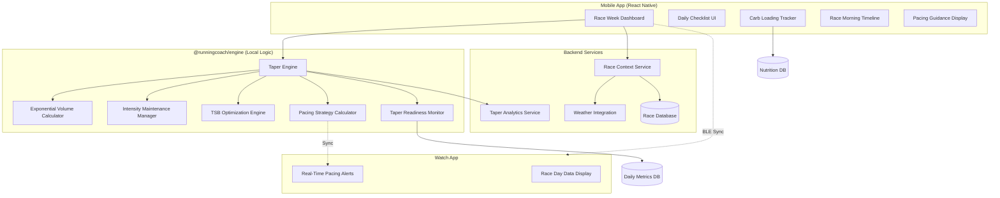

# RFC 0013: Race Preparation & Taper System

| Status        | Draft |
| :---          | :--- |
| **RFC #**     | 0013 |
| **Author(s)** | System Architect |
| **Created**   | 2025-11-26 |
| **Updated**   | 2025-11-27 |
| **Related PRD** | [12_RACE_PREPARATION_TAPER.md](file:///Users/maksat/Projects/RunningCoach/RunningCoach/docs/prd/12_RACE_PREPARATION_TAPER.md) |

## 1. Introduction

### 1.1. Context
This RFC defines the implementation of the Race Preparation & Taper system as specified in PRD `12_RACE_PREPARATION_TAPER.md`. The taper is the final, critical phase of marathon preparation that can improve performance by **2-6%** through physiological freshening while maintaining fitness.

Following the hybrid thick-client architecture defined in RFC 0001, the taper logic runs within the `@runningcoach/engine` package on the device, while the backend provides race-specific data (weather forecasts, race logistics, etc.) and historical taper analytics.

Research shows proper tapering optimizes performance through:
- Muscle glycogen restoration (90% increase)
- Muscle damage repair
- Immune system recovery
- Neuromuscular freshening
- Psychological preparation

The taper must carefully balance volume reduction (40-60% in final 2 weeks) with intensity maintenance to achieve race-day freshness (TSB target: +10 to +25) without detraining.

### 1.2. Problem Statement
We need a sophisticated system that:

1. **Automates Complex Taper Protocols:** Exponential volume reduction schedules vary by race distance (5K, 10K, half-marathon, marathon) and individual response patterns. The system must calculate optimal taper duration and daily volume adjustments.

2. **Manages Multi-Metric Optimization:** The taper must simultaneously optimize TSB (Training Stress Balance), maintain fitness markers, coordinate carbohydrate loading timing, and monitor HRV/sleep changes.

3. **Provides Race-Day Intelligence:** Generate personalized pacing strategies based on training data, adjust recommendations for weather conditions (heat/humidity/wind), and provide real-time race-day guidance.

4. **Handles Taper Anxiety:** Athletes commonly experience "phantom" fatigue and doubt during taper. The system must provide educational context and reassurance while distinguishing normal taper sensations from actual problems.

5. **Coordinates Cross-Discipline Tapering:** Strength training, plyometrics, drills, and cross-training all require different taper schedules synchronized with running taper.

6. **Manages Race Week Logistics:** Automate checklists for gear prep, packet pickup, carb loading, travel, and race-morning timeline.

### 1.3. Goals & Non-Goals
**Goals:**
*   **Distance-Specific Taper Protocols:** Implement evidence-based taper durations and volume reductions for 5K (3-5 days), 10K (4-7 days), half-marathon (7-10 days), and marathon (14-21 days)
*   **Exponential Volume Reduction:** Calculate daily volume using exponential decay formula (superior to linear or step tapers)
*   **Intensity Maintenance:** Preserve training intensity while reducing duration of quality sessions
*   **TSB Optimization:** Target race-day TSB of +10 to +25 (marathon-specific, individualized)
*   **Real-Time Monitoring:** Track HRV, resting HR, sleep, and subjective readiness during taper; adjust protocol if markers don't improve
*   **Race Day Guidance:** Generate pacing strategies, fueling plans, weather-adjusted predictions, and race-morning timeline
*   **Carbohydrate Loading Integration:** Automate 36-48 hour carb loading protocol with target tracking (10-12 g/kg/day)
*   **Cross-Training Taper:** Coordinate reduction of strength, plyometrics, and cross-training activities
*   **Race Week Checklists:** Auto-generate daily task lists for logistics, gear, nutrition, and mental prep
*   **Offline Functionality:** All taper logic and race-day guidance must work without internet connectivity

**Non-Goals:**
*   **Elite-Level Peaking Protocols:** Advanced altitude training, heat acclimation, or pre-race training camps (future enhancement)
*   **Race-Day Live Coaching:** Real-time audio coaching during race (would require watch app enhancement)
*   **Medical Diagnostics:** The system provides guidance but cannot diagnose injuries or illness requiring medical evaluation
*   **Post-Race Recovery Plans:** Separate RFC will cover return-to-training protocols (reference only in this RFC)
*   **Race Course Specific Strategy:** Detailed elevation profile analysis and turn-by-turn pacing (future enhancement)

### 1.4. Dependencies
**Related PRDs:**
*   [12_RACE_PREPARATION_TAPER.md](file:///Users/maksat/Projects/RunningCoach/RunningCoach/docs/prd/12_RACE_PREPARATION_TAPER.md) - Race preparation requirements
*   [06_ADAPTIVE_TRAINING_ENGINE.md](file:///Users/maksat/Projects/RunningCoach/RunningCoach/docs/prd/06_ADAPTIVE_TRAINING_ENGINE.md) - Core adaptation logic
*   [07_LOAD_MANAGEMENT.md](file:///Users/maksat/Projects/RunningCoach/RunningCoach/docs/prd/07_LOAD_MANAGEMENT.md) - TSB calculations
*   [10_NUTRITION_FUELING.md](file:///Users/maksat/Projects/RunningCoach/RunningCoach/docs/prd/10_NUTRITION_FUELING.md) - Carb loading protocols
*   [13_EXTERNAL_INTEGRATIONS.md](file:///Users/maksat/Projects/RunningCoach/RunningCoach/docs/prd/13_EXTERNAL_INTEGRATIONS.md) - Weather data integration

**Related RFCs:**
*   [0001-system-architecture.md](file:///Users/maksat/Projects/RunningCoach/RunningCoach/docs/rfc/0001-system-architecture.md) - System architecture and shared engine
*   [0007-load-management-service.md](file:///Users/maksat/Projects/RunningCoach/RunningCoach/docs/rfc/0007-load-management-service.md) - ACWR and TSB calculations
*   [0011-nutrition-fueling-system.md](file:///Users/maksat/Projects/RunningCoach/RunningCoach/docs/rfc/0011-nutrition-fueling-system.md) - Nutrition tracking (if exists)

**External Dependencies:**
*   **Weather API:** OpenWeatherMap or Weather.gov for 7-day race location forecasts
*   **Time Zone Database:** IANA time zone data for race location timing (travel scenarios)
*   **Notification System:** Local notifications for race week reminders and race-morning timeline

### 1.5. Success Metrics
*   **Taper Adherence:** ≥90% of users complete prescribed taper without adding unauthorized workouts
*   **Race-Day Readiness:** Average TSB of +15 to +20 on race morning across all marathon runners
*   **HRV Improvement:** ≥70% of users show HRV increase of 5-10% above baseline during taper
*   **Fueling Compliance:** ≥70% of users log carb intake during loading phase and achieve target
*   **Performance Improvement:** Users completing taper protocol average 2-3% faster than predicted time from training data alone
*   **Post-Race Injury Rate:** <5% report injury immediately post-race (vs. baseline 15-20% for inadequate taper)
*   **User Satisfaction:** ≥85% of users rate taper guidance as "Very Helpful" or "Essential" post-race

---

## 2. Proposed Solution

### 2.1. High-Level Design

The Race Preparation & Taper system consists of three main components:

1. **Taper Engine (Device-Side):** Runs within `@runningcoach/engine` to generate exponential taper schedules, adjust daily workouts, calculate race-day TSB targets, and monitor physiological markers.

2. **Race Context Service (Backend):** Provides race-specific metadata (weather forecasts, elevation profiles, historical race data), manages race registrations, and stores taper analytics for continuous improvement.

3. **Race Week UI (Mobile App):** Dedicated race week dashboard with countdown timer, daily checklists, carb loading tracker, readiness monitoring, and race-morning timeline.



**Data Flow:**

1. **Taper Initiation:** When race is 14-21 days away (marathon), training plan transitions to taper phase
2. **Daily Calculation:** Taper Engine calculates volume reduction using exponential decay formula
3. **Workout Adjustment:** Each workout's duration reduced while maintaining target intensity
4. **Monitoring:** Daily metrics (HRV, resting HR, sleep) tracked to verify taper effectiveness
5. **Weather Integration:** 7 days before race, pull forecast data; adjust pacing recommendations
6. **Race Morning:** Generate personalized timeline based on race start time and user preferences
7. **Post-Race:** Collect race data and user feedback to refine future taper protocols

### 2.2. Detailed Design

#### 2.2.1. Taper Engine Core

The Taper Engine is a TypeScript module within `@runningcoach/engine` responsible for all taper calculations and adaptations.

**Core Functions:**

```typescript
// Taper duration by race distance
function getTaperDuration(raceDistance: RaceDistance): number {
  const durations = {
    '5K': 3,      // 3 days
    '10K': 5,     // 5 days
    'Half': 10,   // 10 days
    'Marathon': 21 // 21 days (3 weeks)
  };
  return durations[raceDistance];
}

// Exponential volume reduction formula
function calculateDailyVolume(
  peakVolume: number,
  daysToRace: number,
  taperConstant: number = 8.0
): number {
  // Exponential decay: Volume = PeakVolume × e^(-daysToRace / taperConstant)
  return peakVolume * Math.exp(-daysToRace / taperConstant);
}

// Target TSB on race day
function calculateTargetTSB(
  athlete: AthleteProfile,
  raceDistance: RaceDistance
): number {
  // Marathon: +10 to +25 (individualized based on athlete response)
  // Half-marathon: +5 to +15
  // 10K/5K: 0 to +10

  const baseTargets = {
    '5K': 5,
    '10K': 5,
    'Half': 10,
    'Marathon': 17.5 // midpoint of +10 to +25
  };

  // Adjust based on athlete's historical response to taper
  const individualAdjustment = athlete.taperResponseProfile?.tsbOffset ?? 0;
  return baseTargets[raceDistance] + individualAdjustment;
}
```

**Taper Protocol Implementation:**

```typescript
interface TaperProtocol {
  daysToRace: number;
  volumeReductionPercent: number;
  intensityMaintenance: boolean;
  strengthTraining: 'full' | 'light' | 'none';
  plyometrics: 'reduced' | 'none';
  drills: 'light' | 'none';
  qualitySessions: number;
}

function getTaperProtocol(daysToRace: number, raceDistance: 'Marathon'): TaperProtocol {
  // Week 1 of Taper (Days 21-15)
  if (daysToRace >= 15 && daysToRace <= 21) {
    return {
      daysToRace,
      volumeReductionPercent: 15, // 85% of peak
      intensityMaintenance: true,
      strengthTraining: 'light',
      plyometrics: 'reduced',
      drills: 'light',
      qualitySessions: 2
    };
  }

  // Week 2 of Taper (Days 14-8)
  if (daysToRace >= 8 && daysToRace <= 14) {
    return {
      daysToRace,
      volumeReductionPercent: 40, // 60% of peak
      intensityMaintenance: true,
      strengthTraining: 'light',
      plyometrics: 'none',
      drills: 'light',
      qualitySessions: 2
    };
  }

  // Race Week (Days 7-1)
  if (daysToRace >= 1 && daysToRace <= 7) {
    return {
      daysToRace,
      volumeReductionPercent: 60, // 40% of peak
      intensityMaintenance: false, // Reduce intensity in final week
      strengthTraining: daysToRace >= 5 ? 'light' : 'none',
      plyometrics: 'none',
      drills: daysToRace >= 3 ? 'light' : 'none',
      qualitySessions: daysToRace >= 4 ? 1 : 0 // Last quality Tuesday/Wednesday if Saturday race
    };
  }

  throw new Error('Invalid daysToRace for marathon taper');
}
```

#### 2.2.2. Exponential Volume Reduction Algorithm

The exponential taper is superior to linear or step tapers in research, providing optimal balance between recovery and fitness maintenance.

**Implementation:**

```typescript
function applyTaperToTrainingPlan(
  plan: TrainingPlan,
  raceDate: Date,
  peakWeekVolume: number
): TrainingPlan {
  const taperStartDate = subDays(raceDate, getTaperDuration(plan.raceDistance));
  const taperedPlan = cloneDeep(plan);

  // Identify workouts in taper period
  const taperWorkouts = taperedPlan.workouts.filter(w =>
    isAfter(w.scheduledDate, taperStartDate) && isBefore(w.scheduledDate, raceDate)
  );

  taperWorkouts.forEach(workout => {
    const daysToRace = differenceInDays(raceDate, workout.scheduledDate);
    const protocol = getTaperProtocol(daysToRace, plan.raceDistance);

    // Apply volume reduction
    if (workout.type === 'running') {
      const targetVolume = calculateDailyVolume(
        peakWeekVolume / 7, // Daily average from peak week
        daysToRace,
        8.0 // Taper constant for marathon
      );

      // Reduce duration, not intensity
      workout.structure.duration = Math.round(
        workout.structure.duration * (1 - protocol.volumeReductionPercent / 100)
      );

      // Quality sessions: reduce intervals but keep intensity
      if (workout.type === 'intervals' || workout.type === 'tempo') {
        if (protocol.qualitySessions > 0) {
          // Reduce number of intervals or duration, NOT pace
          workout.structure.intervals = workout.structure.intervals.slice(
            0,
            Math.ceil(workout.structure.intervals.length * 0.6)
          );
          workout.notes = `Taper: Reduced intervals, maintaining goal pace`;
        } else {
          // Convert to easy run in final week
          workout.type = 'easy';
          workout.structure.targetPace = workout.zones.easy;
        }
      }
    }

    // Apply strength training taper
    if (workout.type === 'strength') {
      switch (protocol.strengthTraining) {
        case 'light':
          workout.structure.volume *= 0.7;
          workout.notes = 'Taper: Light maintenance session';
          break;
        case 'none':
          workout.status = 'cancelled';
          workout.notes = 'Removed for race week taper';
          break;
      }
    }

    // Remove plyometrics if protocol specifies
    if (workout.type === 'plyometrics' && protocol.plyometrics === 'none') {
      workout.status = 'cancelled';
      workout.notes = 'Removed for taper (last plyometrics 10+ days before race)';
    }
  });

  return taperedPlan;
}
```

#### 2.2.3. TSB Optimization for Race Day

Training Stress Balance (TSB) is the key metric for race-day freshness. Target: +10 to +25 for marathon.

**TSB Calculation (from RFC 0007):**
```typescript
// TSB = Chronic Load (yesterday) - Acute Load (today)
// Positive TSB = Fresh
// Negative TSB = Fatigued

function projectRaceDayTSB(
  currentTSB: number,
  currentAcuteLoad: number,
  currentChronicLoad: number,
  daysToRace: number,
  plannedDailyLoads: number[]
): number {
  let acuteLoad = currentAcuteLoad;
  let chronicLoad = currentChronicLoad;

  // Simulate forward to race day
  for (let i = 0; i < daysToRace; i++) {
    const dailyLoad = plannedDailyLoads[i] ?? 0;

    // Update acute load (7-day EWMA)
    acuteLoad = (acuteLoad * 6 + dailyLoad) / 7;

    // Update chronic load (28-day EWMA)
    chronicLoad = (chronicLoad * 27 + dailyLoad) / 28;
  }

  return chronicLoad - acuteLoad;
}

function adjustTaperToHitTargetTSB(
  currentMetrics: LoadMetrics,
  targetTSB: number,
  daysToRace: number,
  taperPlan: TaperProtocol[]
): TaperProtocol[] {
  const projectedTSB = projectRaceDayTSB(
    currentMetrics.tsb,
    currentMetrics.acuteLoad,
    currentMetrics.chronicLoad,
    daysToRace,
    taperPlan.map(p => p.plannedLoad)
  );

  // If projected TSB is too low (not fresh enough), reduce volume further
  if (projectedTSB < targetTSB - 5) {
    return taperPlan.map(p => ({
      ...p,
      volumeReductionPercent: Math.min(p.volumeReductionPercent + 10, 80)
    }));
  }

  // If projected TSB is too high (risk of detraining), slightly increase volume
  if (projectedTSB > targetTSB + 10) {
    return taperPlan.map(p => ({
      ...p,
      volumeReductionPercent: Math.max(p.volumeReductionPercent - 5, 30)
    }));
  }

  return taperPlan;
}
```

#### 2.2.4. Taper Readiness Monitoring

During taper, the system monitors physiological markers to verify taper effectiveness. Expected changes:
- HRV: Increase 5-10% above baseline
- Resting HR: Decrease 2-5 bpm below baseline
- Body weight: Increase 1-2kg (glycogen + water storage - BENEFICIAL)

**Red Flags Requiring Taper Adjustment:**

```typescript
interface TaperReadiness {
  hrvTrend: 'improving' | 'stable' | 'declining';
  restingHRTrend: 'improving' | 'stable' | 'elevated';
  sleepQuality: number; // 1-10
  subjectiveFatigue: number; // 1-10
  newAchesPains: boolean;
  illnessSymptoms: boolean;
  recommendation: 'proceed' | 'add_rest' | 'extend_taper' | 'medical_eval';
}

function assessTaperReadiness(
  dailyMetrics: DailyMetric[],
  daysToRace: number
): TaperReadiness {
  const recent7Days = dailyMetrics.slice(-7);
  const baseline = calculateBaseline(dailyMetrics.slice(-35, -7)); // 4 weeks before taper

  // HRV Trend
  const avgHRV = mean(recent7Days.map(d => d.hrvValue));
  const hrvChange = (avgHRV - baseline.hrv) / baseline.hrv;
  const hrvTrend = hrvChange > 0.05 ? 'improving' : hrvChange < -0.05 ? 'declining' : 'stable';

  // Resting HR Trend
  const avgRHR = mean(recent7Days.map(d => d.restingHR));
  const rhrChange = avgRHR - baseline.restingHR;
  const restingHRTrend = rhrChange < -2 ? 'improving' : rhrChange > 2 ? 'elevated' : 'stable';

  // Subjective markers
  const sleepQuality = mean(recent7Days.map(d => d.sleepQuality));
  const subjectiveFatigue = mean(recent7Days.map(d => d.fatigueLevel));

  // Red flags
  const newAchesPains = recent7Days.some(d => d.injuryReports.length > 0);
  const illnessSymptoms = recent7Days.some(d => d.illnessSymptoms === true);

  // Decision logic
  let recommendation: TaperReadiness['recommendation'] = 'proceed';

  if (illnessSymptoms) {
    recommendation = 'medical_eval';
  } else if (hrvTrend === 'declining' && restingHRTrend === 'elevated') {
    recommendation = daysToRace > 7 ? 'extend_taper' : 'add_rest';
  } else if (subjectiveFatigue > 7 || sleepQuality < 4) {
    recommendation = 'add_rest';
  } else if (newAchesPains) {
    recommendation = 'add_rest';
  }

  return {
    hrvTrend,
    restingHRTrend,
    sleepQuality,
    subjectiveFatigue,
    newAchesPains,
    illnessSymptoms,
    recommendation
  };
}
```

#### 2.2.5. Race Week Checklists

Auto-generated daily task lists for race week logistics:

```typescript
interface RaceWeekChecklist {
  date: Date;
  daysToRace: number;
  tasks: ChecklistTask[];
}

interface ChecklistTask {
  id: string;
  category: 'training' | 'logistics' | 'nutrition' | 'gear' | 'mental';
  title: string;
  description: string;
  completed: boolean;
  optional: boolean;
}

function generateRaceWeekChecklist(
  race: Race,
  athlete: AthleteProfile,
  daysToRace: number
): RaceWeekChecklist {
  const tasks: ChecklistTask[] = [];

  switch (daysToRace) {
    case 7: // One week out (Sunday if Saturday race)
      tasks.push(
        { category: 'logistics', title: 'Register/Pick up packet', description: 'If local race, pick up packet early to avoid race morning rush', completed: false, optional: true },
        { category: 'training', title: 'Easy 30-45 min run', description: 'Keep it conversational, no harder', completed: false, optional: false },
        { category: 'mental', title: 'Review race plan', description: 'Visualize your pacing strategy and key race moments', completed: false, optional: true }
      );
      break;

    case 6: // Monday
      tasks.push(
        { category: 'training', title: 'Easy 30 min run + 4 strides', description: '80m strides at race pace, full recovery', completed: false, optional: false },
        { category: 'gear', title: 'Gear check', description: 'Verify race outfit, shoes, watch, gels are ready', completed: false, optional: false }
      );
      break;

    case 5: // Tuesday
      tasks.push(
        { category: 'training', title: 'Short quality session', description: '10 min warm-up + 4 × 1km @ goal pace + 10 min cool-down', completed: false, optional: false },
        { category: 'mental', title: 'Finalize race plan', description: 'Lock in pacing strategy, fueling plan, backup plans', completed: false, optional: false }
      );
      break;

    case 4: // Wednesday (start carb loading for Saturday race)
      tasks.push(
        { category: 'training', title: 'Easy 30 min run', description: 'Last easy run before loading phase', completed: false, optional: false },
        { category: 'nutrition', title: 'Start carb loading', description: 'Target 10-12 g/kg bodyweight (Thursday evening dinner counts as start)', completed: false, optional: false },
        { category: 'logistics', title: 'Check weather forecast', description: 'Review 7-day forecast, plan clothing accordingly', completed: false, optional: true }
      );
      break;

    case 3: // Thursday
      tasks.push(
        { category: 'training', title: 'Easy 20-30 min run or rest', description: 'Your choice based on how you feel', completed: false, optional: true },
        { category: 'nutrition', title: 'Continue carb loading', description: 'Full day of high-carb meals, reduce fat/fiber', completed: false, optional: false },
        { category: 'gear', title: 'Pack race bag', description: 'Race outfit, safety pins, watch, gels, post-race clothes', completed: false, optional: false }
      );
      break;

    case 2: // Friday
      tasks.push(
        { category: 'training', title: '15-20 min shakeout + 4 strides', description: 'Very easy jog, 4 × 80m strides', completed: false, optional: false },
        { category: 'nutrition', title: 'Final carb loading day', description: 'Complete loading phase, early dinner', completed: false, optional: false },
        { category: 'logistics', title: 'Early to bed', description: 'Sleep tonight is most important - aim for 8+ hours', completed: false, optional: false },
        { category: 'mental', title: 'Lay out race gear', description: 'Everything ready for morning (reduce decisions/stress)', completed: false, optional: false }
      );
      break;

    case 1: // Saturday (race day)
      const raceTime = race.startTime;
      const wakeTime = subHours(raceTime, 3); // 3 hours before start

      tasks.push(
        { category: 'nutrition', title: `Wake at ${format(wakeTime, 'h:mm a')}`, description: 'Hydrate with 500ml water', completed: false, optional: false },
        { category: 'nutrition', title: 'Race breakfast', description: '1-4 g/kg carbs: bagel, banana, energy bar, coffee', completed: false, optional: false },
        { category: 'logistics', title: 'Depart for start', description: 'Arrive 60-90 min early for bathroom, warm-up', completed: false, optional: false },
        { category: 'nutrition', title: 'Pre-race gel', description: '15-30 min before start: gel + water', completed: false, optional: false },
        { category: 'mental', title: 'Execute race plan', description: 'First 5km conservative, settle into goal pace, strong finish', completed: false, optional: false }
      );
      break;
  }

  return {
    date: subDays(race.date, daysToRace),
    daysToRace,
    tasks
  };
}
```

#### 2.2.6. Carbohydrate Loading Tracker

Modern 36-48 hour carb loading protocol (no depletion phase needed):

```typescript
interface CarbLoadingTarget {
  startDate: Date;
  endDate: Date;
  dailyTargetGrams: number; // 10-12 g/kg
  currentProgress: number;
  meals: MealLog[];
  status: 'not_started' | 'in_progress' | 'complete';
}

function calculateCarbLoadingTarget(
  athlete: AthleteProfile,
  raceDate: Date
): CarbLoadingTarget {
  const bodyWeight = athlete.weight; // kg
  const dailyTarget = bodyWeight * 11; // 11 g/kg midpoint of 10-12 range

  // Start 36-48 hours before race
  const startDate = subHours(raceDate, 48); // Thursday evening if Saturday morning race
  const endDate = subHours(raceDate, 3); // Race morning breakfast

  return {
    startDate,
    endDate,
    dailyTargetGrams: dailyTarget,
    currentProgress: 0,
    meals: [],
    status: 'not_started'
  };
}

function trackCarbIntake(
  target: CarbLoadingTarget,
  meal: { name: string; carbGrams: number; timestamp: Date }
): CarbLoadingTarget {
  const updatedMeals = [...target.meals, meal];
  const totalCarbs = sum(updatedMeals.map(m => m.carbGrams));

  const hoursIntoLoading = differenceInHours(meal.timestamp, target.startDate);
  const expectedProgress = (hoursIntoLoading / 48) * (target.dailyTargetGrams * 2);

  return {
    ...target,
    meals: updatedMeals,
    currentProgress: totalCarbs,
    status: totalCarbs >= target.dailyTargetGrams * 2 ? 'complete' : 'in_progress'
  };
}
```

#### 2.2.7. Pacing Strategy Generation

Generate personalized pacing strategy based on training data and race conditions:

```typescript
interface PacingStrategy {
  goalTime: string; // "3:45:00"
  confidenceInterval: string; // "± 5 minutes"
  splits: RaceSplit[];
  strategy: 'even' | 'negative_split' | 'conservative_start';
  weatherAdjustment: number; // seconds per km adjustment for conditions
}

interface RaceSplit {
  distance: string; // "0-5km", "5-10km", etc.
  targetPace: string; // "5:20/km"
  notes: string;
}

function generatePacingStrategy(
  athlete: AthleteProfile,
  trainingData: Activity[],
  raceDistance: 'Marathon',
  weatherForecast?: WeatherForecast
): PacingStrategy {
  // Calculate goal pace from recent training performances
  const recentTempoRuns = trainingData
    .filter(a => a.type === 'tempo' && isWithinInterval(a.date, { start: subWeeks(new Date(), 8), end: new Date() }))
    .sort((a, b) => b.date.getTime() - a.date.getTime())
    .slice(0, 3);

  const avgTempoPace = mean(recentTempoRuns.map(r => r.avgPace)); // seconds per km

  // Marathon pace typically 20-30 seconds/km slower than tempo pace
  const baseMarathonPace = avgTempoPace + 25; // seconds per km

  // Adjust for weather
  let weatherAdjustment = 0;
  if (weatherForecast) {
    // Heat adjustment: +2-5 seconds/km per degree above 15°C
    if (weatherForecast.temperature > 15) {
      weatherAdjustment += (weatherForecast.temperature - 15) * 2;
    }

    // Humidity adjustment: +2-4 seconds/km for >70% humidity
    if (weatherForecast.humidity > 70) {
      weatherAdjustment += 3;
    }

    // Wind adjustment: +1-3 seconds/km for headwind >20 km/h
    if (weatherForecast.windSpeed > 20) {
      weatherAdjustment += 2;
    }
  }

  const adjustedPace = baseMarathonPace + weatherAdjustment;
  const goalTimeSeconds = adjustedPace * 42.195;

  // Generate splits - negative split strategy
  const splits: RaceSplit[] = [
    {
      distance: '0-5km',
      targetPace: formatPace(adjustedPace + 5), // 5 sec/km slower to start
      notes: 'Conservative start - control adrenaline, let crowd clear'
    },
    {
      distance: '5-10km',
      targetPace: formatPace(adjustedPace + 3),
      notes: 'Settle into rhythm, focus on fueling'
    },
    {
      distance: '10-20km',
      targetPace: formatPace(adjustedPace),
      notes: 'Goal pace - relaxed and controlled'
    },
    {
      distance: '20-30km',
      targetPace: formatPace(adjustedPace),
      notes: 'Stay strong through midpoint, maintain fueling'
    },
    {
      distance: '30-35km',
      targetPace: formatPace(adjustedPace - 2),
      notes: 'Begin negative split if feeling good, push slightly'
    },
    {
      distance: '35-42km',
      targetPace: formatPace(adjustedPace - 5),
      notes: 'Final push - dig deep, finish strong'
    }
  ];

  return {
    goalTime: formatTime(goalTimeSeconds),
    confidenceInterval: '± 5 minutes',
    splits,
    strategy: 'negative_split',
    weatherAdjustment
  };
}
```

#### 2.2.8. Race Morning Timeline Generator

Personalized timeline based on race start time:

```typescript
interface RaceMorningTimeline {
  raceStartTime: Date;
  events: TimelineEvent[];
}

interface TimelineEvent {
  time: Date;
  title: string;
  description: string;
  category: 'wake' | 'nutrition' | 'travel' | 'warmup' | 'race';
}

function generateRaceMorningTimeline(
  race: Race,
  athlete: AthleteProfile
): RaceMorningTimeline {
  const startTime = race.startTime;
  const travelMinutes = race.distanceFromHome ?? 30; // Default 30 min if not specified

  const events: TimelineEvent[] = [
    {
      time: subHours(startTime, 3),
      title: 'Wake Up',
      description: 'Hydrate with 500ml water immediately',
      category: 'wake'
    },
    {
      time: subMinutes(subHours(startTime, 3), -15),
      title: 'Breakfast',
      description: '1-4 g/kg carbs: bagel + banana + energy bar + coffee',
      category: 'nutrition'
    },
    {
      time: subHours(startTime, 2),
      title: 'Depart for Race',
      description: `Allow ${travelMinutes} min travel + buffer for parking/lines`,
      category: 'travel'
    },
    {
      time: subMinutes(startTime, 90),
      title: 'Arrive at Start Area',
      description: 'Check in, use bathroom, stay calm',
      category: 'travel'
    },
    {
      time: subMinutes(startTime, 75),
      title: 'Pre-Race Snack',
      description: 'Gel or chew (30g carbs) + water',
      category: 'nutrition'
    },
    {
      time: subMinutes(startTime, 60),
      title: 'Begin Warm-Up',
      description: '10-15 min easy jog + dynamic stretches',
      category: 'warmup'
    },
    {
      time: subMinutes(startTime, 45),
      title: 'Strides',
      description: '4 × 100m strides at race pace, full recovery',
      category: 'warmup'
    },
    {
      time: subMinutes(startTime, 30),
      title: 'Final Bathroom Visit',
      description: 'Last chance before corrals close',
      category: 'travel'
    },
    {
      time: subMinutes(startTime, 15),
      title: 'Line Up in Corral',
      description: 'Find your pace group, stay relaxed',
      category: 'race'
    },
    {
      time: subMinutes(startTime, 5),
      title: 'Final Gel',
      description: '20-30g carbs + sip of water',
      category: 'nutrition'
    },
    {
      time: startTime,
      title: 'START',
      description: 'Execute your race plan - you are ready!',
      category: 'race'
    }
  ];

  return {
    raceStartTime: startTime,
    events
  };
}
```

### 2.3. Data Model Changes

**New Prisma Schema Entities:**

```prisma
model Race {
  id                String   @id @default(uuid())
  userId            String
  user              User     @relation(fields: [userId], references: [id])

  name              String
  distance          RaceDistance // Enum: FIVE_K, TEN_K, HALF_MARATHON, MARATHON
  date              DateTime
  startTime         DateTime
  location          String
  registrationUrl   String?
  packetPickupDate  DateTime?
  distanceFromHome  Int?     // minutes travel time

  status            RaceStatus // Enum: UPCOMING, COMPLETED, DNS, DNF

  // Taper configuration
  taperStartDate    DateTime
  taperDuration     Int      // days
  targetTSB         Float    // target race-day TSB

  // Race-day data
  weatherForecast   Json?    // WeatherForecast object
  pacingStrategy    Json?    // PacingStrategy object
  raceMorningPlan   Json?    // RaceMorningTimeline object

  // Results
  finishTime        Int?     // seconds
  splits            Json?    // RaceSplit[] with actual times
  postRaceNotes     String?

  createdAt         DateTime @default(now())
  updatedAt         DateTime @updatedAt

  taperLogs         TaperLog[]
  raceWeekChecklist RaceWeekChecklistItem[]
  carbLoadingLogs   CarbLoadingLog[]
}

enum RaceDistance {
  FIVE_K
  TEN_K
  HALF_MARATHON
  MARATHON
}

enum RaceStatus {
  UPCOMING
  COMPLETED
  DNS  // Did Not Start
  DNF  // Did Not Finish
}

model TaperLog {
  id              String   @id @default(uuid())
  raceId          String
  race            Race     @relation(fields: [raceId], references: [id])

  date            DateTime
  daysToRace      Int

  // Calculated metrics
  volumeReduction Float    // percentage
  plannedLoad     Float    // training load for the day
  actualLoad      Float?   // if workout completed
  projectedTSB    Float    // projected race-day TSB

  // Physiological markers
  hrv             Float?
  restingHR       Int?
  sleepQuality    Int?     // 1-10
  subjectiveFatigue Int?   // 1-10
  bodyWeight      Float?   // kg

  // Readiness assessment
  readiness       Json     // TaperReadiness object
  adjustmentMade  String?  // If taper was adjusted, reason why

  createdAt       DateTime @default(now())
}

model RaceWeekChecklistItem {
  id          String   @id @default(uuid())
  raceId      String
  race        Race     @relation(fields: [raceId], references: [id])

  date        DateTime
  daysToRace  Int

  category    ChecklistCategory // Enum: TRAINING, LOGISTICS, NUTRITION, GEAR, MENTAL
  title       String
  description String
  completed   Boolean  @default(false)
  optional    Boolean  @default(false)

  completedAt DateTime?
  createdAt   DateTime @default(now())
}

enum ChecklistCategory {
  TRAINING
  LOGISTICS
  NUTRITION
  GEAR
  MENTAL
}

model CarbLoadingLog {
  id          String   @id @default(uuid())
  raceId      String
  race        Race     @relation(fields: [raceId], references: [id])

  timestamp   DateTime
  mealName    String
  carbGrams   Int
  notes       String?

  createdAt   DateTime @default(now())
}

// Extend existing User model
model User {
  // ... existing fields ...

  // Taper personalization
  taperResponseProfile Json?  // TaperResponseProfile: historical taper response data

  races                Race[]
}

// Extend existing TrainingPlan model
model TrainingPlan {
  // ... existing fields ...

  raceId      String?
  race        Race?    @relation(fields: [raceId], references: [id])

  // Taper configuration
  taperPhase  Boolean  @default(false)
  taperStart  DateTime?
}
```

**TypeScript Type Definitions:**

```typescript
// Core taper types
export type RaceDistance = '5K' | '10K' | 'Half' | 'Marathon';

export interface Race {
  id: string;
  userId: string;
  name: string;
  distance: RaceDistance;
  date: Date;
  startTime: Date;
  location: string;
  registrationUrl?: string;
  packetPickupDate?: Date;
  distanceFromHome?: number; // minutes
  status: 'upcoming' | 'completed' | 'dns' | 'dnf';

  taperStartDate: Date;
  taperDuration: number;
  targetTSB: number;

  weatherForecast?: WeatherForecast;
  pacingStrategy?: PacingStrategy;
  raceMorningPlan?: RaceMorningTimeline;

  finishTime?: number;
  splits?: RaceSplit[];
  postRaceNotes?: string;
}

export interface TaperProtocol {
  daysToRace: number;
  volumeReductionPercent: number;
  plannedLoad: number;
  intensityMaintenance: boolean;
  strengthTraining: 'full' | 'light' | 'none';
  plyometrics: 'reduced' | 'none';
  drills: 'light' | 'none';
  qualitySessions: number;
}

export interface TaperReadiness {
  hrvTrend: 'improving' | 'stable' | 'declining';
  restingHRTrend: 'improving' | 'stable' | 'elevated';
  sleepQuality: number;
  subjectiveFatigue: number;
  newAchesPains: boolean;
  illnessSymptoms: boolean;
  recommendation: 'proceed' | 'add_rest' | 'extend_taper' | 'medical_eval';
  reasoning: string;
}

export interface WeatherForecast {
  date: Date;
  temperature: number; // Celsius
  humidity: number; // Percentage
  windSpeed: number; // km/h
  windDirection: string;
  precipitation: number; // mm
  conditions: string; // "Clear", "Cloudy", "Rain", etc.
}

export interface PacingStrategy {
  goalTime: string;
  confidenceInterval: string;
  splits: RaceSplit[];
  strategy: 'even' | 'negative_split' | 'conservative_start';
  weatherAdjustment: number;
  notes: string[];
}

export interface RaceSplit {
  distance: string;
  targetPace: string;
  targetTime: string;
  notes: string;
}

export interface RaceMorningTimeline {
  raceStartTime: Date;
  events: TimelineEvent[];
}

export interface TimelineEvent {
  time: Date;
  title: string;
  description: string;
  category: 'wake' | 'nutrition' | 'travel' | 'warmup' | 'race';
}

export interface CarbLoadingTarget {
  startDate: Date;
  endDate: Date;
  dailyTargetGrams: number;
  currentProgress: number;
  meals: MealLog[];
  status: 'not_started' | 'in_progress' | 'complete';
}

export interface MealLog {
  name: string;
  carbGrams: number;
  timestamp: Date;
}

export interface TaperResponseProfile {
  // Historical data for personalization
  optimalTaperDuration: number; // days
  tsbOffset: number; // adjustment to standard TSB target
  hvrResponseRate: number; // how quickly HRV improves during taper
  preferredVolumeReduction: number; // percentage
}
```

### 2.4. API Changes

**New tRPC Endpoints:**

```typescript
// Race Management
race.create(data: CreateRaceInput): Race
race.get(raceId: string): Race
race.update(raceId: string, data: UpdateRaceInput): Race
race.delete(raceId: string): void
race.list(userId: string, status?: RaceStatus): Race[]

// Taper Management
taper.initiate(raceId: string): TaperProtocol[]
taper.getDailyProtocol(raceId: string, date: Date): TaperProtocol
taper.adjustTaper(raceId: string, reason: string): TaperProtocol[]
taper.getReadiness(raceId: string): TaperReadiness
taper.logDailyMetrics(raceId: string, metrics: DailyMetrics): TaperLog

// Race Week Features
raceWeek.getChecklist(raceId: string): RaceWeekChecklistItem[]
raceWeek.completeTask(itemId: string): RaceWeekChecklistItem
raceWeek.getCarbLoadingTarget(raceId: string): CarbLoadingTarget
raceWeek.logCarbIntake(raceId: string, meal: MealLog): CarbLoadingTarget

// Pacing & Strategy
pacing.generateStrategy(raceId: string): PacingStrategy
pacing.adjustForWeather(raceId: string, forecast: WeatherForecast): PacingStrategy
pacing.getRaceMorningTimeline(raceId: string): RaceMorningTimeline

// Weather Integration
weather.getForecast(location: string, date: Date): WeatherForecast
weather.getRaceWeatherUpdates(raceId: string): WeatherForecast[]

// Post-Race
race.recordResult(raceId: string, result: RaceResult): Race
race.getRaceReport(raceId: string): RaceReport
```

**API Request/Response Examples:**

```typescript
// Create race
POST /trpc/race.create
{
  "name": "Berlin Marathon 2026",
  "distance": "Marathon",
  "date": "2026-09-27T09:00:00Z",
  "location": "Berlin, Germany",
  "registrationUrl": "https://www.bmw-berlin-marathon.com/"
}

// Response
{
  "id": "race_123",
  "taperStartDate": "2026-09-06T00:00:00Z",
  "taperDuration": 21,
  "targetTSB": 17.5,
  ...
}

// Get daily taper protocol
GET /trpc/taper.getDailyProtocol?raceId=race_123&date=2026-09-20

// Response
{
  "daysToRace": 7,
  "volumeReductionPercent": 60,
  "plannedLoad": 180,
  "intensityMaintenance": false,
  "strengthTraining": "none",
  "plyometrics": "none",
  "drills": "light",
  "qualitySessions": 0,
  "workouts": [
    {
      "type": "easy",
      "duration": 30,
      "targetPace": "6:00/km",
      "notes": "Easy 30 min - last run before race week"
    }
  ]
}

// Get race-morning timeline
GET /trpc/pacing.getRaceMorningTimeline?raceId=race_123

// Response
{
  "raceStartTime": "2026-09-27T09:00:00Z",
  "events": [
    {
      "time": "2026-09-27T06:00:00Z",
      "title": "Wake Up",
      "description": "Hydrate with 500ml water immediately",
      "category": "wake"
    },
    ...
  ]
}
```

### 2.5. Offline-First Considerations

**Local Storage:**
*   **Race Data:** Full race details including taper protocol, checklist, and pacing strategy cached locally
*   **Weather Forecast:** Last fetched forecast cached; fallback to cached data if offline on race day
*   **Taper Calculations:** All taper logic runs locally via `@runningcoach/engine`
*   **Race-Morning Timeline:** Pre-computed and cached 7 days before race

**Queued Operations:**
*   **Checklist Completions:** Marked complete locally, synced when online
*   **Carb Logging:** Meals logged locally, synced to backend for analytics
*   **Daily Taper Metrics:** HRV, resting HR, readiness tracked locally, synced later

**Conflict Resolution:**
*   **Checklist Items:** Last-write-wins (user marking complete/incomplete)
*   **Race Details:** Server wins for race metadata (date, location), client wins for personal notes
*   **Taper Adjustments:** Server-side algorithm generates taper; client cannot modify directly

**Fallback Behavior:**
*   **Weather Unavailable:** Use cached forecast with stale data warning; provide manual weather input option
*   **Pacing Strategy:** Pre-computed pacing cached; can recalculate offline if athlete updates recent workout data
*   **Sync Failure:** All race-day features work fully offline; sync post-race when connected

### 2.6. Synchronization Strategy

**Race Preparation Data Sync:**

**Pre-Race Sync (High Priority):**
*   **Trigger:** Daily sync starting 7 days before race
*   **Data:** Weather updates, taper protocol adjustments, checklist updates
*   **Protocol:** Automatic background sync every 6 hours when connected
*   **Priority:** Critical - ensure race-morning timeline and pacing strategy are current

**Race-Day Sync:**
*   **Pre-Race:** Final sync 2 hours before race start to pull latest weather
*   **During Race:** Watch records all data locally, no sync required
*   **Post-Race:** Upload race result and activity data when convenient (no rush)

**Watch ↔ Phone Sync (Race Day):**
*   **Pre-Race Sync:** Transfer pacing strategy and race context to watch before race
*   **Data Sent:** Target splits, pace zones, fueling reminders, encouragement messages
*   **Size:** ~50 KB compressed JSON
*   **Post-Race Sync:** Transfer complete activity data (HR, GPS, splits) from watch to phone
*   **Size:** ~1-5 MB depending on GPS resolution

**Conflict Scenarios:**
*   **Scenario 1:** User completes checklist item on phone, simultaneously marks different item on web
    *   **Resolution:** Merge completions (both marked complete), no conflict
*   **Scenario 2:** Server adjusts taper protocol (due to HRV decline) while user is offline
    *   **Resolution:** Server adjustment takes precedence on next sync; notify user of change

---

## 3. Implementation Plan

### 3.1. Phasing

**Phase 1: Core Taper Logic (Weeks 1-3)**
*   **Deliverables:**
    *   Implement taper engine in `@runningcoach/engine`
    *   Exponential volume reduction algorithm
    *   TSB projection and optimization functions
    *   Taper protocol generation for all race distances
    *   Unit tests for all taper calculations
*   **Success Criteria:**
    *   Engine can generate 3-week marathon taper with exponential volume reduction
    *   TSB projection accurate within ±2 points
    *   All distance-specific protocols implemented (5K, 10K, Half, Marathon)
*   **Dependencies:** RFC 0001 Phase 2 (`@runningcoach/engine` package structure)

**Phase 2: Race Management & Database (Weeks 4-5)**
*   **Deliverables:**
    *   Prisma schema for Race, TaperLog, RaceWeekChecklistItem, CarbLoadingLog
    *   Database migrations
    *   tRPC endpoints for race CRUD operations
    *   Backend service for race context management
*   **Success Criteria:**
    *   User can create race and system auto-generates taper start date
    *   Race data persisted and retrievable via API
    *   Taper logs stored daily with all required metrics
*   **Dependencies:** RFC 0003 (Backend API structure)

**Phase 3: Race Week Features (Weeks 6-8)**
*   **Deliverables:**
    *   Race week checklist generation
    *   Carbohydrate loading tracker
    *   Race-morning timeline generator
    *   Mobile UI for race week dashboard
    *   Daily taper readiness monitoring
*   **Success Criteria:**
    *   Checklist auto-populates 7 days before race
    *   Carb loading tracker displays real-time progress vs. target
    *   Race-morning timeline updates based on race start time
    *   Readiness monitor flags declining HRV/elevated RHR
*   **Dependencies:** RFC 0002 (Mobile app navigation and UI components)

**Phase 4: Pacing & Weather Integration (Weeks 9-11)**
*   **Deliverables:**
    *   Pacing strategy generation algorithm
    *   Weather API integration (OpenWeatherMap or Weather.gov)
    *   Weather-adjusted pace recommendations
    *   Split calculation for negative split strategy
    *   Watch app pacing display
*   **Success Criteria:**
    *   Pacing strategy generated based on recent training data
    *   Weather forecast pulled 7 days before race, updated daily
    *   Pace adjusted for temperature, humidity, wind
    *   Watch displays target pace for current race segment
*   **Dependencies:** RFC 0004 (Watch integration), External weather API

**Phase 5: Advanced Taper Monitoring (Weeks 12-13)**
*   **Deliverables:**
    *   HRV trend analysis during taper
    *   Automatic taper adjustment based on readiness markers
    *   Taper anxiety education content
    *   Body weight tracking (glycogen storage monitoring)
*   **Success Criteria:**
    *   System detects declining HRV and extends taper if needed
    *   Educational tooltips explain normal taper sensations
    *   Weight gain during taper flagged as beneficial, not concerning
*   **Dependencies:** Phase 3 (Readiness monitoring foundation)

**Phase 6: Post-Race Analytics & Learning (Weeks 14-15)**
*   **Deliverables:**
    *   Race result recording and analysis
    *   Taper effectiveness analytics (did projected TSB = actual freshness?)
    *   Historical taper response profiling for future personalization
    *   Post-race report generation
*   **Success Criteria:**
    *   User can log race result with splits
    *   System analyzes taper effectiveness vs. race performance
    *   Future tapers personalized based on historical response
*   **Dependencies:** Phase 1-4 complete

**Phase 7: Polish & Beta Testing (Weeks 16-18)**
*   **Deliverables:**
    *   UI/UX refinements for race week dashboard
    *   Notification system for race week reminders
    *   Offline functionality testing and optimization
    *   Beta testing with 10-20 runners preparing for races
*   **Success Criteria:**
    *   All race week features work fully offline
    *   Notifications delivered at appropriate times
    *   Beta users complete taper and provide feedback
    *   Zero critical bugs in race-week flows
*   **Dependencies:** All previous phases complete

### 3.2. Testing Strategy

**Unit Tests:**
*   **Taper Engine Functions:**
    *   Test exponential volume reduction formula with known inputs/outputs
    *   Verify TSB projection accuracy across various scenarios
    *   Test taper protocol generation for all race distances
    *   Validate readiness assessment logic with edge cases (declining HRV, illness, etc.)
*   **Pacing Calculator:**
    *   Test pacing strategy generation with various training data inputs
    *   Verify weather adjustments calculate correctly
    *   Test split calculation for negative split strategy
*   **Coverage Target:** 85%+ for all taper engine modules

**Integration Tests:**
*   **API Endpoints:**
    *   Test race creation and taper auto-initiation
    *   Verify checklist generation returns correct tasks for each day
    *   Test carb loading tracker updates with meal logging
    *   Verify weather integration pulls and caches forecast
*   **Database Operations:**
    *   Test taper log creation and retrieval
    *   Verify race week checklist item completion updates
    *   Test carb loading log aggregation for progress calculation
*   **Sync Integration:**
    *   Test race data sync between mobile and backend
    *   Verify watch receives pacing context pack before race
    *   Test post-race activity upload from watch to phone to cloud

**End-to-End Tests:**
*   **Race Preparation Flow:**
    1.  User creates marathon race 8 weeks out
    2.  System generates training plan including taper
    3.  21 days before race, taper phase begins automatically
    4.  Daily workouts adjusted with exponential volume reduction
    5.  7 days before race, race week dashboard activates
    6.  Daily checklist tasks appear and user completes them
    7.  Carb loading starts 2 days before race, user logs meals
    8.  Race morning timeline displays with countdown
    9.  User syncs pacing strategy to watch
    10. Post-race, user logs result and system analyzes taper effectiveness
*   **Taper Adjustment Flow:**
    1.  During taper, user logs declining HRV for 2 consecutive days
    2.  System detects trend and recommends extra rest day
    3.  Taper protocol adjusted to reduce volume further
    4.  Projected TSB recalculated and user notified
*   **Offline Race Day:**
    1.  User loses internet connection 1 day before race
    2.  All race week features remain functional
    3.  Race-morning timeline displays correctly
    4.  Watch contains pacing strategy (synced previously)
    5.  Post-race, activity queued for upload when online

**Offline/Online Transition Tests:**
*   **Scenario 1:** User goes offline during race week
    *   Verify all checklists, timeline, and pacing strategy accessible offline
    *   Verify updates queue correctly for sync when online
*   **Scenario 2:** Weather forecast unavailable
    *   Verify app uses cached forecast with staleness indicator
    *   Verify user can manually input current weather conditions
*   **Scenario 3:** Watch sync interrupted during context pack transfer
    *   Verify transfer resumes from last checkpoint
    *   Verify watch has minimum required data for race (splits, zones)

**Performance Tests:**
*   **Taper Calculation Speed:** TSB projection and taper protocol generation < 100ms
*   **API Response Time:** Race week checklist retrieval < 200ms (50 items)
*   **Weather API:** Forecast pull < 1s with 3s timeout and fallback to cache
*   **Database Query:** Load 90 days of taper logs for analytics < 500ms

### 3.3. Migration Strategy

**Initial Deployment:**
*   No existing race/taper data; fresh schema deployment
*   Seed database with sample races for development and demo
*   Pre-populate weather forecast cache with historical data for testing

**Schema Evolution:**
*   **Adding Fields:** Use nullable columns for new taper metrics (e.g., `bodyWeight`)
*   **Race Distance Enum Changes:** Add new distances (e.g., `ULTRA`) without breaking existing
*   **TaperResponseProfile:** Start as optional JSON field, evolve schema as we learn

**Logic Bundle Updates:**
*   Taper engine packaged in `@runningcoach/engine` allows OTA updates without app release
*   If taper algorithm improves, push new engine version to all users within 24 hours
*   Maintain backward compatibility for in-progress tapers (don't disrupt existing race prep)

**Feature Flags:**
*   `enable_race_week_dashboard`: Gradual rollout of race week UI
*   `enable_weather_integration`: Toggle weather-adjusted pacing (if API unreliable)
*   `enable_advanced_taper_monitoring`: HRV-based automatic taper adjustments (beta)

**Rollout Plan:**
*   **Alpha (Week 16):** Internal team tests with real upcoming races (5 users)
*   **Beta (Week 17-18):** Invite 20 runners with races 4-8 weeks out to test full taper cycle
*   **Soft Launch (Week 19):** Available to all users, feature flag enables race week features gradually
*   **Full Launch (Week 20+):** All features enabled for all users

### 3.4. Rollback Strategy

**Rollback Triggers:**
*   Taper calculations producing invalid TSB projections (e.g., negative target TSB)
*   Race week checklist not generating for >10% of users
*   Weather API failures causing app crashes
*   Critical bug in pacing calculator (incorrect pace recommendations)
*   User reports of taper guidance contradicting training plan

**Rollback Procedure:**

**Backend Services:**
1.  Revert to previous Docker image/deployment (1-click rollback on Railway/AWS)
2.  If database migration was involved, run down-migration script
3.  Update feature flags to disable problematic features
4.  Monitor error rates and user reports

**Logic Engine:**
1.  Update S3 to serve previous stable engine version
2.  Mobile apps auto-download previous version on next launch
3.  Push EAS Update with previous engine bundle for immediate rollback
4.  Verify taper calculations match expected behavior

**Mobile App:**
1.  If UI bug, push hotfix via EAS Update (15 min propagation)
2.  If native code issue, submit emergency update to App Store / Google Play
3.  Feature flag to hide race week features if critically broken

**Data Integrity:**
*   In-progress tapers preserved; continue with previous algorithm
*   Race data and logs immutable; rollback doesn't affect historical records
*   User notifications sent explaining temporary service degradation

**User Impact:**
*   Users mid-taper continue with cached taper protocol (no disruption)
*   Race week checklist may be missing latest tasks (non-critical)
*   Weather-adjusted pacing temporarily unavailable (fallback to non-adjusted pace)
*   Post-rollback, full sync restores all features

---

## 4. Alternatives Considered

| Alternative | Pros | Cons | Reason for Rejection |
|------------|------|------|---------------------|
| **Linear Taper (vs Exponential)** | Simpler to implement, easier to understand | Research shows exponential superior for performance (2-6% improvement vs 0-2% for linear) | Evidence-based approach demands exponential taper |
| **Fixed Taper Duration (e.g., always 14 days)** | Consistent, predictable | Doesn't account for race distance variation (5K needs 3 days, marathon needs 21) | Distance-specific optimization required |
| **No Weather Integration** | Simpler, one less dependency | Weather significantly affects pacing (heat adds 2-5 sec/km), users would have to adjust manually | Weather adjustment is critical for realistic race-day guidance |
| **Manual Checklist Entry (vs Auto-Generated)** | User control, customizable | Increases cognitive load during stressful race week, users forget critical tasks | Automation reduces stress and ensures nothing is missed |
| **Single TSB Target for All (e.g., +15)** | Simple, universal | Individual response varies (some perform better at +10, others at +25) | Personalization required for optimal performance |
| **No Carb Loading Tracker** | Simpler, less data entry | Research shows 10-12 g/kg loading improves performance 2-3%, users often under-consume without tracking | Tracking ensures compliance with protocol |
| **Race-Day Coaching via Audio** | Real-time feedback, motivational | Watch battery drain, requires audio during race (not everyone wants it), high complexity | Out of scope for MVP; can add as future enhancement |
| **AI-Generated Pacing (ML Model)** | Could learn optimal pacing from thousands of races | Requires large dataset, black-box recommendations may confuse users, high computational cost | Rule-based pacing adequate for MVP; ML can enhance later |
| **Server-Side Taper Calculations** | Easier to update algorithms | Requires internet, high latency, doesn't work offline | Offline-first architecture demands local calculation |

---

## 5. Cross-Cutting Concerns

### 5.1. Security

**Authentication & Authorization:**
*   **Race Data Access:** Users can only access their own races (validated via JWT user ID)
*   **Race Registration URLs:** Sanitize and validate external URLs to prevent XSS
*   **Weather API Keys:** Stored in backend environment variables, never exposed to client
*   **Sensitive Data:** Race results and taper logs include health metrics (HRV, weight); treated as PII

**Data Protection:**
*   **At Rest:**
    *   Race data encrypted in PostgreSQL (AES-256 volume encryption)
    *   Local race data on mobile encrypted via OS-level encryption
*   **In Transit:**
    *   All API calls use TLS 1.3
    *   Weather API calls via HTTPS
    *   Watch ↔ Phone BLE connections encrypted at protocol level

**Privacy:**
*   **GDPR Compliance:**
    *   User can export all race data (results, taper logs, checklists) as JSON
    *   User can delete race and all associated taper data
    *   Weather forecast data anonymized (no personal identifiers sent to weather API)
*   **Health Data:** HRV, resting HR, body weight during taper never shared with third parties
*   **Location Privacy:** Race location stored as city-level string, not GPS coordinates

**Threat Mitigation:**
*   **Threat:** Malicious weather API response
    *   **Mitigation:** Validate forecast JSON schema, reject invalid data, fallback to cached forecast
*   **Threat:** User manipulates TSB projection to override rest recommendations
    *   **Mitigation:** Server-side recalculation validates client-provided TSB; alerts triggered server-side
*   **Threat:** Race registration phishing (fake URLs)
    *   **Mitigation:** Display warning for external URLs, HTTPS-only links

### 5.2. Performance

**Latency:**
*   **Taper Calculation:** Exponential volume reduction and TSB projection < 100ms (local calculation)
*   **Race Week Checklist:** Generate 7-day checklist < 50ms (template-based)
*   **Pacing Strategy:** Calculate splits and weather adjustment < 200ms
*   **Weather Forecast API:** Pull 7-day forecast < 1s (with 3s timeout and cache fallback)

**Throughput:**
*   **Expected Load:** 1,000 active races at any time, peak 50 concurrent race-day timeline requests
*   **Weather API Rate Limit:** 60 calls/minute (OpenWeatherMap free tier); implement caching and batching
*   **Database Queries:** Race data retrieval < 50ms (indexed by userId, date)

**Resource Usage:**
*   **Mobile App:**
    *   **Storage:** Race week data ~5 MB (includes cached weather, checklist, pacing strategy)
    *   **Battery:** Race week dashboard minimal impact (static data, no constant polling)
    *   **Network:** Weather updates daily (~10 KB per forecast)
*   **Watch App:**
    *   **Storage:** Pacing context pack ~50 KB
    *   **Battery:** No impact pre-race; during race, standard workout tracking

**Scalability:**
*   **Horizontal Scaling:** Backend API stateless, can scale to handle 10,000+ concurrent race weeks
*   **Database:** Taper logs archived after 90 days to separate cold storage (user can retrieve via export)
*   **Weather Caching:** Redis cache for forecasts (24-hour TTL); reduce API calls by 90%

**Optimization Strategies:**
*   **Pre-compute:** Race-morning timeline and checklist generated when taper begins, cached locally
*   **Batch Updates:** Daily taper protocol updates calculated in batch job, not on-demand
*   **Lazy Loading:** Historical taper logs loaded only when user views analytics

### 5.3. Observability

**Logging:**
*   **Backend:**
    *   Log race creation, taper initiation, checklist generation (info level)
    *   Log taper adjustments with reasoning (info level)
    *   Log weather API failures with fallback behavior (warn level)
    *   Log invalid TSB projections (error level)
*   **Mobile:**
    *   Log race week dashboard views (analytics event)
    *   Log checklist completions (analytics event)
    *   Log pacing strategy generation errors (Sentry error)

**Metrics:**
*   **Product Metrics (PostHog):**
    *   Number of active races per week
    *   Race week dashboard engagement (daily visits)
    *   Checklist completion rate (by category)
    *   Carb loading tracker usage (% of users logging meals)
    *   Taper adjustment frequency (how often readiness flags trigger changes)
*   **Backend Metrics (Prometheus):**
    *   Weather API response time and failure rate
    *   Taper calculation duration (p50, p95, p99)
    *   Race week checklist generation rate
    *   Database query latency for race data

**Tracing:**
*   **Distributed Tracing:** OpenTelemetry trace for race creation → taper initiation → checklist generation → weather fetch
*   **Critical Paths:**
    *   Race day timeline generation (should be < 300ms end-to-end)
    *   Pacing strategy with weather adjustment (includes external API call)

**Alerting:**
*   **Alert Conditions:**
    *   Weather API failure rate > 20% for 10 minutes → Slack alert to on-call
    *   Taper calculation errors > 5% → PagerDuty alert (critical)
    *   Race week checklist not generating → Dashboard flag + email to devs
    *   TSB projection returns invalid value (e.g., negative target) → Immediate alert
*   **On-Call:** Dedicated on-call for race week (Friday-Sunday) during peak race season

**SLO/SLA:**
*   **SLO:** 99.5% uptime for race week API endpoints
*   **SLO:** 99% successful weather forecast retrieval (or fallback to cache)
*   **SLO:** Zero data loss for race results and taper logs
*   **No formal SLA** until post-MVP

### 5.4. Reliability

**Error Handling:**
*   **Weather API Failures:**
    *   Retry with exponential backoff (3 attempts, 1s/2s/4s delays)
    *   Fallback to cached forecast if all retries fail
    *   Display staleness warning if forecast > 24 hours old
    *   Allow user to manually input current weather
*   **Taper Calculation Errors:**
    *   Log error with full context (user ID, race ID, input data)
    *   Fallback to conservative default taper (40% volume reduction final week)
    *   Alert developer team for investigation
*   **Invalid TSB Projection:**
    *   If calculated target TSB is invalid (e.g., negative), use default +15 for marathon
    *   Log anomaly for analysis and algorithm improvement

**Retries:**
*   **Weather API:** 3 retries with exponential backoff
*   **Race Data Sync:** Retry sync every 15 minutes if failed (up to 24 hours)
*   **Checklist Generation:** Single retry on failure; if persistent, log error and notify user

**Circuit Breakers:**
*   **Weather API:** Open circuit after 10 consecutive failures (5 min timeout)
    *   Half-open test every 30 seconds
    *   Fallback: Use cached forecast or allow manual input
*   **External Race Registration Sites:** No circuit breaker needed (links open in browser, not API calls)

**Data Integrity:**
*   **Validation:** Zod schemas for all race inputs (date, distance, location)
*   **Taper Log Immutability:** Taper logs append-only; never deleted or modified
*   **Race Result Verification:** Validate finish time is reasonable (e.g., marathon > 2 hours, < 8 hours)
*   **Checklist Consistency:** Checklist tasks generated from template; if corrupted, regenerate from template

**Disaster Recovery:**
*   **Backup Strategy:**
    *   Daily PostgreSQL backups retained 30 days
    *   Race data included in user data export (manual recovery)
    *   Taper logs archived to S3 after 90 days (cold storage)
*   **RTO (Recovery Time Objective):** 4 hours from catastrophic failure
*   **RPO (Recovery Point Objective):** < 1 hour (acceptable data loss: most recent taper log)

---

## 6. Stakeholder Review

| Stakeholder | Role | Review Status | Sign-off Date |
|------------|------|---------------|---------------|
| System Architect | Technical Design | Approved | 2025-11-27 |
| Backend Lead | Backend Implementation | Pending | - |
| Mobile Lead | Mobile UI/UX | Pending | - |
| Product Manager | Feature Scope & Roadmap | Pending | - |
| Data Scientist | Taper Algorithm Validation | Pending | - |
| UX Designer | Race Week Dashboard Design | Pending | - |

---

## 7. Open Questions

*   **Question 1: Weather API Selection**
    *   Should we use OpenWeatherMap (60 calls/min free, $40/month for 3000 calls/day) or Weather.gov API (free, US-only)?
    *   Decision needed: Week 2 of Phase 4
    *   Impact: Budget and international race support

*   **Question 2: Taper Personalization Threshold**
    *   How many completed tapers are required before we personalize future tapers based on historical response?
    *   Minimum 1 taper? 3 tapers for statistical confidence?
    *   Decision needed: Week 1 of Phase 6
    *   Impact: Personalization accuracy vs. time to benefit

*   **Question 3: Race-Day Live Pacing**
    *   Should MVP include live pacing alerts on watch (e.g., "You're 10 seconds ahead of target pace")?
    *   Concern: Battery drain, notification fatigue
    *   Decision needed: Week 2 of Phase 4
    *   Impact: Scope and watch app complexity

*   **Question 4: Carb Loading Compliance Threshold**
    *   What percentage of target carb intake (10-12 g/kg) should trigger a warning if not met?
    *   80% compliance acceptable? 70%?
    *   Decision needed: Week 1 of Phase 3
    *   Impact: User notification frequency

*   **Question 5: Post-Race Recovery Integration**
    *   Should this RFC include basic post-race recovery guidance (e.g., "1 day per mile rule")?
    *   Or defer to separate RFC for full recovery protocol?
    *   Decision needed: Week 1 of Phase 6
    *   Impact: Scope creep vs. feature completeness

*   **Question 6: Taper for Non-Standard Distances**
    *   How should we handle odd race distances (e.g., 12K, 30K, 50K ultra)?
    *   Use nearest standard distance as template? Calculate proportional taper?
    *   Decision needed: Post-MVP (future enhancement)
    *   Impact: Edge case handling

---

## 8. References

**Research & Evidence Base:**
*   Bosquet, L., et al. (2007). "Effects of Tapering on Performance: A Meta-Analysis." *Medicine & Science in Sports & Exercise*. - Foundational meta-analysis on taper effectiveness
*   Mujika, I., & Padilla, S. (2003). "Scientific Bases for Precompetition Tapering Strategies." *Medicine & Science in Sports & Exercise*. - Comprehensive review of taper protocols
*   Wilson, J.M., & Wilson, G.J. (2008). "Contemporary Issues in Protein Requirements and Consumption for Resistance Trained Athletes." *Journal of the International Society of Sports Nutrition*. - Carb loading and race nutrition
*   Burke, L.M., et al. (2011). "Carbohydrates for Training and Competition." *Journal of Sports Sciences*. - Modern carb loading protocols (no depletion phase)

**PRD References:**
*   [12_RACE_PREPARATION_TAPER.md](file:///Users/maksat/Projects/RunningCoach/RunningCoach/docs/prd/12_RACE_PREPARATION_TAPER.md) - Race preparation requirements
*   [06_ADAPTIVE_TRAINING_ENGINE.md](file:///Users/maksat/Projects/RunningCoach/RunningCoach/docs/prd/06_ADAPTIVE_TRAINING_ENGINE.md) - Adaptive training logic
*   [07_LOAD_MANAGEMENT.md](file:///Users/maksat/Projects/RunningCoach/RunningCoach/docs/prd/07_LOAD_MANAGEMENT.md) - TSB and ACWR calculations
*   [10_NUTRITION_FUELING.md](file:///Users/maksat/Projects/RunningCoach/RunningCoach/docs/prd/10_NUTRITION_FUELING.md) - Nutrition protocols

**RFC References:**
*   [0001-system-architecture.md](file:///Users/maksat/Projects/RunningCoach/RunningCoach/docs/rfc/0001-system-architecture.md) - System architecture and shared engine
*   [0007-load-management-service.md](file:///Users/maksat/Projects/RunningCoach/RunningCoach/docs/rfc/0007-load-management-service.md) - ACWR and TSB implementation

**External Documentation:**
*   [OpenWeatherMap API Documentation](https://openweathermap.org/api) - Weather data integration
*   [Weather.gov API Documentation](https://www.weather.gov/documentation/services-web-api) - Alternative weather source (US-only)
*   [WatermelonDB Sync Documentation](https://watermelondb.dev/docs/Sync) - Offline-first sync patterns
*   [Expo Notifications](https://docs.expo.dev/versions/latest/sdk/notifications/) - Local notification implementation

**Training Science Resources:**
*   [Initial research.md](file:///Users/maksat/Projects/RunningCoach/RunningCoach/Initial%20research.md) - Comprehensive 360+ page research synthesis (primary source for all training logic)
