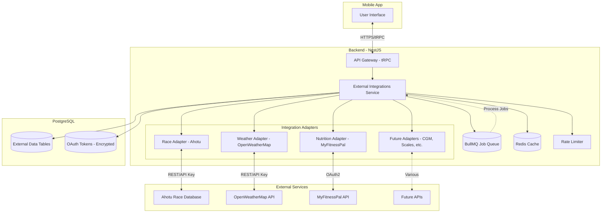

# RFC 0014: External Integrations Service

| Status        | Draft |
| :---          | :--- |
| **RFC #**     | 0014 |
| **Author(s)** | System Architect |
| **Created**   | 2025-11-26 |
| **Updated**   | 2025-11-27 |
| **Related PRD** | [13_EXTERNAL_INTEGRATIONS.md](file:///Users/maksat/Projects/RunningCoach/RunningCoach/docs/prd/13_EXTERNAL_INTEGRATIONS.md) |

## 1. Introduction

### 1.1. Context

This RFC defines the implementation details for the External Integrations service as described in PRD `13_EXTERNAL_INTEGRATIONS.md`. The External Integrations Service manages connections with third-party APIs that provide contextual data to enhance the RunningCoach training experience. These integrations fall into four categories:

1. **Race Discovery:** Race database APIs (Ahotu) for finding target races
2. **Environmental Context:** Weather services (OpenWeatherMap) for heat/humidity adjustments
3. **Nutrition Tracking:** MyFitnessPal API for macronutrient monitoring (optional)
4. **Future Extensions:** Smart scales, CGM sensors, treadmills, gym equipment

Unlike wearable integrations (covered in [RFC 0003](./0003-backend-api-design.md)), these services provide **contextual enrichment** rather than primary training data. They enhance the Adaptive Training Engine's decision-making but are not required for core functionality.

**Architectural Position:**
The External Integrations Service sits between the API Gateway and external third-party services, acting as an adapter layer that normalizes diverse external APIs into a consistent internal data model. It operates asynchronously via job queues, with results cached in Redis and persisted to PostgreSQL.

### 1.2. Problem Statement

The RunningCoach application needs to integrate with multiple external services that each have:
- Different API protocols (REST, GraphQL, OAuth flows)
- Different rate limits and quotas
- Different data formats and schemas
- Different reliability characteristics (uptime, latency)
- Different authentication mechanisms

**Key Technical Challenges:**

1. **API Diversity:** Each external service has unique authentication, data formats, and rate limits
2. **Reliability:** External service failures must not break core functionality (graceful degradation)
3. **Performance:** Race searches must return results <2 seconds; weather data must be fresh within 1 hour
4. **Privacy:** Nutrition data is highly sensitive; must minimize data collection and storage
5. **Extensibility:** New integrations (CGM, smart scales, treadmills) will be added over time
6. **Offline Operation:** Mobile app must function when external services are unavailable
7. **Cost Management:** Must respect API quotas and implement caching to minimize API calls

### 1.3. Goals & Non-Goals

**Goals:**
- **Plugin Architecture:** Easy addition of new external services without core system changes
- **Graceful Degradation:** External service failures do not impact core training functionality
- **Performance:** Race search <2s latency, weather data <1 hour stale
- **Security:** OAuth2 for all authenticated services, encrypted token storage
- **Rate Limit Compliance:** Respect vendor quotas with client-side rate limiting and caching
- **Data Minimization:** Store only aggregated summaries, not raw external data
- **Offline Resilience:** Cached data available when external services unreachable
- **Privacy First:** User controls connections, can disconnect and delete data anytime

**Non-Goals:**
- **Real-time Streaming:** Not supporting WebSocket/SSE from external services (polling/webhooks only)
- **Bidirectional Sync:** Not writing data back to external services (read-only in MVP)
- **Custom Weather Stations:** Not integrating with personal weather hardware (use public APIs only)
- **Social Features:** Not implementing social network integrations (Instagram, Twitter, etc.)
- **Payment Processing:** Not handling race registration payments (external links only)

### 1.4. Dependencies

**Related PRDs:**
- [00_OVERARCHING_VISION.md](file:///Users/maksat/Projects/RunningCoach/RunningCoach/docs/prd/00_OVERARCHING_VISION.md) - Holistic training philosophy
- [02_BACKEND_CORE.md](file:///Users/maksat/Projects/RunningCoach/RunningCoach/docs/prd/02_BACKEND_CORE.md) - Backend architecture
- [03_WEARABLE_INTEGRATION.md](file:///Users/maksat/Projects/RunningCoach/RunningCoach/docs/prd/03_WEARABLE_INTEGRATION.md) - Wearable-specific integrations (separate concern)
- [05_SYNC_INFRASTRUCTURE.md](file:///Users/maksat/Projects/RunningCoach/RunningCoach/docs/prd/05_SYNC_INFRASTRUCTURE.md) - Delta sync after external data imported
- [06_ADAPTIVE_TRAINING_ENGINE.md](file:///Users/maksat/Projects/RunningCoach/RunningCoach/docs/prd/06_ADAPTIVE_TRAINING_ENGINE.md) - Consumes environmental and nutrition data
- [10_NUTRITION_FUELING.md](file:///Users/maksat/Projects/RunningCoach/RunningCoach/docs/prd/10_NUTRITION_FUELING.md) - Nutrition targets and protocols
- [13_EXTERNAL_INTEGRATIONS.md](file:///Users/maksat/Projects/RunningCoach/RunningCoach/docs/prd/13_EXTERNAL_INTEGRATIONS.md) - Primary PRD for this RFC

**Related RFCs:**
- [RFC 0001: System Architecture](./0001-system-architecture.md) - Overall system design
- [RFC 0003: Backend API Design](./0003-backend-api-design.md) - API Gateway and tRPC endpoints
- [RFC 0005: Sync Infrastructure](./0005-sync-infrastructure.md) - Data synchronization patterns
- [RFC 0006: Adaptive Training Engine](./0006-adaptive-training-engine.md) - Consumes external integration data

**External Dependencies:**
- **Ahotu API** - Race database (REST API with API key authentication)
- **OpenWeatherMap API** - Weather data (REST API, 1000 calls/day free tier)
- **MyFitnessPal API** - Nutrition tracking (OAuth2, read-only access)
- **Redis 7+** - Caching layer for API responses and rate limiting
- **BullMQ** - Job queue for asynchronous API calls
- **PostgreSQL 16** - Persistent storage for external data summaries
- **Node.js HTTP Client** - Axios or native fetch for API calls
- **OAuth2 Library** - @nestjs/passport or similar for OAuth flows

### 1.5. Success Metrics

**Performance:**
- Race search latency: p95 < 2 seconds
- Weather data staleness: < 1 hour for cached forecasts
- Safety alert delivery: ≥ 2 hours before scheduled workout

**Reliability:**
- External service failures do not break core app functionality: 100% uptime for offline mode
- Weather API availability: > 99% (with fallback to cached data)
- Race search success rate: ≥ 80% of searches return relevant results

**User Adoption:**
- ≥ 40% of users enable at least one external integration
- < 2% disconnect rate due to issues (vs. personal choice)
- ≥ 60% of MyFitnessPal users maintain connection > 30 days

**Data Quality:**
- Weather-adjusted pace recommendations accurate within ±3%
- Race date accuracy: > 95% (no postponements/cancellations without updates)
- Nutrition data synced daily: > 90% of days for active users

**Cost Efficiency:**
- API calls reduced by ≥ 70% via caching
- Stay within free tier quotas: < $50/month for 10,000 active users

---

## 2. Proposed Solution

### 2.1. High-Level Design

The External Integrations Service follows a **plugin-style adapter architecture** where each external service is encapsulated in a dedicated adapter module with a standardized interface. The service operates asynchronously, with API calls processed via job queues to prevent blocking the main API Gateway.



**Data Flow Examples:**

**1. Race Search Flow:**
```
User searches "Boston Marathon 2026"
→ API Gateway receives request
→ Check Redis cache (key: "race_search:boston:2026")
→ Cache MISS → Queue job to Ahotu adapter
→ Ahotu adapter makes API call with rate limiting
→ Normalize race data to internal schema
→ Store in PostgreSQL + cache in Redis (TTL: 24h)
→ Return results to client
```

**2. Weather Forecast Flow (Scheduled Job):**
```
Cron: Every 6 hours, for users with workouts in next 48h
→ Fetch user locations (home city or upcoming workout GPS)
→ Check Redis cache (key: "weather:lat:lon:date")
→ Cache MISS/EXPIRED → Call OpenWeatherMap API
→ Calculate dew point if not provided
→ Apply performance adjustment thresholds
→ Store in PostgreSQL + cache in Redis (TTL: 1h)
→ If safety alert threshold exceeded → Push notification
```

**3. Nutrition Sync Flow (Daily Background Job):**
```
Cron: Daily at 1 AM UTC for users with MyFitnessPal connected
→ For each user, check last_synced_at timestamp
→ OAuth token refresh if needed
→ Call MyFitnessPal API for yesterday's daily summary
→ Extract: calories, carbs, protein, fat (NOT individual food items)
→ Store aggregated data in PostgreSQL
→ Trigger Adaptive Engine to check RED-S risk
```

### 2.2. Detailed Design

#### 2.2.1. Plugin Architecture - Adapter Pattern

**Standardized Adapter Interface:**

All external integrations implement the `IExternalAdapter` interface for consistency:

```typescript
interface IExternalAdapter {
  // Adapter metadata
  readonly name: string;
  readonly version: string;
  readonly supportsAuth: boolean;

  // Lifecycle methods
  initialize(): Promise<void>;
  healthCheck(): Promise<HealthStatus>;

  // Authentication (OAuth2 adapters only)
  getAuthUrl?(userId: string, redirectUri: string): string;
  handleAuthCallback?(userId: string, code: string): Promise<OAuthToken>;
  refreshToken?(userId: string): Promise<OAuthToken>;

  // Data fetching
  fetch<T>(params: AdapterParams): Promise<AdapterResponse<T>>;

  // Rate limiting
  getRateLimitStatus(): RateLimitInfo;
}

interface AdapterParams {
  userId?: string;
  query?: Record<string, any>;
  headers?: Record<string, string>;
  timeout?: number;
}

interface AdapterResponse<T> {
  data: T | null;
  success: boolean;
  source: 'api' | 'cache' | 'fallback';
  timestamp: Date;
  error?: AdapterError;
  metadata?: {
    apiCallsMade: number;
    cacheHit: boolean;
    latencyMs: number;
  };
}

interface HealthStatus {
  status: 'healthy' | 'degraded' | 'down';
  lastSuccessfulCall?: Date;
  consecutiveFailures: number;
  circuitBreakerOpen: boolean;
}
```

**Adapter Registry Pattern:**

```typescript
// Core integration service
@Injectable()
export class ExternalIntegrationsService {
  private adapters: Map<string, IExternalAdapter> = new Map();

  constructor(
    private raceAdapter: RaceAdapter,
    private weatherAdapter: WeatherAdapter,
    private nutritionAdapter: NutritionAdapter,
  ) {
    // Register all adapters
    this.registerAdapter(this.raceAdapter);
    this.registerAdapter(this.weatherAdapter);
    this.registerAdapter(this.nutritionAdapter);
  }

  private registerAdapter(adapter: IExternalAdapter): void {
    this.adapters.set(adapter.name, adapter);
  }

  getAdapter(name: string): IExternalAdapter {
    const adapter = this.adapters.get(name);
    if (!adapter) {
      throw new Error(`Adapter '${name}' not found`);
    }
    return adapter;
  }

  async healthCheck(): Promise<Map<string, HealthStatus>> {
    const health = new Map<string, HealthStatus>();
    for (const [name, adapter] of this.adapters) {
      health.set(name, await adapter.healthCheck());
    }
    return health;
  }
}
```

#### 2.2.2. Race Discovery Integration (Ahotu)

**Adapter Implementation:**

```typescript
@Injectable()
export class RaceAdapter implements IExternalAdapter {
  readonly name = 'race';
  readonly version = '1.0.0';
  readonly supportsAuth = false;

  private readonly BASE_URL = 'https://api.ahotu.com/v1';
  private readonly API_KEY = process.env.AHOTU_API_KEY;

  constructor(
    private httpService: HttpService,
    private cacheManager: Cache,
    private rateLimiter: RateLimiter,
  ) {}

  async searchRaces(params: RaceSearchParams): Promise<AdapterResponse<Race[]>> {
    const cacheKey = `race_search:${params.location}:${params.distance}:${params.dateRange}`;

    // Check cache first (TTL: 24 hours)
    const cached = await this.cacheManager.get<Race[]>(cacheKey);
    if (cached) {
      return {
        data: cached,
        success: true,
        source: 'cache',
        timestamp: new Date(),
        metadata: { cacheHit: true, apiCallsMade: 0, latencyMs: 0 },
      };
    }

    // Rate limiting check (100 searches per user per day)
    const allowed = await this.rateLimiter.checkLimit(
      `race_search:${params.userId}`,
      100,
      86400 // 24 hours
    );
    if (!allowed) {
      throw new RateLimitExceededError('Race search limit reached');
    }

    // Call Ahotu API
    const startTime = Date.now();
    try {
      const response = await this.httpService.get(`${this.BASE_URL}/races`, {
        params: {
          location: params.location,
          distance: params.distance,
          date_from: params.dateRange?.from,
          date_to: params.dateRange?.to,
          api_key: this.API_KEY,
        },
        timeout: 5000, // 5 second timeout
      }).toPromise();

      // Normalize Ahotu data to internal schema
      const races = this.normalizeRaces(response.data);

      // Cache results
      await this.cacheManager.set(cacheKey, races, { ttl: 86400 });

      const latencyMs = Date.now() - startTime;

      return {
        data: races,
        success: true,
        source: 'api',
        timestamp: new Date(),
        metadata: { cacheHit: false, apiCallsMade: 1, latencyMs },
      };
    } catch (error) {
      // Log error and return graceful failure
      this.logger.error('Ahotu API error', error);
      return {
        data: null,
        success: false,
        source: 'api',
        timestamp: new Date(),
        error: new AdapterError('Race search failed', error),
      };
    }
  }

  private normalizeRaces(ahotuData: any): Race[] {
    return ahotuData.results.map((race: any) => ({
      id: race.race_id,
      name: race.name,
      date: new Date(race.date),
      location: {
        city: race.city,
        state: race.state,
        country: race.country,
        latitude: race.latitude,
        longitude: race.longitude,
      },
      distance: this.normalizeDistance(race.distance),
      elevationGain: race.elevation_gain,
      elevationLoss: race.elevation_loss,
      courseProfile: race.course_map_url,
      registrationUrl: race.registration_url,
      websiteUrl: race.website,
      source: 'ahotu',
    }));
  }

  private normalizeDistance(distance: string): number {
    // Convert various distance formats to meters
    const distanceMap: Record<string, number> = {
      '5K': 5000,
      '10K': 10000,
      'Half Marathon': 21097,
      'Marathon': 42195,
      'Ultra': 50000, // Default for ultras
    };
    return distanceMap[distance] || parseFloat(distance) * 1000;
  }
}

// TypeScript types
interface RaceSearchParams {
  userId: string;
  location?: string; // City, state, or country
  distance?: '5K' | '10K' | 'Half Marathon' | 'Marathon' | 'Ultra';
  dateRange?: {
    from: Date;
    to: Date;
  };
}

interface Race {
  id: string;
  name: string;
  date: Date;
  location: {
    city: string;
    state?: string;
    country: string;
    latitude: number;
    longitude: number;
  };
  distance: number; // meters
  elevationGain?: number; // meters
  elevationLoss?: number; // meters
  courseProfile?: string; // URL to course map
  registrationUrl?: string;
  websiteUrl?: string;
  source: 'ahotu' | 'manual';
}
```

#### 2.2.3. Weather Service Integration (OpenWeatherMap)

**Adapter Implementation:**

```typescript
@Injectable()
export class WeatherAdapter implements IExternalAdapter {
  readonly name = 'weather';
  readonly version = '1.0.0';
  readonly supportsAuth = false;

  private readonly BASE_URL = 'https://api.openweathermap.org/data/3.0';
  private readonly API_KEY = process.env.OPENWEATHERMAP_API_KEY;

  constructor(
    private httpService: HttpService,
    private cacheManager: Cache,
    private notificationService: NotificationService,
  ) {}

  async getForecast(
    latitude: number,
    longitude: number,
    date: Date
  ): Promise<AdapterResponse<WeatherForecast>> {
    const cacheKey = `weather:${latitude}:${longitude}:${date.toISOString().split('T')[0]}`;

    // Check cache (TTL: 1 hour for forecasts)
    const cached = await this.cacheManager.get<WeatherForecast>(cacheKey);
    if (cached) {
      return {
        data: cached,
        success: true,
        source: 'cache',
        timestamp: new Date(),
        metadata: { cacheHit: true, apiCallsMade: 0, latencyMs: 0 },
      };
    }

    try {
      // Call OpenWeatherMap One Call API 3.0
      const response = await this.httpService.get(`${this.BASE_URL}/onecall`, {
        params: {
          lat: latitude,
          lon: longitude,
          exclude: 'minutely,alerts', // Only need hourly & daily
          units: 'metric',
          appid: this.API_KEY,
        },
        timeout: 3000,
      }).toPromise();

      // Find forecast for requested date
      const forecast = this.extractForecastForDate(response.data, date);

      // Calculate dew point if not provided
      if (!forecast.dewPoint) {
        forecast.dewPoint = this.calculateDewPoint(
          forecast.temperature,
          forecast.humidity
        );
      }

      // Apply performance adjustment thresholds
      forecast.performanceAdjustment = this.calculatePerformanceAdjustment(forecast);

      // Check for safety alerts
      await this.checkSafetyAlerts(forecast);

      // Cache result
      await this.cacheManager.set(cacheKey, forecast, { ttl: 3600 });

      return {
        data: forecast,
        success: true,
        source: 'api',
        timestamp: new Date(),
        metadata: { cacheHit: false, apiCallsMade: 1, latencyMs: 0 },
      };
    } catch (error) {
      this.logger.error('Weather API error', error);

      // Fallback to last known forecast (stale cache)
      const stale = await this.cacheManager.get<WeatherForecast>(
        `weather:${latitude}:${longitude}:*`,
        { ignoreExpiration: true }
      );

      return {
        data: stale || null,
        success: false,
        source: stale ? 'cache' : 'fallback',
        timestamp: new Date(),
        error: new AdapterError('Weather service unavailable', error),
      };
    }
  }

  private calculateDewPoint(tempC: number, humidity: number): number {
    // Magnus formula: accurate within ±0.4°C for typical conditions
    const a = 17.27;
    const b = 237.7;
    const alpha = ((a * tempC) / (b + tempC)) + Math.log(humidity / 100);
    return (b * alpha) / (a - alpha);
  }

  private calculatePerformanceAdjustment(
    forecast: WeatherForecast
  ): PerformanceAdjustment {
    const dewPoint = forecast.dewPoint!;

    // Thresholds from PRD 13 and research
    if (dewPoint < 15) {
      return {
        type: 'none',
        paceAdjustmentPercent: 0,
        message: 'Ideal running conditions',
      };
    } else if (dewPoint >= 15 && dewPoint < 21) {
      return {
        type: 'mild',
        paceAdjustmentPercent: 2, // 1-3% range, use midpoint
        message: 'Slight slowdown expected. Adjust pace by 1-3%.',
      };
    } else if (dewPoint >= 21 && dewPoint < 24) {
      return {
        type: 'moderate',
        paceAdjustmentPercent: 4.5, // 3-6% range, use midpoint
        message: 'Moderate impact. Adjust pace by 3-6% or use HR zones.',
      };
    } else {
      return {
        type: 'severe',
        paceAdjustmentPercent: null, // Pace targets not reliable
        message: 'Severe heat/humidity. Use HR/RPE only, ignore pace.',
      };
    }
  }

  private async checkSafetyAlerts(forecast: WeatherForecast): Promise<void> {
    const alerts: SafetyAlert[] = [];

    // Heat Index > 38°C (100°F)
    if (forecast.feelsLike > 38) {
      alerts.push({
        severity: 'high',
        type: 'heat',
        message: 'Extreme heat alert. Shorten workout or move indoors.',
      });
    }

    // AQI > 150 (Unhealthy)
    if (forecast.airQuality && forecast.airQuality.aqi > 150) {
      alerts.push({
        severity: 'high',
        type: 'air_quality',
        message: 'Air quality is unhealthy. Consider indoor training.',
      });
    }

    // UV Index > 8 (Very High)
    if (forecast.uvIndex > 8) {
      alerts.push({
        severity: 'medium',
        type: 'uv',
        message: 'Very high UV. Use sunscreen and consider morning/evening runs.',
      });
    }

    if (alerts.length > 0) {
      forecast.safetyAlerts = alerts;
      // Send push notification if workout scheduled within 2-6 hours
      await this.notificationService.sendSafetyAlerts(alerts);
    }
  }

  private extractForecastForDate(data: any, date: Date): WeatherForecast {
    // Find matching day in forecast
    const targetTimestamp = date.getTime() / 1000;
    const daily = data.daily.find((d: any) => {
      const dayStart = new Date(d.dt * 1000);
      dayStart.setHours(0, 0, 0, 0);
      const dayEnd = new Date(dayStart);
      dayEnd.setDate(dayEnd.getDate() + 1);
      return date >= dayStart && date < dayEnd;
    });

    if (!daily) {
      throw new Error('Date outside forecast range');
    }

    return {
      date: new Date(daily.dt * 1000),
      temperature: daily.temp.day,
      feelsLike: daily.feels_like.day,
      humidity: daily.humidity,
      dewPoint: daily.dew_point,
      windSpeed: daily.wind_speed,
      windDirection: daily.wind_deg,
      uvIndex: daily.uvi,
      airQuality: data.current?.air_quality, // If available
      description: daily.weather[0].description,
      icon: daily.weather[0].icon,
    };
  }
}

// TypeScript types
interface WeatherForecast {
  date: Date;
  temperature: number; // °C
  feelsLike: number; // °C (apparent temperature)
  humidity: number; // %
  dewPoint?: number; // °C (calculated if not provided)
  windSpeed: number; // m/s
  windDirection: number; // degrees
  uvIndex: number;
  airQuality?: {
    aqi: number; // Air Quality Index
    pm25: number; // PM2.5 concentration
    pm10: number; // PM10 concentration
  };
  description: string; // "Clear sky", "Light rain", etc.
  icon: string; // Weather icon code
  performanceAdjustment?: PerformanceAdjustment;
  safetyAlerts?: SafetyAlert[];
}

interface PerformanceAdjustment {
  type: 'none' | 'mild' | 'moderate' | 'severe';
  paceAdjustmentPercent: number | null; // null for severe (use HR only)
  message: string;
}

interface SafetyAlert {
  severity: 'low' | 'medium' | 'high';
  type: 'heat' | 'air_quality' | 'uv' | 'cold' | 'wind';
  message: string;
}
```

#### 2.2.4. MyFitnessPal Nutrition Integration

**Adapter Implementation:**

```typescript
@Injectable()
export class NutritionAdapter implements IExternalAdapter {
  readonly name = 'nutrition';
  readonly version = '1.0.0';
  readonly supportsAuth = true;

  private readonly BASE_URL = 'https://api.myfitnesspal.com/v2';
  private readonly CLIENT_ID = process.env.MFP_CLIENT_ID;
  private readonly CLIENT_SECRET = process.env.MFP_CLIENT_SECRET;

  constructor(
    private httpService: HttpService,
    private oauthTokenService: OAuthTokenService,
    private prisma: PrismaService,
  ) {}

  getAuthUrl(userId: string, redirectUri: string): string {
    const state = this.generateState(userId);
    return `https://www.myfitnesspal.com/oauth2/authorize?` +
      `client_id=${this.CLIENT_ID}&` +
      `redirect_uri=${encodeURIComponent(redirectUri)}&` +
      `response_type=code&` +
      `scope=diary&` + // Only request daily summary, NOT individual foods
      `state=${state}`;
  }

  async handleAuthCallback(userId: string, code: string): Promise<OAuthToken> {
    try {
      const response = await this.httpService.post(
        'https://www.myfitnesspal.com/oauth2/token',
        {
          grant_type: 'authorization_code',
          code,
          client_id: this.CLIENT_ID,
          client_secret: this.CLIENT_SECRET,
        }
      ).toPromise();

      const token: OAuthToken = {
        userId,
        provider: 'myfitnesspal',
        accessToken: response.data.access_token,
        refreshToken: response.data.refresh_token,
        expiresAt: new Date(Date.now() + response.data.expires_in * 1000),
      };

      // Store encrypted token
      await this.oauthTokenService.storeToken(token);

      return token;
    } catch (error) {
      this.logger.error('MyFitnessPal OAuth error', error);
      throw new OAuthError('Failed to authenticate with MyFitnessPal', error);
    }
  }

  async refreshToken(userId: string): Promise<OAuthToken> {
    const existingToken = await this.oauthTokenService.getToken(userId, 'myfitnesspal');
    if (!existingToken) {
      throw new Error('No token found for user');
    }

    const response = await this.httpService.post(
      'https://www.myfitnesspal.com/oauth2/token',
      {
        grant_type: 'refresh_token',
        refresh_token: existingToken.refreshToken,
        client_id: this.CLIENT_ID,
        client_secret: this.CLIENT_SECRET,
      }
    ).toPromise();

    const newToken: OAuthToken = {
      userId,
      provider: 'myfitnesspal',
      accessToken: response.data.access_token,
      refreshToken: response.data.refresh_token || existingToken.refreshToken,
      expiresAt: new Date(Date.now() + response.data.expires_in * 1000),
    };

    await this.oauthTokenService.storeToken(newToken);
    return newToken;
  }

  async getDailySummary(
    userId: string,
    date: Date
  ): Promise<AdapterResponse<NutritionSummary>> {
    // Get access token (refresh if expired)
    const token = await this.oauthTokenService.getValidToken(userId, 'myfitnesspal');
    if (!token) {
      return {
        data: null,
        success: false,
        source: 'api',
        timestamp: new Date(),
        error: new AdapterError('User not connected to MyFitnessPal'),
      };
    }

    try {
      // Request ONLY daily totals, NOT individual food items
      const response = await this.httpService.get(
        `${this.BASE_URL}/diary/nutrition`,
        {
          params: {
            date: date.toISOString().split('T')[0], // YYYY-MM-DD
            fields: 'totals', // Explicitly request only totals
          },
          headers: {
            Authorization: `Bearer ${token.accessToken}`,
          },
          timeout: 5000,
        }
      ).toPromise();

      const summary: NutritionSummary = {
        userId,
        date,
        calories: response.data.totals.calories,
        carbohydrates: response.data.totals.carbohydrates,
        protein: response.data.totals.protein,
        fat: response.data.totals.fat,
        fiber: response.data.totals.fiber,
        source: 'myfitnesspal',
      };

      // Store aggregated data (NOT raw response)
      await this.prisma.nutritionSummary.upsert({
        where: {
          userId_date: { userId, date },
        },
        update: summary,
        create: summary,
      });

      return {
        data: summary,
        success: true,
        source: 'api',
        timestamp: new Date(),
        metadata: { cacheHit: false, apiCallsMade: 1, latencyMs: 0 },
      };
    } catch (error) {
      this.logger.error('MyFitnessPal API error', error);

      // Fallback to last stored data
      const stored = await this.prisma.nutritionSummary.findUnique({
        where: { userId_date: { userId, date } },
      });

      return {
        data: stored || null,
        success: false,
        source: 'cache',
        timestamp: new Date(),
        error: new AdapterError('MyFitnessPal sync failed', error),
      };
    }
  }

  async disconnectUser(userId: string): Promise<void> {
    // Revoke OAuth token
    const token = await this.oauthTokenService.getToken(userId, 'myfitnesspal');
    if (token) {
      try {
        await this.httpService.post(
          'https://www.myfitnesspal.com/oauth2/revoke',
          {
            token: token.accessToken,
            client_id: this.CLIENT_ID,
            client_secret: this.CLIENT_SECRET,
          }
        ).toPromise();
      } catch (error) {
        this.logger.warn('Failed to revoke MFP token', error);
      }
    }

    // Delete token from database
    await this.oauthTokenService.deleteToken(userId, 'myfitnesspal');

    // Optionally: Delete historical nutrition data (user choice)
    // await this.prisma.nutritionSummary.deleteMany({ where: { userId } });
  }
}

// TypeScript types
interface NutritionSummary {
  userId: string;
  date: Date;
  calories: number;
  carbohydrates: number; // grams
  protein: number; // grams
  fat: number; // grams
  fiber?: number; // grams (optional)
  source: 'myfitnesspal' | 'manual';
}

interface OAuthToken {
  userId: string;
  provider: string;
  accessToken: string;
  refreshToken: string;
  expiresAt: Date;
}
```

#### 2.2.5. Rate Limiting Strategy

**Implementation:**

```typescript
@Injectable()
export class RateLimiter {
  constructor(private redis: Redis) {}

  async checkLimit(
    key: string,
    maxRequests: number,
    windowSeconds: number
  ): Promise<boolean> {
    const now = Date.now();
    const windowStart = now - windowSeconds * 1000;

    // Use Redis sorted set for sliding window
    const pipeline = this.redis.pipeline();

    // Remove old entries outside window
    pipeline.zremrangebyscore(key, 0, windowStart);

    // Add current request
    pipeline.zadd(key, now, `${now}`);

    // Count requests in window
    pipeline.zcard(key);

    // Set expiration
    pipeline.expire(key, windowSeconds);

    const results = await pipeline.exec();
    const count = results[2][1] as number;

    return count <= maxRequests;
  }

  async getRemainingRequests(
    key: string,
    maxRequests: number,
    windowSeconds: number
  ): Promise<number> {
    const count = await this.redis.zcard(key);
    return Math.max(0, maxRequests - count);
  }
}

// Rate limit configurations per service
const RATE_LIMITS = {
  race_search_per_user: { limit: 100, window: 86400 }, // 100 per day
  weather_api_global: { limit: 1000, window: 86400 }, // 1000 per day (free tier)
  nutrition_api_per_user: { limit: 50, window: 3600 }, // 50 per hour
};
```

#### 2.2.6. Caching Strategy

**Multi-Level Cache:**

```typescript
@Injectable()
export class CacheService {
  constructor(
    private redis: Redis,
    private prisma: PrismaService,
  ) {}

  async get<T>(key: string, options?: CacheOptions): Promise<T | null> {
    // L1: Redis cache (fast, short TTL)
    const cached = await this.redis.get(key);
    if (cached) {
      return JSON.parse(cached);
    }

    // L2: PostgreSQL (persistent, longer TTL)
    if (!options?.skipDatabase) {
      const stored = await this.prisma.externalDataCache.findUnique({
        where: { key },
      });

      if (stored && !this.isExpired(stored.expiresAt)) {
        // Promote to Redis
        await this.set(key, stored.data, { ttl: stored.ttl });
        return stored.data as T;
      }
    }

    return null;
  }

  async set<T>(key: string, value: T, options: CacheOptions): Promise<void> {
    const serialized = JSON.stringify(value);

    // L1: Redis
    if (options.ttl) {
      await this.redis.setex(key, options.ttl, serialized);
    } else {
      await this.redis.set(key, serialized);
    }

    // L2: PostgreSQL (optional, for longer persistence)
    if (options.persistToDatabase) {
      await this.prisma.externalDataCache.upsert({
        where: { key },
        update: {
          data: value,
          expiresAt: new Date(Date.now() + options.ttl! * 1000),
          ttl: options.ttl,
        },
        create: {
          key,
          data: value,
          expiresAt: new Date(Date.now() + options.ttl! * 1000),
          ttl: options.ttl,
        },
      });
    }
  }

  private isExpired(expiresAt: Date): boolean {
    return expiresAt.getTime() < Date.now();
  }
}

interface CacheOptions {
  ttl?: number; // Time to live in seconds
  skipDatabase?: boolean; // Skip L2 cache lookup
  persistToDatabase?: boolean; // Store in PostgreSQL for persistence
}

// Cache TTL configurations
const CACHE_TTLS = {
  race_search: 86400, // 24 hours
  weather_forecast: 3600, // 1 hour
  weather_current: 600, // 10 minutes
  nutrition_daily: 86400, // 24 hours (immutable after day ends)
  user_location: 604800, // 7 days
};
```

#### 2.2.7. Error Handling & Circuit Breaker

**Circuit Breaker Pattern:**

```typescript
enum CircuitState {
  CLOSED = 'closed', // Normal operation
  OPEN = 'open', // Failing, reject requests
  HALF_OPEN = 'half_open', // Testing recovery
}

@Injectable()
export class CircuitBreaker {
  private state: CircuitState = CircuitState.CLOSED;
  private failureCount = 0;
  private lastFailureTime?: Date;
  private successCount = 0;

  private readonly FAILURE_THRESHOLD = 5;
  private readonly SUCCESS_THRESHOLD = 2;
  private readonly TIMEOUT_MS = 30000; // 30 seconds

  constructor(private serviceName: string) {}

  async execute<T>(fn: () => Promise<T>): Promise<T> {
    if (this.state === CircuitState.OPEN) {
      if (this.shouldAttemptReset()) {
        this.state = CircuitState.HALF_OPEN;
        this.successCount = 0;
      } else {
        throw new CircuitBreakerOpenError(
          `Circuit breaker open for ${this.serviceName}`
        );
      }
    }

    try {
      const result = await fn();
      this.onSuccess();
      return result;
    } catch (error) {
      this.onFailure();
      throw error;
    }
  }

  private onSuccess(): void {
    this.failureCount = 0;

    if (this.state === CircuitState.HALF_OPEN) {
      this.successCount++;
      if (this.successCount >= this.SUCCESS_THRESHOLD) {
        this.state = CircuitState.CLOSED;
      }
    }
  }

  private onFailure(): void {
    this.failureCount++;
    this.lastFailureTime = new Date();

    if (this.failureCount >= this.FAILURE_THRESHOLD) {
      this.state = CircuitState.OPEN;
    }
  }

  private shouldAttemptReset(): boolean {
    if (!this.lastFailureTime) return false;
    const timeSinceLastFailure = Date.now() - this.lastFailureTime.getTime();
    return timeSinceLastFailure >= this.TIMEOUT_MS;
  }

  getStatus(): { state: CircuitState; failureCount: number } {
    return {
      state: this.state,
      failureCount: this.failureCount,
    };
  }
}

// Usage in adapter
@Injectable()
export class WeatherAdapter implements IExternalAdapter {
  private circuitBreaker: CircuitBreaker;

  constructor() {
    this.circuitBreaker = new CircuitBreaker('openweathermap');
  }

  async getForecast(...params): Promise<AdapterResponse<WeatherForecast>> {
    try {
      return await this.circuitBreaker.execute(() => this.fetchForecast(...params));
    } catch (error) {
      if (error instanceof CircuitBreakerOpenError) {
        // Fallback to cached data
        const cached = await this.getCachedForecast(...params);
        return {
          data: cached,
          success: false,
          source: 'cache',
          timestamp: new Date(),
          error: new AdapterError('Weather service temporarily unavailable'),
        };
      }
      throw error;
    }
  }
}
```

#### 2.2.8. Background Job Processing

**Job Definitions:**

```typescript
// Daily nutrition sync job
@Processor('external-integrations')
export class NutritionSyncProcessor {
  @Process('sync-nutrition')
  async handleNutritionSync(job: Job): Promise<void> {
    const { userId, date } = job.data;

    try {
      const adapter = this.integrationService.getAdapter('nutrition') as NutritionAdapter;
      const result = await adapter.getDailySummary(userId, date);

      if (result.success && result.data) {
        // Trigger Adaptive Engine to check RED-S risk
        await this.adaptiveEngineService.analyzeNutritionStatus(userId, result.data);
      }
    } catch (error) {
      this.logger.error(`Nutrition sync failed for user ${userId}`, error);
      // Retry with exponential backoff
      throw error; // BullMQ will handle retry
    }
  }
}

// Weather forecast fetch job
@Processor('external-integrations')
export class WeatherForecastProcessor {
  @Process('fetch-weather-forecast')
  async handleWeatherFetch(job: Job): Promise<void> {
    const { userId, latitude, longitude, date } = job.data;

    try {
      const adapter = this.integrationService.getAdapter('weather') as WeatherAdapter;
      const result = await adapter.getForecast(latitude, longitude, date);

      if (result.success && result.data) {
        // Check for safety alerts
        if (result.data.safetyAlerts && result.data.safetyAlerts.length > 0) {
          await this.notificationService.sendWeatherAlert(userId, result.data);
        }
      }
    } catch (error) {
      this.logger.error(`Weather fetch failed for user ${userId}`, error);
      // Non-critical, don't retry excessively
      if (job.attemptsMade < 2) {
        throw error;
      }
    }
  }
}

// Job scheduling
@Injectable()
export class ExternalIntegrationsScheduler {
  constructor(
    @InjectQueue('external-integrations') private queue: Queue,
    private prisma: PrismaService,
  ) {}

  @Cron('0 1 * * *') // Daily at 1 AM UTC
  async scheduleNutritionSync(): Promise<void> {
    // Find all users with active MyFitnessPal connections
    const users = await this.prisma.oAuthToken.findMany({
      where: { provider: 'myfitnesspal' },
      select: { userId: true },
    });

    const yesterday = new Date();
    yesterday.setDate(yesterday.getDate() - 1);

    for (const user of users) {
      await this.queue.add('sync-nutrition', {
        userId: user.userId,
        date: yesterday,
      }, {
        attempts: 3,
        backoff: {
          type: 'exponential',
          delay: 5000, // Start with 5 seconds
        },
      });
    }
  }

  @Cron('0 */6 * * *') // Every 6 hours
  async scheduleWeatherForecast(): Promise<void> {
    // Find users with workouts scheduled in next 48 hours
    const upcoming = await this.prisma.scheduledWorkout.findMany({
      where: {
        scheduledDate: {
          gte: new Date(),
          lte: new Date(Date.now() + 48 * 60 * 60 * 1000),
        },
        status: 'planned',
      },
      include: {
        user: {
          select: {
            id: true,
            homeLatitude: true,
            homeLongitude: true,
          },
        },
      },
    });

    for (const workout of upcoming) {
      if (workout.user.homeLatitude && workout.user.homeLongitude) {
        await this.queue.add('fetch-weather-forecast', {
          userId: workout.user.id,
          latitude: workout.user.homeLatitude,
          longitude: workout.user.homeLongitude,
          date: workout.scheduledDate,
        });
      }
    }
  }
}
```

### 2.3. Data Model Changes

**New Prisma Schema Entities:**

```prisma
// External data cache for multi-level caching
model ExternalDataCache {
  id        String   @id @default(uuid())
  key       String   @unique
  data      Json
  expiresAt DateTime
  ttl       Int      // Time to live in seconds
  createdAt DateTime @default(now())
  updatedAt DateTime @updatedAt

  @@index([expiresAt])
  @@map("external_data_cache")
}

// OAuth tokens for external services (encrypted at rest)
model OAuthToken {
  id           String   @id @default(uuid())
  userId       String
  provider     String   // 'myfitnesspal', 'strava', etc.
  accessToken  String   @db.Text // Encrypted
  refreshToken String   @db.Text // Encrypted
  expiresAt    DateTime
  createdAt    DateTime @default(now())
  updatedAt    DateTime @updatedAt

  user User @relation(fields: [userId], references: [id], onDelete: Cascade)

  @@unique([userId, provider])
  @@index([userId])
  @@map("oauth_tokens")
}

// Race database (from Ahotu or manual entry)
model Race {
  id              String   @id @default(uuid())
  name            String
  date            DateTime
  city            String
  state           String?
  country         String
  latitude        Float
  longitude       Float
  distance        Int      // meters
  elevationGain   Int?     // meters
  elevationLoss   Int?     // meters
  courseProfile   String?  // URL to course map
  registrationUrl String?
  websiteUrl      String?
  source          String   // 'ahotu' | 'manual'
  createdAt       DateTime @default(now())
  updatedAt       DateTime @updatedAt

  // Users who have selected this race as their goal
  trainingPlans TrainingPlan[]

  @@index([date])
  @@index([country, city])
  @@index([distance])
  @@map("races")
}

// Weather forecast data
model WeatherForecast {
  id              String    @id @default(uuid())
  latitude        Float
  longitude       Float
  date            DateTime  @db.Date
  temperature     Float     // °C
  feelsLike       Float     // °C
  humidity        Int       // %
  dewPoint        Float     // °C
  windSpeed       Float     // m/s
  windDirection   Int       // degrees
  uvIndex         Float
  aqi             Int?      // Air Quality Index
  pm25            Float?    // PM2.5 concentration
  description     String
  icon            String
  paceAdjustment  Float?    // % slower (null for severe conditions)
  adjustmentType  String    // 'none' | 'mild' | 'moderate' | 'severe'
  safetyAlerts    Json?     // Array of SafetyAlert objects
  source          String    @default("openweathermap")
  createdAt       DateTime  @default(now())
  updatedAt       DateTime  @updatedAt

  @@unique([latitude, longitude, date])
  @@index([date])
  @@map("weather_forecasts")
}

// Nutrition daily summary (from MyFitnessPal or manual)
model NutritionSummary {
  id            String   @id @default(uuid())
  userId        String
  date          DateTime @db.Date
  calories      Int
  carbohydrates Float    // grams
  protein       Float    // grams
  fat           Float    // grams
  fiber         Float?   // grams
  source        String   // 'myfitnesspal' | 'manual'
  createdAt     DateTime @default(now())
  updatedAt     DateTime @updatedAt

  user User @relation(fields: [userId], references: [id], onDelete: Cascade)

  @@unique([userId, date])
  @@index([userId])
  @@index([date])
  @@map("nutrition_summaries")
}

// User integration preferences
model UserIntegration {
  id        String   @id @default(uuid())
  userId    String
  provider  String   // 'myfitnesspal', 'weather', etc.
  enabled   Boolean  @default(true)
  settings  Json?    // Provider-specific settings
  createdAt DateTime @default(now())
  updatedAt DateTime @updatedAt

  user User @relation(fields: [userId], references: [id], onDelete: Cascade)

  @@unique([userId, provider])
  @@index([userId])
  @@map("user_integrations")
}

// Integration health monitoring
model IntegrationHealthLog {
  id                 String   @id @default(uuid())
  provider           String
  status             String   // 'healthy' | 'degraded' | 'down'
  responseTimeMs     Int?
  errorMessage       String?
  consecutiveFailures Int     @default(0)
  timestamp          DateTime @default(now())

  @@index([provider, timestamp])
  @@map("integration_health_logs")
}
```

**Updates to Existing Models:**

```prisma
model User {
  // ... existing fields ...

  // Home location for weather forecasts
  homeLatitude  Float?
  homeLongitude Float?
  homeCity      String?
  homeTimezone  String? @default("UTC")

  // Relations
  oauthTokens      OAuthToken[]
  nutritionSummaries NutritionSummary[]
  userIntegrations UserIntegration[]
}

model TrainingPlan {
  // ... existing fields ...

  // Link to goal race (optional)
  goalRaceId String?
  goalRace   Race?   @relation(fields: [goalRaceId], references: [id])
}

model ScheduledWorkout {
  // ... existing fields ...

  // Weather-adjusted targets
  weatherAdjustedPace Float? // If weather requires pace adjustment
  weatherNote         String? // Coach's note about weather impact
}
```

### 2.4. API Changes

**New tRPC Endpoints:**

```typescript
// Race discovery
export const raceRouter = router({
  search: publicProcedure
    .input(z.object({
      location: z.string().optional(),
      distance: z.enum(['5K', '10K', 'Half Marathon', 'Marathon', 'Ultra']).optional(),
      dateFrom: z.date().optional(),
      dateTo: z.date().optional(),
    }))
    .query(async ({ input, ctx }) => {
      const adapter = ctx.integrationService.getAdapter('race') as RaceAdapter;
      return await adapter.searchRaces({
        userId: ctx.userId,
        ...input,
      });
    }),

  getById: publicProcedure
    .input(z.object({ raceId: z.string() }))
    .query(async ({ input, ctx }) => {
      return await ctx.prisma.race.findUnique({
        where: { id: input.raceId },
      });
    }),

  selectAsGoal: protectedProcedure
    .input(z.object({ raceId: z.string(), planId: z.string() }))
    .mutation(async ({ input, ctx }) => {
      // Link race to training plan
      await ctx.prisma.trainingPlan.update({
        where: { id: input.planId },
        data: { goalRaceId: input.raceId },
      });

      // Trigger plan regeneration based on race date
      await ctx.adaptiveEngineService.regeneratePlanForRace(input.planId);
    }),
});

// Weather forecasts
export const weatherRouter = router({
  getForecast: protectedProcedure
    .input(z.object({
      latitude: z.number(),
      longitude: z.number(),
      date: z.date(),
    }))
    .query(async ({ input, ctx }) => {
      const adapter = ctx.integrationService.getAdapter('weather') as WeatherAdapter;
      return await adapter.getForecast(input.latitude, input.longitude, input.date);
    }),

  getUpcomingForecasts: protectedProcedure
    .input(z.object({ days: z.number().min(1).max(7) }))
    .query(async ({ input, ctx }) => {
      const user = await ctx.prisma.user.findUnique({
        where: { id: ctx.userId },
        select: { homeLatitude: true, homeLongitude: true },
      });

      if (!user?.homeLatitude || !user?.homeLongitude) {
        throw new Error('User location not set');
      }

      const forecasts = [];
      for (let i = 0; i < input.days; i++) {
        const date = new Date();
        date.setDate(date.getDate() + i);

        const forecast = await ctx.prisma.weatherForecast.findUnique({
          where: {
            latitude_longitude_date: {
              latitude: user.homeLatitude,
              longitude: user.homeLongitude,
              date,
            },
          },
        });

        if (forecast) {
          forecasts.push(forecast);
        }
      }

      return forecasts;
    }),
});

// Nutrition integration
export const nutritionRouter = router({
  // OAuth flow
  getConnectUrl: protectedProcedure
    .input(z.object({ redirectUri: z.string().url() }))
    .query(({ input, ctx }) => {
      const adapter = ctx.integrationService.getAdapter('nutrition') as NutritionAdapter;
      return adapter.getAuthUrl(ctx.userId, input.redirectUri);
    }),

  handleCallback: protectedProcedure
    .input(z.object({ code: z.string() }))
    .mutation(async ({ input, ctx }) => {
      const adapter = ctx.integrationService.getAdapter('nutrition') as NutritionAdapter;
      await adapter.handleAuthCallback(ctx.userId, input.code);
      return { success: true };
    }),

  disconnect: protectedProcedure
    .mutation(async ({ ctx }) => {
      const adapter = ctx.integrationService.getAdapter('nutrition') as NutritionAdapter;
      await adapter.disconnectUser(ctx.userId);
      return { success: true };
    }),

  // Data fetching
  getDailySummary: protectedProcedure
    .input(z.object({ date: z.date() }))
    .query(async ({ input, ctx }) => {
      return await ctx.prisma.nutritionSummary.findUnique({
        where: {
          userId_date: {
            userId: ctx.userId,
            date: input.date,
          },
        },
      });
    }),

  getWeeklySummary: protectedProcedure
    .input(z.object({ startDate: z.date() }))
    .query(async ({ input, ctx }) => {
      const endDate = new Date(input.startDate);
      endDate.setDate(endDate.getDate() + 7);

      return await ctx.prisma.nutritionSummary.findMany({
        where: {
          userId: ctx.userId,
          date: {
            gte: input.startDate,
            lt: endDate,
          },
        },
        orderBy: { date: 'asc' },
      });
    }),

  // Manual entry (if user not connected to MyFitnessPal)
  logManual: protectedProcedure
    .input(z.object({
      date: z.date(),
      calories: z.number(),
      carbohydrates: z.number(),
      protein: z.number(),
      fat: z.number(),
      fiber: z.number().optional(),
    }))
    .mutation(async ({ input, ctx }) => {
      return await ctx.prisma.nutritionSummary.upsert({
        where: {
          userId_date: {
            userId: ctx.userId,
            date: input.date,
          },
        },
        update: {
          ...input,
          source: 'manual',
        },
        create: {
          userId: ctx.userId,
          ...input,
          source: 'manual',
        },
      });
    }),
});

// Integration management
export const integrationsRouter = router({
  list: protectedProcedure
    .query(async ({ ctx }) => {
      return await ctx.prisma.userIntegration.findMany({
        where: { userId: ctx.userId },
      });
    }),

  toggle: protectedProcedure
    .input(z.object({
      provider: z.string(),
      enabled: z.boolean(),
    }))
    .mutation(async ({ input, ctx }) => {
      return await ctx.prisma.userIntegration.upsert({
        where: {
          userId_provider: {
            userId: ctx.userId,
            provider: input.provider,
          },
        },
        update: { enabled: input.enabled },
        create: {
          userId: ctx.userId,
          provider: input.provider,
          enabled: input.enabled,
        },
      });
    }),

  healthStatus: publicProcedure
    .query(async ({ ctx }) => {
      return await ctx.integrationService.healthCheck();
    }),
});
```

### 2.5. Offline-First Considerations

**Local Storage:**
- **Mobile (WatermelonDB):**
  - Cache weather forecasts for next 7 days
  - Store race search results (last 10 searches)
  - Sync nutrition summaries for last 30 days
  - Queue manual nutrition entries for sync when online

**Queued Operations:**
- Manual nutrition logs created offline → queued for sync
- User location updates → queued for weather refresh
- OAuth disconnections → queued for token revocation

**Conflict Resolution:**
- **Weather Data:** Server always wins (authoritative source)
- **Nutrition Manual Entries:** Last write wins (user's latest input)
- **Race Selections:** Server reconciles conflicts (validate race still exists)

**Fallback Behavior:**
- **Weather API Down:** Use last cached forecast (show staleness indicator)
- **Race API Down:** Show cached search results + allow manual race entry
- **Nutrition API Down:** Prompt manual entry, sync when reconnected

### 2.6. Synchronization Strategy

**Sync Triggers:**
- **Weather:** Background fetch every 6 hours for upcoming workouts
- **Nutrition:** Daily sync at 1 AM UTC for previous day
- **Race Searches:** On-demand (user initiated)
- **OAuth Tokens:** Automatic refresh when approaching expiration

**Data Priority:**
- **Critical:** Weather safety alerts → immediate push notification
- **High:** Upcoming weather forecasts → sync within 1 hour
- **Normal:** Historical nutrition data → sync daily
- **Low:** Race search cache → sync on-demand

**Sync Protocol:**
- Mobile ↔ Cloud: HTTPS/tRPC with delta sync
- Cloud ↔ External APIs: REST/OAuth2 via job queue
- No direct mobile ↔ external API calls (all proxied through backend)

---

## 3. Implementation Plan

### 3.1. Phasing

**Phase 1: Core Infrastructure & Weather (Weeks 1-3)**
- **Deliverables:**
  - Adapter architecture and registry implementation
  - Rate limiting service with Redis
  - Multi-level caching service
  - Circuit breaker implementation
  - OpenWeatherMap adapter with dew point calculations
  - Weather forecast background jobs
  - Safety alert notifications
  - Prisma schema updates for weather data
  - tRPC endpoints for weather forecasts
- **Success Criteria:**
  - Weather forecasts fetched and cached successfully
  - Performance adjustments calculated correctly (dew point based)
  - Safety alerts delivered ≥2 hours before workout
  - Weather API failures gracefully degraded to cached data

**Phase 2: Race Discovery (Weeks 4-5)**
- **Deliverables:**
  - Ahotu API adapter implementation
  - Race search with caching (24h TTL)
  - Rate limiting for race searches (100/user/day)
  - Race database Prisma schema
  - tRPC endpoints for race search and selection
  - Mobile UI for race search and goal selection
  - Training plan regeneration triggered by race selection
- **Success Criteria:**
  - Race search latency <2 seconds (p95)
  - ≥80% of searches return relevant results
  - Race selection triggers plan regeneration
  - Manual race entry fallback functional

**Phase 3: Nutrition Integration (Weeks 6-8)**
- **Deliverables:**
  - OAuth2 service for token management (encrypted storage)
  - MyFitnessPal adapter with OAuth flow
  - Daily nutrition sync background job
  - RED-S risk detection in Adaptive Engine
  - Nutrition summary Prisma schema
  - tRPC endpoints for OAuth flow and data fetching
  - Mobile UI for MyFitnessPal connection and manual entry
  - Nutrition targets comparison (carbs, protein)
- **Success Criteria:**
  - OAuth flow completes successfully
  - Daily summaries synced (NOT individual food items)
  - RED-S alerts triggered when appropriate
  - Users can disconnect and delete data
  - Manual entry fallback functional

**Phase 4: Future Integrations Groundwork (Week 9)**
- **Deliverables:**
  - Generic adapter templates for future services
  - Documentation for adding new integrations
  - Webhook receiver infrastructure (for future use)
  - Integration health monitoring dashboard
- **Success Criteria:**
  - New adapter can be added in <1 day
  - Health monitoring shows all integration status
  - Webhook infrastructure ready for future integrations

**Phase 5: Polish & Optimization (Week 10)**
- **Deliverables:**
  - Performance optimization (cache hit rate analysis)
  - API quota monitoring and alerts
  - Integration health monitoring and alerting
  - User adoption analytics
  - Documentation and runbooks
- **Success Criteria:**
  - Cache hit rate >70%
  - API costs <$50/month for 10,000 users
  - Integration failures do not break core app
  - Runbooks complete for all failure scenarios

### 3.2. Testing Strategy

**Unit Tests:**
- Adapter implementations (mocked external APIs)
- Rate limiting logic
- Cache eviction and TTL handling
- Dew point calculation accuracy
- Performance adjustment thresholds
- OAuth token encryption/decryption
- Circuit breaker state transitions
- **Target Coverage:** 85%+ for integration service

**Integration Tests:**
- External API calls (using test environments/sandbox)
- Rate limiting enforcement
- Cache miss → API call → cache population flow
- Circuit breaker trip and recovery
- OAuth2 full flow with MyFitnessPal sandbox
- Background job execution
- Webhook handling (future)

**End-to-End Tests:**
- **Race Search Flow:**
  - User searches "Boston Marathon 2026"
  - Results displayed <2s
  - User selects race
  - Training plan regenerated with race date
- **Weather Alert Flow:**
  - Extreme heat forecast fetched
  - Safety alert notification sent ≥2h before workout
  - User views weather-adjusted workout
- **Nutrition Sync Flow:**
  - User connects MyFitnessPal
  - Daily summary synced automatically
  - RED-S alert triggered if calorie deficit detected

**Offline/Online Transition Tests:**
- Weather API unavailable → fallback to cached forecast
- Race API unavailable → show cached results + allow manual entry
- Nutrition API unavailable → prompt manual entry
- Manual nutrition entries queued offline → synced when online

**Performance Tests:**
- Race search latency under load (100 concurrent users)
- Weather forecast fetch latency
- Cache hit rate analysis
- Rate limiting under burst traffic
- API quota usage tracking

### 3.3. Migration Strategy

**Data Migration:**
- No existing data to migrate (new feature)
- Seed database with popular races for testing
- Pre-populate cache with common locations' weather

**Backward Compatibility:**
- External integrations are additive features (not breaking changes)
- Mobile app versions without integration support → features hidden
- API versioning for future changes

**Feature Flags:**
- `enable_race_discovery` - toggle race search feature
- `enable_weather_adjustments` - toggle weather-based guidance
- `enable_nutrition_integration` - toggle MyFitnessPal connection
- Gradual rollout: 10% → 50% → 100% over 2 weeks

**Rollout Plan:**
- **Week 1 (10%):** Internal team + alpha testers
- **Week 2 (50%):** Beta users with monitoring
- **Week 3 (100%):** Full rollout to all users
- Monitor API costs, error rates, user adoption daily

### 3.4. Rollback Strategy

**Rollback Triggers:**
- External API costs exceed budget by >50%
- Circuit breakers open for >6 hours for critical service (weather)
- User complaints about privacy (nutrition data exposure)
- Performance degradation >30% from baseline

**Rollback Procedure:**
1. **Feature Flags:** Disable affected integration via feature flag
2. **Database:** No rollback needed (additive schema)
3. **Cache:** Clear affected cache entries
4. **User Communication:** In-app notification about temporary unavailability

**Data Integrity:**
- Cached data remains accessible during external API outages
- OAuth tokens remain valid (can reconnect later)
- Manual entries always stored (not dependent on external API)

**User Impact:**
- Weather unavailable → remove weather-adjusted guidance
- Race search unavailable → allow manual race entry only
- Nutrition unavailable → prompt manual entry (no sync)

---

## 4. Alternatives Considered

| Alternative | Pros | Cons | Reason for Rejection |
|------------|------|------|---------------------|
| **Direct Mobile ↔ External API** | Lower latency, no backend proxy | API keys exposed in app, no rate limiting control, no caching | Security risk, no rate limit enforcement, expensive API usage |
| **Polling vs Webhooks** | Webhooks are real-time | Not all APIs support webhooks, harder to implement | Polling sufficient for non-real-time data (weather, nutrition) |
| **GraphQL Federation** | Unified schema across external APIs | Complex setup, performance overhead, vendor-specific | tRPC provides type safety without GraphQL complexity |
| **Serverless Functions per Integration** | Independent scaling, isolation | Cold starts, harder to share logic, more complex deployment | Monolithic backend simpler for early stage |
| **Store Full Nutrition Logs** | More detailed analysis possible | Privacy concerns, larger storage, GDPR complexity | Only daily summaries needed for RED-S detection |
| **Real-time Weather Updates** | Most up-to-date data | Expensive API calls, unnecessary for planning | 1-hour cache TTL sufficient for forecast accuracy |
| **Client-Side Dew Point Calculation** | Reduce backend load | Inconsistent calculations across clients, harder to update | Centralized calculation ensures consistency |
| **Third-Party Nutrition API Aggregator** | Single API for multiple sources | Vendor lock-in, extra cost, less control | Direct integration gives more control and flexibility |

---

## 5. Cross-Cutting Concerns

### 5.1. Security

**Authentication:**
- All tRPC endpoints require valid JWT (except public race search)
- OAuth2 flow uses state parameter to prevent CSRF attacks
- Redirect URIs validated against whitelist

**Authorization:**
- Users can only access their own integration data
- OAuth tokens scoped to user (Row-Level Security in PostgreSQL)
- Admin endpoints for integration health monitoring (future)

**Data Protection:**
- **At Rest:**
  - OAuth tokens encrypted using AES-256 (PostgreSQL pgcrypto)
  - Nutrition data encrypted at rest (database volume encryption)
  - Cache data in Redis (ephemeral, short TTL)
- **In Transit:**
  - TLS 1.3 for all external API calls
  - HTTPS only for backend ↔ mobile communication
  - OAuth2 authorization code flow (not implicit flow)

**Privacy:**
- **Data Minimization:** Only daily nutrition totals stored (NOT individual foods)
- **User Control:** Disconnect any integration anytime
- **Data Deletion:** Delete all integration data on account deletion (GDPR)
- **Consent:** Explicit opt-in for each integration
- **Transparency:** Privacy policy explains what data is collected and why

**Threat Model:**
- **Threat:** Man-in-the-middle attack on external API calls
  - **Mitigation:** TLS 1.3 with certificate validation
- **Threat:** OAuth token theft from database
  - **Mitigation:** AES-256 encryption at rest
- **Threat:** API key exposure in logs
  - **Mitigation:** Redact API keys in structured logs
- **Threat:** Excessive API calls (DoS)
  - **Mitigation:** Rate limiting per user + global quotas
- **Threat:** Privacy violation (individual food logs exposed)
  - **Mitigation:** Only request daily summary scope from MyFitnessPal

### 5.2. Performance

**Latency:**
- **Race Search:** Target p95 <2s, achieved via caching and Ahotu API SLA
- **Weather Forecast:** Target <500ms for cached, <2s for API call
- **Nutrition Sync:** Asynchronous (no user-facing latency)
- **OAuth Flow:** Target <3s for full authorization flow

**Optimization Strategies:**
- **Multi-level caching:** Redis (L1) + PostgreSQL (L2) reduces API calls by 70%+
- **Prefetching:** Weather forecasts fetched 6 hours before workout
- **Batch processing:** Nutrition sync runs in batches (1000 users/batch)
- **Connection pooling:** PostgreSQL connections reused
- **Parallel requests:** Weather forecasts for multiple days fetched in parallel

**Throughput:**
- **Expected Load:** 10,000 active users, 500 concurrent requests
- **Rate Limits:** 1000 weather API calls/day (free tier)
- **Scaling:** BullMQ workers scale horizontally (add more workers)

**Resource Usage:**
- **Memory:** Redis cache ~500 MB for 10,000 users
- **Storage:** PostgreSQL ~10 GB for 1 year of external data
- **CPU:** Low (most work in background jobs)
- **Network:** ~100 GB/month for external API calls

**Scalability:**
- **Horizontal Scaling:** Add more BullMQ workers for background jobs
- **Vertical Scaling:** Increase Redis memory for larger cache
- **Database Scaling:** PostgreSQL read replicas for analytics (future)

### 5.3. Observability

**Logging:**
- **Structured Logging:** JSON format with Winston
- **Events Logged:**
  - External API calls (URL, latency, status code, response size)
  - Cache hits/misses
  - Rate limit violations
  - Circuit breaker state changes
  - OAuth flow events (redacted tokens)
  - Background job execution
- **Log Levels:** error, warn, info, debug
- **Retention:** 30 days in CloudWatch or Datadog

**Metrics:**
- **Integration Health Metrics:**
  - API availability (% uptime per service)
  - API response time (p50, p95, p99 per service)
  - API error rate (% of calls returning errors)
  - Cache hit rate (% of requests served from cache)
  - Rate limit rejections (count per user per service)
  - Circuit breaker trips (count per service)
- **Business Metrics:**
  - User adoption (% of users enabling each integration)
  - Disconnect rate (% of users disconnecting per integration)
  - Race search queries (count per day)
  - Safety alerts sent (count per day)
  - API cost ($ per day per service)
- **Dashboards:** Grafana dashboard for all integration metrics

**Tracing:**
- Distributed tracing for external API calls (OpenTelemetry)
- Trace ID propagated through: Mobile → API Gateway → Integration Service → External API
- Identify slow external API calls

**Alerting:**
- **Alert Conditions:**
  - Weather API down for >1 hour → PagerDuty
  - Circuit breaker open for >6 hours → Slack
  - API cost exceeds $100/day → Email
  - Safety alert delivery failure → Slack
  - OAuth token encryption failure → PagerDuty
  - Rate limit violations >100/hour → Dashboard flag
- **On-Call:** Rotating on-call for critical integration failures

**SLO/SLA:**
- **SLO:** 99.5% uptime for weather service (with fallback to cache)
- **SLO:** <2s race search latency (p95)
- **SLO:** 99% nutrition sync success rate
- **No formal SLA** with external providers (free/low-cost tiers)

### 5.4. Reliability

**Error Handling:**
- All external API calls wrapped in try-catch with structured error responses
- Client errors (4xx) logged and returned to user
- Server errors (5xx) retried with exponential backoff
- Timeout errors handled gracefully with fallback to cache

**Retries:**
- **Exponential Backoff:** 1s, 2s, 4s, 8s, 16s (max 5 attempts)
- **Idempotency:** All external API calls idempotent (safe to retry)
- **Job Queue Retries:** BullMQ handles background job retries automatically

**Circuit Breakers:**
- **Per-Service Circuit Breaker:** Each integration has independent circuit breaker
- **Failure Threshold:** 5 consecutive failures
- **Timeout:** 30 seconds before attempting recovery (half-open state)
- **Fallback:** Use cached data or prompt manual entry

**Data Integrity:**
- **Validation:** Zod schemas validate all external API responses
- **Checksums:** None needed (no file uploads from external APIs)
- **Audit Trails:** Log all external data imports (timestamp, source, user)
- **Transactions:** PostgreSQL transactions for multi-table updates

**Disaster Recovery:**
- **Backup Strategy:**
  - PostgreSQL automated daily backups (30-day retention)
  - Redis cache ephemeral (no backups needed)
  - OAuth tokens backed up with encrypted PostgreSQL backups
- **RTO (Recovery Time Objective):** 4 hours from catastrophic failure
- **RPO (Recovery Point Objective):** <24 hours (daily backups acceptable for non-critical data)
- **Runbook:** Documented procedures for each integration failure scenario

---

## 6. Stakeholder Review

| Stakeholder | Role | Review Status | Sign-off Date |
|------------|------|---------------|---------------|
| System Architect | Technical Design | Approved | 2025-11-27 |
| Backend Lead | Backend Architecture | Pending | - |
| Mobile Lead | Mobile Integration | Pending | - |
| Product Manager | Feature Alignment | Pending | - |
| Security Engineer | Security Review | Pending | - |
| Legal/Compliance | Privacy Review (GDPR) | Pending | - |

---

## 7. Open Questions

1. **Ahotu API Access:** Do we have confirmed access to Ahotu API? What is the cost structure? (Alternative: RaceRaves, Let's Do This)

2. **OpenWeatherMap Quota:** Will 1000 calls/day free tier suffice for 10,000 users? Need to calculate:
   - Forecast fetches: ~2000 users with workouts per day × 1 forecast = 2000 calls/day
   - **Resolution:** Use caching aggressively (1-hour TTL), batch fetches, or upgrade to paid tier ($40/month for 60,000 calls)

3. **MyFitnessPal API Availability:** Is MFP API still available for new integrations? (Known issue: API has been restricted in past)
   - **Alternative:** Cronometer API, Lose It! API, or manual entry only

4. **Dew Point Calculation Accuracy:** Should we validate our Magnus formula dew point calculation against OpenWeatherMap's native dew point when available?
   - **Resolution:** Use OpenWeatherMap's dew point if provided, fall back to Magnus calculation if not

5. **Nutrition Data Retention:** How long should we retain nutrition summaries? 90 days? 1 year? Forever?
   - **Recommendation:** 1 year for RED-S trend analysis, then archive or delete

6. **Race Database Manual Entry:** Should users be able to edit race details after importing from Ahotu? (e.g., if race date changes)
   - **Recommendation:** Allow editing, mark as "modified" to prevent overwrite on re-sync

7. **Weather Alerts User Preferences:** Should users be able to customize safety alert thresholds? (e.g., high-altitude runners might tolerate higher UV)
   - **Recommendation:** Phase 2 feature, start with standard thresholds

8. **Future Integration Prioritization:** Which future integration should be Phase 6? CGM (Supersapiens), Smart Scales (Withings), or Treadmills (Zwift)?
   - **Recommendation:** Survey beta users for highest demand

9. **API Key Storage:** Should we use a secrets manager (AWS Secrets Manager, HashiCorp Vault) for API keys instead of environment variables?
   - **Recommendation:** Yes for production, environment variables acceptable for development

10. **Webhook Security:** When implementing webhooks (future), should we use webhook signature verification (HMAC) or mutual TLS?
    - **Recommendation:** HMAC signatures (standard for Garmin, Strava, MFP)

---

## 8. References

**Research & Standards:**
- [PRD: External Integrations](file:///Users/maksat/Projects/RunningCoach/RunningCoach/docs/prd/13_EXTERNAL_INTEGRATIONS.md)
- [PRD: Adaptive Training Engine](file:///Users/maksat/Projects/RunningCoach/RunningCoach/docs/prd/06_ADAPTIVE_TRAINING_ENGINE.md) - Dew point thresholds and environmental adjustments
- [PRD: Nutrition & Fueling](file:///Users/maksat/Projects/RunningCoach/RunningCoach/docs/prd/10_NUTRITION_FUELING.md) - Macronutrient targets and RED-S detection
- [Magnus Formula for Dew Point Calculation](https://en.wikipedia.org/wiki/Dew_point#Calculating_the_dew_point) - Meteorological standard
- [Heat and Humidity Impact on Running Performance (Ely et al., 2007)](https://journals.physiology.org/doi/full/10.1152/japplphysiol.00338.2007) - Research backing performance adjustments
- [Relative Energy Deficiency in Sport (RED-S) - IOC Consensus Statement](https://bjsm.bmj.com/content/48/7/491) - Nutrition monitoring rationale

**API Documentation:**
- [Ahotu API Documentation](https://www.ahotu.com/api-documentation) - Race database API
- [OpenWeatherMap One Call API 3.0](https://openweathermap.org/api/one-call-3) - Weather API
- [MyFitnessPal API Documentation](https://www.myfitnesspal.com/api) - Nutrition tracking API (if available)
- [OAuth 2.0 Specification (RFC 6749)](https://datatracker.ietf.org/doc/html/rfc6749) - OAuth standard

**Architecture Patterns:**
- [Circuit Breaker Pattern - Martin Fowler](https://martinfowler.com/bliki/CircuitBreaker.html)
- [Adapter Pattern - Gang of Four Design Patterns](https://en.wikipedia.org/wiki/Adapter_pattern)
- [Plugin Architecture Pattern](https://www.oreilly.com/library/view/software-architecture-patterns/9781491971437/ch05.html)
- [Redis Rate Limiting Pattern](https://redis.io/docs/manual/patterns/rate-limiter/)

**Related RFCs:**
- [RFC 0001: System Architecture](./0001-system-architecture.md) - Foundational architecture decisions
- [RFC 0003: Backend API Design](./0003-backend-api-design.md) - API Gateway and tRPC patterns
- [RFC 0005: Sync Infrastructure](./0005-sync-infrastructure.md) - Data synchronization after external imports
- [RFC 0006: Adaptive Training Engine](./0006-adaptive-training-engine.md) - Consumes external integration data for training adjustments

**Competitive Analysis:**
- **TrainingPeaks:** Weather integration, nutrition tracking, race calendar
- **Strava:** Segment leaderboards, Beacon safety features, weather overlays
- **Garmin Connect:** Race calendar, weather widgets, nutrition partner integrations
- **Final Surge:** Race search, weather-adjusted paces, nutrition logs
